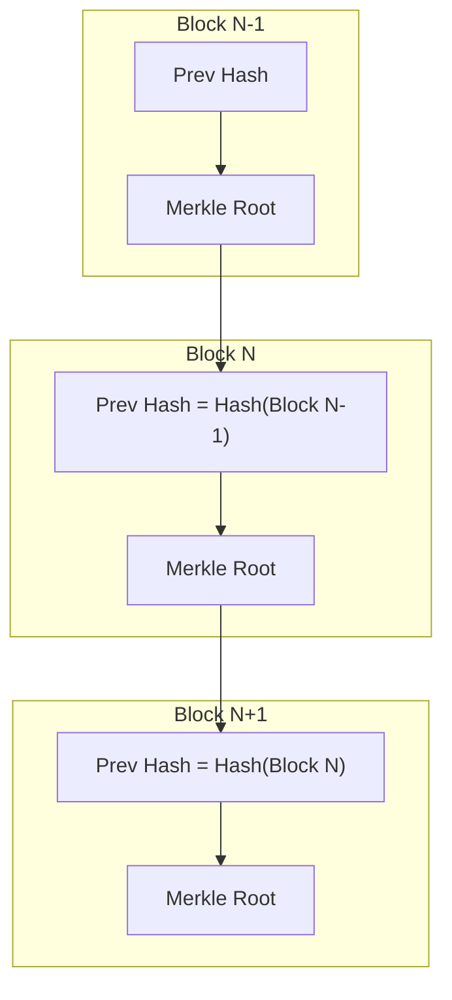
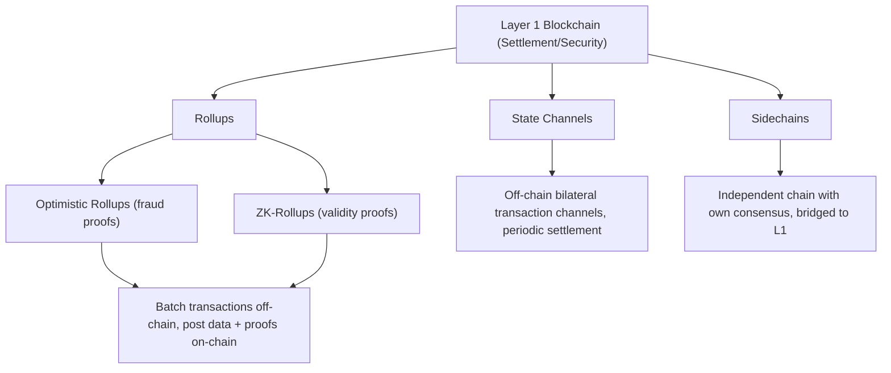

## Blockchain Architecture and Consensus Mechanisms

### Overview

Blockchain is a distributed ledger technology that maintains a continuously growing, tamper-evident record of transactions across a network of nodes without requiring a central trusted authority. Its two foundational pillars are the **data structure** (how blocks link together and how state is represented) and the **consensus mechanism** (how distributed, potentially mutually distrusting nodes agree on a single canonical history). Understanding both is essential for evaluating digital assets, decentralized finance (DeFi) protocols, and blockchain-based financial market infrastructure.

### Core Data Structure

**The Block**

A block typically contains:

1. **Block header**: metadata including a reference to the previous block's hash, a timestamp, a nonce (for proof-of-work), a Merkle root, and a version number
2. **Transaction list**: the set of validated transactions included in that block
3. **Block hash**: a cryptographic hash (e.g., SHA-256 in Bitcoin) of the header, uniquely identifying the block and cryptographically linking it to its predecessor

$$H(\text{Block}_n) = \text{SHA-256}(\text{prev\_hash} \,\|\, \text{merkle\_root} \,\|\, \text{timestamp} \,\|\, \text{nonce})$$

Because each block's hash depends on the previous block's hash, altering any historical block changes its hash, breaking the chain of references for every subsequent block—this is the core tamper-evidence property.

**Merkle Trees**

Transactions within a block are organized into a Merkle (hash) tree, where each leaf is a transaction hash and each parent node is the hash of its children's concatenation:

$$H_{\text{parent}} = H(H_{\text{left child}} \,\|\, H_{\text{right child}})$$

This allows efficient verification that a specific transaction is included in a block via a **Merkle proof**—a logarithmic-length path of sibling hashes—without needing to download or verify the entire block's transaction set. This underlies **Simplified Payment Verification (SPV)**, used by lightweight clients.

### Network Architecture

**Key Points**

- **Peer-to-peer (P2P) network**: nodes connect directly to one another (typically via gossip protocols) to propagate transactions and blocks without a central server
- **Full nodes**: store the complete blockchain history and independently validate all transactions and blocks against consensus rules
- **Light/SPV clients**: store only block headers and rely on Merkle proofs to verify specific transactions, trading off some trust assumptions for reduced resource requirements
- **Miners/Validators**: specialized nodes that participate in the consensus process, proposing and validating new blocks in exchange for block rewards and/or transaction fees

### State Models: UTXO vs. Account-Based

| Model | Description | Example |
| --- | --- | --- |
| UTXO (Unspent Transaction Output) | Ledger is a set of discrete, unspent value "coins"; each transaction consumes existing UTXOs as inputs and creates new ones as outputs | Bitcoin |
| Account-based | Ledger maintains a global state mapping addresses to balances, similar to a bank ledger, updated by debit/credit operations | Ethereum |

The UTXO model enables straightforward parallel transaction validation (since UTXOs are independent) and simplifies privacy-enhancing techniques, while the account-based model more naturally supports complex smart contract state and is generally considered more intuitive for programmability. [Inference: relative advantages are debated and implementation-dependent]

### Consensus Mechanisms

The consensus mechanism solves the **Byzantine Generals Problem**—achieving agreement among distributed nodes when some may be faulty or malicious, without a trusted central coordinator.

**Proof of Work (PoW)**

Miners compete to solve a computationally difficult cryptographic puzzle: finding a nonce such that the resulting block hash falls below a target threshold determined by network difficulty:

$$H(\text{Block Header} \,\|\, \text{nonce}) < \text{Target}$$

The difficulty target is periodically adjusted (e.g., every 2016 blocks in Bitcoin, targeting a 10-minute average block time) to maintain a roughly constant block production rate as total network hash power changes:

$$\text{New Difficulty} = \text{Old Difficulty} \times \frac{\text{Actual Time for 2016 Blocks}}{\text{Target Time (2 weeks)}}$$

**Key Points**

- Security derives from the computational cost of the puzzle: rewriting history requires re-mining all subsequent blocks faster than the honest network, requiring control of the majority of network hash power (the "51% attack" threshold)
- PoW is energy-intensive, a frequently cited criticism, since the security guarantee is directly tied to real-world resource expenditure
- Bitcoin uses Nakamoto Consensus: nodes always follow the chain with the greatest cumulative proof-of-work ("longest chain rule," more precisely the chain with the most accumulated difficulty)

**Proof of Stake (PoS)**

Validators are selected to propose and attest to blocks based on the amount of cryptocurrency they "stake" (lock up) as collateral, rather than computational work. Malicious behavior (e.g., proposing conflicting blocks) results in **slashing**—forfeiture of some or all of the validator's staked collateral.

$$P(\text{selected as validator}) \propto \frac{\text{Stake}_i}{\sum_j \text{Stake}_j}$$

Ethereum transitioned from PoW to PoS via "The Merge" (September 2022), using the **Gasper** consensus protocol, which combines:

- **LMD-GHOST** (Latest Message Driven Greediest Heaviest Observed SubTree): the fork-choice rule determining the canonical chain head
- **Casper FFG** (Friendly Finality Gadget): an overlay providing economic finality by having validators periodically vote to "finalize" checkpoints, after which reverting them would require an attacker to be slashed for at least one-third of total staked ETH

**Key Points**

- PoS dramatically reduces energy consumption relative to PoW (commonly cited as a 99%+ reduction for Ethereum post-Merge based on Ethereum Foundation estimates)
- Security derives from economic penalties (slashing) rather than physical resource cost, introducing different attack-cost economics (e.g., "nothing at stake" problem in naive PoS designs, addressed by slashing conditions)
- Wealth concentration concerns: larger stakeholders have proportionally greater influence over block proposal and validation, raising decentralization questions distinct from PoW's hash-power concentration concerns

**Delegated Proof of Stake (DPoS)**

Token holders vote to elect a limited set of delegates (e.g., 21 in EOS) who take turns producing blocks, trading off decentralization for higher throughput and faster finality.

**Practical Byzantine Fault Tolerance (pBFT) and Variants**

Used in permissioned/consortium blockchains (e.g., Hyperledger Fabric), pBFT achieves consensus through multiple rounds of message-passing voting among a known, fixed set of validating nodes, tolerating up to $\lfloor (n-1)/3 \rfloor$ Byzantine (malicious) nodes out of $n$ total nodes:

$$n \geq 3f + 1$$

where $f$ is the maximum number of faulty nodes tolerated. This achieves deterministic finality (no probabilistic reorg risk) but scales poorly with a large number of validators due to $O(n^2)$ communication complexity.

### Consensus Mechanism Comparison

| Mechanism | Finality | Energy Use | Throughput | Decentralization Trade-off | Example |
| --- | --- | --- | --- | --- | --- |
| Proof of Work | Probabilistic | Very High | Low | High (permissionless, open participation) | Bitcoin |
| Proof of Stake | Probabilistic/Economic finality | Low | Medium-High | Moderate (stake concentration risk) | Ethereum (post-Merge) |
| Delegated PoS | Fast, near-deterministic | Low | High | Lower (limited validator set) | EOS |
| pBFT | Deterministic | Low | High | Low (requires known validator set) | Hyperledger Fabric |

### Forks and Chain Reorganization

**Key Points**

- **Soft fork**: a backward-compatible protocol change; old nodes still recognize new blocks as valid (e.g., Bitcoin's SegWit upgrade)
- **Hard fork**: a backward-incompatible change requiring all nodes to upgrade, potentially splitting the network into two separate chains if not universally adopted (e.g., Ethereum/Ethereum Classic split following the 2016 DAO hack)
- **Chain reorganization ("reorg")**: temporary divergence when two miners/validators find valid blocks nearly simultaneously; the network converges on one branch per the fork-choice rule, and transactions in the discarded branch return to the mempool

### Smart Contracts and Programmability

Ethereum introduced a Turing-complete virtual machine (the **Ethereum Virtual Machine**, EVM) enabling arbitrary programmable logic ("smart contracts") to execute deterministically across all validating nodes. Execution cost is metered via **gas**, preventing infinite loops/denial-of-service by requiring payment proportional to computational steps:

$$\text{Transaction Cost} = \text{Gas Used} \times \text{Gas Price}$$

**Example**

A simple ERC-20 token transfer typically consumes approximately 21,000–65,000 gas units depending on whether the recipient address already holds a balance (first-time storage writes cost more than updates to existing storage slots), multiplied by the prevailing gas price (denominated in gwei, $10^{-9}$ ETH) to determine the total transaction fee. [Inference: exact gas costs are protocol-version-dependent and subject to periodic EVM opcode repricing]

### Layer 2 Scaling Architecture

Given base-layer ("Layer 1") throughput constraints, various scaling approaches move computation off the main chain while inheriting its security:

- **Rollups**: execute transactions off-chain, then post compressed transaction data and a cryptographic proof (validity proof for ZK-rollups, or a fraud-proof challenge window for optimistic rollups) back to Layer 1
- **State channels**: enable off-chain transaction exchange between parties, with only the opening and closing states settled on-chain
- **Sidechains**: independently secured chains connected via bridges, trading some security guarantees for higher throughput

### Financial Relevance for Digital Assets

**Key Points**

- **Settlement finality risk**: probabilistic finality (PoW, standard PoS) implies a nonzero reorg probability that must be priced into custody and settlement risk models, especially for large-value transfers
- **Validator/miner concentration**: mining pool or staking pool concentration affects the credibility of decentralization assumptions underlying digital asset valuation and regulatory treatment
- **Gas fee volatility**: transaction cost variability affects the economics of on-chain trading, DeFi arbitrage, and smart contract-based financial products
- **Cross-chain bridge risk**: bridges connecting different consensus domains have historically been frequent attack targets, representing a distinct risk category in digital asset market infrastructure

### Conclusion

Blockchain architecture combines a cryptographically linked data structure (blocks, Merkle trees, hash chaining) with a consensus mechanism that resolves the Byzantine Generals Problem across a distributed, potentially adversarial network. The choice of consensus mechanism—Proof of Work, Proof of Stake, delegated variants, or BFT-style protocols—fundamentally shapes a network's security assumptions, energy profile, throughput, decentralization, and finality guarantees, all of which are directly relevant inputs for valuing, trading, and managing risk in digital assets and blockchain-based financial infrastructure.

**Related Topics**

- Ethereum's transition to Proof of Stake and the Gasper consensus protocol
- Layer 2 scaling: optimistic vs. zero-knowledge rollups
- Cross-chain bridges and interoperability risk
- Decentralized finance (DeFi) protocol architecture (AMMs, lending protocols)
- Digital asset custody and settlement finality risk
- 51% attacks and mining/staking pool concentration
- Smart contract security and formal verification
- Central bank digital currencies (CBDCs) and permissioned ledger design