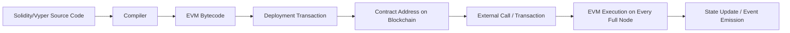
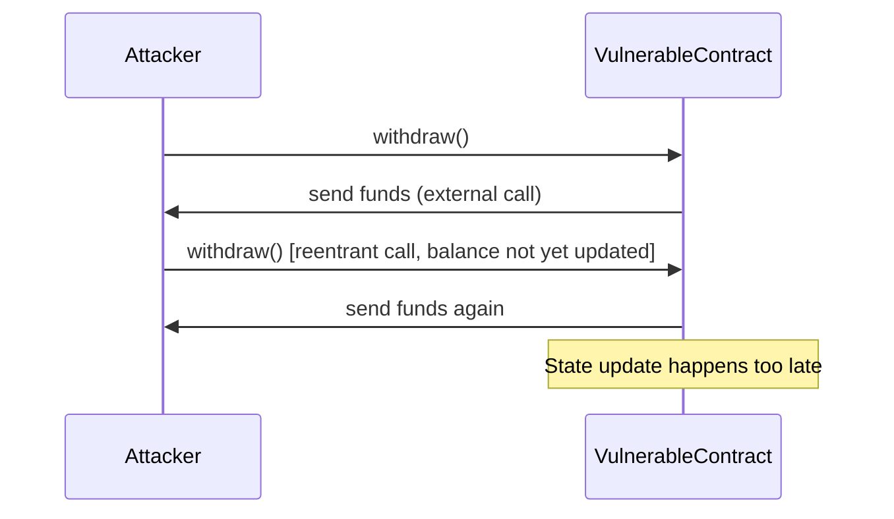
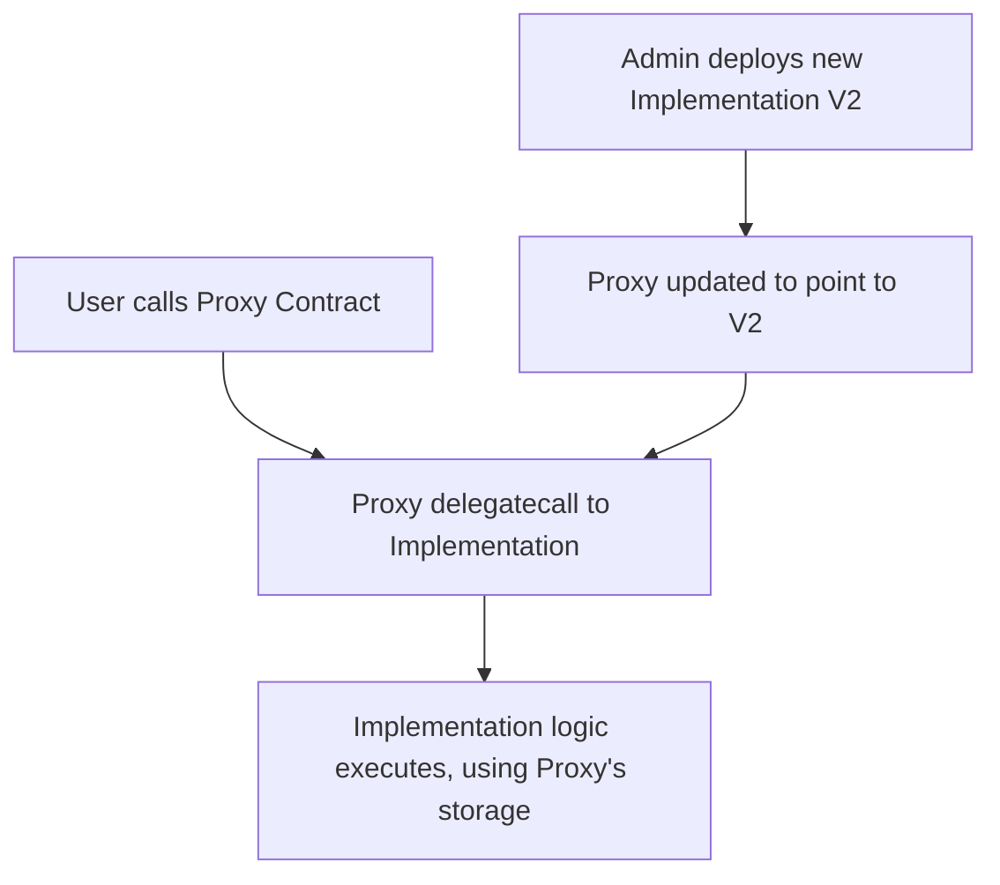

## Smart Contracts


### Overview

Smart contracts are self-executing programs deployed on a blockchain that automatically enforce the terms of an agreement when predefined conditions are met, without requiring a trusted intermediary. The term, coined by Nick Szabo in 1994, predates blockchain implementation by over a decade, but became practically realizable with Ethereum's introduction of a Turing-complete execution environment in 2015. Smart contracts underpin decentralized finance (DeFi), tokenization, and a broad class of programmable financial market infrastructure.

### Conceptual Foundations

**Key Points**

- Smart contracts are **deterministic**: given the same input and blockchain state, every validating node executing the contract must arrive at the same output, since consensus requires universal agreement on resulting state
- Smart contracts are **immutable by default**: once deployed, the contract's bytecode generally cannot be altered, though upgradeability patterns exist to work around this limitation
- Smart contracts are **transparent**: their bytecode (and often source code) is publicly visible on-chain, allowing anyone to audit the logic governing fund flows
- Smart contracts are **trust-minimizing**, not "trustless": execution correctness relies on the underlying blockchain's consensus security, and contract logic itself may contain bugs or be adversarially exploited despite being open and immutable

### Execution Environment

**The Ethereum Virtual Machine (EVM)**

The EVM is a quasi-Turing-complete, stack-based virtual machine that executes bytecode identically across every full node in the network. Contracts are typically written in a high-level language (most commonly **Solidity**, or alternatively **Vyper**) and compiled down to EVM bytecode for deployment.



**Gas Mechanics**

Every computational step in the EVM consumes **gas**, a metering unit preventing infinite loops and denial-of-service attacks by pricing computation:

$$\text{Transaction Fee} = \text{Gas Used} \times \text{Gas Price}$$

Post-EIP-1559 (Ethereum's fee market reform, August 2021), gas price splits into a **base fee** (burned, algorithmically adjusted based on block fullness) and a **priority fee/tip** (paid to the validator):

$$\text{Gas Price} = \text{Base Fee} + \text{Priority Fee}$$


$$\text{Total Fee} = \text{Gas Used} \times (\text{Base Fee} + \text{Priority Fee})$$

If a transaction runs out of gas before completing execution, all state changes are reverted, but the gas consumed up to that point is still forfeited to the validator—this "all state reverts, gas still spent" behavior is a standard, well-documented EVM property.

### Anatomy of a Smart Contract (Solidity Example)

**Example**

A minimal escrow contract illustrating core structural elements:

```solidity
// SPDX-License-Identifier: MIT
pragma solidity ^0.8.19;

contract SimpleEscrow {
    address public buyer;
    address public seller;
    uint256 public amount;
    bool public isReleased;

    event FundsDeposited(address indexed buyer, uint256 amount);
    event FundsReleased(address indexed seller, uint256 amount);

    modifier onlyBuyer() {
        require(msg.sender == buyer, "Only buyer can call this");
        _;
    }

    constructor(address _seller) payable {
        buyer = msg.sender;
        seller = _seller;
        amount = msg.value;
        emit FundsDeposited(buyer, amount);
    }

    function releaseFunds() external onlyBuyer {
        require(!isReleased, "Funds already released");
        isReleased = true;
        (bool success, ) = seller.call{value: amount}("");
        require(success, "Transfer failed");
        emit FundsReleased(seller, amount);
    }
}
```

**Key structural elements:**

- **State variables**: persistent storage (`buyer`, `seller`, `amount`, `isReleased`), each write costs gas and permanently occupies contract storage
- **Modifiers**: reusable access-control or validation logic (`onlyBuyer`) applied via decorator-like syntax
- **Events**: emitted logs indexed for efficient off-chain querying, commonly used by front-ends and indexers (e.g., The Graph) rather than reading contract storage directly
- **Constructor**: executes once at deployment, initializing state
- **External functions**: callable by externally-owned accounts (EOAs) or other contracts

### Standardized Token Interfaces

Interoperability across wallets, exchanges, and DeFi protocols depends on standardized contract interfaces defined via **Ethereum Improvement Proposals (EIPs)**.

| Standard | Purpose | Key Functions |
| --- | --- | --- |
| ERC-20 | Fungible tokens | `transfer`, `approve`, `transferFrom`, `balanceOf` |
| ERC-721 | Non-fungible tokens (NFTs) | `ownerOf`, `safeTransferFrom`, `tokenURI` |
| ERC-1155 | Multi-token (fungible + non-fungible in one contract) | `balanceOfBatch`, `safeBatchTransferFrom` |
| ERC-4626 | Tokenized yield-bearing vaults | `deposit`, `withdraw`, `convertToShares`, `convertToAssets` |

The **approve/transferFrom** pattern in ERC-20 is foundational to DeFi composability: a user grants a smart contract (e.g., a decentralized exchange) permission to move a specified token amount on their behalf, enabling automated protocols to interact with user funds without custody.

### Common Smart Contract Vulnerabilities

**Key Points**

**1. Reentrancy**

An external call within a function allows the called contract to recursively re-enter the calling function before the first invocation completes its state updates, potentially draining funds. This was the mechanism behind the 2016 DAO hack (~$60 million in ETH).



**Mitigation**: the **checks-effects-interactions** pattern (update internal state *before* making external calls) and reentrancy guard modifiers:

```solidity
bool private locked;
modifier nonReentrant() {
    require(!locked, "Reentrant call");
    locked = true;
    _;
    locked = false;
}
```

**2. Integer Overflow/Underflow**

Prior to Solidity 0.8.0, arithmetic operations could silently wrap around on overflow/underflow. Solidity ≥0.8.0 reverts automatically on overflow/underflow by default, though earlier contracts (or those using `unchecked` blocks for gas optimization) remain susceptible.

**3. Access Control Failures**

Missing or incorrectly implemented permission checks (e.g., a function intended to be owner-only lacking a modifier) can allow unauthorized state changes, including fund withdrawal or contract logic modification.

**4. Oracle Manipulation**

DeFi contracts frequently rely on external price feeds (oracles) for functions like collateral valuation and liquidation triggers. If a protocol uses a manipulable on-chain price source (e.g., a single DEX pool's spot price rather than a time-weighted or decentralized oracle network), an attacker can artificially move that price within a single transaction to trigger favorable liquidations or borrowing terms—a pattern behind numerous DeFi exploits.

**5. Front-Running/MEV (Maximal Extractable Value)**

Since pending transactions are visible in the mempool before inclusion in a block, validators or bots can observe profitable transactions and insert their own transactions before or around them (sandwich attacks, arbitrage extraction) to capture value at the expense of the original transaction's sender.

### Smart Contract Upgradeability Patterns

Since deployed bytecode is immutable by default, several patterns enable controlled upgrades:

**Proxy Pattern**

A lightweight proxy contract holds state and delegates logic execution to a separate implementation contract via `delegatecall`, which executes the implementation's code in the context of the proxy's storage:



**Key Points**

- **Transparent Proxy** and **UUPS (Universal Upgradeable Proxy Standard)** are the two dominant implementations, differing in where upgrade logic resides (proxy vs. implementation contract) and associated gas cost trade-offs
- Upgradeability introduces a **centralization/trust trade-off**: whoever controls the upgrade mechanism (often a multisig or DAO governance vote) can theoretically alter contract logic, partially undermining the immutability guarantee that gives smart contracts their credibility
- **Storage layout collisions** are a specific technical risk when upgrading: new implementation contracts must preserve the exact storage slot ordering of prior versions, or state can become corrupted

### Formal Verification and Auditing

Given the irreversibility of on-chain exploits (funds sent to an attacker generally cannot be clawed back without a contentious hard fork, as in the DAO case), rigorous pre-deployment verification is standard practice for financially significant contracts:

- **Manual audits**: specialized security firms (e.g., Trail of Bits, OpenZeppelin, ConsenSys Diligence) review code line-by-line against known vulnerability classes
- **Static analysis tools**: automated scanners (Slither, Mythril) detect common patterns like reentrancy and unchecked external calls
- **Formal verification**: mathematically proving that contract code satisfies specified properties under all possible execution paths, used for high-value protocols (e.g., MakerDAO's formal verification of core contracts)
- **Bug bounty programs**: crowdsourced vulnerability discovery with financial rewards, often run through platforms like Immunefi

### Financial Applications

**Key Points**

- **Decentralized exchanges (DEXs)**: automated market maker (AMM) contracts like Uniswap use constant-product formulas ($x \cdot y = k$) to enable permissionless token swaps without an order book
- **Lending protocols**: contracts like Aave and Compound algorithmically set interest rates based on utilization and manage collateralized borrowing with automated liquidation logic
- **Tokenization**: real-world assets (bonds, real estate, funds) represented as on-chain tokens governed by smart contracts encoding transfer restrictions, compliance logic, and corporate actions
- **Derivatives and synthetic assets**: on-chain perpetual futures and synthetic asset protocols use smart contracts to manage margin, funding rates, and settlement without a centralized clearinghouse
- **DAOs (Decentralized Autonomous Organizations)**: governance smart contracts enabling token-weighted voting to control protocol parameters or treasury funds

### Regulatory and Legal Considerations

**Key Points**

- The legal enforceability of smart contracts as binding agreements varies substantially by jurisdiction, and courts have generally treated code execution as a technical fact rather than automatically dispositive of legal rights and obligations [Unverified: legal treatment continues to evolve and varies materially across jurisdictions]
- **Code is law** was an early ideological framing suggesting contract outcomes should be accepted purely as coded, regardless of intent—a view substantially tempered following incidents like the DAO hack, where the Ethereum community executed a contentious hard fork to reverse an exploit's effects
- Regulatory frameworks (e.g., MiCA in the EU) increasingly address smart-contract-based financial products directly, including requirements around audits and operational resilience for significant DeFi protocols [Inference: specific regulatory scope and enforcement continue to develop]

### Conclusion

Smart contracts extend blockchain's tamper-evident ledger into programmable financial logic, enabling automated, transparent execution of agreements without centralized intermediaries. Their determinism and immutability provide credibility but also mean that bugs, once deployed and exploited, are often irreversible—making rigorous auditing, formal verification, and careful architectural patterns (checks-effects-interactions, reentrancy guards, secure oracle design) essential engineering disciplines rather than optional best practices in financial smart contract development.

**Related Topics**

- Automated market makers and constant-function market maker design
- DeFi lending protocol mechanics (collateralization, liquidation, interest rate models)
- MEV (Maximal Extractable Value) and transaction ordering fairness
- Oracle design and decentralized price feed security (Chainlink architecture)
- DAO governance mechanisms and on-chain voting
- Formal verification methods for smart contract security
- Tokenization of real-world assets and compliance-embedded tokens
- Gas optimization techniques in Solidity development