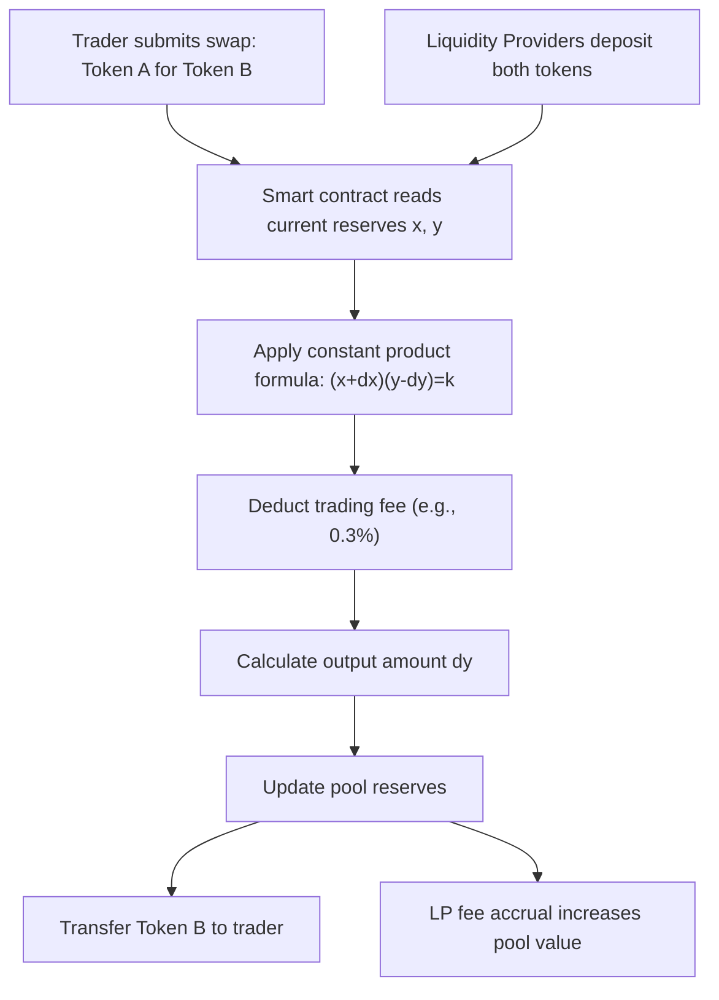
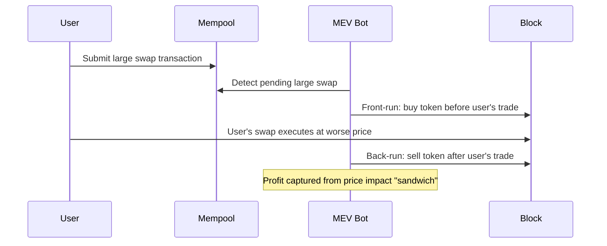

## Decentralized Exchanges and Automated Market Makers

### Overview

Decentralized exchanges (DEXs) enable peer-to-peer trading of digital assets without a centralized intermediary holding custody of funds or matching orders through a proprietary order book. Automated market makers (AMMs) are the dominant DEX architecture, replacing traditional order-book matching with algorithmic, formula-based pricing against pooled liquidity. This architecture underlies the majority of on-chain trading volume in decentralized finance (DeFi).

### DEX Architecture Types

**Key Points**

- **Order-book DEXs**: replicate traditional exchange matching (bid/ask limit orders) either fully on-chain (e.g., early dYdX, Serum on Solana) or via off-chain order matching with on-chain settlement (hybrid model), constrained by blockchain throughput and latency for on-chain order books
- **Automated Market Makers (AMMs)**: use deterministic mathematical formulas and pooled liquidity rather than matching individual buy/sell orders, dominant since Uniswap's 2018 launch due to simplicity, permissionless listing, and lower on-chain computational requirements
- **Aggregators**: route trades across multiple DEXs/AMMs to find optimal execution price and minimize price impact and slippage (e.g., 1inch, Matcha)

### Constant Product Market Maker (Uniswap V1/V2 Model)

The foundational AMM formula maintains a constant product between two pooled reserve assets:

$$x \cdot y = k$$

where $x$ and $y$ are the reserve quantities of the two pooled tokens, and $k$ is held constant (absent fees) across trades. A trade of $\Delta x$ into the pool yields output $\Delta y$ satisfying:

$$(x + \Delta x)(y - \Delta y) = k$$

Solving for output:

$$\Delta y = y - \frac{k}{x + \Delta x} = y - \frac{xy}{x + \Delta x}$$

**Effective Price and Slippage**

The instantaneous marginal price is the ratio of reserves:

$$P = \frac{y}{x}$$

As a trade size $\Delta x$ grows relative to pool depth, the effective execution price diverges from the pre-trade marginal price—this divergence is **price impact/slippage**, which the constant-product formula makes convex in trade size (larger trades face disproportionately worse pricing).

**Example**

A pool holds 100 ETH and 300,000 USDC ($k = 100 \times 300{,}000 = 30{,}000{,}000$), implying a marginal price of 3,000 USDC/ETH. A trader swaps in 10,000 USDC:

$$\Delta y_{\text{ETH out}} = 100 - \frac{30{,}000{,}000}{100{,}000 + \cdots}$$

More precisely, with new USDC reserve $= 300{,}000 + 10{,}000 = 310{,}000$:

$$\text{New ETH reserve} = \frac{30{,}000{,}000}{310{,}000} = 96.774$$

$$\Delta \text{ETH out} = 100 - 96.774 = 3.226 \text{ ETH}$$

Effective price paid: $10{,}000 / 3.226 = 3{,}099.2$ USDC/ETH, roughly 3.3% worse than the 3,000 marginal price—this gap is the slippage cost borne by the trader, increasing with trade size relative to pool depth.

### Liquidity Provision and LP Tokens

Liquidity providers (LPs) deposit both assets of a trading pair in proportion to the current pool ratio, receiving **LP tokens** representing their proportional claim on the pool:

$$\text{LP Tokens Minted} = \text{Total Supply} \times \min\left(\frac{\Delta x}{x}, \frac{\Delta y}{y}\right)$$

LPs earn a share of trading fees (commonly 0.3% per swap in Uniswap V2, distributed pro rata to pool share) but bear **impermanent loss** risk.

### Impermanent Loss

Impermanent loss (IL) is the opportunity cost an LP incurs when the relative price of pooled assets diverges from the price at deposit time, compared to simply holding the assets outside the pool.

For a constant-product pool, if the price ratio changes by a factor $r$ (new price / initial price of one asset relative to the other), the value of LP holdings relative to holding the assets unpooled is:

$$\text{IL} = \frac{2\sqrt{r}}{1+r} - 1$$

**Example**

If ETH price doubles relative to USDC ($r = 2$) after an LP deposits into an ETH/USDC pool:

$$\text{IL} = \frac{2\sqrt{2}}{1+2} - 1 = \frac{2(1.414)}{3} - 1 = 0.943 - 1 = -0.057$$

The LP's position is worth approximately 5.7% less than if they had simply held the two assets separately without providing liquidity, before accounting for accumulated trading fees, which may partially or fully offset this loss depending on trading volume during the holding period. The term "impermanent" reflects that this loss is only realized if the LP withdraws while the price divergence persists; if prices return to the original ratio, the loss reverses to zero (excluding fee income, which is retained regardless).

**Key Points**

- Impermanent loss is largest for asset pairs with high relative price volatility and near-zero for correlated or pegged asset pairs (e.g., stablecoin-stablecoin pools)
- IL is a structural feature of constant-function AMMs, not a bug; LPs are compensated (in expectation) via trading fees for bearing this risk, and profitability depends on realized fee income exceeding realized IL over the holding period
- Sophisticated LPs and protocols have developed IL-hedging strategies using options or perpetual futures, though these introduce additional complexity and cost

### Concentrated Liquidity (Uniswap V3)

Uniswap V3 (2021) introduced **concentrated liquidity**, allowing LPs to allocate capital within a specified price range rather than across the entire price spectrum $(0, \infty)$, dramatically improving capital efficiency.

$$L = \frac{\Delta x \cdot \Delta y}{(\sqrt{P_b} - \sqrt{P_a})^2} \quad \text{(virtual liquidity within range } [P_a, P_b])$$

The pool tracks liquidity via "ticks," discrete price points, and LP positions become NFTs (rather than fungible ERC-20 LP tokens) since each position's range parameters are unique.

**Key Points**

- Capital efficiency gains: an LP concentrating liquidity within a narrow band around the current price can provide equivalent depth (equivalent slippage for traders) with substantially less capital than a full-range V2-style position, since capital outside the active trading range in V2 earns no fees
- Trade-off: concentrated positions require **active management**—if price moves outside the chosen range, the position stops earning fees and becomes fully weighted in the less valuable asset (effectively "sold" as price rises through the range, or "bought" as it falls), amplifying realized impermanent loss risk relative to full-range provision if not actively rebalanced
- This shifted LP behavior toward more active, often algorithmically-managed strategies, giving rise to specialized "liquidity management" protocols that automate range adjustment on behalf of passive LPs

### Alternative AMM Curve Designs

| AMM Type | Formula/Approach | Use Case | Example |
| --- | --- | --- | --- |
| Constant Product | $x \cdot y = k$ | General-purpose volatile pairs | Uniswap V2 |
| Constant Sum | $x + y = k$ | Zero slippage but requires external arbitrage to prevent pool depletion (rarely used alone) | — |
| StableSwap/Curve Invariant | Hybrid of constant product and constant sum, flattened near the peg | Stablecoin and pegged-asset pairs (low slippage near parity) | Curve Finance |
| Weighted Pools | Generalizes constant product to arbitrary token weights (e.g., 80/20) | Multi-asset pools, index-like exposure | Balancer |
| Concentrated Liquidity | Liquidity allocated to custom price ranges | Capital-efficient provision, especially for correlated/stable pairs | Uniswap V3 |

**Curve's StableSwap Invariant**

Curve Finance's formula blends constant-sum (linear, zero-slippage) and constant-product (convex) curves, becoming nearly flat (low slippage) near the peg price for pegged assets (e.g., USDC/USDT/DAI) while reverting to constant-product-like convexity as reserves become imbalanced, protecting against full depletion of one asset:

$$A \cdot n^n \sum x_i + D = A \cdot D \cdot n^n + \frac{D^{n+1}}{n^n \prod x_i}$$

where $A$ is an amplification coefficient controlling how "flat" the curve is near equilibrium, $n$ is the number of assets in the pool, and $D$ is the invariant representing total pool value at the peg. [This formula reflects Curve's documented StableSwap design; exact parameterization has evolved across protocol versions.]

### Maximal Extractable Value (MEV) in DEX Trading

Because pending transactions are visible in the public mempool before block inclusion, DEX trades are subject to several forms of value extraction:

**Key Points**

- **Sandwich attacks**: a bot places a buy order immediately before a victim's large swap (pushing price up) and a sell order immediately after (capturing the price impact the victim's trade caused), extracting value directly from the victim's slippage tolerance
- **Arbitrage MEV**: bots exploit price discrepancies between DEX pools or between DEXs and centralized exchanges, which is generally viewed as a less harmful (even beneficial, price-correcting) form of MEV compared to sandwich attacks
- **Mitigations**: private transaction relays/mempools (e.g., Flashbots Protect) that hide pending transactions from public view, slippage tolerance limits, and MEV-aware transaction ordering protocols (e.g., MEV-Boost's proposer-builder separation on Ethereum)

### Oracle and Price Feed Considerations

AMM pools' spot prices can be manipulated within a single transaction (a **flash loan attack** pattern: borrow a large uncollateralized sum, manipulate a thinly-liquid pool's price, exploit a protocol relying on that manipulated price as an oracle, repay the loan, all within one atomic transaction). This has motivated the widespread adoption of:

- **Time-Weighted Average Price (TWAP) oracles**: averaging price over a window of blocks, making single-transaction manipulation prohibitively expensive since an attacker would need to sustain the manipulated price across multiple blocks
- **External decentralized oracle networks** (e.g., Chainlink) aggregating price data from many sources off-chain, reducing reliance on any single on-chain pool's potentially manipulable spot price

$$\text{TWAP} = \frac{\sum_{i=1}^{n} P_i \times \Delta t_i}{\sum_{i=1}^{n} \Delta t_i}$$

### DEX vs. Centralized Exchange (CEX) Trade-offs

| Dimension | DEX (AMM) | CEX |
| --- | --- | --- |
| Custody | Self-custodial (non-custodial) | Custodial (exchange holds funds) |
| Listing | Permissionless (anyone can create a pool) | Curated, requires exchange approval |
| Price discovery | Formula-driven, arbitrage-corrected against external markets | Order-book driven, direct price discovery |
| Capital efficiency | Improving (concentrated liquidity) but historically lower than deep order books | Generally higher for liquid pairs |
| Counterparty/custodial risk | Smart contract risk (exploits, bugs) | Exchange insolvency/hack risk (e.g., FTX) |
| Regulatory status | Ambiguous/evolving across jurisdictions | Generally licensed/regulated entities |

### Financial and Risk Considerations for Institutional Participants

**Key Points**

- **Slippage and price impact modeling**: institutional-size trades on AMMs require explicit price impact estimation given the convex slippage function, often necessitating trade splitting across pools/time or routing through aggregators
- **Smart contract risk**: AMM protocols, despite audits, remain exposed to exploit risk; total value locked at risk should factor into position sizing and counterparty risk frameworks distinct from traditional exchange counterparty risk
- **Impermanent loss as a distinct risk factor**: for any LP position, IL functions analogously to a short volatility/short gamma exposure on the relative price of pooled assets, and can be analyzed using options-pricing intuition (an LP position resembles a short straddle relative to holding the underlying assets)
- **Regulatory uncertainty**: the classification of AMM liquidity provision, governance tokens, and DEX aggregator activity under existing securities and commodities regulation remains an active and jurisdiction-dependent area of development [Unverified: regulatory treatment continues to evolve]

### Conclusion

Automated market makers replaced order-book matching with algorithmic, pool-based pricing, enabling permissionless, non-custodial trading at the cost of introducing distinctive risks—impermanent loss for liquidity providers, convex slippage for large traders, and MEV extraction from public transaction visibility. The evolution from simple constant-product formulas (Uniswap V2) to concentrated liquidity (Uniswap V3) and specialized stable-asset curves (Curve) reflects ongoing efforts to improve capital efficiency while managing these structural trade-offs, with active liquidity management and MEV mitigation now central concerns for sophisticated market participants operating in DeFi.

**Related Topics**

- Impermanent loss hedging strategies using options and perpetuals
- MEV extraction, proposer-builder separation, and Flashbots architecture
- Flash loans and single-transaction oracle manipulation attacks
- Concentrated liquidity management protocols and active LP strategies
- Curve Finance StableSwap invariant and stablecoin pool design
- DEX aggregators and optimal trade routing algorithms
- Decentralized oracle networks (Chainlink architecture and design)
- Regulatory treatment of liquidity provision and DeFi governance tokens