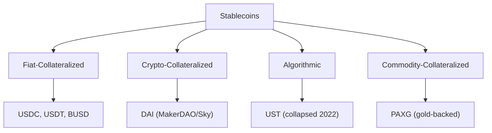
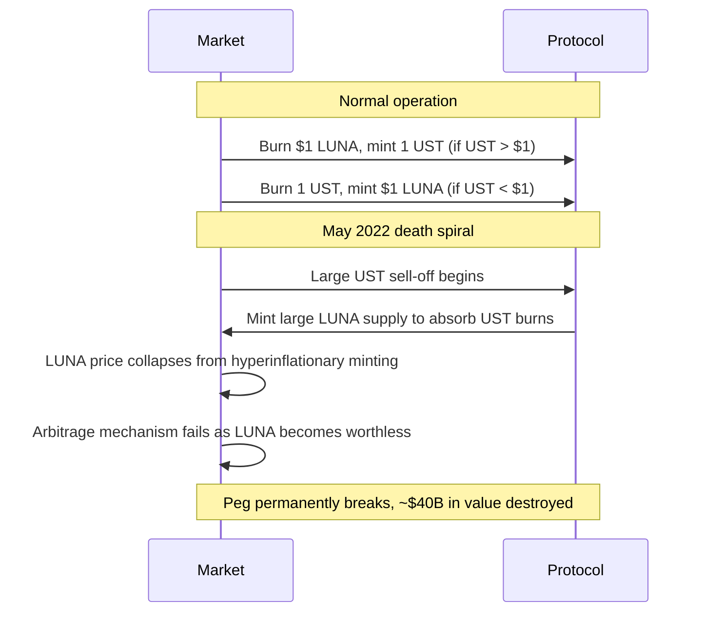
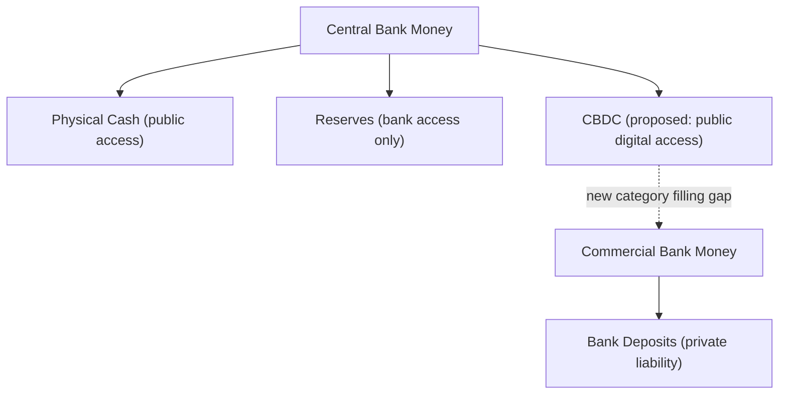

## Stablecoins and Central Bank Digital Currencies

### Overview

Stablecoins are digital assets designed to maintain a stable value, typically pegged to a fiat currency (predominantly the US dollar), by using various collateralization and stabilization mechanisms. Central Bank Digital Currencies (CBDCs) are digital liabilities of a central bank, representing a sovereign-issued digital complement or alternative to physical cash and commercial bank reserves. Both address the volatility limitation of cryptocurrencies as a medium of exchange, but differ fundamentally in issuance, backing, and institutional design.

### Stablecoin Taxonomy

### Fiat-Collateralized Stablecoins

**Mechanism**

Each token is backed 1:1 (nominally) by fiat currency or fiat-equivalent assets (cash, short-term Treasuries, commercial paper) held in reserve by a centralized issuer. Redemption and issuance occur through the issuer directly:

$$\text{Tokens Outstanding} \leq \text{Reserve Assets (USD equivalent)}$$

**Key Points**

- **USDT (Tether)** and **USDC (Circle)** dominate this category by market capitalization; USDC has generally emphasized more frequent third-party attestations of reserve composition, while USDT has historically faced greater scrutiny and, in past enforcement actions, penalties over reserve transparency and disclosure accuracy
- Reserve composition matters materially for risk assessment: reserves held in cash and short-duration Treasuries carry minimal credit/duration risk, while reserves held in commercial paper, corporate bonds, or other issuers' liabilities introduce credit and liquidity risk that could impair the peg under stress
- **Redemption risk**: the peg's credibility depends on the issuer's operational capacity and willingness to honor redemptions at par, especially during periods of high redemption demand; this is fundamentally a **centralized counterparty risk**, analogous to money market fund or bank deposit risk, despite the token itself trading on decentralized rails
- The March 2023 USDC de-pegging episode (following Silicon Valley Bank's failure, where Circle held a portion of reserves) illustrated this risk directly: USDC briefly traded as low as approximately $0.87 before recovering to par once depositor guarantees were confirmed and reserve access was restored [Inference: this reflects publicly reported market events; exact trough pricing varied by venue and timestamp]

### Crypto-Collateralized (Decentralized) Stablecoins

**Mechanism**

Collateralized by other cryptocurrencies (rather than fiat) locked in smart contracts, typically **overcollateralized** to absorb the collateral asset's price volatility.

**Example: MakerDAO/Sky's DAI**

A user locks ETH (or other approved collateral) into a Maker Vault and mints DAI against it, subject to a minimum collateralization ratio (historically around 150% for ETH vaults, varying by collateral type and risk parameters set by governance):

$$\text{Collateralization Ratio} = \frac{\text{Value of Collateral}}{\text{Value of DAI Minted}} \geq \text{Minimum Ratio}$$

If the collateralization ratio falls below the liquidation threshold due to collateral price decline, the position is automatically liquidated (collateral auctioned off) to repay the outstanding DAI debt plus a liquidation penalty, protecting the system's solvency.

$$\text{Liquidation triggers when: } \frac{\text{Collateral Value}}{\text{Debt}} < \text{Liquidation Ratio}$$

**Key Points**

- Overcollateralization provides a buffer against the underlying collateral's volatility but makes the system **capital-inefficient** relative to fiat-backed stablecoins (locking $150 of ETH to mint $100 of DAI, for example)
- Stability mechanisms include the **Stability Fee** (an interest rate charged on minted DAI, adjustable by governance to manage supply/demand and peg pressure) and the **Peg Stability Module (PSM)**, which allows direct 1:1 swaps between DAI and fiat-collateralized stablecoins (e.g., USDC) to arbitrage away small peg deviations
- Later iterations of DAI incorporated substantial **fiat-collateralized stablecoin and real-world asset (RWA) backing** via the PSM and RWA vaults, representing a hybridization that somewhat reduces DAI's original "fully decentralized" collateral profile in exchange for tighter peg stability [Inference: the precise current collateral composition changes over time with governance decisions and should be verified against current protocol data for any specific analysis]
- Governance risk is a distinct consideration: parameters like collateralization ratios, stability fees, and approved collateral types are set via decentralized governance token voting, introducing a different risk-transmission channel than centralized issuer decisions

### Algorithmic Stablecoins

**Mechanism**

Algorithmic stablecoins attempt to maintain a peg through supply-adjustment mechanisms and market incentives rather than direct collateral backing (or with only partial/undercollateralization), often using a companion volatile token to absorb demand fluctuations.

**Case Study: TerraUSD (UST) Collapse**

UST maintained its peg through a mint/burn arbitrage mechanism with its companion token, LUNA: users could always burn $1 worth of LUNA to mint 1 UST, or burn 1 UST to mint $1 worth of LUNA, theoretically anchoring UST to $1 via arbitrage incentives.

In May 2022, a large, sustained sell-off of UST triggered the arbitrage mechanism to mint enormous quantities of LUNA to absorb redemptions, causing LUNA's price to collapse toward zero. As LUNA's value collapsed, the arbitrage backing became worthless, breaking UST's peg entirely in a self-reinforcing "death spiral"—an event frequently cited as the canonical case study in algorithmic stablecoin design failure.

**Key Points**

- The core structural vulnerability of purely algorithmic (uncollateralized or thinly collateralized) models is that the stabilization mechanism relies on continued market confidence in the companion token's value; during a genuine confidence crisis, the mechanism can amplify rather than dampen the destabilization
- This event materially influenced global regulatory approaches to stablecoins, contributing to accelerated legislative and regulatory attention (e.g., in the EU's MiCA framework and various proposed US legislative frameworks) specifically distinguishing algorithmic from asset-backed stablecoins, often with heightened restrictions or disclosure requirements for the former
- Since the UST collapse, market share and new development in the stablecoin sector have shifted heavily toward fiat- and crypto-collateralized models, with purely algorithmic designs facing substantially diminished adoption and regulatory tolerance [Inference: reflects post-2022 market and regulatory trends observed through the knowledge cutoff]

### Stablecoin Peg Maintenance Mechanisms Compared

| Mechanism | Collateral Efficiency | Peg Robustness Under Stress | Primary Risk |
| --- | --- | --- | --- |
| Fiat-collateralized | High (near 1:1) | Generally strong if reserves are high-quality and liquid | Issuer/custodial/reserve credit risk |
| Crypto-collateralized (overcollateralized) | Low (often 150%+) | Moderate; vulnerable to rapid collateral price crashes and liquidation cascades | Collateral volatility, liquidation mechanism failure |
| Algorithmic (uncollateralized) | Very high (nominally) | Weak; vulnerable to reflexive confidence spirals | Companion token collapse, death spiral dynamics |

### Central Bank Digital Currencies (CBDCs)

**Definition and Rationale**

A CBDC is a digital liability directly issued by a central bank, distinct from commercial bank deposits (which are private bank liabilities) and from existing central bank reserves (which are only accessible to financial institutions, not the general public or businesses directly).

**Key Points**

- Commonly cited motivations include: preserving public access to central bank money as cash usage declines, improving payment system efficiency and financial inclusion, enhancing monetary policy transmission, and maintaining monetary sovereignty in the face of private stablecoin and foreign CBDC adoption
- **Retail CBDC**: designed for general public use in everyday transactions, raising the most significant design and policy questions (privacy, disintermediation risk, offline functionality)
- **Wholesale CBDC**: restricted to use by financial institutions for interbank settlement, generally viewed as a lower-risk, more incremental extension of existing reserve account infrastructure

### CBDC Design Dimensions

**Key Points**

- **Account-based vs. token-based**: account-based models verify identity to access a central bank account (similar to existing bank account infrastructure); token-based models verify the validity of the digital token itself (more similar to cash's bearer-instrument property), with significant implications for privacy and offline usability
- **Direct vs. intermediated (two-tier) issuance**: most major CBDC proposals (including the ECB's digital euro exploration and China's e-CNY) adopt an intermediated model, where the central bank issues the CBDC but commercial banks and payment providers handle customer-facing distribution, KYC/AML compliance, and wallet infrastructure, preserving the existing banking sector's customer relationship role
- **Interest-bearing vs. non-interest-bearing**: an interest-bearing CBDC could directly compete with bank deposits for household savings, a design choice with significant implications for bank disintermediation risk (a "digital bank run" concern in stress periods, since a CBDC would offer instant, risk-free settlement compared to a private bank deposit)
- **Privacy design**: full transaction transparency to the central bank raises surveillance concerns, while full anonymity raises AML/CFT (anti-money laundering/counter-terrorist financing) compliance concerns; most active CBDC designs propose a tiered privacy model with limited anonymity for small-value transactions

### Disintermediation Risk

A central concern in CBDC design is the potential for large-scale, rapid conversion of commercial bank deposits into CBDC holdings during periods of financial stress, since a sovereign central bank liability carries no credit risk, unlike a commercial bank deposit (even with deposit insurance, which typically caps coverage and involves processing delays).

$$\text{Bank Deposit Outflow Risk} \propto f(\text{CBDC attractiveness}, \text{perceived bank risk}, \text{ease of conversion})$$

Mitigation approaches under active discussion include holding limits (caps on individual CBDC balances), tiered remuneration (below-market or zero/negative interest rates on CBDC holdings above a threshold), and maintaining the two-tier intermediated distribution model to preserve banks' customer relationships. [Inference: specific mitigation designs remain under active policy development and vary by jurisdiction]

### Global CBDC Development Status Comparison

| Jurisdiction | Project | Status (as of knowledge cutoff) | Model |
| --- | --- | --- | --- |
| China | e-CNY (Digital Yuan) | Advanced pilot phase across multiple cities | Retail, two-tier, account/token hybrid |
| Eurozone | Digital Euro | Investigation/preparation phase | Retail, two-tier, privacy-focused design under development |
| United States | (No formal retail CBDC program) | Research and exploratory stage (Federal Reserve) | Undetermined; significant congressional and public debate over necessity |
| Bahamas | Sand Dollar | Live, one of the first fully launched retail CBDCs | Retail |
| Nigeria | eNaira | Live | Retail |

[Note: CBDC development is a fast-moving policy area; status for any specific jurisdiction should be verified against current central bank publications, as programs frequently advance, pause, or change design between planning cycles.]

### Stablecoins vs. CBDCs: Comparative Framework

| Dimension | Stablecoins | CBDCs |
| --- | --- | --- |
| Issuer | Private company/DAO | Sovereign central bank |
| Credit risk | Issuer/collateral-dependent | None (sovereign liability) |
| Regulatory status | Increasingly regulated (MiCA, proposed US frameworks) but still evolving | Direct extension of existing monetary authority |
| Monetary policy role | None (private liability, outside central bank balance sheet) | Direct central bank monetary policy tool/transmission channel |
| Programmability | High (smart contract-native, especially DeFi-integrated stablecoins) | Design-dependent; often more constrained by policy/legal considerations |
| Privacy | Varies by design; generally pseudonymous on public blockchains | Actively debated; tiered privacy models common in proposals |

### Financial Market Relevance

**Key Points**

- Stablecoins function as the primary **settlement and collateral asset** within DeFi, serving roles analogous to money market instruments in traditional finance; their aggregate market capitalization and reserve composition are increasingly monitored by financial stability authorities (e.g., the Financial Stability Board, FSOC)
- Large-scale stablecoin reserve holdings in short-term Treasuries and commercial paper create a growing linkage between crypto-market stress and traditional money markets, a channel regulators have flagged as a potential systemic risk transmission mechanism [Inference: the magnitude of this systemic linkage is actively studied and debated]
- CBDC introduction could alter cross-border payment dynamics, correspondent banking relationships, and potentially monetary sovereignty dynamics if foreign CBDCs achieve significant adoption outside their issuing jurisdiction, though multilateral CBDC interoperability projects (e.g., Project mBridge) remain in relatively early stages [Inference: long-run geopolitical and market-structure implications remain speculative]

### Conclusion

Stablecoins and CBDCs both address cryptocurrency's core limitation as a volatile medium of exchange, but through fundamentally different institutional architectures: stablecoins are privately issued liabilities backed by varying collateral models with correspondingly varying risk profiles (as starkly illustrated by the UST collapse), while CBDCs represent a direct extension of sovereign central bank money into digital form, raising distinct design questions around disintermediation, privacy, and monetary policy transmission. Both remain active areas of regulatory development, with stablecoin regulation increasingly converging toward requiring high-quality collateral and transparency, and CBDC design converging toward intermediated, privacy-tiered models in most major jurisdictions under active exploration.

**Related Topics**

- MakerDAO/Sky governance and the Peg Stability Module mechanism
- The TerraUSD/LUNA collapse: mechanism design failure analysis
- MiCA (Markets in Crypto-Assets) regulatory framework for stablecoins
- Stablecoin reserve composition and money market fund risk parallels
- CBDC privacy design: tiered anonymity and AML/CFT trade-offs
- Cross-border CBDC interoperability (Project mBridge and similar initiatives)
- Bank disintermediation risk and CBDC holding limit design
- Stablecoins as DeFi collateral and systemic risk transmission channels