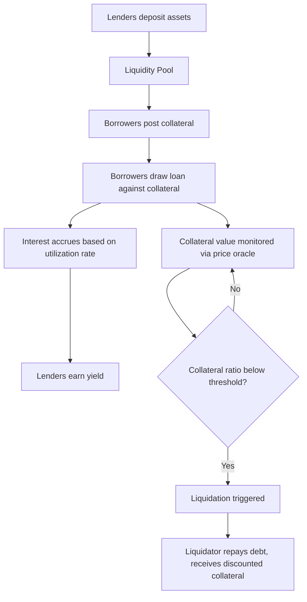
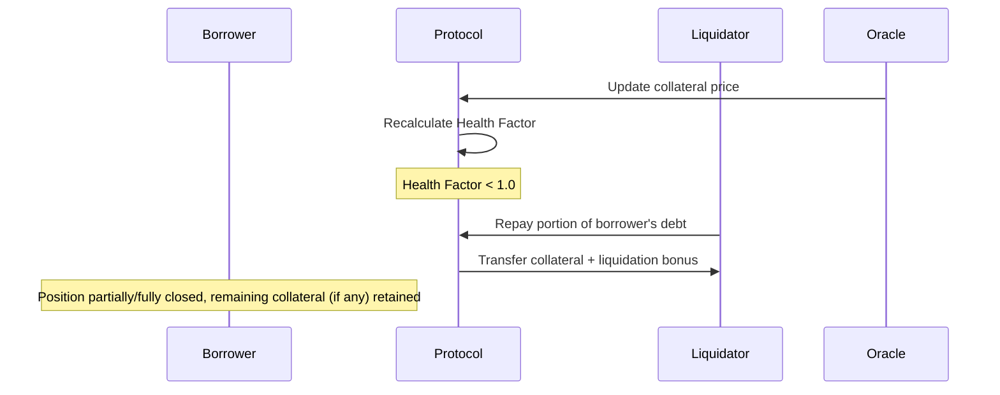
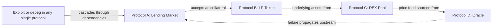

## DeFi Lending, Borrowing, and Protocol Risk

### Overview

Decentralized finance (DeFi) lending protocols enable permissionless borrowing and lending of digital assets through smart contracts, replacing credit-based underwriting with algorithmic, collateral-based mechanisms. These protocols form a core pillar of the DeFi ecosystem, providing yield to depositors and leverage/liquidity access to borrowers, while introducing distinctive risk categories absent from traditional lending markets.

### Core Lending Protocol Architecture

**Key Points**

- **Pooled liquidity model**: lenders deposit assets into a shared smart contract pool rather than being matched with individual borrowers; borrowers draw from the pool against posted collateral (used by Aave, Compound)
- **Peer-to-pool, not peer-to-peer**: interest rates and liquidity are determined algorithmically at the pool level based on aggregate utilization, not negotiated between individual counterparties
- **Overcollateralization requirement**: since DeFi lacks a credit-scoring/identity infrastructure to assess borrower creditworthiness, virtually all mainstream DeFi lending requires posting collateral exceeding the loan value—fundamentally different from undercollateralized traditional bank lending

### Interest Rate Models

**Utilization-Based Interest Rates**

Most protocols set borrow and supply rates as a function of pool **utilization**, the ratio of borrowed funds to total supplied liquidity:

$$U = \frac{\text{Total Borrowed}}{\text{Total Supplied}}$$

Aave and Compound use a **kinked (piecewise linear) interest rate model**, with a lower slope below an optimal utilization threshold and a steeper slope above it:

$$R_{\text{borrow}} =
\begin{cases}
R_0 + \dfrac{U}{U_{\text{optimal}}} \times R_{\text{slope1}} & \text{if } U \leq U_{\text{optimal}} \\[2mm]
R_0 + R_{\text{slope1}} + \dfrac{U - U_{\text{optimal}}}{1 - U_{\text{optimal}}} \times R_{\text{slope2}} & \text{if } U > U_{\text{optimal}}
\end{cases}$$

where $R_0$ is a base rate, and $R_{\text{slope2}} \gg R_{\text{slope1}}$, creating a strong incentive against sustained near-100% utilization since borrowing costs escalate sharply, which also protects lender liquidity by discouraging pool depletion.

Supply rate is derived from the borrow rate, scaled by utilization and adjusted for the protocol's reserve factor (a cut retained by the protocol treasury):

$$R_{\text{supply}} = R_{\text{borrow}} \times U \times (1 - \text{Reserve Factor})$$

**Example**

With $R_0 = 0\%$, $U_{\text{optimal}} = 80\%$, $R_{\text{slope1}} = 4\%$, $R_{\text{slope2}} = 60\%$, and current utilization $U = 90\%$:

$$R_{\text{borrow}} = 0\% + 4\% + \frac{0.90 - 0.80}{1 - 0.80} \times 60\% = 4\% + 0.5 \times 60\% = 34\%$$

If the reserve factor is 10%, supply rate:

$$R_{\text{supply}} = 34\% \times 0.90 \times (1 - 0.10) = 27.54\%$$

This steep escalation above optimal utilization illustrates the model's design purpose: sharply penalizing high utilization to protect withdrawal liquidity for lenders.

### Collateralization and Loan-to-Value Ratios

Each collateral asset is assigned protocol-specific risk parameters via governance:

| Parameter | Definition |
| --- | --- |
| Loan-to-Value (LTV) | Maximum borrowing power against a unit of collateral at origination |
| Liquidation Threshold | Collateral ratio below which a position becomes eligible for liquidation |
| Liquidation Bonus/Penalty | Discount liquidators receive on seized collateral as compensation for executing the liquidation |

$$\text{Health Factor} = \frac{\sum (\text{Collateral}_i \times \text{Liquidation Threshold}_i)}{\text{Total Borrowed Value}}$$

A Health Factor below 1.0 makes a position eligible for liquidation. Assets with higher price volatility (e.g., smaller-cap altcoins) are assigned lower LTVs and liquidation thresholds than lower-volatility assets (e.g., ETH, major stablecoins), reflecting their greater collateral-value risk.

**Example**

A borrower deposits $10,000 of ETH (liquidation threshold 82.5%) and borrows $7,000 of USDC:

$$\text{Health Factor} = \frac{10{,}000 \times 0.825}{7{,}000} = \frac{8{,}250}{7{,}000} = 1.179$$

If ETH price falls approximately 15%, collateral value drops to $8,500:

$$\text{Health Factor} = \frac{8{,}500 \times 0.825}{7{,}000} = \frac{7{,}012.5}{7{,}000} = 1.0018$$

The position approaches the liquidation threshold; a further small decline would trigger liquidation eligibility.

### Liquidation Mechanics

**Key Points**

- Liquidations are typically permissionless: any external party (or automated liquidation bot) can trigger a liquidation once a position becomes eligible, competing for the liquidation bonus, creating a decentralized incentive structure for maintaining protocol solvency
- **Close factor**: many protocols limit liquidators to repaying only a portion (e.g., 50%) of the outstanding debt in a single liquidation transaction, preventing excessive borrower penalty from a single liquidation event while still restoring the position toward health
- **Liquidation cascades**: during sharp market downturns, mass liquidations across many positions simultaneously can create additional sell pressure on the liquidated collateral asset, potentially triggering further price declines and additional liquidations—a self-reinforcing dynamic observed during major crypto market crashes (e.g., "Black Thursday," March 2020, when Ethereum network congestion also delayed liquidation transactions, causing some MakerDAO vaults to be liquidated at effectively $0 due to failed liquidation auctions)
- **Bad debt risk**: if collateral price falls faster than liquidations can execute (due to insufficient liquidator competition, network congestion, or oracle lag), the protocol can accrue **bad debt**—borrowed value exceeding recoverable collateral value—which must be absorbed by the protocol's insurance fund, treasury, or socialized across remaining depositors

### Flash Loans

A distinctive DeFi-native primitive: **uncollateralized loans** that must be borrowed and repaid within a single atomic blockchain transaction. If the loan is not repaid (plus fee) by the end of the transaction, the entire transaction reverts as if it never occurred, making default technically impossible.

$$\text{Transaction: } \{\text{Borrow} \to \text{Arbitrary Operations} \to \text{Repay} + \text{Fee}\} \text{ or Revert}$$

**Key Points**

- Legitimate uses include arbitrage across DEX price discrepancies, collateral swapping (replacing one collateral type with another without needing upfront capital), and self-liquidation to avoid third-party liquidation penalties
- Malicious uses include **oracle manipulation attacks**: borrowing a large sum via flash loan, using it to temporarily distort a thinly-liquid on-chain price feed, exploiting a protocol relying on that manipulated price (e.g., to borrow more than genuinely collateralized, or trigger favorable liquidations), then repaying the flash loan—all within one transaction, at zero capital risk to the attacker beyond gas fees
- This attack vector has driven widespread adoption of TWAP oracles and external oracle networks (Chainlink) rather than reliance on single-block, single-pool spot prices for critical protocol functions

### Protocol Risk Taxonomy

| Risk Category | Description | Example/Mitigation |
| --- | --- | --- |
| Smart contract risk | Bugs or exploits in contract code | Audits, formal verification, bug bounties |
| Oracle risk | Manipulated or stale price feeds | TWAP oracles, decentralized oracle networks |
| Liquidation risk | Cascading liquidations, bad debt from failed liquidations | Close factors, liquidation bonus tuning, circuit breakers |
| Governance risk | Malicious or erroneous parameter changes via token voting | Timelocks, multisig guardians, governance audits |
| Collateral risk | Underlying collateral asset depegs, collapses, or becomes illiquid | Conservative LTV/liquidation thresholds, collateral diversification limits |
| Systemic/composability risk | Interconnected protocols propagate failures (one protocol's exploit or depeg cascades into others that use it as collateral or an oracle input) | Risk isolation modules, exposure caps per integrated protocol |
| Regulatory risk | Uncertain or adverse regulatory treatment of lending protocol operations | Jurisdiction-dependent; actively evolving |

### Governance Risk in Practice

DeFi lending protocols are typically governed by token-holder voting over risk parameters (LTVs, liquidation thresholds, supported collateral assets, interest rate model parameters). This introduces distinctive risks:

**Key Points**

- **Parameter risk**: governance votes to add a new, riskier collateral asset or raise LTVs on an existing asset can increase systemic risk if not rigorously risk-assessed beforehand
- **Governance attack risk**: an attacker acquiring sufficient governance tokens (potentially via a flash loan, in protocols without vote-locking/snapshot protections) could theoretically pass a malicious proposal (e.g., draining the treasury), a risk category that has motivated snapshot-based voting (using token balances at a historical block) and timelock delays between vote passage and execution
- **Centralization in practice**: despite nominal decentralization, governance token distribution is often concentrated among founding teams, venture investors, and large holders, raising questions about the practical degree of decentralization versus de facto centralized control [Inference: degree of concentration varies significantly by protocol and is empirically measurable via token distribution analysis]

### Composability and Systemic Interconnection

DeFi protocols are highly composable ("money legos")—tokens and positions from one protocol are frequently used as inputs to others (e.g., LP tokens used as collateral, one protocol's stablecoin integrated as collateral in another's lending market). This creates efficiency but also risk transmission channels.

**Example**

The November 2022 collapse of a major centralized exchange created contagion effects across DeFi protocols that held exposure to its associated token or had counterparty relationships with affected entities, illustrating how risk can transmit across nominally separate centralized and decentralized venues when collateral, token, or counterparty linkages exist. [Inference: specific mechanisms and magnitudes of contagion in any particular episode require case-specific analysis rather than a generic model]

### Risk Mitigation Approaches in Mature Protocols

**Key Points**

- **Isolated lending markets**: newer protocol designs (e.g., Aave V3's isolation mode, Euler's risk-isolated lending pairs prior to its 2023 exploit) segregate riskier or newer collateral assets into isolated pools with capped borrowing exposure, preventing a single risky asset's failure from threatening the entire protocol's solvency
- **Supply/borrow caps**: limiting the maximum amount of a given asset that can be supplied or borrowed, reducing concentration risk and limiting the potential scale of an oracle-manipulation or liquidation-cascade event
- **Insurance/safety modules**: protocol-owned reserve funds (e.g., Aave's Safety Module, funded by staked governance tokens subject to slashing) designed to backstop bad debt events
- **Circuit breakers and pause guardians**: emergency mechanisms (often multisig-controlled) to halt protocol operations (deposits, borrows) if an exploit or severe market dislocation is detected, trading off decentralization purity for crisis-response capability

### Comparative Protocol Risk Profile Example

**Example**

Comparing risk posture across two hypothetical lending protocol designs:

| Feature | Conservative Design | Aggressive Design |
| --- | --- | --- |
| Collateral assets | Limited to ETH, BTC, major stablecoins | Broad range including long-tail tokens |
| LTV on volatile assets | 60-70% | 80%+ |
| Oracle | TWAP + Chainlink aggregation | Single DEX spot price |
| Governance timelock | 48-72 hours | None or minimal |
| Isolation mode | Yes, for newer assets | No, single shared pool |

A protocol favoring the aggressive design profile trades higher capital efficiency and broader asset support for materially elevated exposure to oracle manipulation, liquidation cascade, and governance attack risk—a trade-off pattern reflected in historical exploit incidence being disproportionately concentrated in protocols with thinner risk controls. [Inference: general pattern observed across historical DeFi exploits; not a guarantee for any specific protocol]

### Conclusion

DeFi lending protocols replace traditional credit underwriting with algorithmic, overcollateralized mechanisms enforced by smart contracts and permissionless liquidation incentives, enabling efficient, transparent capital markets without centralized intermediaries. This design introduces a distinctive risk taxonomy—oracle manipulation, liquidation cascades, governance attacks, and composability-driven contagion—that has no direct analog in traditional lending markets and requires purpose-built mitigation techniques (TWAP oracles, isolation modes, conservative parameter governance, insurance modules). Evaluating DeFi lending protocol risk requires assessing not only individual protocol design but also its position within the broader, highly interconnected DeFi ecosystem.

**Related Topics**

- Aave, Compound, and MakerDAO risk parameter governance frameworks
- Flash loan attack case studies and oracle manipulation mechanics
- Liquidation cascade dynamics and historical market stress events (Black Thursday 2020)
- Isolated lending markets and risk-segregated pool design
- DeFi insurance protocols and safety module mechanics
- Governance token concentration and decentralization measurement
- Composability risk and DeFi systemic contagion channels
- Interest rate model design and utilization curve calibration