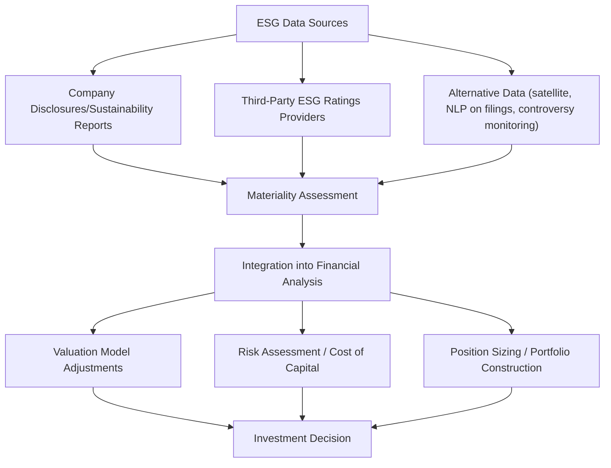

## ESG Integration in Investment Decisions

### Overview

ESG (Environmental, Social, and Governance) integration refers to the systematic incorporation of ESG factors into traditional financial analysis and investment decision-making, distinct from exclusionary screening or values-based investing. Rather than treating ESG considerations as separate ethical overlays, integration frameworks treat material ESG factors as inputs to fundamental valuation, risk assessment, and portfolio construction, on the premise that these factors can affect financial performance and risk-adjusted returns.

### ESG Investment Approaches: A Taxonomy

**Key Points**

- **Negative/exclusionary screening**: excluding entire sectors or companies (e.g., tobacco, fossil fuels, weapons manufacturers) from the investable universe based on predetermined criteria
- **Positive/best-in-class screening**: selecting companies with superior ESG performance relative to sector peers, rather than excluding entire industries
- **Norms-based screening**: excluding issuers that violate international standards (e.g., UN Global Compact principles, ILO labor conventions)
- **ESG integration**: the systematic and explicit inclusion of material ESG factors into fundamental financial analysis, distinct from screening approaches since it doesn't necessarily exclude any sector but adjusts valuation, risk assessment, or position sizing based on ESG-related considerations
- **Thematic investing**: targeting specific sustainability themes (renewable energy, water scarcity, gender diversity) as an investment thesis
- **Impact investing**: seeking measurable, intentional positive social/environmental impact alongside financial return, often with impact measurement as a formal mandate objective

ESG integration is distinguished from the other approaches primarily by its financial materiality framing—it argues ESG factors matter *because* they affect risk and return, not solely because of independent ethical considerations, though in practice these motivations are not mutually exclusive and can coexist within an integrated approach.

### Materiality Frameworks

A central methodological question in ESG integration is determining which ESG factors are financially material for a given industry, since not all ESG issues are relevant to all sectors.

**SASB (Sustainability Accounting Standards Board) Materiality Map**

SASB (now consolidated into the IFRS Foundation's ISSB, International Sustainability Standards Board) developed industry-specific materiality frameworks identifying which of roughly 26 general sustainability issues (across five dimensions: environment, social capital, human capital, business model & innovation, leadership & governance) are financially material for each of 77 industries.

**Example**

For an oil and gas exploration company, SASB-identified material topics typically include greenhouse gas emissions, water management, biodiversity impact, and worker health and safety. For a software/IT services company, material topics shift toward data privacy, data security, and employee recruitment/diversity—illustrating why a generic, non-industry-specific ESG scoring approach can misallocate analytical attention toward immaterial factors while under-weighting genuinely material ones.

**Double Materiality (EU Framework)**

The EU's Corporate Sustainability Reporting Directive (CSRD) formalizes a **double materiality** concept, requiring disclosure of both:

1. **Financial materiality**: how ESG factors affect the company's financial performance and enterprise value (the traditional integration framing)
2. **Impact materiality**: how the company's operations affect the environment and society, regardless of financial impact on the company itself

$$\text{Double Materiality} = \text{Financial Materiality} \cup \text{Impact Materiality}$$

This dual framing distinguishes the EU's regulatory approach from the traditionally US-centric, single (financial) materiality framing embodied in SASB/ISSB standards, reflecting a genuine methodological divergence in global ESG disclosure regulation. [Note: as of the knowledge cutoff, ISSB and CSRD interoperability efforts were ongoing, and the precise degree of convergence should be verified against current standard-setting developments.]

### ESG Ratings and Data Providers

| Provider | Approach | Notable Characteristic |
| --- | --- | --- |
| MSCI ESG Ratings | Industry-relative, letter-grade (AAA to CCC) | Widely used benchmark for index construction |
| Sustainalytics (Morningstar) | ESG Risk Rating (unmanaged risk exposure, absolute scale) | Focuses on "risk" framing rather than pure performance scoring |
| S&P Global ESG Scores | Corporate Sustainability Assessment-based | Integrates with S&P Dow Jones Sustainability Indices |
| Refinitiv (LSEG) ESG Scores | Percentile-rank based on disclosed data | Heavy reliance on company self-disclosure |

**Key Points**

- A well-documented empirical finding is that ESG ratings from different providers frequently **diverge substantially** for the same company (Berg, Kölbel, and Rigobon, 2022, found average pairwise correlations across major rating providers considerably lower than credit rating agency correlations for the same issuers), attributable to differences in: which underlying data sources are used, how missing data is handled, the relative weighting scheme across E, S, and G pillars, and whether ratings are scaled absolutely or relative to industry peers
- This **ratings divergence** ("aggregate confusion") complicates portfolio construction and academic research relying on any single ESG rating as ground truth, and has motivated research using multiple providers or focusing on specific, verifiable underlying metrics (e.g., carbon emissions data) rather than composite scores
- Rating providers differ in whether they measure a company's **ESG risk exposure and management** (financial materiality framing, e.g., Sustainalytics) versus broader **ESG performance/impact** (which can blend financial materiality with stakeholder impact considerations), a conceptual distinction that itself contributes to divergence

### Integration Methodologies in Practice

**1. Valuation Model Adjustments**

ESG factors can be incorporated directly into discounted cash flow (DCF) models by adjusting:

- **Cash flow projections**: incorporating expected costs from carbon pricing/regulation, litigation risk from governance failures, or projected revenue growth from favorable ESG-driven product positioning
- **Discount rate/cost of capital**: applying a risk premium or discount to the cost of equity/debt based on perceived ESG risk exposure, though the empirical basis for a specific quantitative adjustment remains debated in the literature [Inference: practitioner approaches vary substantially and lack full methodological consensus]
- **Terminal value assumptions**: adjusting long-term growth or terminal multiple assumptions for structural ESG-related risks or opportunities (e.g., stranded asset risk for fossil fuel reserves under a transition scenario)

$$V_0 = \sum_{t=1}^{n} \frac{CF_t (\text{ESG-adjusted})}{(1 + r_{\text{ESG-adjusted}})^t} + \frac{TV_n}{(1+r)^n}$$

**2. Fundamental Research Integration**

Analysts incorporate ESG considerations as qualitative or semi-quantitative inputs alongside traditional financial statement analysis, engaging management on ESG-related risks during due diligence and ongoing monitoring, often formalized through structured ESG scorecards embedded in the investment committee memo process.

**3. Quantitative/Factor-Based Integration**

ESG scores are treated as an additional factor in multi-factor quantitative models, tested for standalone or interaction effects with traditional factors (value, momentum, quality, low-volatility):

$$r_{i,t} = \alpha + \beta_1 \text{MKT}_t + \beta_2 \text{SMB}_t + \beta_3 \text{HML}_t + \beta_4 \text{ESG}_{i,t} + \varepsilon_{i,t}$$

**Key Points**

- Empirical findings on whether an "ESG factor" carries a statistically significant risk premium (positive or negative) are mixed and highly sensitive to sample period, region, and which ESG rating provider's scores are used—there is no academic consensus equivalent to the broad acceptance of value, size, or momentum factors [Inference: an active and unsettled area of empirical asset pricing research]
- Some studies find ESG integration is associated with lower downside risk/tail risk (a risk-mitigation channel) even absent a clear standalone return premium, distinguishing risk-adjusted from raw-return effects
- Multicollinearity between ESG scores and other characteristics (notably size and quality, since larger, more mature companies tend to have more ESG disclosure resources and often higher ESG scores) complicates isolating a pure ESG effect from these confounds

### Portfolio Construction Approaches

| Approach | Mechanism | Trade-off |
| --- | --- | --- |
| ESG tilt/optimization | Overweight high-ESG-score names, underweight low scores, within tracking-error constraints relative to a benchmark | Preserves broad diversification; modest ESG signal strength |
| ESG-weighted indices | Reweight index constituents by ESG score rather than market cap alone | Passive, rules-based, transparent methodology |
| Carbon-aware optimization | Explicitly minimize portfolio carbon footprint/intensity subject to tracking error and risk constraints | Directly targets a specific, quantifiable ESG dimension |
| Engagement-focused (active ownership) | Maintain full-universe holdings but exercise voting rights and direct company engagement to drive ESG improvement | Does not alter portfolio composition; relies on stewardship effectiveness |

$$\text{Portfolio Carbon Intensity} = \sum_i w_i \times \frac{\text{Scope 1+2 Emissions}_i}{\text{Revenue}_i}$$

### Active Ownership and Stewardship

**Key Points**

- **Proxy voting**: institutional investors increasingly vote on ESG-related shareholder resolutions (climate risk disclosure, board diversity, executive compensation linked to ESG metrics), with major asset managers publishing voting records and rationale
- **Engagement**: direct dialogue with company management/boards on ESG risks and improvement plans, often organized through collaborative investor initiatives (e.g., Climate Action 100+, though its structure and participant commitments have evolved over time and specifics should be verified against current initiative disclosures)
- Stewardship is sometimes framed as complementary to, or a substitute for, divestment: rather than exiting a position over ESG concerns, engaged investors argue that retained ownership provides greater leverage to influence corporate behavior—though the empirical effectiveness of engagement relative to divestment as a behavior-change mechanism remains debated [Inference: effectiveness likely varies by issue, company responsiveness, and investor coordination]

### Regulatory Landscape Affecting Integration Practice

**Key Points**

- **EU Sustainable Finance Disclosure Regulation (SFDR)**: classifies funds into Article 6 (no explicit ESG focus), Article 8 ("light green," promoting environmental/social characteristics), and Article 9 ("dark green," explicit sustainable investment objective), creating disclosure obligations tied to a fund's ESG integration claims
- **EU Taxonomy Regulation**: establishes a technical classification system defining which economic activities qualify as "environmentally sustainable," providing a standardized reference for Article 8/9 fund disclosures and corporate reporting
- **US regulatory approach**: has historically been comparatively less prescriptive at the federal level regarding mandatory ESG fund disclosure standards relative to the EU framework, though state-level and SEC rulemaking activity in this area has been active and subject to ongoing legal and political contestation [Inference: the US regulatory landscape has been notably more fluid and contested than the EU's over recent years; current specifics should be verified against latest SEC and state-level developments]
- **"Greenwashing" scrutiny**: regulators in multiple jurisdictions have increased enforcement focus on funds making ESG-related marketing claims not substantiated by actual portfolio composition or integration methodology, resulting in several high-profile enforcement actions and fund reclassifications

### Common Methodological Criticisms

**Key Points**

- **Rating divergence undermines comparability**: as noted, since different providers can rate the same company very differently, "ESG integration" claims across managers using different data providers may not be directly comparable
- **Self-reported data reliance**: many ESG scores rely heavily on voluntary corporate disclosure, creating potential for selective disclosure bias (companies disclosing favorable metrics prominently while omitting unfavorable ones) absent third-party assurance
- **Backward-looking bias**: many ESG metrics (historical emissions, past controversies) are inherently backward-looking, whereas investment decisions require forward-looking risk assessment, creating a structural lag between disclosed data and genuinely predictive signal
- **"ESG" as an overly aggregated construct**: bundling environmental, social, and governance dimensions into a single composite score can obscure important trade-offs (a company can score well on governance while performing poorly on environmental metrics), and academic critiques have increasingly called for disaggregated, pillar-specific analysis rather than reliance on composite scores

### Conclusion

ESG integration represents an attempt to formalize the incorporation of material non-financial factors into mainstream financial analysis, distinguished from exclusionary or values-based approaches by its explicit framing around financial materiality and risk-adjusted return impact. The field faces genuine, unresolved methodological challenges—substantial ratings divergence across providers, mixed and context-dependent empirical evidence on risk-adjusted return effects, and an evolving, sometimes fragmented global regulatory landscape (SFDR/EU Taxonomy vs. a more fluid US approach)—that practitioners and researchers should weigh carefully rather than treating "ESG integration" as a settled, standardized methodology.

**Related Topics**

- SASB/ISSB industry-specific materiality frameworks
- ESG ratings divergence and the "aggregate confusion" problem
- Climate risk (physical and transition) integration into valuation models
- Carbon footprint measurement and portfolio decarbonization strategies
- Shareholder engagement and proxy voting stewardship practices
- SFDR fund classification (Article 6/8/9) and greenwashing regulation
- Empirical evidence on ESG factor risk premia in asset pricing
- Double materiality and EU Corporate Sustainability Reporting Directive (CSRD)