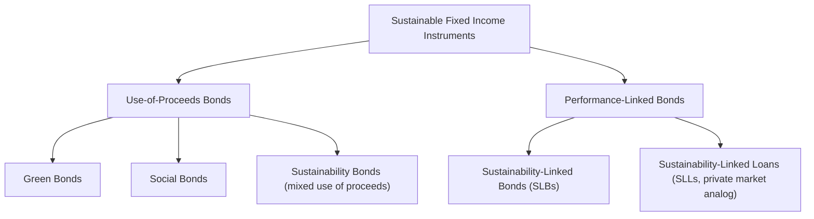
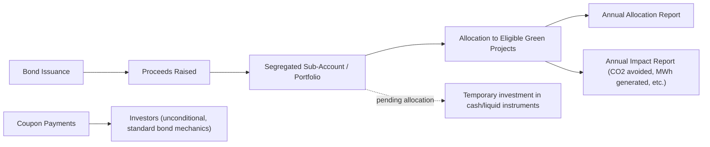

## Green and Sustainability-Linked Bonds

### Overview

Green bonds and sustainability-linked bonds (SLBs) are the two dominant instruments in the sustainable fixed income market, but they differ fundamentally in structure: green bonds are **use-of-proceeds instruments**, restricting raised capital to specific eligible environmental projects, while sustainability-linked bonds are **general-purpose financing instruments** whose financial terms (typically coupon rate) are contractually tied to the issuer's achievement of predefined sustainability performance targets. This structural distinction has significant implications for credit analysis, covenant design, and impact verification.

### Market Taxonomy

### Green Bonds: Structure and Standards

**Core Mechanism**

A green bond is structurally identical to a conventional bond (same seniority, coupon mechanics, and credit risk as the issuer's other debt) with an added contractual/voluntary commitment that proceeds will be allocated exclusively to eligible green projects.

**International Capital Market Association (ICMA) Green Bond Principles (GBP)**

The GBP, a voluntary framework rather than a binding regulation, establishes four core components:

1. **Use of Proceeds**: proceeds must be allocated to eligible green project categories (renewable energy, energy efficiency, clean transportation, sustainable water management, pollution prevention, green buildings, biodiversity conservation, among others)
2. **Process for Project Evaluation and Selection**: the issuer must disclose its process for determining project eligibility against defined environmental sustainability objectives
3. **Management of Proceeds**: net proceeds should be tracked (e.g., via a sub-account or sub-portfolio) and their allocation formally attested to periodically
4. **Reporting**: annual reporting on the allocation of proceeds and, where feasible, the environmental impact of funded projects (e.g., tons of CO2 avoided, MWh of renewable capacity added)

**Key Points**

- The GBP does not itself certify environmental legitimacy; it establishes a disclosure and process framework, meaning "green bond" compliance is fundamentally a matter of self-declared adherence to a voluntary framework absent binding third-party enforcement, unless the issuer separately obtains independent verification
- **External review** (though voluntary under ICMA) has become market-standard practice: second-party opinions (SPOs) from providers like Sustainalytics, CICERO, or Vigeo Eiris assess a bond framework's alignment with GBP and the credibility of the green project categories prior to issuance
- **EU Green Bond Standard (EuGBS)**, effective from late 2024, represents a more prescriptive, regulation-based approach requiring alignment with the EU Taxonomy for at least a specified minimum share of proceeds, along with mandatory external review by a registered external reviewer—a notable step toward standardization beyond ICMA's voluntary framework [Note: specific implementation timelines and thresholds should be verified against current EU regulatory publications given the framework's relative recency]

### Green Bond Cash Flow and Reporting Structure

**Key Points**

- Coupon payment and principal repayment obligations are **entirely independent** of environmental performance—a green bond issuer that fails to fully allocate proceeds to eligible projects, or whose funded projects underperform environmentally, faces no direct financial penalty under standard green bond structures (reputational risk aside), distinguishing them sharply from SLBs
- **Proceeds tracking, not project-level ring-fencing**: since bond proceeds are fungible with an issuer's general treasury operations in practice, "use of proceeds" tracking is typically an accounting/attestation exercise (allocating an equivalent amount to eligible expenditures) rather than physical, dollar-for-dollar tracing of specific banknotes to specific projects

### Sustainability-Linked Bonds (SLBs): Structure and Mechanics

**Core Mechanism**

Unlike green bonds, SLB proceeds are unrestricted and can be used for general corporate purposes. Instead, the bond's financial characteristics—most commonly the coupon rate—are contractually linked to whether the issuer achieves one or more predefined **Sustainability Performance Targets (SPTs)** measured against **Key Performance Indicators (KPIs)** by specified target observation dates.

**ICMA Sustainability-Linked Bond Principles (SLBP) Core Components**

1. **Selection of KPIs**: material, core, relevant, and quantifiable/externally verifiable metrics (e.g., Scope 1+2 GHG emissions intensity, renewable energy percentage, gender diversity in leadership)
2. **Calibration of SPTs**: targets should be ambitious, meaningfully beyond a business-as-usual trajectory, and benchmarked (e.g., against science-based decarbonization pathways or sector peer performance)
3. **Bond Characteristics**: the specific financial/structural consequence of target achievement or failure (most commonly, a coupon step-up)
4. **Reporting**: annual reporting on KPI performance relative to the SPT trajectory
5. **Verification**: independent, external verification of KPI performance is required at least annually near the target observation date(s)—a significantly stronger verification requirement than the voluntary external review common in green bonds

**Coupon Step-Up Mechanism**

$$\text{Coupon}_t =
\begin{cases}
C_0 & \text{if SPT is achieved by target observation date} \\
C_0 + \Delta & \text{if SPT is not achieved (step-up penalty)}
\end{cases}$$

**Example**

An issuer sells a 10-year SLB with an initial coupon of 4.00% and a single SPT: reduce Scope 1+2 GHG emissions intensity by 30% relative to a 2020 baseline by year 5. The bond documentation specifies a 25 basis point coupon step-up if the target is missed:

- If the target is achieved: coupon remains 4.00% for the bond's remaining life
- If the target is missed: coupon increases to 4.25% from year 5 through maturity (year 10)

$$\text{Additional Annual Cost if Missed} = \$100{,}000{,}000 \times 0.0025 = \$250{,}000 \text{ per year for 5 years} = \$1{,}250{,}000 \text{ total}$$

This creates a direct, quantifiable financial incentive for the issuer to pursue the stated sustainability objective, though critics note that step-up penalties in practice have often been calibrated at levels that may be immaterial relative to an issuer's overall cost of capital and profitability. [Inference: materiality of any specific step-up penalty depends on issuer size, bond size, and step-up magnitude relative to overall financing costs—this is a frequently raised, but not universally applicable, criticism]

### Green Bonds vs. Sustainability-Linked Bonds: Structural Comparison

| Dimension | Green Bonds | Sustainability-Linked Bonds |
| --- | --- | --- |
| Use of proceeds | Restricted to eligible green projects | Unrestricted (general corporate purposes) |
| Financial consequence of underperformance | None (proceeds tracking/reporting obligation only) | Coupon step-up (or other structural penalty) |
| Applicable issuers | Issuers with identifiable eligible green capex/opex | Any issuer, including those without discrete green projects (enables broader sectoral participation, e.g., heavy industry transition financing) |
| Verification | Voluntary external review common but not always mandatory | Mandatory annual independent verification of KPI performance under ICMA SLBP |
| Primary criticism | Proceeds fungibility; whether allocated projects would have occurred regardless of green financing (additionality question) | Whether SPTs and step-up penalties are sufficiently ambitious/material ("greenwashing via weak targets") |

### Additionality and Impact Questions

**Key Points**

- **Additionality**: a central, debated question for green bonds is whether the financed projects represent genuinely incremental environmental investment, or whether the issuer would have undertaken the same capital expenditure regardless of green bond financing (in which case the bond primarily provides a labeling/marketing benefit rather than driving new environmental outcomes) [Inference: additionality is inherently difficult to establish empirically since it requires a counterfactual that cannot be directly observed]
- **KPI/SPT ambition scrutiny for SLBs**: since issuers self-select their own KPIs and calibrate their own targets (subject to external review of the framework, not approval by investors directly), there is documented variation in target ambition across issuances, with some academic and NGO analyses finding a meaningful share of early SLB issuances set targets that appeared likely to be achieved under business-as-usual trajectories, undermining the instrument's intended incentive effect [Inference: findings and their generalizability vary by study methodology and issuance vintage; this remains an active area of market and academic scrutiny]
- **Greenium**: empirical studies have found that green bonds sometimes price at a modest yield discount ("greenium") relative to otherwise comparable conventional bonds from the same issuer, reflecting investor demand for green-labeled assets, though the magnitude is generally small (often cited in the low single-digit basis points range) and varies by market conditions, currency, and issuer [Inference: greenium magnitude and even its consistent existence across markets and periods remains subject to ongoing empirical debate]

### Credit Analysis Considerations

**Key Points**

- **Green bonds**: credit risk is determined by the issuer's overall creditworthiness (same seniority and recourse as conventional debt), not by the performance of the specific funded projects—a green bond from a financially distressed issuer carries that issuer's credit risk regardless of environmental merit
- **SLBs**: the coupon step-up mechanism introduces a modest, quantifiable path-dependent cash flow uncertainty into otherwise standard bond cash flow modeling; analysts must incorporate a probability-weighted assessment of SPT achievement into yield-to-worst/yield-to-maturity calculations
- **Framework and second-party opinion review** should be incorporated into ESG-integrated credit research as a qualitative input, given the absence of binding legal enforcement of "green" claims in most jurisdictions outside the emerging EuGBS regime
- **Covenant analysis**: SLB step-up triggers should be assessed for genuine bindingness—whether target observation dates, KPI calculation methodologies, and force majeure/M&A adjustment clauses could allow issuers to avoid triggering penalties even absent genuine target achievement

### Market Development and Sizing Context

**Key Points**

- The global green, social, sustainability, and sustainability-linked bond market has grown substantially since the first labeled green bond (European Investment Bank, 2007) and first sovereign green bond issuances (e.g., Poland, 2016; France, 2017), with SLBs emerging as a distinct instrument category beginning around 2019 (Enel's inaugural SLB issuance is commonly cited as an early landmark transaction)
- Sovereign, supranational, and agency (SSA) issuers, along with financial institutions and utilities, have historically represented substantial shares of green bond issuance, reflecting both large financing needs for eligible project categories (renewable energy, green buildings, sustainable infrastructure) and reputational/policy incentives for public-sector issuers
- [Inference: precise current market size, growth rates, and issuer composition should be verified against current market data sources (e.g., Climate Bonds Initiative, ICMA) given the rapid pace of market evolution]

### Conclusion

Green bonds and sustainability-linked bonds represent two structurally distinct approaches to sustainable fixed income financing: green bonds constrain the use of proceeds to specific eligible projects with reporting but no direct financial penalty for underperformance, while SLBs apply financial consequences (typically coupon step-ups) directly to an issuer's overall sustainability performance regardless of how proceeds are used. Both instruments face genuine, actively debated scrutiny regarding additionality, target ambition, and the materiality of financial incentives—concerns that credit and ESG analysts should incorporate into due diligence rather than treating the "green" or "sustainability-linked" label as a proxy for verified environmental outcome.

**Related Topics**

- ICMA Green Bond Principles and Sustainability-Linked Bond Principles frameworks
- EU Green Bond Standard and EU Taxonomy alignment requirements
- Second-party opinions and external verification methodologies
- The "greenium" and empirical pricing studies of labeled green debt
- Sustainability-linked loans as a private-market analog to SLBs
- Additionality assessment in green project finance
- Science-based targets and SPT calibration standards
- Sovereign green bond issuance and use-of-proceeds allocation reporting