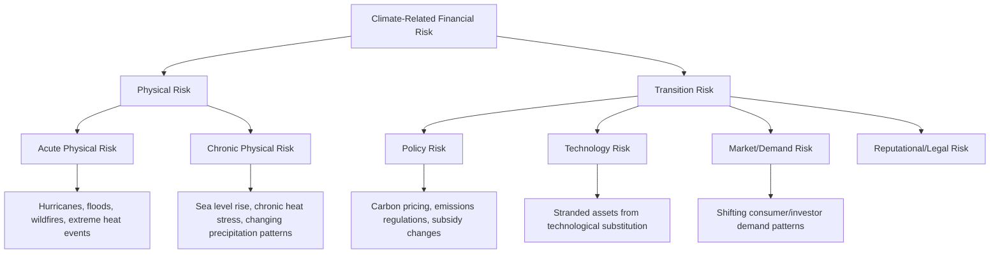
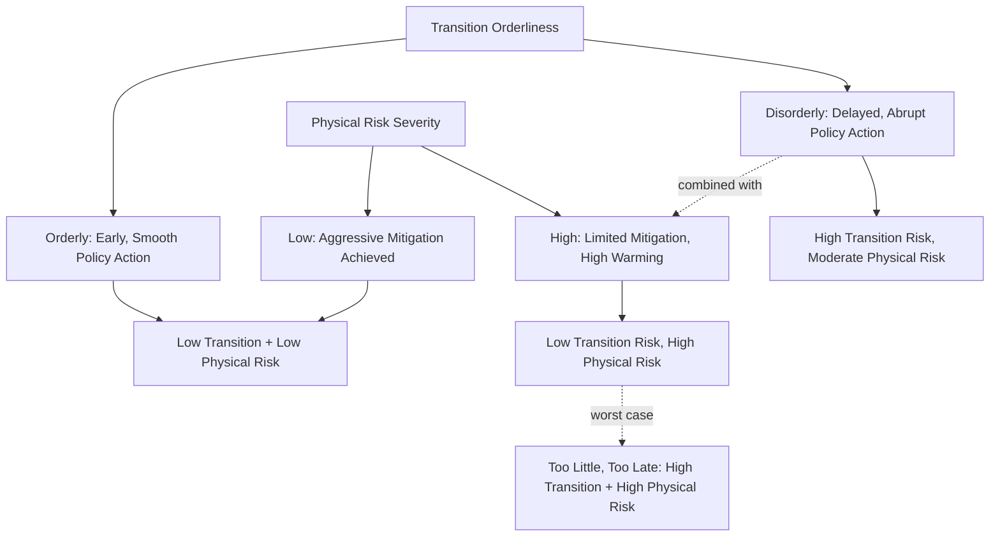

## Climate Transition and Physical Risk Pricing

### Overview

Climate risk pricing addresses how financial markets do, and should, incorporate two distinct categories of climate-related financial risk into asset valuation: **physical risk**, arising from the direct effects of climate change and extreme weather, and **transition risk**, arising from the economic and financial consequences of adjusting toward a lower-carbon economy. Both risk categories present significant measurement, modeling, and time-horizon challenges relative to conventional financial risk factors.

### Risk Taxonomy

### Physical Risk: Acute and Chronic

**Acute Physical Risk**

Discrete, event-driven risks from extreme weather events: hurricanes, floods, wildfires, and heatwaves. These are characterized by low-frequency, high-severity loss distributions, historically modeled using catastrophe (cat) risk modeling techniques borrowed from the insurance and reinsurance industry.

$$\text{Expected Annual Loss (EAL)} = \sum_{i} P(\text{event}_i) \times \text{Severity}(\text{event}_i) \times \text{Exposure}$$

**Chronic Physical Risk**

Gradual, long-term shifts in climate patterns: sea level rise, rising average temperatures, changing precipitation patterns, and increasing frequency/intensity of heat stress. These risks compound over long horizons and are harder to price into standard financial instruments given typical investment holding periods and asset maturity structures that are often shorter than the timescales over which chronic risks materialize.

**Key Points**

- Physical risk exposure is highly **geographically and asset-specific**, making generic sector-level or company-level ESG scores poorly suited to capturing it—two companies in the same industry can have vastly different physical risk exposure depending on the specific location of their physical assets, supply chains, and customer base
- **Real estate and infrastructure** are particularly exposed asset classes given their fixed physical location and long asset lives, motivating growing use of geospatial climate risk analytics (flood zone mapping, wildfire risk scoring, coastal exposure modeling) in real asset underwriting
- **Insurance market signals** are an increasingly cited proxy for physical risk pricing: rising insurance premiums, reduced coverage availability, or insurer withdrawal from high-risk regions (observed in several US coastal and wildfire-prone markets) can serve as a leading indicator of physical risk being priced into related real estate and infrastructure valuations [Inference: the strength and consistency of this signal across different markets and event types is an active area of empirical research]

### Transition Risk Components

**1. Policy and Regulatory Risk**

Risk arising from climate-related regulatory changes: carbon pricing mechanisms (carbon taxes, cap-and-trade systems), emissions standards, subsidy phase-outs for carbon-intensive activities, and disclosure mandates.

$$\text{Carbon Cost Exposure} = \text{Emissions (tCO}_2\text{e)} \times \text{Carbon Price (\$/tCO}_2\text{e)}$$

**Example**

A cement manufacturer emitting 2 million tonnes of CO2e annually, operating in a jurisdiction with a carbon price rising from $30/tonne to a projected $100/tonne over a decade under an aggressive policy scenario:

$$\text{Current Annual Carbon Cost} = 2{,}000{,}000 \times \$30 = \$60{,}000{,}000$$

$$\text{Projected Annual Carbon Cost (Year 10)} = 2{,}000{,}000 \times \$100 = \$200{,}000{,}000$$

This represents a material, quantifiable input for cash flow projection and valuation, assuming no offsetting abatement investment or emissions reduction over the projection period—a static assumption analysts typically adjust downward as issuers implement decarbonization measures.

**2. Technology Risk (Stranded Assets)**

Risk that technological transition (renewable energy cost declines, electrification, carbon capture alternatives) renders existing carbon-intensive assets economically obsolete before the end of their expected useful/depreciable life.

$$\text{Stranded Asset Value} = \text{Book Value} - \text{Recoverable Value under Transition Scenario}$$

**Key Points**

- **Fossil fuel reserves** are the most frequently cited stranded asset category: under scenarios consistent with limiting global warming to 1.5-2°C, a substantial share of currently booked proved reserves would need to remain unextracted ("unburnable carbon"), implying potential material write-downs relative to reserves valued under a business-as-usual extraction assumption
- Stranding risk extends beyond fossil fuel reserves to carbon-intensive capital stock more broadly: internal combustion engine manufacturing capacity, coal-fired power generation assets, and carbon-intensive industrial processes without viable decarbonization pathways
- The **speed and predictability of technology cost curves** (e.g., historically rapid solar PV and battery storage cost declines) materially affects stranding risk timing, and scenario models are highly sensitive to technology cost assumptions that have historically proven difficult to forecast accurately over multi-decade horizons [Inference: technology cost forecasting uncertainty is a well-documented, structural limitation of long-horizon transition scenario modeling]

**3. Market and Demand Risk**

Shifts in consumer preferences, investor capital allocation, and corporate procurement standards toward lower-carbon products and suppliers, affecting revenue growth and competitive positioning independent of direct regulatory action.

**4. Legal and Litigation Risk**

Growing litigation targeting corporations and, in some cases, financial institutions over climate-related disclosure adequacy, alleged greenwashing, or direct liability for climate damages, representing a less quantifiable but increasingly monitored risk category. [Inference: litigation trends and outcomes are jurisdiction-specific and rapidly evolving; this remains a developing area of legal and financial risk assessment]

### Climate Scenario Analysis Frameworks

Given the deep uncertainty and long time horizons involved, climate risk pricing relies heavily on **scenario analysis** rather than single point-estimate forecasting, following frameworks established by:

**Network for Greening the Financial System (NGFS) Scenarios**

The NGFS, a coalition of central banks and supervisors, publishes a widely referenced set of climate scenarios used across financial sector climate risk assessment, typically organized along two dimensions: physical risk severity and transition orderliness.

| Scenario Category | Description |
| --- | --- |
| Orderly Transition | Early, well-coordinated policy action; smooth transition with lower physical risk but earlier transition cost realization |
| Disorderly Transition | Delayed, then abrupt policy action; higher transition risk concentrated in a shorter window, elevated stranded asset risk |
| Hot House World | Limited additional climate policy action; lower near-term transition risk but substantially higher long-run physical risk |
| Too Little, Too Late | Insufficient action combined with disorderly late action; combines elevated physical and transition risk |

**Key Points**

- Scenario analysis is explicitly **not** a forecasting exercise producing a single probability-weighted expected outcome; rather, it stress-tests portfolios and balance sheets against a range of plausible, internally consistent future pathways to identify vulnerabilities under different climate and policy trajectories
- Central bank and supervisory climate stress tests (e.g., conducted by the Bank of England, European Central Bank, and other NGFS member authorities) have applied these scenarios to assess financial system resilience, generally finding that transition risk under disorderly scenarios and physical risk under high-warming scenarios both represent material, though generally not systemically catastrophic in isolation, risk categories for the tested financial institutions [Inference: specific stress test findings and their interpretation vary by jurisdiction, methodology, and vintage; results should be verified against the specific study in question]

### Carbon Pricing Mechanisms and Their Financial Modeling Implications

| Mechanism | Structure | Financial Modeling Implication |
| --- | --- | --- |
| Carbon tax | Fixed price per tonne of CO2e emitted | Directly modelable as a per-unit cost increase; price path certainty depends on policy durability |
| Cap-and-trade (ETS) | Market-determined price via tradeable emissions allowances under a declining cap | Price volatility itself becomes a risk factor; requires forward curve/option-based modeling for hedging assessment |
| Internal carbon price | Company-set shadow price used in internal capital allocation decisions, without external market mechanism | Signals management's own transition risk assessment; comparability across companies limited by voluntary, self-determined methodology |
| Border carbon adjustment (e.g., EU CBAM) | Import tariff based on embedded carbon content of imported goods | Affects competitive positioning of carbon-intensive importers/exporters differently by trade exposure |

### Integrating Climate Risk into Valuation Models

**Example**

A DCF-based approach to incorporating transition risk for a carbon-intensive issuer might involve running parallel valuations under multiple NGFS-aligned scenarios:

1. **Orderly transition scenario**: gradual carbon price increase, smooth demand shift, moderate capex for decarbonization technology, resulting terminal value reflecting a successfully transitioned business model
2. **Disorderly transition scenario**: delayed carbon pricing followed by an abrupt, steep increase; compressed timeline for capital reallocation, higher stranded asset write-down probability, and elevated cost of capital reflecting realized policy uncertainty
3. **Hot house world scenario**: minimal transition cost realized, but elevated physical risk assumptions applied to physical asset base, supply chain disruption probability, and potentially higher long-run operating cost volatility

$$V_{\text{probability-weighted}} = \sum_{s} P(\text{scenario}_s) \times V(\text{scenario}_s)$$

though in practice, given the deep uncertainty around scenario probabilities themselves, many practitioners present scenario-specific valuation ranges rather than a single probability-weighted point estimate, explicitly preserving the range of plausible outcomes for decision-makers rather than collapsing it into potentially spurious precision. [Inference: this reflects a commonly cited best-practice critique of naive probability-weighting given the genuine deep uncertainty in scenario likelihoods]

### Data and Measurement Challenges

**Key Points**

- **Scope 3 emissions** (value chain emissions, both upstream from suppliers and downstream from product use) typically represent the largest share of a company's total carbon footprint for many sectors but are the least reliably measured and disclosed, given reliance on estimation methodologies and third-party data rather than direct measurement
- **Physical risk geospatial data** quality and resolution vary substantially by region and hazard type, with more mature data infrastructure generally available for well-studied hazards (US flood risk, hurricane modeling) than for less-studied hazards or emerging-market geographies [Inference: general pattern reflecting historical concentration of catastrophe modeling development in mature insurance markets]
- **Forward-looking vs. backward-looking metrics**: most currently available climate data (historical emissions, past weather events) is inherently backward-looking, while transition and physical risk pricing fundamentally requires forward-looking assessment—a structural tension analogous to, but arguably more pronounced than, the general ESG data limitations discussed in broader ESG integration contexts

### Regulatory and Disclosure Developments

**Key Points**

- **Task Force on Climate-related Financial Disclosures (TCFD)** framework, now substantially incorporated into the IFRS Foundation's ISSB S2 climate disclosure standard, established the now-standard four-pillar disclosure structure: governance, strategy, risk management, and metrics/targets, including explicit encouragement of scenario analysis disclosure
- **Mandatory climate risk disclosure requirements** have expanded across multiple jurisdictions (EU CSRD, UK mandatory TCFD-aligned reporting, evolving SEC climate disclosure rulemaking in the US), progressively formalizing what had previously been largely voluntary disclosure practice [Inference: the pace and final scope of mandatory disclosure regimes, particularly in the US, has been subject to ongoing legal and political contestation and should be verified against current regulatory status]
- **Central bank supervisory expectations**: a growing number of banking and insurance supervisors have incorporated climate risk into supervisory expectations for risk management frameworks, incrementally normalizing climate scenario analysis as a component of standard prudential risk management rather than a specialized ESG-only exercise

### Conclusion

Physical and transition risk pricing require methodologies fundamentally different from conventional financial risk modeling, given deep uncertainty, long time horizons often exceeding standard financial planning periods, and the fundamentally scenario-dependent (rather than probability-forecastable) nature of key drivers like future policy action and technology cost trajectories. Scenario analysis frameworks like NGFS provide a structured, increasingly standardized basis for stress-testing rather than point-forecasting climate financial risk, while genuine measurement challenges—particularly around Scope 3 emissions and granular physical risk data—continue to constrain the precision with which these risks can be incorporated into mainstream valuation and credit analysis.

**Related Topics**

- NGFS climate scenario framework and central bank climate stress testing
- Stranded asset risk and unburnable carbon reserve valuation
- TCFD/ISSB S2 climate disclosure standards and scenario analysis requirements
- Carbon pricing mechanisms: carbon taxes, cap-and-trade, and border adjustments
- Catastrophe risk modeling techniques applied to physical climate risk
- Scope 3 emissions measurement methodologies and data quality challenges
- Climate litigation risk and evolving legal liability frameworks
- Insurance market signals as physical risk pricing indicators