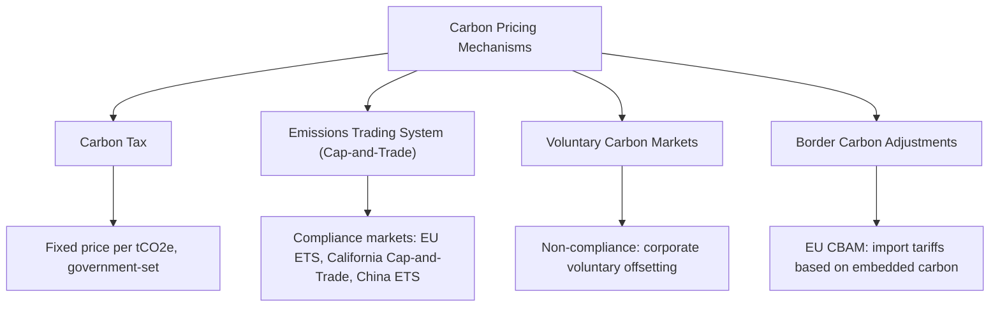
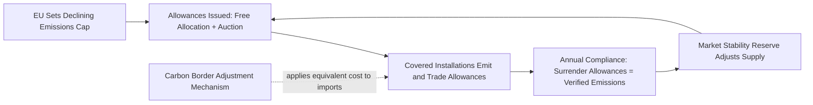
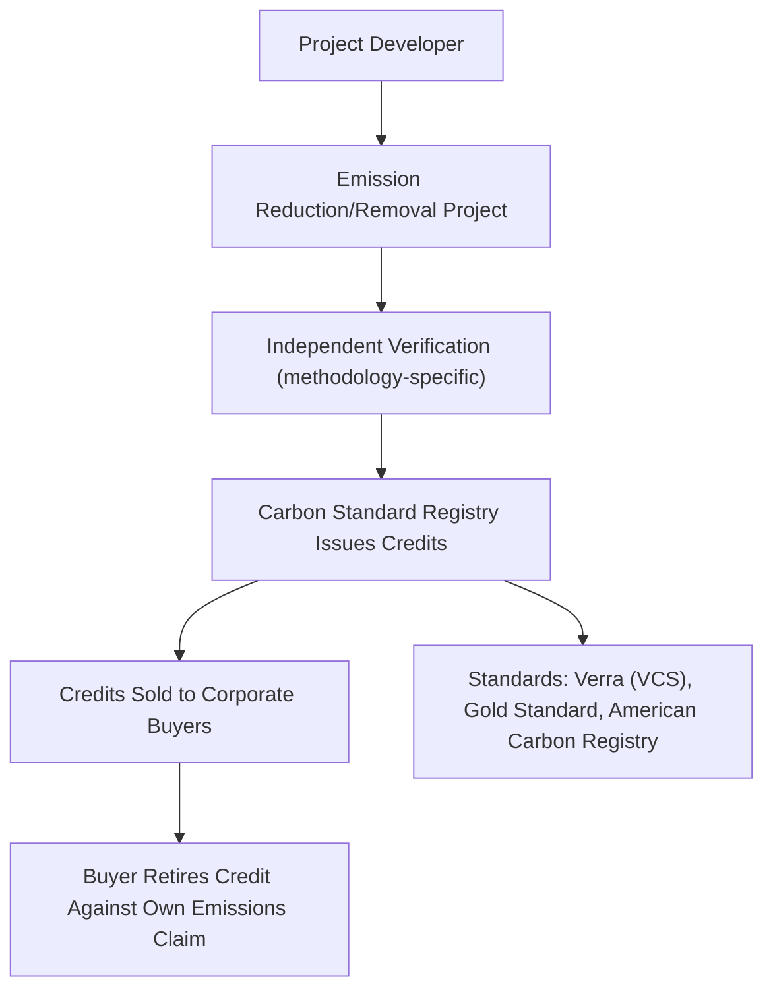

## Carbon Markets and Carbon Pricing

### Overview

Carbon pricing is a policy and market mechanism that assigns an explicit cost to greenhouse gas emissions, internalizing the externality of climate damage into economic decision-making. Two broad instrument families dominate: **carbon taxes** (a fixed price per unit of emissions, set directly by government) and **emissions trading systems (ETS)** (a market-determined price emerging from trading within a quantity-capped allowance system). A parallel, distinct market—**voluntary carbon markets**—operates alongside these compliance mechanisms, with materially different pricing dynamics and integrity considerations.

### Carbon Pricing Instrument Taxonomy

### Carbon Taxes

**Mechanism**

A carbon tax directly sets the price per tonne of CO2-equivalent (tCO2e) emitted, typically levied upstream (on fossil fuel producers/importers) or at the point of combustion, with the cost expected to pass through the supply chain to end consumers via higher energy and product prices.

$$\text{Tax Liability} = \text{Emissions (tCO}_2\text{e)} \times \text{Tax Rate (\$/tCO}_2\text{e)}$$

**Key Points**

- **Price certainty, quantity uncertainty**: a carbon tax fixes the price of emissions but leaves the resulting quantity of emissions reduction uncertain, since actual abatement response depends on the price elasticity of demand and available substitution technology
- Notable carbon tax jurisdictions include Sweden (among the earliest and highest-priced carbon taxes, dating to 1991), Canada's federal carbon pricing backstop (combining a tax with rebate mechanisms), and Singapore
- Revenue recycling design (returning tax revenue via rebates, tax cuts, or green investment) is a major policy design consideration affecting both the tax's political durability and its distributional/equity impact [Inference: specific revenue recycling designs and their effectiveness are actively debated in public finance literature]

### Emissions Trading Systems (Cap-and-Trade)

**Mechanism**

A regulator sets a declining cap on total allowable emissions within the covered sector(s), issues (via free allocation or auction) a corresponding number of tradeable emissions allowances, and requires covered entities to surrender allowances equal to their actual emissions. The price emerges from market trading rather than being administratively set.

$$\text{Total Allowances} = \text{Cap}_t \quad \text{(declining over time per a predetermined trajectory)}$$

$$\text{Market Price} = f(\text{Aggregate Abatement Cost Curve}, \text{Cap Tightness}, \text{Banking/Borrowing Behavior})$$

**Key Points**

- **Quantity certainty, price uncertainty**: the reverse trade-off from a carbon tax—an ETS guarantees the total emissions ceiling but leaves the market-clearing price to fluctuate based on economic activity, energy prices, and abatement cost realizations
- **Allowance allocation methods**: free allocation (grandfathering, often based on historical emissions or benchmarked output intensity, used to protect trade-exposed, emissions-intensive industries from competitiveness loss during transition periods) versus auctioning (generating government revenue and generally considered more economically efficient by removing the implicit subsidy embedded in free allocation)
- **Banking and borrowing**: most ETS designs allow regulated entities to bank unused allowances for future compliance periods (smoothing price volatility and providing intertemporal flexibility) and, in some designs, limited borrowing against future allocations

**EU Emissions Trading System (EU ETS)**

The EU ETS, launched in 2005, is the largest and longest-running major compliance carbon market, covering power generation, energy-intensive industry, and (progressively) aviation and, from 2024, maritime shipping.

**Key Points**

- The **Market Stability Reserve (MSR)**, introduced to address a historical oversupply problem that had depressed EU ETS prices for much of its early phases, algorithmically adjusts the number of allowances auctioned based on the total allowances in circulation, functioning as a supply-management mechanism to reduce excessive price volatility and structural oversupply
- EU ETS allowance prices have exhibited substantial historical volatility, reflecting economic cycles (notably a sharp price collapse following the 2008 financial crisis due to reduced industrial output and allowance oversupply) and subsequent structural reforms (including the MSR) that contributed to materially higher price levels in more recent years [Inference: specific price levels should be verified against current market data given ongoing volatility and policy evolution]
- The EU's **Carbon Border Adjustment Mechanism (CBAM)**, being phased in through the mid-2020s, applies an equivalent carbon cost to imports of covered goods (initially including cement, steel, aluminum, fertilizers, electricity, and hydrogen), designed to prevent "carbon leakage" (production relocating to jurisdictions with laxer carbon pricing) as free allocation for EU domestic producers is progressively phased out

**Other Major Compliance Markets**

| System | Coverage | Key Characteristic |
| --- | --- | --- |
| California Cap-and-Trade | Power, industry, transportation fuels | Linked with Quebec's system; includes a price floor and ceiling (price containment reserve) |
| RGGI (Regional Greenhouse Gas Initiative, US Northeast) | Power sector only | First mandatory US cap-and-trade program (2009), multi-state cooperative structure |
| China National ETS | Initially power sector, expanding to other sectors | World's largest ETS by covered emissions, though historically operating with intensity-based (not absolute cap) allocation in its initial phase |
| UK ETS | Post-Brexit successor to UK participation in EU ETS | Broadly similar design to EU ETS following UK's departure |

[Note: specific coverage, price levels, and design parameters for each system evolve regularly through policy reform; current details should be verified against each program's official regulatory publications.]

### Carbon Price Levels and the Social Cost of Carbon

**Key Points**

- The **social cost of carbon (SCC)**, an estimate of the discounted present value of economic damages from one additional tonne of CO2 emitted, is used in cost-benefit analysis of climate policy and, in some jurisdictions, regulatory impact assessment, but estimates vary enormously (from roughly $50 to several hundred dollars per tonne across major published estimates) depending heavily on assumed discount rates, damage function specification, and treatment of catastrophic/tail risk scenarios [Inference: this range reflects genuine, unresolved methodological disagreement among economists rather than simple estimation error, and any specific point estimate requires citing its source assumptions]
- The **High-Level Commission on Carbon Prices** (Stiglitz-Stern Commission, 2017) suggested carbon prices in the range of $40-80/tCO2e by 2020 and $50-100/tCO2e by 2030 as consistent with meeting the Paris Agreement's temperature goals, though actual observed carbon prices across most existing systems have historically remained below these suggested ranges for much of their history, with a few notable exceptions (e.g., certain Nordic carbon taxes) [Inference: comparison of current price levels against these benchmarks requires up-to-date market data]
- **Carbon price convergence** across jurisdictions remains limited, creating both competitiveness concerns (motivating border adjustment mechanisms) and arbitrage/carbon leakage dynamics as capital and production can shift toward lower-carbon-cost jurisdictions

### Voluntary Carbon Markets

**Mechanism**

Distinct from compliance markets, voluntary carbon markets (VCMs) allow companies or individuals to purchase carbon credits—each representing a verified tonne of CO2e reduced, avoided, or removed—to offset their own emissions on a non-mandatory basis, typically as part of corporate net-zero or carbon-neutrality commitments.

**Key Points**

- **Credit types** span emission reduction projects (renewable energy, methane capture, avoided deforestation—REDD+) and emission removal projects (afforestation/reforestation, direct air capture, enhanced weathering, biochar), with removal credits generally considered more robust against additionality and permanence concerns but historically commanding a significant price premium and representing a smaller share of overall market volume
- **Additionality**: the core integrity question for any offset credit—would the emission reduction/removal have occurred anyway absent the carbon credit revenue? This is inherently a counterfactual claim that cannot be directly observed, and has been a persistent source of credibility challenges, particularly for certain forestry and avoided-deforestation project types where baseline (counterfactual deforestation rate) assumptions have faced significant scrutiny in investigative journalism and academic analysis [Inference: the scale and generalizability of integrity problems found in specific investigations to the broader VCM remains debated, and varies substantially by project type, methodology, and registry]
- **Permanence risk**: particularly relevant for nature-based removal credits (forestry), where sequestered carbon can be released back into the atmosphere through wildfire, disease, land-use reversal, or political/legal change, undermining the credit's claimed long-term climate benefit unless robust buffer pools or insurance mechanisms are in place
- **Double counting risk**: ensuring a single tonne of emission reduction is not claimed by multiple parties (e.g., both the host country toward its Paris Agreement Nationally Determined Contribution and a corporate buyer toward its own net-zero claim)—addressed under Article 6 of the Paris Agreement through "corresponding adjustment" accounting mechanisms for internationally transferred mitigation outcomes

**Market Integrity Initiatives**

In response to well-documented credibility concerns, several initiatives have emerged to standardize quality assessment: the **Integrity Council for the Voluntary Carbon Market (ICVCM)**, which established "Core Carbon Principles" to assess credit methodologies, and the **Voluntary Carbon Markets Integrity Initiative (VCMI)**, focused on standards for corporate claims made using purchased credits. [Note: given the rapidly evolving nature of these initiatives and their assessment outcomes, current status should be verified against each body's latest published determinations.]

### Compliance vs. Voluntary Market Comparison

| Dimension | Compliance Markets (ETS/Tax) | Voluntary Carbon Markets |
| --- | --- | --- |
| Legal basis | Government-mandated | Voluntary corporate/individual participation |
| Price formation | Regulated cap-and-trade market or fixed tax rate | Fragmented, credit-type and quality-dependent pricing |
| Fungibility | High within a given system (allowances largely homogeneous) | Low across project types; significant price dispersion by methodology, vintage, and co-benefits |
| Enforcement | Legal penalties for non-compliance | Reputational consequences only; no legal enforcement of offset claims in most jurisdictions |
| Primary integrity concern | Cap-setting rigor, allocation method | Additionality, permanence, double-counting |

### Carbon Price as a Financial Analysis Input

**Key Points**

- **Direct cost modeling**: for companies subject to compliance carbon pricing, current and projected allowance/tax costs should be incorporated directly into operating cost projections and, where hedging is available (as in liquid ETS futures markets like EU ETS futures traded on ICE), carbon price risk can be assessed using standard derivatives pricing and hedging frameworks
- **Internal carbon pricing**: many corporations, including those not currently subject to binding external carbon pricing, apply a voluntary internal shadow price to capital allocation decisions, serving as a forward-looking risk management tool anticipating future regulatory carbon cost exposure—though methodologies and price levels are self-determined and vary substantially across companies, limiting cross-company comparability
- **Carbon price forward curves**: liquid compliance markets like EU ETS have developed exchange-traded futures markets, allowing market-implied forward carbon price expectations to be extracted and used as a forward-looking input to valuation models, analogous to how commodity forward curves inform other input cost projections
- **Offset credit pricing as a cost management tool**: for companies pursuing voluntary net-zero commitments, VCM credit pricing (which varies enormously by project type and quality tier) represents a direct input to the cost of achieving stated climate commitments, with corporate procurement strategy increasingly distinguishing between lower-cost, lower-integrity credits and higher-cost, higher-integrity removal credits based on both climate impact and reputational risk considerations

### Conclusion

Carbon pricing operates through two structurally distinct compliance mechanisms—taxes (price certainty, quantity uncertainty) and cap-and-trade systems (quantity certainty, price uncertainty)—alongside a parallel voluntary carbon market with materially different integrity considerations and no legal enforcement mechanism. For financial analysis, compliance carbon pricing increasingly represents a directly modelable, sometimes hedgeable cost input, while voluntary carbon credits require careful quality assessment given persistent, well-documented additionality, permanence, and double-counting concerns that distinguish genuine climate impact from credits that may not represent the emission reductions they claim.

**Related Topics**

- EU ETS Market Stability Reserve and allowance price dynamics
- Carbon Border Adjustment Mechanism (CBAM) design and carbon leakage prevention
- Social cost of carbon estimation methodologies and discount rate debates
- Additionality and permanence assessment in voluntary carbon credit methodologies
- Article 6 of the Paris Agreement and corresponding adjustment accounting
- Internal carbon pricing practices in corporate capital allocation
- Carbon futures markets and forward curve-based risk management
- REDD+ forestry credits and baseline/counterfactual integrity challenges