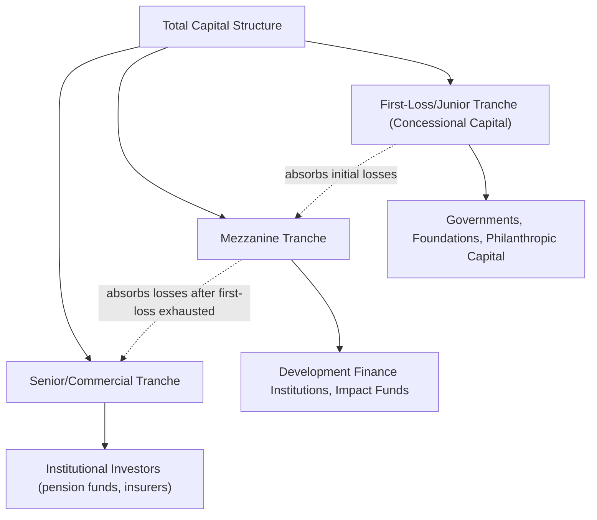

## Impact Investing and Blended Finance

### Overview

Impact investing seeks to generate measurable, intentional positive social or environmental outcomes alongside financial return, distinguishing it from ESG integration (which treats sustainability factors primarily as inputs to risk-adjusted return) and from philanthropy (which generally does not require financial return). Blended finance is a structuring approach that combines concessional (below-market-return) capital with commercial capital to mobilize private investment into ventures or sectors that would otherwise be considered too high-risk or low-return for commercial investors alone. Together, these frameworks address a persistent gap between traditional commercial finance and pure philanthropic grant-making.

### Defining Impact Investing

**Global Impact Investing Network (GIIN) Core Characteristics**

The GIIN, a leading industry body, defines impact investments by four core characteristics:

1. **Intentionality**: the investor's explicit intent to generate positive, measurable social/environmental impact, not merely a byproduct of the investment
2. **Investment with return expectations**: impact investments are expected to generate a financial return (distinguishing them from grants), spanning a return spectrum from below-market to risk-adjusted market-rate returns
3. **Range of return expectations and asset classes**: impact investments can be made across asset classes (private equity, debt, real assets, public equities) and can target market-rate or concessional returns depending on investor mandate
4. **Impact measurement**: a commitment to measuring and reporting the social and environmental performance of underlying investments, distinguishing genuine impact investing from unsubstantiated claims

**Key Points**

- The **return spectrum** distinguishes "impact-first" investors (willing to accept concessional, below-market returns in exchange for greater impact) from "finance-first" impact investors (requiring risk-adjusted market-rate returns while still targeting measurable impact), a distinction with significant implications for capital structuring and investor base
- Impact investing spans an enormous range of sectors and structures: microfinance, affordable housing, renewable energy in emerging markets, healthcare access, financial inclusion, and increasingly climate-specific strategies overlapping with the broader climate finance landscape
- The field emerged from, and remains closely associated with, **development finance institutions (DFIs)** such as the International Finance Corporation (IFC), and has progressively expanded to include mainstream asset managers launching dedicated impact funds

### Impact Measurement and Management (IMM)

**Key Points**

- **Theory of Change**: a structured framework articulating the causal pathway from an investment's activities and outputs to its intended intermediate outcomes and ultimate long-term impact, forming the analytical basis for what should be measured and why
- **IRIS+ metrics** (managed by GIIN): a standardized catalog of impact metrics across sectors (e.g., number of jobs created, tonnes of CO2 avoided, number of underserved individuals reached), designed to improve comparability across funds and reduce the proliferation of bespoke, non-comparable impact metrics
- **Impact-weighted accounting**: an emerging methodological approach (associated with research initiatives such as Harvard Business School's Impact-Weighted Accounts Project) attempting to monetize social and environmental externalities and incorporate them directly into financial statements, though this remains a developing, methodologically contested area rather than a standardized practice [Inference: monetization methodologies for social/environmental externalities involve significant assumptions and are not yet subject to broad practitioner or regulatory consensus]
- **Attribution vs. contribution**: a persistent measurement challenge distinguishing impact directly attributable to a specific investment from impact that would have occurred through other causal pathways (government programs, other investors, market forces)—analogous to, but often more granular than, the additionality question raised in green bond and carbon credit contexts

### Additionality in Impact Investing

The additionality question—would this positive outcome have occurred without this specific investment?—is central to impact investing legitimacy, particularly for finance-first strategies targeting market-rate returns in sectors that may already attract conventional commercial capital.

**Key Points**

- **Financial additionality**: the investment provides capital that would not otherwise have been available on similar terms (e.g., financing an early-stage renewable energy project in a frontier market where conventional lenders are unwilling to lend absent a de-risking mechanism)
- **Non-financial/value-added additionality**: the investor provides technical assistance, governance improvement, or strategic guidance beyond capital alone, contributing to impact outcomes distinct from the capital itself
- Critics have raised concern that some self-labeled "impact" investments in liquid public markets or well-established sectors may lack genuine additionality, since the underlying company's operations and impact would likely proceed similarly regardless of the specific investor's participation—a concern structurally similar to additionality critiques in green bond markets [Inference: the prevalence and materiality of this concern across the broader impact investing universe is empirically difficult to establish and varies substantially by strategy and asset class]

### Blended Finance: Structure and Rationale

**Core Concept**

Blended finance uses concessional capital (grants, below-market-rate loans, guarantees, first-loss capital) strategically positioned within a capital structure to absorb disproportionate risk, thereby improving the risk-adjusted return profile for commercial (market-rate-seeking) investors and mobilizing private capital into markets or sectors it would not otherwise enter.

$$\text{Effective Risk-Adjusted Return to Senior/Commercial Tranche} = f(\text{Concessional Capital Size}, \text{Subordination Structure}, \text{Underlying Asset Risk})$$

### Blended Finance Structuring Mechanisms

**1. First-Loss Capital / Junior Tranche Subordination**

Concessional capital providers (often DFIs, foundations, or governments) accept the initial layer of losses in a structured vehicle, effectively providing credit enhancement to more senior, commercial tranches.

**Example**

A $100 million emerging-market renewable energy fund is structured with:

| Tranche | Amount | Provider | Position |
| --- | --- | --- | --- |
| Senior debt | $60 million | Commercial banks, institutional investors | First claim on cash flows, most protected from losses |
| Mezzanine | $25 million | DFIs, impact-focused asset managers | Subordinate to senior, senior to first-loss |
| First-loss/junior equity | $15 million | Government agency, philanthropic foundation | Absorbs first 15% of portfolio losses |

If underlying project defaults generate $12 million in losses, the first-loss tranche absorbs the full amount, leaving senior and mezzanine tranches unaffected—this credit enhancement is what allows the senior tranche to be marketed to commercial investors at a risk profile and return expectation comparable to conventional fixed income, despite the underlying portfolio's genuinely higher standalone risk.

**2. Guarantees**

A DFI or donor agency provides a partial credit guarantee covering a specified percentage of losses on a loan portfolio, reducing the effective risk borne by commercial lenders without requiring upfront capital deployment by the guarantor unless losses actually materialize.

**3. Technical Assistance Facilities**

Grant-funded technical assistance (feasibility studies, capacity building, regulatory engagement) is often bundled alongside blended finance capital structures, addressing non-financial barriers to investment (e.g., project preparation capacity in frontier markets) that pure capital provision alone cannot resolve.

**4. Concessional Pricing/Below-Market Rate Capital**

Direct provision of debt or equity at below-market terms (interest rate, tenor, currency risk-bearing) blended alongside commercial capital within the same instrument or transaction, rather than through tranched subordination.

### OECD DAC Blended Finance Principles

The OECD Development Assistance Committee has published guiding principles for blended finance, emphasizing:

**Key Points**

- **Additionality**: concessional finance should mobilize commercial investment that would not otherwise occur, avoiding "crowding out" private capital that would have invested on commercial terms regardless
- **Crowding-in and market development**: blended finance structures should aim to demonstrate commercial viability and progressively reduce reliance on concessional capital over time, rather than creating permanent dependency on subsidized structures
- **Commercial sustainability**: transactions should be structured toward eventual market-based, unsubsidized replicability, rather than one-off transactions with no pathway to broader market mobilization
- **Reinforcing development priorities**: blended finance should align with, and not undermine, local development priorities and country ownership of development strategy [Inference: application and enforcement of these principles in practice varies by transaction and has been subject to ongoing critique regarding consistency]

### Common Criticisms and Debates

**Key Points**

- **Mobilization ratio concerns**: a frequently cited concern is that the ratio of private capital mobilized per dollar of concessional/public capital deployed has, in many blended finance transactions, been lower than initially projected by proponents, raising questions about the mechanism's scalability relative to the scale of financing needs (e.g., for the UN Sustainable Development Goals or Paris Agreement-aligned climate finance) [Inference: mobilization ratio findings vary substantially across studies, sectors, and reporting methodologies, and remain an actively debated empirical question]
- **Subsidy allocation efficiency**: critics have questioned whether concessional capital is being allocated to genuinely additional, high-impact transactions, or whether some blended structures primarily reduce risk/enhance returns for commercial investors on transactions that may have proceeded on largely similar terms regardless (an additionality critique analogous to those raised elsewhere in sustainable finance)
- **Complexity and transaction costs**: blended finance structures often involve multiple stakeholders (DFIs, governments, commercial investors, technical assistance providers) with differing objectives and risk tolerances, resulting in structuring complexity and transaction costs that can be disproportionate for smaller-scale transactions, potentially limiting the mechanism's practical scalability for smaller enterprises and projects
- **Impact-return trade-off transparency**: some market participants and researchers have called for greater transparency regarding the actual financial return trade-offs accepted by concessional capital providers, arguing that opacity in reporting can obscure the true "cost" of impact being borne by concessional investors relative to commercial market benchmarks

### Impact Investing vs. Blended Finance: Relationship and Distinction

| Dimension | Impact Investing | Blended Finance |
| --- | --- | --- |
| Core concept | An investment approach/mandate defined by intentionality, return expectation, and impact measurement | A capital structuring technique combining concessional and commercial capital |
| Scope | Can be applied by any investor type across any structure | Specifically involves multiple capital providers with differentiated risk/return expectations within one structure |
| Relationship | Blended finance is one structuring tool frequently used to enable impact investment in higher-risk contexts | Not all impact investments use blended structures (many are direct, single-tranche investments); not all blended finance transactions are explicitly framed as "impact investing" |

### Sector Applications

**Key Points**

- **Microfinance and financial inclusion**: one of the earliest and most established impact investing sectors, though the sector has faced its own periodic controversies regarding over-indebtedness and mission drift toward purely commercial lending practices in some markets [Inference: specific controversies are market- and institution-specific rather than characteristic of the sector as a whole]
- **Renewable energy access in emerging/frontier markets**: a major blended finance application area, given genuine technology and project risk combined with policy/currency risk that commercial lenders alone are often unwilling to bear without credit enhancement
- **Affordable housing**: both in developed markets (community development finance) and emerging markets, frequently structured with blended capital given below-market rent/mortgage payment capacity of target beneficiaries relative to full-cost commercial financing requirements
- **Healthcare and agriculture value chains**: growing application areas particularly in emerging markets, often combining impact investment capital with technical assistance addressing supply chain, regulatory, and capacity constraints

### Conclusion

Impact investing formalizes the pursuit of measurable social and environmental outcomes alongside financial return, distinguished from ESG integration by its explicit intentionality and impact measurement requirements, and from philanthropy by its return expectation. Blended finance provides a specific structuring toolkit—first-loss capital, guarantees, concessional pricing—to mobilize commercial capital into contexts it would not otherwise enter, though both fields face genuine, actively debated questions regarding additionality, mobilization efficiency, and impact measurement rigor that practitioners should weigh carefully rather than treating impact or blended finance labeling as self-evidently indicative of additional, measurable positive outcomes.

**Related Topics**

- GIIN IRIS+ metrics and impact measurement standardization
- Theory of Change frameworks and impact attribution methodology
- OECD DAC Blended Finance Principles and mobilization ratio analysis
- Development finance institutions (DFI) role in de-risking emerging market investment
- First-loss capital structuring and credit enhancement mechanisms
- Impact-weighted accounting and externality monetization methodologies
- Microfinance sector evolution and mission drift concerns
- Additionality assessment across impact investing, green bonds, and carbon credits