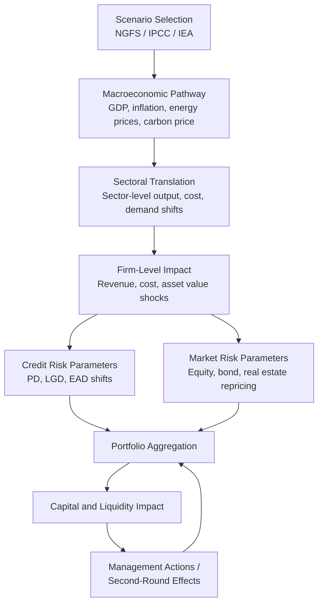

## Climate Scenario Analysis and Stress Testing

### Overview

Climate scenario analysis and stress testing is the discipline of evaluating how climate-related risks—physical and transition—propagate through financial exposures under alternative, forward-looking pathways. Unlike traditional financial stress tests that rely on historical shocks, climate stress testing is fundamentally exploratory: it uses hypothetical, long-horizon narratives because the historical record contains insufficient data on climate-driven financial losses to calibrate a probability distribution.

**Key Points**

- Purpose: assess capital adequacy, portfolio resilience, and strategic exposure under multiple plausible climate futures, not to predict a single outcome
- Two primary risk channels: **physical risk** (acute and chronic) and **transition risk** (policy, technology, market, legal)
- Distinguished from standard stress testing by long time horizons (to 2050 or 2100), deep uncertainty, and non-stationarity of underlying risk drivers
- Used by central banks (climate stress tests), regulators (Basel/prudential frameworks), and financial institutions (internal risk management, TCFD/ISSB disclosure)

### Risk Taxonomy

#### Physical Risk

Physical risk arises from the direct impact of climate change and weather events on physical assets, operations, and supply chains.

- **Acute physical risk**: event-driven, e.g., hurricanes, floods, wildfires, extreme heat waves. Manifests as sudden shocks to asset values, insurance claims, and business interruption
- **Chronic physical risk**: longer-term shifts, e.g., sea-level rise, rising average temperatures, changing precipitation patterns, ocean acidification. Manifests as gradual asset impairment, productivity loss, and migration of economic activity

#### Transition Risk

Transition risk arises from the process of adjusting to a low-carbon economy.

- **Policy and legal risk**: carbon pricing, emissions regulations, litigation exposure
- **Technology risk**: disruptive low-carbon technologies stranding incumbent assets
- **Market risk**: shifting consumer and investor preferences, changing relative prices of energy sources
- **Reputational risk**: stakeholder perception shifts affecting cost of capital and brand value

$$\text{Total Climate Risk Exposure} = f(\text{Physical Risk}, \text{Transition Risk}, \text{Second-Round Macro Effects})$$

### Scenario Frameworks

#### NGFS Scenarios

The Network for Greening the Financial System (NGFS) provides the most widely adopted reference scenarios for financial-sector climate stress testing. They are organized along two axes: physical risk severity and transition orderliness.

| Scenario Category | Transition Orderliness | Physical Risk | Description |
| --- | --- | --- | --- |
| Orderly | Early, smooth policy action | Low | Net zero by 2050, gradual carbon pricing |
| Disorderly | Late, abrupt policy action | Low-Medium | Divergent net zero, delayed transition |
| Hot house world | Limited/no new action | High | Current policies, nationally determined contributions (NDCs) only |
| Too little, too late | Insufficient action | High | Fails to limit warming, high physical damages materialize |

**Key Points**

- Orderly scenarios (e.g., "Net Zero 2050") front-load transition risk but minimize physical risk
- Disorderly scenarios (e.g., "Delayed Transition") combine sudden repricing of carbon-intensive assets with moderate physical risk
- Hot house world scenarios (e.g., "Current Policies", "NDCs") minimize transition risk but accumulate severe long-run physical risk
- NGFS scenarios are produced using Integrated Assessment Models (IAMs) such as REMIND-MAgPIE, MESSAGEix-GLOBIOM, and GCAM, combined with physical risk modules

#### Other Frameworks

- **IPCC Representative Concentration Pathways (RCPs)** and **Shared Socioeconomic Pathways (SSPs)**: underlying climate science scenarios feeding into IAMs (e.g., RCP 8.5 = high emissions, SSP5 = fossil-fueled development)
- **IEA scenarios**: Net Zero Emissions (NZE), Announced Pledges Scenario (APS), Stated Policies Scenario (STEPS)—primarily used for energy-sector transition pathway calibration
- **TCFD-aligned scenario sets**: institutions often blend NGFS with sector-specific scenarios for disclosure purposes

### Methodological Architecture

A climate stress test typically follows a multi-stage pipeline connecting macro scenarios to portfolio-level financial impact.

#### Stage Detail

1. **Scenario selection and calibration**: choose orderly/disorderly/hot-house pathways; set carbon price trajectories, temperature outcomes, and time horizon
2. **Macro-financial translation**: convert scenario narratives into paths for GDP, unemployment, inflation, interest rates, and energy prices, typically via IAM output or central bank macro models
3. **Sectoral and geographic granularity**: map macro variables to sector-level output and cost shocks using input-output tables or sectoral transition pathways (often NACE/NAICS classification)
4. **Firm/asset-level translation**: apply sectoral shocks to individual counterparties or physical assets, incorporating firm-specific carbon intensity, geographic exposure, and adaptive capacity
5. **Risk parameter translation**: convert financial impact into credit risk parameters (probability of default (PD), loss given default (LGD), exposure at default (EAD)) or market risk repricing
6. **Portfolio aggregation**: roll up exposures across the balance sheet, capturing concentration and correlation effects
7. **Capital/liquidity impact assessment**: translate portfolio losses into capital ratio and liquidity coverage impacts
8. **Second-round and feedback effects**: incorporate amplification channels—fire sales, credit crunches, insurance market disruption—that standard one-off shock models often omit

### Credit Risk Transmission Mechanics

The core financial translation for credit portfolios follows the standard expected loss framework, with climate risk entering through shifts in PD and LGD.

$$EL = PD \times LGD \times EAD$$

Climate stress testing modifies PD via a structural or reduced-form link to firm financial distress:

$$PD_{t}^{climate} = \Phi\left(\frac{DD_{t}^{baseline} - \Delta DD_{t}^{climate}}{\sigma}\right)$$

where $DD$ is distance-to-default (Merton-style structural credit model) and $\Delta DD_{t}^{climate}$ captures the additional asset value erosion or volatility increase attributable to physical damage or transition cost shocks in period $t$.

**Example**

A coal-fired utility under an NGFS "Disorderly" scenario faces a rising carbon price path reaching $130/tCO2 by 2030. Its cost structure shock is modeled as:

$$\Delta \text{EBITDA}_t = -\left(\text{Carbon Price}_t \times \text{Emissions Intensity} \times \text{Output}_t\right) \times (1 - \text{Pass-through Rate})$$

If the utility cannot pass through carbon costs to consumers (pass-through rate = 0.3), a large share of the carbon cost compresses margins, raising leverage-adjusted default probability. This flows into elevated PD in the bank's power-sector loan book, increasing expected and unexpected credit losses.

### Physical Risk Modeling Techniques

- **Hazard modeling**: catastrophe (CAT) models estimate hazard intensity and frequency (flood depth, wind speed, wildfire perimeter) at high geographic resolution, often combined with climate model downscaling
- **Vulnerability functions**: translate hazard intensity into damage ratios for specific asset types (e.g., depth-damage curves for flood)
- **Exposure mapping**: geolocate physical collateral (real estate, infrastructure, facilities) against hazard layers
- **Value-at-risk translation**: aggregate expected annual damage and tail-risk losses (e.g., 1-in-100-year event) into asset impairment and collateral value adjustments for mortgage and commercial real estate portfolios

$$\text{Expected Annual Damage} = \int_{0}^{\infty} h(x) \cdot v(x) \cdot A \, dx$$

where $h(x)$ is the hazard probability density function, $v(x)$ is the vulnerability (damage ratio) function, and $A$ is asset value.

### Market Risk and Repricing Channels

- **Equity repricing**: sector-level carbon intensity and stranded-asset exposure feed into discounted cash flow revaluation under transition scenarios; carbon-intensive sectors see multiple compression
- **Fixed income repricing**: sovereign and corporate bond spreads widen for issuers with high transition or physical exposure; sovereign risk incorporates fiscal exposure to climate adaptation costs
- **Real estate repricing**: chronic physical risk (flood zones, wildfire zones) and energy-efficiency-driven transition risk (building codes, retrofit costs) affect commercial and residential property valuations
- **Stranded asset risk**: fossil fuel reserves and carbon-intensive capital stock that become uneconomic before the end of their expected useful life under aggressive decarbonization pathways

**Example**

Under an orderly Net Zero 2050 scenario, an oil and gas company's proved reserves are re-valued using a lower long-run oil price assumption consistent with declining demand. A discounted cash flow re-run with the NGFS-implied price path can show reserve write-downs of 20–40% for high-cost extraction assets, depending on cost-curve positioning. [Inference: exact magnitude is scenario- and company-specific; figures illustrate methodology, not a universal benchmark.]

### Regulatory and Supervisory Applications

- **ECB Climate Stress Test (2022)**: top-down and bottom-up combined approach across euro area banks, covering physical and transition risk over a 30-year horizon
- **Bank of England Climate Biennial Exploratory Scenario (CBES)**: explored bank and insurer resilience under three NGFS-aligned scenarios (Early Action, Late Action, No Additional Action)
- **Federal Reserve Pilot Climate Scenario Analysis**: exploratory exercise with large US banks, focused on both physical risk (real estate) and transition risk (corporate lending)
- **Basel Committee**: principles for climate-related financial risk management, encouraging integration into existing risk frameworks (Pillar 2 supervisory review) rather than a separate capital charge (as of most recent guidance) [Unverified: regulatory capital treatment continues to evolve; confirm current requirements against the latest Basel/national supervisor publications]

**Key Points**

- Most current supervisory climate stress tests are framed as *exploratory* exercises, not pass/fail capital tests, distinguishing them from standard prudential stress tests (e.g., CCAR/DFAST)
- Results are primarily used to identify data gaps, model risk, and risk management capability rather than to set binding capital add-ons
- This is an evolving area; some jurisdictions are moving toward embedding climate risk into Pillar 1 capital requirements [Speculation: direction of travel varies significantly by jurisdiction and is subject to political and regulatory change]

### Data and Modeling Challenges

- **Long horizons and deep uncertainty**: 30+ year projections exceed typical credit risk model validation periods; standard backtesting is not feasible
- **Non-stationarity**: historical correlations between macro variables and defaults may not hold under structurally different climate-transition regimes
- **Granular data gaps**: firm-level emissions data (especially Scope 3), physical asset geolocation, and adaptive capacity data are often incomplete or self-reported
- **Compounding and cascading risk**: interactions between physical and transition risk, and between climate risk and other risk types (liquidity, operational, legal), are difficult to model jointly
- **Double counting and scenario coherence**: ensuring macro, sectoral, and firm-level shocks are internally consistent across the translation pipeline

### Second-Round and Systemic Effects

Advanced stress testing frameworks attempt to capture amplification mechanisms beyond first-round asset repricing:

- **Fire-sale dynamics**: forced asset sales by distressed institutions depressing market prices further
- **Insurance protection gaps**: rising uninsurability of physical risk in high-hazard zones, shifting losses onto uninsured balance sheets and public backstops
- **Credit crunch feedback**: bank capital erosion reducing lending capacity, amplifying the initial real-economy shock
- **Sovereign-financial sector nexus**: climate-driven fiscal stress affecting sovereign bond holdings on bank balance sheets, which in turn affects sovereign funding costs

### Illustrative Scenario Comparison (svg_diagram)

<svg xmlns="http://www.w3.org/2000/svg" viewBox="0 0 720 420" font-family="Arial, sans-serif">
<text x="360" y="30" text-anchor="middle" font-size="18" font-weight="bold" fill="#1a1a1a">NGFS Scenario Axes: Transition vs Physical Risk (svg_diagram)</text>
<line x1="80" y1="360" x2="680" y2="360" stroke="#333" stroke-width="2" />
<line x1="80" y1="360" x2="80" y2="60" stroke="#333" stroke-width="2" />

<text x="380" y="395" text-anchor="middle" font-size="13" fill="#333">Physical Risk Severity →</text>

<text x="30" y="210" text-anchor="middle" font-size="13" fill="#333" transform="rotate(-90 30 210)">Transition Disorderliness →</text>

<circle cx="180" cy="300" r="14" fill="#4CAF50" />
<text x="180" y="330" text-anchor="middle" font-size="12" fill="#1a1a1a">Orderly</text>
<text x="180" y="345" text-anchor="middle" font-size="11" fill="#555">(Net Zero 2050)</text>
<circle cx="420" cy="180" r="14" fill="#FF9800" />
<text x="420" y="160" text-anchor="middle" font-size="12" fill="#1a1a1a">Disorderly</text>
<text x="420" y="145" text-anchor="middle" font-size="11" fill="#555">(Delayed Transition)</text>
<circle cx="580" cy="330" r="14" fill="#F44336" />
<text x="580" y="300" text-anchor="middle" font-size="12" fill="#1a1a1a">Hot House World</text>
<text x="580" y="285" text-anchor="middle" font-size="11" fill="#555">(Current Policies)</text>
<circle cx="620" cy="140" r="14" fill="#9C27B0" />
<text x="620" y="115" text-anchor="middle" font-size="12" fill="#1a1a1a">Too Little,</text>
<text x="620" y="130" text-anchor="middle" font-size="11" fill="#555">Too Late</text>

<text x="120" y="80" font-size="11" fill="#777">High transition risk</text>

<text x="500" y="80" font-size="11" fill="#777">High transition + physical risk</text>

<text x="120" y="350" font-size="11" fill="#777">Low risk overall</text>

<text x="520" y="350" font-size="11" fill="#777">High physical risk only</text>

</svg>

### Implementation Considerations for Financial Institutions

- **Governance**: climate scenario analysis should be embedded within existing risk governance (risk appetite statements, ICAAP/ILAAP), not run as a standalone exercise
- **Model risk management**: given the reliance on IAMs, hazard models, and expert judgment overlays, robust model validation and documentation of assumptions is critical
- **Sensitivity analysis**: given deep uncertainty, institutions typically run sensitivity bands around central scenario assumptions rather than treating NGFS output as point estimates
- **Disclosure integration**: outputs feed into TCFD/ISSB IFRS S2-aligned disclosures, requiring consistency between internal risk management scenarios and external reporting narratives

### Common Pitfalls

- Treating scenario output as forecasts/probabilities rather than "what-if" narratives for exploring vulnerability
- Ignoring second-round/feedback effects, understating tail risk
- Using overly coarse sector mappings that mask intra-sector heterogeneity (e.g., treating all "utilities" as equally exposed)
- Static balance sheet assumptions that ignore management actions (portfolio rebalancing, divestment) over long horizons
- Underestimating data quality issues in Scope 3 emissions and physical asset geolocation, leading to false precision in reported results

**Next Steps**

- Transition risk pathway modeling and carbon pricing mechanisms
- Physical risk catastrophe modeling and geospatial hazard mapping
- TCFD/ISSB (IFRS S2) climate-related financial disclosure standards
- Green taxonomy and sustainable finance classification systems (EU Taxonomy)
- Stranded asset risk and fossil fuel reserve valuation
- Central bank climate stress test methodologies (ECB, BoE, Federal Reserve comparative review)
- Sovereign climate risk and fiscal sustainability under transition scenarios
- Climate value-at-risk (Climate VaR) portfolio-level metrics