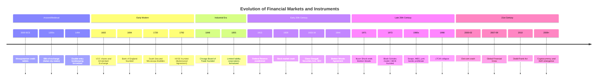

## The History of Financial Markets and Instruments

### Overview

Financial markets and instruments evolved from informal credit arrangements in ancient societies into today's highly interconnected, technologically driven global system. The history is best understood as a sequence of innovations that each solved a specific economic problem—risk-sharing, liquidity, price discovery, capital formation, information asymmetry—and, in doing so, often created new forms of systemic risk that later required regulatory and institutional responses.

**Key Points**

- Financial instruments emerged to solve recurring economic problems: intertemporal transfer of resources, risk pooling, and capital allocation
- Market structures (exchanges, clearinghouses, intermediaries) developed to reduce counterparty risk and transaction costs
- Financial crises recur throughout history and are a primary driver of regulatory and institutional innovation
- The pace of financial innovation has accelerated markedly since the mid-20th century, particularly with computerization and derivatives proliferation

### Ancient and Pre-Modern Origins (c. 3000 BCE – 1400 CE)

#### Early Credit and Debt Instruments

- **Mesopotamia (c. 3000 BCE)**: clay tablet records document loans of grain and silver with interest, representing some of the earliest documented credit instruments; temple and palace institutions acted as proto-banks
- **Code of Hammurabi (c. 1750 BCE)**: codified interest rate ceilings and rules governing loan default, an early example of financial regulation
- **Ancient Greece**: *maritime loans* (bottomry) financed sea trade, with the loan forgiven if the ship was lost—an early form of risk-transfer instrument functionally similar to insurance
- **Ancient Rome**: *argentarii* (bankers) took deposits, extended credit, and facilitated payments; Roman law developed concepts of *societas* (partnership) for pooling capital in commercial ventures

#### Medieval Developments

- **Bills of exchange (12th–13th century)**: developed by Italian merchants (Genoa, Venice, Florence) to facilitate trade without physically transporting specie; functioned as an early negotiable instrument and cross-border payment mechanism
- **Double-entry bookkeeping**: formalized in Italy (Luca Pacioli's 1494 treatise documented existing merchant practice), enabling more sophisticated tracking of assets, liabilities, and capital
- **Medici Bank (15th century)**: pioneered branch banking and the use of bills of exchange across a network of European cities, effectively creating an early multinational financial institution

### The Age of Chartered Companies and Early Exchanges (1600–1750)

#### Joint-Stock Companies

- **Dutch East India Company (VOC, 1602)**: widely regarded as the first entity to issue tradable shares to the public, creating permanent, transferable capital rather than capital tied to a single voyage
- **Amsterdam Stock Exchange (1602)**: established to trade VOC shares, generally considered the first formal stock exchange with continuous trading, price quotation, and short-selling activity
- **English East India Company (1600)**: similarly structured joint-stock enterprise, precursor to the London capital market

#### Early Derivatives and Speculation

- **Tulip mania (Netherlands, 1636–1637)**: futures-like forward contracts on tulip bulbs traded on Amsterdam's exchanges; often cited as an early speculative bubble, though modern economic historians debate the severity and systemic impact of the episode [Unverified: the scale and economic significance of tulip mania is contested in the historical literature—some scholars argue its effects were more localized and less disruptive than popular accounts suggest]
- **South Sea Bubble (1720, England)** and **Mississippi Bubble (1720, France)**: speculative episodes involving state-chartered trading companies with monopoly privileges; both collapsed after share prices detached from underlying business prospects, prompting early securities regulation (e.g., England's Bubble Act of 1720)

### Formalization of Markets and Central Banking (1650–1850)

#### Central Banking Origins

- **Sveriges Riksbank (Sweden, 1668)**: oldest central bank still in operation
- **Bank of England (1694)**: established initially to fund government war debt; evolved into a model for central bank functions—currency issuance, lender of last resort, government banker
- **Development of paper currency and banknotes**: transition from commodity money (gold, silver) toward representative and eventually fiat currency, accelerating over the 18th–20th centuries

#### Exchange Formalization

- **London Stock Exchange (formalized 1801)**: grew out of informal trading at Jonathan's Coffee-House; formal rulebook and membership structure established to reduce fraud and default
- **New York Stock Exchange (1792)**: founded via the Buttonwood Agreement among 24 brokers, setting commission structures and establishing organized trading of securities
- **Government bond markets**: expansion of sovereign debt markets to finance wars (Napoleonic Wars, American Revolutionary War) created deep, liquid markets in fixed income instruments

### Industrial Revolution and the Expansion of Capital Markets (1800–1900)

- **Railway finance**: railways required capital far exceeding what individual merchants or partnerships could provide, driving mass issuance of corporate stocks and bonds and broadening public participation in equity markets
- **Limited liability corporations**: legal innovation (e.g., UK Limited Liability Act 1855, US state incorporation statutes) separated personal wealth from business risk, enabling wider investor participation
- **Rise of investment banking**: firms such as Rothschild, J.P. Morgan, and Baring Brothers specialized in underwriting sovereign and corporate debt, syndicating large issuances, and providing merchant banking services
- **Commodity futures exchanges**: Chicago Board of Trade (1848) formalized standardized forward contracts on agricultural commodities, evolving into modern futures markets with standardized contract terms and clearing mechanisms
- **Gold standard era**: fixed exchange rate regime anchored to gold (dominant roughly 1870s–1914) provided monetary stability that facilitated cross-border capital flows and international bond issuance

### Early 20th Century: Crisis and Regulatory Response (1900–1945)

#### Panics and the Federal Reserve

- **Panic of 1907**: banking crisis driven by trust company failures and lack of an elastic currency/lender-of-last-resort function; directly catalyzed the creation of the **Federal Reserve System (1913)**
- **Federal Reserve Act (1913)**: established a US central bank with regional structure, tasked with providing an elastic currency, supervising banks, and acting as lender of last resort

#### The Great Depression and Regulatory Overhaul

- **1929 stock market crash**: preceded by a period of margin-financed speculative equity buying; crash triggered a prolonged banking crisis and deflationary depression
- **Glass-Steagall Act (1933)**: separated commercial banking from investment banking activities in the US, and established the Federal Deposit Insurance Corporation (FDIC) to insure bank deposits
- **Securities Act of 1933** and **Securities Exchange Act of 1934**: introduced mandatory disclosure requirements for securities issuance and created the **Securities and Exchange Commission (SEC)** to regulate exchanges and prevent market manipulation
- **Bretton Woods Agreement (1944)**: established a fixed but adjustable exchange rate system pegging currencies to the US dollar, which was convertible to gold; created the **International Monetary Fund (IMF)** and the **World Bank**

### Post-War Expansion and Financial Innovation (1945–1980)

- **Bretton Woods system operation (1944–1971)**: provided relative currency stability, supporting post-war reconstruction and expanding international trade finance
- **Nixon Shock (1971)**: US suspension of dollar-gold convertibility ended the Bretton Woods fixed exchange rate system, ushering in an era of floating exchange rates and creating demand for new currency risk-management instruments
- **Eurodollar market development**: growth of dollar-denominated deposits and lending outside US regulatory jurisdiction, expanding international bank lending capacity
- **Modern Portfolio Theory (Markowitz, 1952)** and the **Capital Asset Pricing Model (Sharpe, Lintner, Treynor, mid-1960s)**: formalized quantitative frameworks for portfolio construction and asset pricing, laying academic groundwork for subsequent financial engineering
- **Black-Scholes-Merton option pricing model (1973)**: provided a closed-form solution for pricing European options, directly enabling the rapid growth of listed options markets
- **Chicago Board Options Exchange (CBOE, 1973)**: first exchange dedicated to standardized, listed equity options trading

### The Derivatives and Deregulation Era (1980–2000)

#### Financial Engineering

- **Interest rate and currency swaps (early 1980s)**: enabled institutions to exchange cash flow exposures without exchanging underlying principal, becoming a cornerstone of corporate and sovereign liability management
- **Mortgage-backed securities (MBS)**: securitization of residential mortgage pools, pioneered by Ginnie Mae (1970) and expanded by Fannie Mae/Freddie Mac and private issuers through the 1980s–1990s
- **Collateralized debt obligations (CDOs)**: further securitization layering, tranching pooled debt into differentiated risk/return securities
- **Junk bond market**: development of a liquid high-yield corporate bond market (notably associated with Michael Milken/Drexel Burnham Lambert), expanding financing access for below-investment-grade issuers

#### Deregulation

- **Depository Institutions Deregulation and Monetary Control Act (1980)** and subsequent US banking deregulation: phased out interest rate ceilings (Regulation Q) and expanded permissible bank activities
- **Gramm-Leach-Bliley Act (1999)**: effectively repealed the Glass-Steagall separation of commercial and investment banking, enabling the rise of large universal banks
- **Electronic trading emergence**: NASDAQ (founded 1971) as the first electronic stock market; progressive computerization of order matching and execution across major exchanges through the 1980s–1990s

#### Crises of the Period

- **1987 Black Monday**: single-day equity market crash (Dow Jones fell approximately 22.6% on October 19, 1987), partly attributed to portfolio insurance strategies and program trading amplifying selling pressure
- **1997–1998 Asian Financial Crisis**: currency and banking crises across Southeast Asian economies, driven by fixed exchange rate regimes, short-term foreign-currency debt, and capital flight
- **Long-Term Capital Management (LTCM) collapse (1998)**: highly leveraged hedge fund using relative-value fixed income and derivatives strategies required a Federal Reserve-coordinated private-sector bailout, illustrating systemic risk from leverage and interconnected counterparty exposure

### The 21st Century: Globalization, Crisis, and Digitization (2000–Present)

#### Dot-Com Bubble

- **2000–2002 dot-com crash**: collapse in internet/technology equity valuations following a period of speculative excess, leading to significant destruction of market capitalization and tightening of venture financing

#### Global Financial Crisis (2007–2009)

- **Subprime mortgage crisis**: proliferation of subprime mortgage lending, securitized into MBS and CDOs, with risk obscured by complex tranching and credit rating agency practices
- **Credit default swaps (CDS)**: widespread use as both hedging and speculative instruments on mortgage-related credit risk, notably implicated in AIG's near-collapse
- **Lehman Brothers collapse (September 2008)**: largest bankruptcy in US history at the time, triggering acute interbank credit freeze and global market contagion
- **Regulatory response**: **Dodd-Frank Wall Street Reform and Consumer Protection Act (2010)** in the US introduced central clearing requirements for standardized derivatives, the Volcker Rule restricting proprietary trading, and enhanced capital/liquidity requirements; **Basel III** internationally strengthened bank capital, leverage, and liquidity standards

#### Post-Crisis Instrument and Market Evolution

- **High-frequency and algorithmic trading**: growth of automated, low-latency trading strategies, raising new questions around market microstructure, fairness, and stability (e.g., the 2010 "Flash Crash")
- **Exchange-traded funds (ETFs)**: rapid growth of ETFs as a liquid, low-cost vehicle for diversified exposure, fundamentally reshaping retail and institutional portfolio construction since the 1990s but accelerating markedly post-2008
- **Central clearing expansion**: mandatory central counterparty (CCP) clearing for standardized over-the-counter (OTC) derivatives, reducing bilateral counterparty risk but concentrating risk within CCPs
- **Cryptocurrency and blockchain-based instruments**: Bitcoin (2009) introduced a decentralized digital asset using distributed ledger technology; subsequent development of a broader digital asset ecosystem including stablecoins, tokenized securities, and decentralized finance (DeFi) protocols
- **Negative interest rate policy (2014 onward, notably ECB, Bank of Japan)**: unconventional monetary policy tool used in response to persistently low growth and inflation, with implications for bond market pricing and bank profitability
- **ESG and sustainable finance instruments**: growth of green bonds, sustainability-linked loans, and climate-related financial products as a distinct asset class category

### Timeline Summary

### Instrument Evolution by Category

| Instrument Class | Early Form | Modern Form | Core Economic Function |
| --- | --- | --- | --- |
| Debt | Grain/silver loans (Mesopotamia) | Sovereign/corporate bonds, structured credit | Intertemporal resource transfer |
| Equity | Merchant partnerships | Common/preferred shares, ETFs | Permanent capital, risk-sharing |
| Derivatives | Maritime loans, tulip forwards | Options, futures, swaps, CDS | Risk transfer, price discovery |
| Payments | Bills of exchange | Wire transfer, digital/crypto payments | Reducing transaction/settlement friction |
| Securitized products | N/A (post-1970 innovation) | MBS, CDO, ABS | Risk tranching, liquidity creation |

### Recurring Patterns Across Financial History

**Key Points**

- **Innovation-crisis cycle**: financial innovation typically outpaces regulatory understanding, contributing to periodic crises (tulip mania → South Sea Bubble → 1929 → 2008 each followed this pattern of new instruments amplifying speculative excess)
- **Regulation as reactive process**: most major regulatory frameworks (SEC, FDIC, Dodd-Frank, Basel accords) were enacted *after* significant crises rather than preemptively
- **Leverage as recurring amplifier**: excessive leverage—whether margin lending in 1929, LTCM's derivatives positions in 1998, or mortgage securitization leverage in 2008—consistently appears as a crisis amplification mechanism
- **Technology as structural driver**: from double-entry bookkeeping to electronic trading to blockchain, technological change repeatedly reshapes market structure and the feasible complexity of financial instruments
- **Globalization and interconnection**: capital markets have grown progressively more interconnected, increasing both efficiency gains and contagion channels across borders

**Next Steps**

- Detailed case study: the 2007–2009 Global Financial Crisis mechanics and securitization chain
- History and mechanics of central banking and monetary policy regimes
- Evolution of derivatives markets and option pricing theory
- Comparative history of banking regulation (Glass-Steagall to Dodd-Frank to Basel III)
- History of exchange rate regimes (gold standard, Bretton Woods, floating rates)
- Cryptocurrency and decentralized finance as a distinct historical/technical topic
- Behavioral finance perspectives on historical speculative bubbles