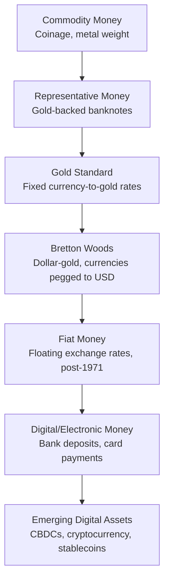

## The Evolution of Monetary Systems

### Overview

Monetary systems have evolved through successive stages driven by the need to reduce transaction costs inherent in barter, establish trust in exchange media, and give governments and institutions tools for economic management. The historical arc moves from commodity money, through representative and fiat currency, to today's largely electronic, centrally managed monetary systems—with digital and cryptographic alternatives emerging as the most recent frontier.

**Key Points**

- Money serves three core functions: **medium of exchange**, **unit of account**, and **store of value**; monetary system evolution reflects the search for instruments that perform these functions more efficiently
- The historical trajectory moves broadly from intrinsic-value (commodity) money toward trust-based (fiat) money, with intermediate representative-money stages
- Central banking emerged specifically to manage the tension between monetary elasticity (ability to expand credit) and monetary stability (maintaining value)
- Exchange rate regimes have cycled between fixed/anchored systems and floating systems, each with distinct trade-offs

### Pre-Monetary and Barter Origins

- **Barter systems**: direct exchange of goods and services, constrained by the **"double coincidence of wants"**—both parties must simultaneously want what the other offers
- **Commodity money precursors**: certain goods (cattle, grain, shells, salt) functioned as proto-money due to relative durability, divisibility, and widespread acceptance within a community, even before standardized coinage
- [Inference: the historical universality and sequencing of a pure "barter economy" preceding money is disputed among economic anthropologists; some scholars argue credit-based exchange and social obligation systems predate or coexisted with barter in many societies, rather than money strictly emerging to solve a barter problem]

### Commodity Money and Early Coinage (c. 3000 BCE – 600 BCE)

- **Metal-weight systems**: Mesopotamian and Egyptian economies used weighed quantities of silver and other metals as a value standard well before standardized coinage
- **Lydian coinage (c. 600 BCE)**: the Kingdom of Lydia (modern-day Turkey) is widely credited with introducing the first standardized metal coins (electrum, a naturally occurring gold-silver alloy), stamped with an official mark guaranteeing weight and purity
- **Spread of coinage**: Greek city-states, followed by Persian and later Roman systems, adopted and refined standardized coinage, embedding sovereign authority (via minting marks) as a guarantee of value

**Key Points**

- Coinage solved two problems simultaneously: standardizing unit weight/purity (reducing verification costs) and establishing sovereign backing (increasing trust and acceptance)
- Intrinsic-value money (coins made of precious metal) tied money supply directly to the physical availability of the underlying metal, constraining monetary policy flexibility

### Representative Money and Early Paper Currency (700 CE – 1700s)

- **Chinese paper currency (Tang and Song Dynasties, 7th–11th century)**: earliest documented use of paper money, initially as receipts for merchant deposits of coinage, later issued directly by the state; the Yuan Dynasty's *Jiaochao* notes (13th century) were observed and documented by Marco Polo
- **Goldsmith banking (Europe, 17th century)**: goldsmiths in England issued receipts for deposited gold that began circulating as a medium of exchange in their own right—an early form of representative money and a precursor to fractional reserve banking, since goldsmiths observed that not all depositors withdrew simultaneously and began lending against reserves
- **Bank of England notes (from 1694)**: formalized banknote issuance backed by gold reserves, establishing a template for representative currency

$$\text{Representative Money Value} = \text{Claim on Underlying Commodity (e.g., gold)}$$

### The Gold Standard Era (c. 1870s–1914; partial revivals to 1971)

- **Classical gold standard (1870s–1914)**: major economies fixed their currencies to a specific weight of gold, creating fixed exchange rates between gold-standard countries and enabling relatively frictionless international trade and capital flows
- **Mechanics**: under the gold standard, balance-of-payments adjustment operated through the **price-specie flow mechanism**—a trade deficit caused gold outflows, contracting the domestic money supply, lowering prices, and restoring competitiveness (in the idealized model)
- **Suspension during WWI**: most major economies suspended gold convertibility to finance wartime spending through money creation, breaking the classical gold standard
- **Interwar gold exchange standard (1920s)**: partial and inconsistent attempts to restore gold-linked currency systems, widely regarded by economic historians as a contributing factor to the severity of the Great Depression due to the deflationary bias of adjustment under the system
- **Abandonment during the Great Depression**: countries progressively left the gold standard through the early-to-mid 1930s (UK in 1931, US effectively restricting private gold ownership in 1933) as governments prioritized domestic monetary flexibility over exchange rate fixity

**Key Points**

- The gold standard provided monetary discipline and exchange rate stability but constrained governments' ability to respond to domestic economic shocks (no independent monetary policy)
- This trade-off is formalized in the **"impossible trinity" (or trilemma)**: a country cannot simultaneously maintain a fixed exchange rate, free capital movement, and independent monetary policy—it must choose at most two

### Bretton Woods System (1944–1971)

- **Establishment**: the 1944 Bretton Woods Conference established a system in which major currencies were pegged to the US dollar, and the US dollar itself was convertible to gold at a fixed rate ($35/ounce) for foreign central banks
- **Institutional architecture**: created the **International Monetary Fund (IMF)**, designed to provide short-term balance-of-payments support and oversee the fixed exchange rate system, and the **World Bank**, focused on post-war reconstruction and development financing
- **Adjustable peg mechanism**: currencies could be realigned in cases of "fundamental disequilibrium," distinguishing the system from the rigid classical gold standard
- **Triffin Dilemma**: economist Robert Triffin identified a structural tension—the world needed a growing supply of dollars to support expanding global trade and reserves, but ever-growing dollar liabilities relative to US gold reserves undermined confidence in dollar-gold convertibility over time
- **Collapse ("Nixon Shock," 1971)**: on August 15, 1971, President Nixon suspended dollar-gold convertibility, effectively ending the Bretton Woods system; by 1973 major currencies had transitioned to floating exchange rates

### The Fiat Money Era (1971–Present)

#### Characteristics

- **Fiat money**: currency with no intrinsic commodity backing, deriving value from government decree, legal tender status, and public confidence in the issuing authority
- **Floating exchange rate regimes**: post-1973, most major currencies float against each other, with value determined by market supply and demand, occasionally subject to central bank intervention (managed float)
- **Monetary policy flexibility**: freed from gold convertibility constraints, central banks gained greater latitude to use interest rate policy and money supply management to address domestic economic conditions (inflation, unemployment, growth)

#### Inflation Control and Central Bank Independence

- **1970s stagflation**: combination of high inflation and stagnant growth (following oil price shocks and loose monetary policy) exposed the risks of fiat money systems without a strong nominal anchor
- **Volcker disinflation (early 1980s)**: US Federal Reserve under Chairman Paul Volcker sharply raised interest rates to combat entrenched inflation, establishing a template for prioritizing price stability
- **Central bank independence movement (1980s–1990s)**: widespread adoption of legally independent central banks with explicit price stability mandates (e.g., Reserve Bank of New Zealand's 1989 inflation-targeting framework, widely cited as an early formal adopter), intended to insulate monetary policy from short-term political pressure

#### Inflation Targeting Frameworks

- Most major central banks (Federal Reserve, European Central Bank, Bank of England, Bank of Japan) operate with explicit or implicit inflation targets (commonly around 2% annually in developed economies), using policy interest rates as the primary tool
- **Unconventional monetary policy**: following the 2008 Global Financial Crisis, with policy rates near the zero lower bound, central banks adopted **quantitative easing (QE)**—large-scale asset purchases to inject liquidity and lower long-term yields—and in some cases **negative interest rate policy (NIRP)**, notably the ECB and Bank of Japan from the mid-2010s

### Electronic and Digital Money (Late 20th Century–Present)

- **Electronic bank deposits and interbank settlement systems**: the vast majority of modern money supply exists as electronic bank deposit records rather than physical currency, transferred via systems such as Fedwire, SWIFT, and real-time gross settlement (RTGS) systems
- **Card-based and digital payment systems**: credit/debit card networks, and more recently mobile and app-based payment systems, progressively reduced reliance on physical cash for transactions
- **Money supply measurement**: modern monetary economics distinguishes monetary aggregates by liquidity—**M0** (physical currency and central bank reserves), **M1** (M0 plus demand deposits), **M2** (M1 plus savings deposits and other near-money instruments)—reflecting the layered, largely electronic nature of contemporary money

$$M2 = \text{Currency in Circulation} + \text{Demand Deposits} + \text{Savings Deposits} + \text{Small Time Deposits} + \text{Retail Money Market Funds}$$

### Emerging Frontier: Digital Assets and CBDCs (2009–Present)

- **Cryptocurrency (from 2009)**: Bitcoin introduced a decentralized digital currency using blockchain (distributed ledger) technology, removing reliance on a central issuing authority; value determined entirely by market demand rather than sovereign backing or commodity linkage
- **Stablecoins**: digital assets designed to maintain a stable value, typically pegged to a fiat currency (e.g., US dollar) through various backing mechanisms (fiat reserves, crypto-collateralization, or algorithmic mechanisms), intended to combine blockchain settlement efficiency with price stability
- **Central Bank Digital Currencies (CBDCs)**: sovereign-issued digital currency, distinct from cryptocurrency in that it represents a direct central bank liability; multiple central banks have launched pilot or exploratory CBDC programs (e.g., China's e-CNY pilot, the ECB's digital euro investigation phase) [Unverified: CBDC development status varies significantly by jurisdiction and changes frequently; confirm current implementation stage against each central bank's latest official publications]
- [Speculation: the long-run role of CBDCs and private stablecoins relative to traditional bank deposits in the broader monetary system remains an actively debated and unsettled question among central banks and academics]

### Comparative Summary of Monetary Regimes

| Regime | Approx. Period | Value Anchor | Key Constraint/Trade-off |
| --- | --- | --- | --- |
| Commodity money | Ancient–1600s | Intrinsic metal value | Supply tied to physical metal availability |
| Representative money | 1600s–1930s | Convertibility to commodity | Requires maintained reserve backing |
| Classical gold standard | 1870s–1914 | Fixed gold parity | No independent monetary policy |
| Bretton Woods | 1944–1971 | USD convertible to gold | Triffin Dilemma (reserve growth vs. convertibility) |
| Fiat money (floating) | 1971–present | Government/central bank credibility | Requires credible inflation anchor |
| Digital/crypto assets | 2009–present | Market demand / algorithmic design or fiat peg | Volatility, regulatory uncertainty, trust mechanisms vary |

### Structural Drivers of Monetary Evolution

**Key Points**

- **Trust substitution**: each transition (commodity → representative → fiat → digital) substitutes a different trust mechanism—physical scarcity, redeemability, sovereign credibility, or cryptographic verification—for the previous one
- **Elasticity vs. stability tension**: monetary systems consistently trade off the ability to expand money/credit flexibly (supporting growth, crisis response) against maintaining stable, predictable value (controlling inflation, preserving confidence)
- **Crisis-driven regime change**: major monetary regime shifts (abandonment of the gold standard, Bretton Woods collapse, adoption of inflation targeting, post-2008 unconventional policy) have historically been triggered by acute economic crises rather than gradual policy redesign
- **Technology as an enabler**: from coinage standardization to electronic settlement to blockchain, technological capability has consistently expanded the feasible design space for monetary systems

**Next Steps**

- Central banking functions and the lender-of-last-resort role in depth
- The impossible trinity (trilemma) and exchange rate regime choice
- Quantitative easing and unconventional monetary policy mechanics
- Inflation targeting frameworks and central bank independence
- Cryptocurrency monetary design and stablecoin mechanisms
- Central Bank Digital Currency (CBDC) architecture and policy debates
- Monetary aggregates and the money multiplier in modern banking systems