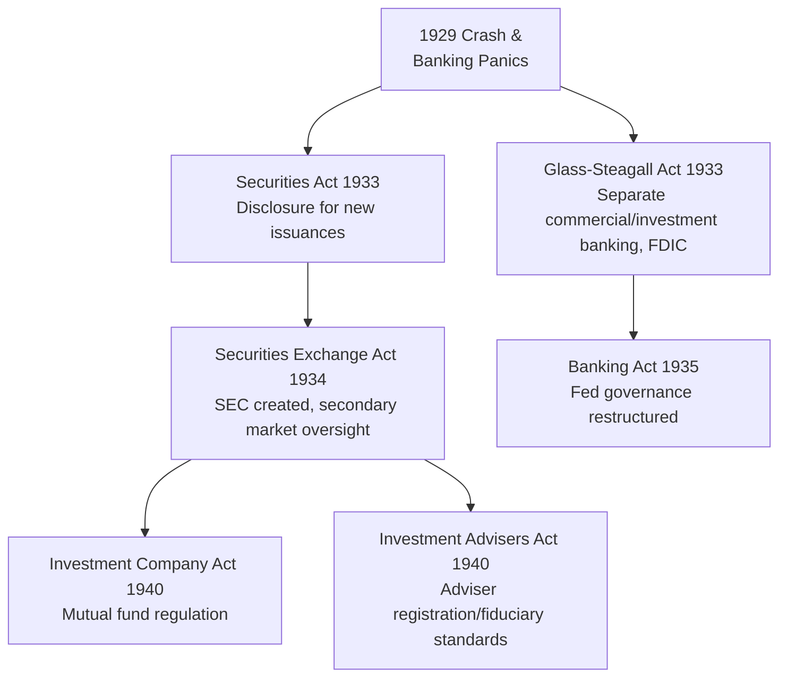

## The History of Financial Regulation

### Overview

Financial regulation has developed largely as a reactive discipline: most major regulatory frameworks were enacted in direct response to crises, fraud episodes, or systemic failures rather than through proactive design. The historical trajectory moves from informal merchant self-governance and sovereign decree, through the establishment of securities and banking law in the early 20th century, to today's complex, internationally coordinated prudential and conduct regulatory architecture.

**Key Points**

- Regulation has historically lagged financial innovation, creating a recurring "innovation-crisis-regulation" cycle
- Two broad regulatory objectives recur across history: **prudential regulation** (solvency, systemic stability) and **conduct/market integrity regulation** (disclosure, fraud prevention, investor protection)
- International regulatory coordination is a relatively recent development, emerging primarily after cross-border financial crises exposed the limits of purely national regulatory frameworks
- The balance between regulation and deregulation has cycled over time, generally tightening after crises and loosening during extended stability

### Early and Pre-Modern Regulation (Ancient Era – 1600s)

- **Code of Hammurabi (c. 1750 BCE)**: codified interest rate ceilings and rules governing debt default and loan forgiveness in cases of crop failure—an early instance of state-imposed financial regulation
- **Usury laws**: religious and secular restrictions on interest-charging (Christian canon law prohibitions on usury through the medieval period, similar restrictions in Islamic and Jewish law) shaped the structure of early lending and constrained formal banking development in various societies
- **Merchant guild self-regulation**: medieval merchant guilds and early exchanges (e.g., Italian city-state banking houses) developed private codes of conduct and dispute resolution mechanisms, functioning as an early form of self-regulatory organization prior to state oversight

### The Bubble Act and Early Corporate Regulation (1720)

- **Trigger**: the South Sea Bubble collapse (1720) in England, following widespread speculative company formation and fraud
- **Bubble Act (1720)**: prohibited the formation of joint-stock companies without a royal charter, directly restricting corporate formation in response to speculative excess
- **Long-run effect**: the Act is widely regarded by economic historians as having constrained legitimate capital formation in England for over a century, illustrating a recurring theme where post-crisis regulation can overcorrect and impose costs on productive economic activity alongside curbing abuse [Inference: this assessment reflects a common view among economic historians but involves counterfactual judgment about growth that would have occurred absent the Act]

### 19th Century: Company Law and Limited Liability

- **Joint Stock Companies Act (UK, 1844)**: established a registration system for companies, improving transparency of corporate formation
- **Limited Liability Act (UK, 1855)** and subsequent company law: formalized limited liability, separating shareholders' personal wealth from business risk—a foundational legal innovation enabling broader public investment in equity markets
- **US state-level "blue sky laws" (beginning with Kansas, 1911)**: early state securities regulation requiring registration and disclosure for securities offerings, named for protecting investors from speculative schemes "with no more basis than so many feet of blue sky"; represented a decentralized, state-by-state precursor to federal securities regulation

### Central Banking as Regulatory Infrastructure (1668–1913)

- **Sveriges Riksbank (1668)** and **Bank of England (1694)**: early central banks combined currency issuance with informal supervisory functions over the banking system
- **US National Banking Acts (1863–1864)**: created a system of federally chartered national banks with capital and reserve requirements, and established the Office of the Comptroller of the Currency (OCC) as a bank supervisor—but did not create a lender-of-last-resort mechanism, leaving the US vulnerable to periodic banking panics
- **Panic of 1907**: banking panic driven by trust company failures, resolved informally through private coordination led by J.P. Morgan; exposed the absence of an institutional lender-of-last-resort function in the US
- **Federal Reserve Act (1913)**: established the Federal Reserve System directly in response to the 1907 panic, creating a formal US central bank with regional structure, tasked with providing an elastic currency and acting as lender of last resort

### The Great Depression and Foundational US Securities Law (1929–1940)

The 1929 crash and subsequent banking crisis catalyzed the most consequential wave of financial regulation in modern history, particularly in the United States.

- **Securities Act of 1933**: introduced mandatory disclosure requirements for new securities issuances, requiring registration statements and prospectuses—establishing the principle that investors need accurate information rather than the state judging investment merit
- **Glass-Steagall Act (Banking Act of 1933)**: separated commercial banking from investment banking activities, aiming to prevent conflicts of interest and excessive risk-taking with insured deposits; also established the **Federal Deposit Insurance Corporation (FDIC)**, insuring bank deposits to prevent bank runs
- **Securities Exchange Act of 1934**: created the **Securities and Exchange Commission (SEC)**, established registration and oversight requirements for securities exchanges and broker-dealers, and introduced rules against market manipulation
- **Banking Act of 1935**: restructured Federal Reserve governance, centralizing monetary policy authority within the Federal Open Market Committee (FOMC)
- **Investment Company Act of 1940** and **Investment Advisers Act of 1940**: established regulatory frameworks for mutual funds and investment advisers, including fiduciary duty concepts for advisers

### Post-War Stability and International Coordination (1944–1970s)

- **Bretton Woods Agreement (1944)**: created the **International Monetary Fund (IMF)** and **World Bank**, establishing the first major international financial institutions coordinating monetary and development policy across countries
- **Relative regulatory stability**: the period from roughly 1945–1970 is often characterized as one of comparative regulatory stability and low financial crisis incidence in developed economies, partly attributed to the constraints of the Bretton Woods system and post-Depression regulatory architecture [Inference: characterization of this period as unusually stable is a common historical assessment, though causal attribution to specific regulatory versus macroeconomic factors is debated]
- **Basel Committee on Banking Supervision (established 1974)**: formed by the central bank governors of the G10 countries following the collapse of Bankhaus Herstatt (a German bank whose failure exposed settlement risk in international currency transactions), marking the beginning of formal international bank regulatory coordination

### Deregulation Era (1980–1999)

- **Depository Institutions Deregulation and Monetary Control Act (US, 1980)**: phased out Regulation Q interest rate ceilings on bank deposits, among other deregulatory measures
- **Garn-St. Germain Depository Institutions Act (1982)**: further deregulated savings and loan institutions, contributing to the subsequent Savings and Loan Crisis of the late 1980s
- **Savings and Loan Crisis (late 1980s–early 1990s)**: widespread failure of US savings and loan institutions following deregulation combined with risky lending, resulting in the **Financial Institutions Reform, Recovery, and Enforcement Act (FIRREA, 1989)**, which restructured S&L regulatory oversight
- **Basel I Accord (1988)**: first internationally coordinated bank capital adequacy framework, establishing minimum capital ratios based on risk-weighted assets
- **Gramm-Leach-Bliley Act (1999)**: effectively repealed the Glass-Steagall separation of commercial and investment banking, permitting the formation of large "universal" financial holding companies combining banking, securities, and insurance activities

### Basel II and Pre-Crisis Regulatory Evolution (1999–2007)

- **Basel II Accord (2004, phased implementation)**: refined the capital adequacy framework with three pillars—minimum capital requirements (with more risk-sensitive internal models), supervisory review, and market discipline through disclosure
- **Commodity Futures Modernization Act (US, 2000)**: exempted most over-the-counter (OTC) derivatives, including credit default swaps, from regulation by the Commodity Futures Trading Commission (CFTC) and SEC—a deregulatory measure later widely cited as having contributed to opaque, unregulated derivatives exposure ahead of the 2008 crisis

### The Global Financial Crisis and Post-Crisis Regulatory Overhaul (2008–2014)

The 2007–2009 Global Financial Crisis triggered the most significant regulatory expansion since the Great Depression.

- **Emergency Economic Stabilization Act (US, 2008)**: authorized the Troubled Asset Relief Program (TARP), providing government capital injections and asset purchases to stabilize the banking system
- **Dodd-Frank Wall Street Reform and Consumer Protection Act (US, 2010)**:
  - Established the **Financial Stability Oversight Council (FSOC)** to monitor systemic risk across the financial system
  - Created the **Consumer Financial Protection Bureau (CFPB)** to oversee consumer financial products
  - Introduced the **Volcker Rule**, restricting proprietary trading by banks with insured deposits
  - Mandated **central clearing** for standardized over-the-counter derivatives through central counterparties (CCPs)
  - Established an orderly liquidation authority for winding down failing systemically important financial institutions
- **Basel III Accord (2010–2011, phased implementation through the 2020s)**: substantially strengthened capital requirements (higher quality and quantity of capital), introduced a leverage ratio, and established new liquidity standards (Liquidity Coverage Ratio, Net Stable Funding Ratio)
- **European regulatory response**: establishment of the **European Banking Authority (EBA)**, **European Systemic Risk Board (ESRB)**, and progression toward **Banking Union** (Single Supervisory Mechanism, Single Resolution Mechanism) in the euro area
- **EMIR (European Market Infrastructure Regulation, 2012)**: EU-level mandate for central clearing and reporting of OTC derivatives, paralleling Dodd-Frank derivatives provisions

**Key Points**

- Post-2008 reforms shifted regulatory emphasis toward **macroprudential regulation**—monitoring and mitigating systemic risk across the financial system—rather than solely microprudential (individual institution) supervision
- The concept of **"too big to fail"** and **systemically important financial institutions (SIFIs/G-SIBs)** became formalized, with additional capital surcharges and resolution planning requirements for the largest institutions
- Central clearing mandates fundamentally restructured derivatives markets, shifting bilateral counterparty risk to concentrated exposure within central counterparties (CCPs), which introduced new questions about CCP resilience and systemic importance

### Recent Developments and Ongoing Themes (2015–Present)

- **Regulatory recalibration debates**: periodic legislative and supervisory efforts to adjust the scope of Dodd-Frank-era rules for smaller and mid-sized institutions (e.g., US Economic Growth, Regulatory Relief, and Consumer Protection Act of 2018, which raised the asset threshold for enhanced prudential standards) [Unverified: specific current thresholds and requirements should be confirmed against the latest regulatory text, as these have been subject to ongoing legislative and supervisory adjustment]
- **Climate-related financial risk regulation**: emerging supervisory expectations and disclosure frameworks (e.g., TCFD-aligned requirements, evolving into ISSB/IFRS S2 standards) reflect a newer regulatory frontier addressing climate risk within existing prudential frameworks
- **Digital asset and cryptocurrency regulation**: an actively evolving area, with jurisdictions taking varied approaches to registration, custody, stablecoin oversight, and market conduct rules for digital assets [Unverified: this area changes rapidly and varies significantly by jurisdiction; confirm current requirements against the latest regulatory publications]
- **Bank failures of 2023 (e.g., Silicon Valley Bank, Signature Bank)**: renewed regulatory scrutiny of mid-sized bank supervision, interest rate risk management, and deposit insurance design, prompting fresh debate over the appropriate regulatory perimeter for banks below the largest systemically important tier

### Comparative Summary of Major Regulatory Milestones

| Era | Trigger Event | Key Regulation/Institution | Primary Objective |
| --- | --- | --- | --- |
| 1720 | South Sea Bubble | Bubble Act | Restrict speculative company formation |
| 1863–1913 | Banking panics | National Banking Acts, Federal Reserve Act | Currency stability, lender of last resort |
| 1929–1940 | Great Depression | Securities Acts, Glass-Steagall, SEC | Disclosure, bank/securities separation |
| 1974 | Herstatt Bank collapse | Basel Committee formation | International supervisory coordination |
| 1980s | S&L deregulation/crisis | FIRREA, Basel I | Capital adequacy, thrift oversight |
| 2008–2011 | Global Financial Crisis | Dodd-Frank, Basel III, EMIR | Systemic risk, derivatives, capital/liquidity |

### Recurring Structural Patterns

**Key Points**

- **Reactive sequencing**: nearly every major regulatory framework in this history followed, rather than preceded, a significant crisis or fraud episode
- **Regulatory perimeter risk**: crises frequently originate in, or are amplified by, activities outside the current regulatory perimeter (shadow banking pre-2008, OTC derivatives pre-2008, non-bank financial intermediation more recently), prompting subsequent perimeter expansion
- **Pendulum dynamics**: regulatory stringency tends to tighten sharply after crises and loosen gradually during extended periods of stability, contributing to a recurring cycle rather than a monotonic trend toward either more or less regulation
- **Internationalization**: regulatory coordination has progressively expanded from purely national frameworks toward international standard-setting (Basel Committee, IOSCO, Financial Stability Board), reflecting the increasingly cross-border nature of financial activity

**Next Steps**

- Basel I, II, and III capital and liquidity frameworks in technical detail
- Dodd-Frank Act provisions and implementation in depth
- Macroprudential regulation and systemic risk monitoring (FSOC, ESRB, G-SIB framework)
- Shadow banking and the regulatory perimeter debate
- Comparative international financial regulatory structures (US, EU, UK post-Brexit)
- Central counterparty (CCP) risk and derivatives market structure regulation
- Emerging digital asset and cryptocurrency regulatory frameworks