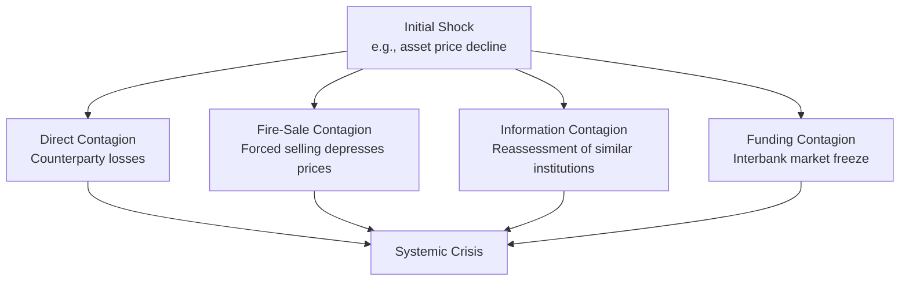

## Lessons from Historical Financial Crises

### Overview

Historical financial crises, despite differing in specific mechanisms and asset classes, exhibit recurring structural patterns that offer durable lessons for risk management, regulation, and macroeconomic policy. This synthesis draws on multiple documented episodes—from 1929 to the 2008 Global Financial Crisis and beyond—to extract generalizable principles rather than treating each crisis as a unique, unrepeatable event.

**Key Points**

- Reinhart and Rogoff's influential historical analysis (*This Time Is Different*, 2009) argues that financial crises share common quantitative signatures across centuries and countries, despite each era's belief that "this time is different"
- Lessons cluster into several categories: leverage and credit cycles, liquidity versus solvency distinctions, regulatory perimeter gaps, contagion mechanisms, and policy response effectiveness
- Historical lessons inform but do not guarantee prevention of future crises, since financial innovation continually creates novel transmission mechanisms not covered by prior lessons

### Lesson 1: Credit Booms Are the Most Reliable Leading Indicator

- **Empirical pattern**: across historical episodes (1929, Japan 1989, Asian Financial Crisis 1997, US 2008), rapid private credit growth relative to GDP consistently precedes major financial crises more reliably than asset price levels alone
- **Mechanism**: expanding credit finances asset purchases, inflating prices, which in turn supports further collateral-based lending—a self-reinforcing cycle consistent with Minsky's Financial Instability Hypothesis (hedge → speculative → Ponzi finance)
- **Practical application**: macroprudential frameworks developed after 2008 (e.g., countercyclical capital buffers under Basel III) explicitly target credit-to-GDP gap metrics as an early warning indicator, directly operationalizing this historical lesson

$$\text{Credit Gap} = \frac{\text{Private Credit}}{\text{GDP}} - \text{Long-Run Trend}$$

**Example**

In the lead-up to the 2008 crisis, US household debt-to-GDP rose from approximately 65% in the mid-1990s to nearly 100% by 2007, concentrated substantially in mortgage debt—a pattern of rapid credit expansion later formalized into countercyclical macroprudential monitoring tools.

### Lesson 2: Liquidity Crises and Solvency Crises Require Different Responses

- **Distinction**: a **liquidity crisis** occurs when fundamentally solvent institutions cannot meet short-term obligations due to funding market disruption; a **solvency crisis** occurs when an institution's assets are genuinely insufficient to cover liabilities
- **Historical confusion cost**: the 1930s Federal Reserve's failure to act as an effective lender of last resort during the banking panics of 1930–1933—partly due to misdiagnosing widespread liquidity problems as solvency problems, or adhering to the "real bills doctrine"—is widely cited as having deepened the Great Depression [Inference: this is the dominant view in monetary history following Friedman and Schwartz's influential analysis, though the precise weighting of Fed policy failure versus other depression causes remains debated among economic historians]
- **2008 policy application**: central banks applied this lesson directly, with the Federal Reserve and other central banks providing extensive emergency liquidity facilities (discount window expansion, term auction facilities, currency swap lines) specifically to address funding market freezes without necessarily implying insolvency of recipient institutions
- **Ongoing challenge**: correctly diagnosing which type of crisis is occurring in real time remains difficult, since liquidity problems can rapidly become solvency problems if forced asset sales occur at depressed ("fire sale") prices

### Lesson 3: Regulatory Perimeter Gaps Are Recurring Crisis Origins

- **Historical pattern**: major crises frequently originate in, or are substantially amplified by, financial activity occurring outside the prevailing regulatory perimeter
- **Examples across eras**:
  - Trust companies in the 1907 Panic operated with less regulatory oversight than national banks, contributing to the panic's severity
  - Savings and loan institutions in the 1980s crisis operated under a regulatory framework poorly matched to the interest rate risk they had taken on
  - **Shadow banking** (money market funds, repo markets, off-balance-sheet securitization vehicles, and non-bank mortgage originators) fell largely outside traditional bank regulatory oversight ahead of 2008, despite performing bank-like credit intermediation functions
- **Lesson application**: post-crisis regulatory reform has repeatedly involved expanding the regulatory perimeter to capture previously unregulated but systemically significant activity—though this expansion is inherently reactive and historically has not anticipated the next perimeter gap

### Lesson 4: Leverage Amplifies Both Gains and Systemic Fragility

- **Cross-episode pattern**: excessive leverage appears as a consistent amplification mechanism—1929 margin lending, Long-Term Capital Management's balance sheet leverage in 1998, investment bank leverage ratios exceeding 30:1 at some institutions ahead of 2008
- **Mechanism**: leverage increases return on equity during favorable conditions but mechanically amplifies losses and can force rapid deleveraging (asset sales) when asset values decline, which further depresses prices in a reflexive spiral
- **Policy response**: Basel III's introduction of a non-risk-weighted **leverage ratio** requirement (minimum capital relative to total exposure, regardless of risk-weighting) was designed specifically to address the historical lesson that risk-weighted capital measures alone had proven insufficient to constrain leverage buildup ahead of 2008

$$\text{Leverage Ratio} = \frac{\text{Tier 1 Capital}}{\text{Total Exposure (on- and off-balance-sheet)}}$$

### Lesson 5: Contagion Spreads Through Interconnection, Not Just Direct Exposure

- **Direct contagion**: losses propagate through direct counterparty exposure—one institution's default directly impairs its creditors
- **Indirect contagion mechanisms** (historically more difficult to anticipate):
  - **Fire-sale externalities**: forced asset sales by distressed institutions depress market prices for similar assets held by unrelated institutions, transmitting losses without direct counterparty linkage
  - **Information contagion**: failure of one institution triggers reassessment of risk at similarly-situated institutions, even absent direct exposure (e.g., regional bank runs following Silicon Valley Bank's 2023 failure, driven by depositor reassessment of uninsured deposit risk at similarly structured banks)
  - **Funding market contagion**: interbank lending markets can freeze broadly when counterparty risk becomes difficult to assess, as occurred following Lehman Brothers' 2008 bankruptcy
- **Lesson application**: post-2008 systemic risk monitoring (stress testing, G-SIB designation, network analysis of interconnections) explicitly attempts to map indirect contagion channels rather than only direct bilateral exposures

### Lesson 6: Complexity and Opacity Obscure Risk Concentration

- **Historical pattern**: financial innovation that increases product complexity (securitized MBS/CDO tranching ahead of 2008, derivative layering, off-balance-sheet vehicles) has repeatedly obscured the true location and concentration of risk within the financial system
- **Consequence**: risk that appears diversified or transferred at the individual security level can remain concentrated at the systemic level when correlated risk factors (e.g., a national house price decline) affect all underlying exposures simultaneously
- **Lesson application**: post-2008 reforms increased emphasis on transparency requirements (trade reporting for OTC derivatives, standardized disclosure for securitized products) and encouraged simpler, more standardized instrument structures where feasible, alongside central clearing to increase visibility of aggregate exposures

### Lesson 7: Policy Credibility and Communication Affect Crisis Severity

- **Historical contrast**: the 1930s banking panics were prolonged partly due to the absence of credible deposit insurance and inconsistent policy response; the introduction of FDIC deposit insurance (1933) subsequently proved highly effective at preventing retail bank runs for decades
- **2008 application**: government guarantee programs (e.g., temporary expansion of deposit insurance limits, money market fund guarantees) were deployed specifically to restore confidence and prevent panic-driven withdrawals, directly drawing on the lesson that credible backstops can prevent self-fulfilling panic dynamics
- **Communication as a policy tool**: central bank forward guidance and public communication strategies have become an increasingly explicit crisis-management tool, informed by the historical recognition that expectations and confidence are central to crisis dynamics, not merely a byproduct of them

### Lesson 8: "This Time Is Different" Thinking Precedes Most Crises

- **Reinhart-Rogoff thesis**: analysis of centuries of sovereign debt and banking crises across many countries finds that each episode is typically preceded by widespread belief that structural changes (new technology, new policy regime, new financial innovation) have permanently altered risk fundamentals, justifying historically elevated valuations or leverage
- **Recurring narrative examples**: "permanently high plateau" commentary preceding 1929; "national house prices have never declined simultaneously" preceding 2008; "internet changes everything" preceding the dot-com crash
- **Lesson application**: this pattern is used as a qualitative warning heuristic in practitioner risk management, though it lacks rigorous quantitative predictive power and is more useful as a prompt for skepticism than as a standalone forecasting tool [Speculation: the practical predictive value of narrative-based warning signals, as opposed to quantitative credit/leverage metrics, remains more contested in the academic literature than in popular crisis retrospectives]

### Lesson 9: Post-Crisis Regulation Tends to Fight the Last Crisis

- **Historical pattern**: regulatory responses are typically calibrated to address the specific mechanism of the most recent crisis (margin lending restrictions after 1929, thrift capital rules after the S&L crisis, derivatives clearing mandates after 2008) rather than anticipating the next novel risk transmission mechanism
- **Implication**: this creates a structural tendency for financial crises to originate from mechanisms not well covered by existing regulation, since regulation is inherently backward-looking relative to financial innovation
- **Balancing consideration**: while this pattern limits regulation's ability to prevent all future crises, historically it has still proven effective at preventing recurrence of the *specific* mechanism addressed (e.g., FDIC insurance has essentially eliminated the classic retail bank run as a crisis trigger in insured-deposit systems since 1933)

### Synthesis: Cross-Cutting Themes

| Lesson | Historical Evidence | Modern Policy Translation |
| --- | --- | --- |
| Credit growth as leading indicator | 1929, Japan 1989, 2008 | Countercyclical capital buffers, credit gap monitoring |
| Liquidity vs. solvency distinction | 1930s Fed policy failure | Central bank emergency liquidity facilities |
| Regulatory perimeter gaps | 1907 trusts, S&L crisis, shadow banking pre-2008 | Perimeter expansion, macroprudential oversight (FSOC) |
| Leverage amplification | 1929 margin, LTCM, pre-2008 bank leverage | Basel III leverage ratio |
| Contagion beyond direct exposure | 2008 fire sales, 2023 regional bank contagion | Stress testing, G-SIB surcharges, network monitoring |
| Complexity obscuring risk | CDO/MBS tranching pre-2008 | Central clearing, standardization, disclosure rules |
| Confidence and credible backstops | FDIC post-1933 vs. pre-1933 panics | Deposit insurance, guarantee programs, forward guidance |
| "This time is different" narratives | 1929, 2008, dot-com | Qualitative risk heuristic (limited standalone predictive power) |
| Reactive regulatory scope | Each major crisis era | Structural limitation of post-crisis regulatory design |

**Key Points**

- No single lesson is sufficient in isolation; historical crises typically involve the interaction of multiple factors simultaneously (credit growth *and* leverage *and* complexity *and* contagion channels)
- Quantitative early-warning indicators (credit-to-GDP gaps, leverage ratios) have stronger historical predictive validation than narrative-based or sentiment-based indicators
- The persistent recurrence of crises despite accumulated historical lessons suggests structural features of financial systems (procyclicality, innovation outpacing regulation, behavioral biases) rather than simple knowledge gaps are the underlying driver [Inference: this interpretation is widely held in the academic macro-finance and financial stability literature but represents a synthesis judgment rather than a single citable finding]

### Limitations of Historical Lesson Application

- **Non-stationarity**: financial system structure changes over time (new instruments, new market participants, new technology), meaning historical relationships may not hold with the same strength in future episodes
- **Survivorship and hindsight bias**: crisis narratives are often reconstructed with the benefit of hindsight, which can overstate how visible warning signs "should have been" in real time
- **Political economy constraints**: even well-understood lessons (e.g., countercyclical capital buffers) can be difficult to implement in practice, since tightening regulation during a boom period is often politically unpopular precisely when it would be most useful

**Next Steps**

- Reinhart and Rogoff's cross-country crisis dataset and methodology in depth
- Minsky's Financial Instability Hypothesis and credit cycle theory
- Macroprudential policy tools: countercyclical buffers, stress testing design
- Lender-of-last-resort theory (Bagehot's Dictum) and central bank crisis response
- Systemic risk measurement: network analysis, CoVaR, and interconnectedness metrics
- Case study comparison: 1929 vs. 2008 policy response effectiveness
- Behavioral and narrative economics as crisis precursors (Shiller's narrative economics)