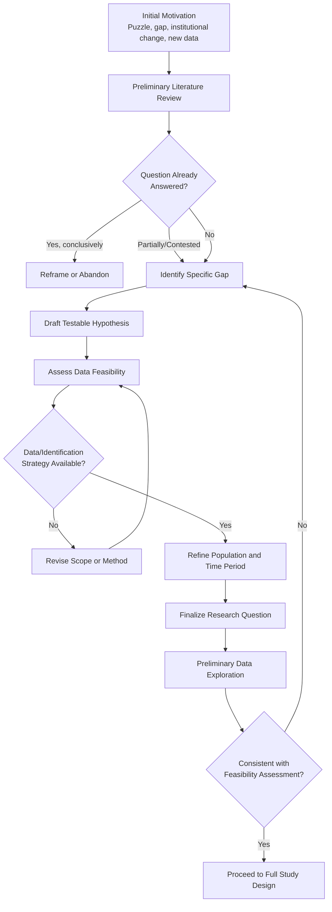

## Formulating Research Questions in Financial Economics

### Overview

Formulating a research question is the foundational step in financial economics scholarship, determining the feasibility, contribution, and eventual impact of an empirical or theoretical study. A well-formulated question sits at the intersection of theoretical motivation, empirical tractability, and genuine gap identification in the existing literature—poorly formulated questions are the most common reason promising research projects fail to produce publishable or decision-useful results.

**Key Points**

- A strong research question must be simultaneously **interesting** (theoretically or practically motivated), **answerable** (data and methodology exist or can be developed), and **novel** (not already conclusively answered)
- Financial economics research questions typically fall into three broad categories: **asset pricing** (why do assets earn the returns they do), **corporate finance** (how do firms make financing/investment decisions and why), and **market microstructure/institutions** (how do market design and frictions affect outcomes)
- The formulation process is iterative, not linear—initial questions are commonly refined, narrowed, or reframed after preliminary literature review and data exploration

### The Anatomy of a Research Question

#### Core Components

A well-specified research question in financial economics typically contains four identifiable elements:

1. **Phenomenon**: the observed or hypothesized empirical regularity, puzzle, or theoretical prediction under investigation
2. **Population/sample**: the specific set of firms, markets, assets, or time periods to which the question applies
3. **Mechanism**: the economic channel or theoretical explanation being tested (this distinguishes description from explanation)
4. **Identification strategy (implicit or explicit)**: the empirical approach by which causality or a specific relationship will be established, distinguished from mere correlation

**Example**

A weak formulation: *"Does ESG investing affect returns?"*

A strong formulation: *"Does exposure to unexpected changes in mandatory ESG disclosure requirements (phenomenon/mechanism) cause a shift in the cost of equity capital (outcome) for publicly listed firms in the EU (population), identified via a difference-in-differences design exploiting the staggered rollout of the Corporate Sustainability Reporting Directive (identification strategy)?"*

The second formulation specifies a testable mechanism, a bounded sample, and an identification strategy that addresses endogeneity concerns—all absent from the first.

### Sources of Research Questions

#### Theoretical Gaps

- Questions arising from unresolved or competing theoretical predictions (e.g., testing which of several competing asset pricing models better explains observed cross-sectional return patterns)
- Extending an established theoretical framework to a new context (e.g., applying option pricing theory to a novel real-options corporate investment setting)

#### Empirical Puzzles and Anomalies

- Observed patterns inconsistent with existing theory (e.g., the equity premium puzzle, momentum effect, value premium) that motivate either new theoretical explanations or re-examination of whether the anomaly is robust/persistent
- **Key consideration**: with the proliferation of documented "anomalies" in asset pricing (sometimes referred to as the "factor zoo"), a valuable research question often interrogates *why* a previously documented anomaly exists or whether it survives more rigorous statistical scrutiny (e.g., multiple testing correction), rather than simply documenting a new one

#### Institutional and Regulatory Change

- Policy changes, regulatory reforms, or market structure shifts create natural experiments and motivate questions about causal effects (e.g., effects of Dodd-Frank derivatives clearing mandates on liquidity, effects of tick-size pilot programs on market quality)
- **Key consideration**: institutional changes are especially valuable when they are plausibly exogenous to the outcome of interest, supporting cleaner identification

#### Data Availability and Novel Data Sources

- Emergence of new datasets (high-frequency trading data, satellite imagery, textual data from earnings calls, alternative credit data) enables previously infeasible questions
- **Caution**: research questions should not be driven purely by data availability without theoretical grounding ("data mining" risk); the strongest papers pair novel data with a clear ex ante theoretical motivation

#### Practitioner and Policy Relevance

- Questions motivated by observed market practices, investor behavior, or policy debates (e.g., "Does high-frequency trading improve or harm market quality?") often have direct relevance to regulators, asset managers, or corporate decision-makers, increasing potential impact

### The Question Formulation Process

#### Stage Detail

1. **Initial motivation**: identify the broad area of interest from theory, anomaly, institutional change, or data availability
2. **Preliminary literature review**: establish what is already known, using both foundational theoretical papers and recent empirical contributions; identify whether the question has been conclusively answered, remains contested, or is unaddressed
3. **Gap identification**: articulate precisely what remains unknown or unresolved—this is often the single most important step, as vague gap identification ("more research is needed") produces weak papers
4. **Hypothesis formulation**: state a specific, falsifiable hypothesis or set of competing hypotheses derived from theory
5. **Feasibility assessment**: evaluate whether appropriate data exists (or can be constructed) and whether a credible identification strategy is available
6. **Scope refinement**: narrow the population, time period, and geographic/market scope to match what is empirically tractable while retaining generalizability
7. **Preliminary data exploration**: conduct exploratory analysis to confirm the question is empirically viable before committing to a full research design

### Evaluating Research Question Quality

#### The "So What?" Test

- Every research question should be able to answer: *why does this matter, and to whom?* (academic theory, policymakers, practitioners, investors)
- Questions that only confirm already well-established results without new mechanism, context, or methodological contribution generally fail this test

#### Distinguishing Description from Explanation

- **Descriptive questions** ("What is the historical relationship between X and Y?") are useful as a foundation but generally insufficient alone for a strong contribution
- **Explanatory/causal questions** ("Does X cause Y, and through what mechanism?") represent a stronger contribution but require more demanding identification strategies

#### The Falsifiability Criterion

- A research question should be structured such that the hypothesis could, in principle, be rejected by the data—vague or unfalsifiable questions ("Is market efficiency important?") are poorly formulated relative to specific, testable versions ("Do stock prices fully incorporate publicly available earnings information within a one-day window?")

### Common Pitfalls in Question Formulation

**Key Points**

- **Overly broad questions**: questions like "What drives stock returns?" lack the specificity needed for a tractable identification strategy; strong papers typically isolate a specific mechanism or channel
- **Endogeneity-blind questions**: formulating a question around an association ("Do firms with X have higher Y?") without considering how causality will be established, leading to papers that cannot support causal claims despite implicitly suggesting them
- **Insufficiently novel questions**: failing to conduct thorough literature review before committing to a question, resulting in unknowingly replicating existing work without added contribution
- **Data-driven fishing**: reverse-engineering a research question to fit an interesting correlation discovered through unstructured data exploration, without ex ante theoretical grounding—raises concerns about specification searching and false positive results
- **Immeasurable constructs**: formulating questions around theoretical constructs that lack a clear, defensible empirical proxy (e.g., "investor sentiment," "firm quality") without specifying how the construct will be operationalized

### Question Formulation Across Financial Economics Subfields

| Subfield | Typical Question Structure | Example |
| --- | --- | --- |
| Asset pricing | Does factor/characteristic X explain cross-sectional variation in expected returns, and why? | Does profitability predict returns after controlling for known factors? |
| Corporate finance | Does financing/governance choice X affect firm outcome Y, and through what channel? | Does board independence affect the sensitivity of CEO pay to performance? |
| Market microstructure | Does market design feature X affect liquidity/price efficiency Y? | Does a reduction in tick size affect bid-ask spreads and depth? |
| Behavioral finance | Does bias/heuristic X explain deviation Y from rational benchmark? | Does disposition effect explain reluctance to realize losses in retail portfolios? |
| Banking/financial intermediation | Does regulatory/structural change X affect bank behavior/stability Y? | Does deposit insurance design affect bank risk-taking? |
| Sustainable/climate finance | Does climate risk exposure/disclosure X affect financial outcome Y? | Does physical climate risk exposure affect mortgage credit spreads? |

### Operationalizing Theoretical Constructs

A recurring formulation challenge is translating an abstract theoretical concept into a measurable empirical proxy.

**Example**

The theoretical construct "financial constraint" (a firm's difficulty accessing external capital) has been operationalized in the literature through multiple competing proxies:

- **Kaplan-Zingles index**: a composite index derived from financial statement variables
- **Whited-Wu index**: an alternative composite index using different underlying variables
- **Firm size and age**: simple proxies based on the empirical regularity that smaller, younger firms face greater constraints
- **Credit rating status**: presence/absence of a public credit rating as a binary proxy

A well-formulated research question involving financial constraints should explicitly justify the choice of proxy and, ideally, demonstrate robustness across multiple measures, since results driven by a single proxy's idiosyncrasies are a common source of non-replicable findings.

### Refining Scope: Breadth vs. Depth Trade-off

- **Narrow, well-identified questions**: smaller scope questions with clean identification strategies (e.g., a single natural experiment in one market) typically offer higher internal validity but face external validity/generalizability concerns
- **Broad, cross-market questions**: larger-scope questions (e.g., cross-country panel studies) offer greater generalizability but often face weaker identification due to unobserved heterogeneity across contexts
- **Practical guidance**: doctoral and early-career researchers are generally advised to prioritize a narrow, well-identified question for a first major paper, since a credible causal claim on a bounded question is typically more valuable to the literature than a suggestive correlation on a broad one [Inference: this is common supervisory/mentorship guidance in financial economics PhD programs, reflecting a broader methodological norm favoring internal validity, though views on the appropriate breadth-depth trade-off vary by subfield and journal]

### Relationship to Subsequent Research Design

**Key Points**

- The research question formulation directly constrains subsequent methodological choices: a causal question requires an identification strategy (natural experiment, instrumental variable, regression discontinuity, difference-in-differences); a descriptive question may only require careful measurement and robust summary statistics
- Questions should generally be finalized (or substantially stabilized) before extensive econometric model-building begins, to avoid post-hoc rationalization of methodology to fit convenient results
- Pre-registration of hypotheses (increasingly common and, in some outlets, required or encouraged) formalizes the discipline of fixing the research question and hypothesis before data analysis, mitigating specification-searching concerns

**Next Steps**

- Literature review methodology and systematic review techniques in financial economics
- Identification strategies: natural experiments, instrumental variables, regression discontinuity design
- The "factor zoo" problem and multiple testing corrections in asset pricing research
- Hypothesis pre-registration and its role in mitigating specification searching
- Constructing and validating empirical proxies for theoretical constructs
- Research design and causal inference fundamentals in financial economics
- Publication process and peer review norms in finance journals