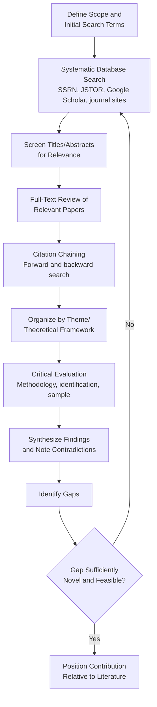

## Literature Review and Identifying Research Gaps

### Overview

The literature review is both a foundational research skill and a distinct analytical output in financial economics, serving to establish the current state of knowledge, situate a new study's contribution, and systematically identify unresolved questions. A rigorous literature review is not a summary of prior work but an argumentative synthesis that builds the case for why a specific gap matters and how existing methodologies have (or have not) adequately addressed it.

**Key Points**

- A literature review serves three distinct functions: **synthesis** (organizing existing knowledge), **critical evaluation** (assessing methodological strengths/weaknesses of prior work), and **gap identification** (motivating new contribution)
- Financial economics literature reviews typically organize around theoretical frameworks, empirical findings, and methodological approaches rather than chronological listing of papers
- Gap identification is the analytical bridge between literature review and research question formulation—a well-executed review should make the research gap feel inevitable to the reader, not asserted

### Types of Literature Reviews in Financial Economics

#### Narrative (Traditional) Review

- Qualitative synthesis organized thematically or theoretically, common as the literature review section within an empirical paper
- Strength: flexibility to weave together theoretical and empirical strands, well suited to establishing motivation for a specific study
- Limitation: subject to selection bias in which papers are included, and lacks the systematic reproducibility of formal methods

#### Systematic Review

- Follows an explicit, pre-specified protocol for literature search, inclusion/exclusion criteria, and synthesis, borrowed from methodologies more common in medicine and social sciences (e.g., PRISMA guidelines) but increasingly applied in finance for comprehensive topic surveys
- Typically used for standalone survey papers rather than as the literature review section of an original empirical study, given the greater time investment required

#### Meta-Analysis

- Quantitative synthesis that statistically aggregates effect sizes across multiple empirical studies addressing a similar question, allowing formal assessment of the average effect and heterogeneity across studies
- Particularly valuable in areas with a large number of studies testing the same relationship with varying samples/methods (e.g., meta-analyses of the relationship between corporate governance characteristics and firm performance)
- Requires comparable effect size metrics across studies, which can be a significant practical constraint in finance given heterogeneous model specifications

#### Theoretical/Conceptual Review

- Synthesizes and compares competing theoretical frameworks rather than empirical findings, often used to reconcile or contrast models that make different predictions about the same phenomenon (e.g., reviewing competing theories of capital structure: trade-off theory, pecking order theory, market timing theory)

### The Literature Review Process

#### Stage Detail

1. **Scope definition**: establish the boundaries of the review (time period, subfield, methodological focus) to keep the search tractable
2. **Systematic search**: query academic databases and repositories (SSRN, Web of Science, Google Scholar, major journal websites) using carefully constructed search terms, including synonyms and related terminology
3. **Screening**: filter results by title/abstract relevance before committing to full-text review
4. **Full-text review**: read and take structured notes on relevant papers—methodology, sample, key findings, identification strategy, and limitations
5. **Citation chaining**: use both **backward citation search** (examining the reference lists of key papers) and **forward citation search** (finding papers that cite key foundational works, often via Google Scholar's "cited by" function) to ensure comprehensive coverage
6. **Thematic organization**: group papers by theoretical framework, empirical finding, or methodological approach rather than by publication date
7. **Critical evaluation**: assess each paper's identification strategy, sample period/composition, robustness, and whether findings have been replicated or contested
8. **Synthesis**: identify areas of consensus, areas of ongoing debate, and methodological evolution over time
9. **Gap identification**: articulate what remains unresolved, untested, or methodologically weak in the existing literature

### Key Academic Resources and Search Strategies

- **SSRN (Social Science Research Network)**: primary repository for working papers in finance and economics, often containing the most current research prior to formal journal publication
- **Major finance journals**: *Journal of Finance*, *Journal of Financial Economics*, *Review of Financial Studies* (the "top three"), alongside field journals such as *Journal of Banking and Finance*, *Journal of Corporate Finance*, *Review of Asset Pricing Studies*
- **NBER Working Papers**: National Bureau of Economic Research repository, particularly relevant for macro-finance and broader economics-adjacent financial research
- **Citation databases**: Web of Science and Scopus provide citation count and impact metrics useful for gauging a paper's influence and identifying highly-cited foundational works
- **Search strategy refinement**: effective searches typically combine keyword searches with citation chaining from known seminal papers, since keyword searches alone can miss relevant work using different terminology for related concepts

### Structuring the Written Literature Review

#### Thematic vs. Chronological Organization

- **Thematic organization** (preferred in most finance research): groups papers by theoretical mechanism or empirical finding, allowing direct comparison of competing explanations for the same phenomenon
- **Chronological organization**: occasionally appropriate when the goal is explicitly tracing the evolution of a research area or methodology over time, but risks reading as a list rather than an argument

#### Building the Argumentative Thread

- Each paragraph or section should advance an argument about the state of knowledge, not merely summarize individual papers in sequence
- Effective reviews explicitly note **agreement and disagreement** among studies, and offer an assessment of *why* studies reach different conclusions (different samples, time periods, identification strategies, or genuinely different underlying economic mechanisms)

**Example**

A well-structured thematic paragraph on capital structure theory might state: *prior evidence on the pecking order theory is mixed—while [Author A] finds support using US manufacturing firms in a specific decade, [Author B] finds the pattern reverses in more recent samples with different financing environments, suggesting the theory's applicability may be time- or context-dependent rather than universal.* This contrasts findings and offers an explanation for the discrepancy, rather than listing each paper's conclusion independently.

### Identifying Research Gaps: A Taxonomy

#### Empirical Gaps

- **Unexamined populations/contexts**: a relationship well-established in one market, time period, or firm type has not been tested in another (e.g., a governance-performance relationship documented for US firms untested in emerging markets)
- **Conflicting findings**: existing studies reach contradictory conclusions, suggesting either a moderating variable not yet identified or a methodological artifact requiring resolution
- **Outdated evidence**: findings based on data predating significant structural, regulatory, or technological change may no longer hold (e.g., market microstructure findings from before the shift to decimalization and high-frequency trading)

#### Methodological Gaps

- **Identification weaknesses**: prior studies rely on correlational evidence or weak instruments where a cleaner identification strategy (natural experiment, improved instrument, regression discontinuity) has since become available
- **Measurement limitations**: prior studies use imprecise or indirect proxies for a theoretical construct where better data or measurement approaches have since emerged
- **Robustness gaps**: findings have not been tested against alternative specifications, subsamples, or with corrections for known statistical issues (e.g., multiple testing, clustering of standard errors)

#### Theoretical Gaps

- **Untested predictions**: a theoretical model generates predictions that have not yet been empirically examined
- **Competing theories unreconciled**: multiple theoretical frameworks make different predictions about the same phenomenon, and existing evidence has not decisively distinguished between them
- **Missing mechanisms**: an empirical relationship is well-documented, but the underlying economic mechanism driving it remains unclear or untested

#### Contextual/Institutional Gaps

- **New institutional settings**: regulatory changes, new market structures, or emerging financial instruments create genuinely new contexts not covered by existing literature (e.g., decentralized finance protocols, novel ESG disclosure regimes)
- **Cross-country/cross-market generalizability**: findings established in one institutional/regulatory environment may not generalize to differently structured markets

### Evaluating the Quality and Credibility of Prior Studies

**Key Points**

- **Identification strategy assessment**: does the study support a causal claim, or only a correlational one? What potential confounding variables or reverse causality concerns remain unaddressed?
- **Sample composition and period**: is the sample representative of the population the study claims to generalize to? Does the time period include unusual events (crises, regime changes) that may limit generalizability?
- **Robustness and replication**: has the finding been replicated by independent researchers using different samples or methods? Replication failures or fragility to specification choices are important signals for a literature review to surface
- **Publication bias awareness**: published literature may overrepresent statistically significant, novel findings relative to null results, given historical journal preferences—reviewers should consider this when assessing whether a documented effect is likely as robust as the published record suggests [Inference: publication bias is a well-documented phenomenon across empirical social science broadly; its specific magnitude within financial economics literature varies by subfield and is not precisely quantifiable in general terms]

### Common Pitfalls in Literature Review and Gap Identification

- **Exhaustive listing without synthesis**: describing each paper sequentially without building a comparative argument, producing a summary rather than a review
- **Confirmation-biased searching**: searching primarily for literature that supports a pre-existing hypothesis, resulting in an incomplete or one-sided review that misses contradicting evidence
- **Overclaiming novelty**: asserting a gap exists without sufficiently thorough search, only to discover (often during peer review) that the question has already been addressed
- **Under-specifying the gap**: identifying a broad, vague absence ("little research exists on X") rather than a precise, well-motivated gap tied to a specific theoretical or empirical shortcoming
- **Ignoring adjacent literatures**: financial economics questions often benefit from literature in adjacent fields (accounting, economics, psychology for behavioral finance, computer science for fintech/algorithmic topics); narrowly scoping the search to "finance" journals alone can miss directly relevant work

### From Gap to Contribution Statement

A well-executed literature review culminates in an explicit **contribution statement** that positions the new research relative to the identified gap.

**Example**

*"While prior literature has established that mandatory ESG disclosure affects firms' cost of capital in the European context [citations], no study has examined whether this effect differs by firm size, and existing identification strategies have not addressed the potential endogeneity of disclosure timing. This paper addresses both gaps by exploiting the staggered introduction of disclosure requirements across EU member states as a source of plausibly exogenous variation, and by examining heterogeneous effects across the firm size distribution."*

This statement explicitly identifies both an empirical gap (firm size heterogeneity) and a methodological gap (endogeneity of disclosure timing), and states how the new study addresses each.

### Literature Review Tools and Reference Management

- **Reference management software** (Zotero, Mendeley, EndNote): systematic organization of citations, PDFs, and notes, with citation formatting integration for manuscript preparation
- **Systematic note-taking frameworks**: structured templates capturing, for each paper, the research question, sample/data, methodology, key findings, and identified limitations—facilitating later synthesis across dozens or hundreds of papers
- **Citation mapping tools**: tools such as Connected Papers or Litmaps visualize citation networks, helping identify clusters of related work and foundational papers that might be missed through keyword search alone

**Next Steps**

- Formulating research questions in financial economics (question-gap linkage)
- Identification strategies and causal inference methods in empirical finance
- Publication bias and the replication crisis in empirical social science
- Meta-analysis methodology for aggregating financial economics findings
- Academic writing structure and journal submission norms in finance
- Working paper repositories and pre-publication research dissemination (SSRN, NBER)
- Constructing a contribution statement and positioning a paper relative to existing literature