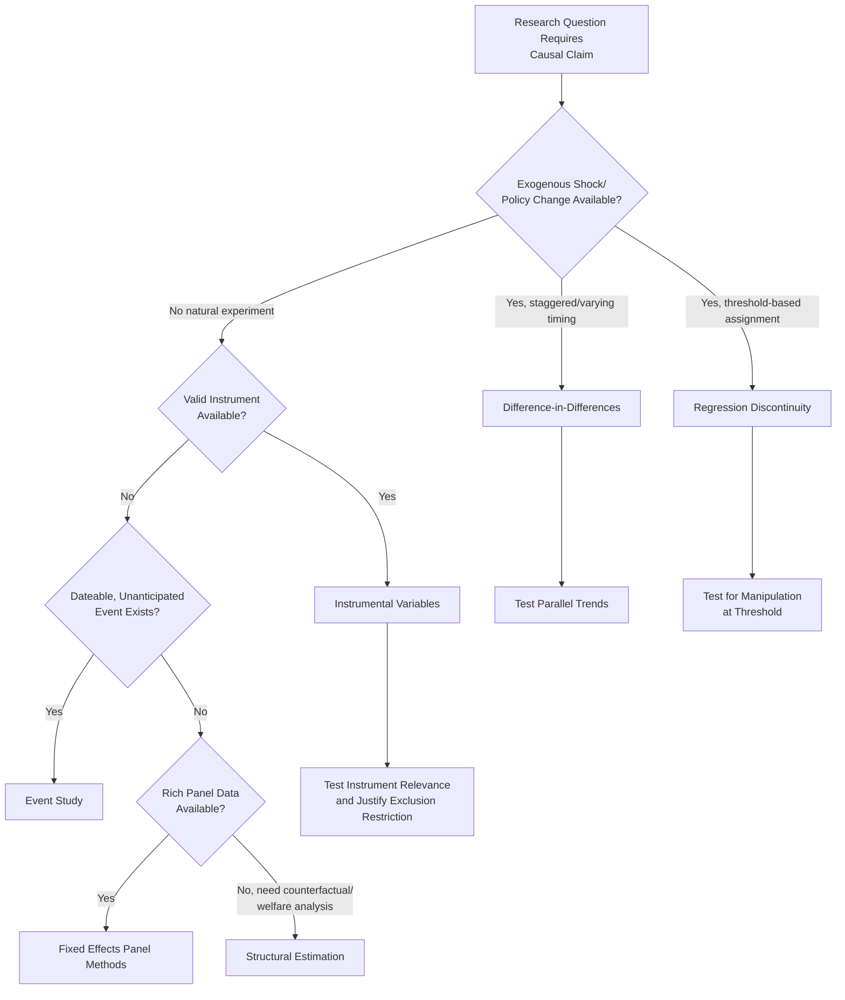

## Empirical Identification Strategies in Finance

### Overview

Empirical identification strategies address the central methodological challenge of financial economics research: distinguishing causal relationships from mere correlation in observational data where randomized controlled experiments are rarely feasible. Identification strategies are the specific econometric and research design techniques used to isolate exogenous variation in an explanatory variable, allowing researchers to credibly attribute observed effects to a hypothesized causal mechanism rather than confounding factors.

**Key Points**

- The core identification problem in finance stems from **endogeneity**: explanatory variables of interest (leverage, governance structure, disclosure choices) are typically chosen by economic agents in response to the same factors that determine the outcome, creating simultaneity, omitted variable bias, or reverse causality
- No single identification strategy is universally superior; the appropriate choice depends on the availability of exogenous variation, data structure, and the specific threat to identification present in a given setting
- Strong empirical papers explicitly state the identifying assumption, discuss its plausibility, and test it where possible—identification strategy discussion has become a central component of finance journal peer review

### The Endogeneity Problem

#### Sources of Endogeneity

- **Omitted variable bias**: an unobserved factor influences both the explanatory variable and the outcome (e.g., unobserved firm quality affects both leverage choice and firm performance)
- **Reverse causality**: the presumed outcome actually influences the presumed cause (e.g., firm performance may influence governance structure choices rather than the reverse)
- **Simultaneity**: explanatory variable and outcome are jointly determined within the same economic decision process (e.g., capital structure and investment decisions are often chosen simultaneously)
- **Measurement error**: mismeasurement of the explanatory variable biases coefficient estimates, typically toward zero (attenuation bias) under classical measurement error assumptions
- **Selection bias**: the sample itself is non-randomly selected in a way correlated with the outcome (e.g., studying only firms that survive to be listed, ignoring delisted/failed firms)

$$Y_i = \beta X_i + \gamma U_i + \varepsilon_i$$

If $U_i$ (unobserved) is correlated with both $X_i$ and $Y_i$ but omitted from the regression, the OLS estimate of $\beta$ is biased:

$$\text{plim}(\hat{\beta}_{OLS}) = \beta + \gamma \cdot \frac{\text{Cov}(X_i, U_i)}{\text{Var}(X_i)}$$

### Natural Experiments and Quasi-Experimental Design

#### Difference-in-Differences (DiD)

- **Core logic**: compares the change in outcomes over time between a treatment group (affected by an exogenous shock or policy change) and a control group (unaffected), isolating the treatment effect under the assumption that both groups would have followed **parallel trends** absent the treatment
- **Identifying assumption**: the parallel trends assumption—treatment and control groups would have evolved similarly in the absence of treatment—is the central threat to identification and should be tested using pre-treatment trend comparisons where possible

$$Y_{it} = \alpha + \beta (\text{Treat}_i \times \text{Post}_t) + \delta_i + \theta_t + \varepsilon_{it}$$

where $\delta_i$ are firm/unit fixed effects, $\theta_t$ are time fixed effects, and $\beta$ captures the treatment effect.

- **Recent methodological developments**: staggered adoption DiD designs (where treatment timing varies across units) have been shown in recent econometric literature to suffer from bias when treatment effects are heterogeneous over time, motivating newer estimators (e.g., Callaway-Sant'Anna, Sun-Abraham, de Chaisemartin-D'Haultfœuille) designed to address this bias [Unverified: this is an active area of ongoing methodological development; specific recommended estimators continue to evolve and should be checked against the current econometric literature]

**Example**

A study examining the effect of a state-level banking deregulation on local firm investment might compare investment growth in states that deregulated (treatment) versus states that had not yet deregulated (control) around the deregulation date, using firm and year fixed effects to control for time-invariant firm characteristics and common macroeconomic shocks.

#### Regression Discontinuity Design (RDD)

- **Core logic**: exploits a threshold-based assignment rule (an eligibility cutoff, index inclusion threshold, credit score cutoff) where units just above and just below the threshold are assumed to be otherwise similar, isolating the causal effect of treatment assignment at the discontinuity
- **Sharp RDD**: treatment is deterministically assigned based on the threshold (e.g., firms above a size threshold are subject to a regulation, those below are not)
- **Fuzzy RDD**: treatment probability jumps discontinuously at the threshold but is not deterministic, requiring an instrumental variable approach around the discontinuity
- **Identifying assumption**: units cannot precisely manipulate their position relative to the threshold (no sorting/manipulation), and all other factors vary smoothly across the threshold

$$\lim_{x \to c^+} E[Y_i \mid X_i = x] - \lim_{x \to c^-} E[Y_i \mid X_i = x] = \tau_{RDD}$$

**Example**

Studies of index inclusion effects (e.g., the effect of S&P 500 index addition on stock returns/liquidity) often exploit market capitalization or float-adjusted ranking cutoffs used by index committees as a quasi-random assignment mechanism, comparing firms just above and below the inclusion threshold.

#### Instrumental Variables (IV)

- **Core logic**: uses a variable (the instrument) that affects the endogenous explanatory variable but has no direct effect on the outcome except through that variable, isolating exogenous variation in the endogenous regressor
- **Two required conditions**:
  - **Relevance**: the instrument must be meaningfully correlated with the endogenous explanatory variable (testable via first-stage F-statistics; weak instruments with low first-stage F-statistics, conventionally below approximately 10, produce unreliable IV estimates)
  - **Exclusion restriction**: the instrument must affect the outcome only through its effect on the endogenous variable, not through any other channel (fundamentally untestable and requires strong institutional/theoretical justification)

$$\text{First stage: } X_i = \pi Z_i + \nu_i \qquad \text{Second stage: } Y_i = \beta \hat{X}_i + \varepsilon_i$$

**Key Points**

- The exclusion restriction is the central vulnerability of IV designs, since it cannot be directly tested and relies on economic argument for plausibility
- Common instrument types in finance include: historical/geographic variables (e.g., historical bank branch density as an instrument for current credit access), regulatory/legal variation across jurisdictions, and peer/network-based instruments
- **Weak instrument bias**: even a small correlation between the instrument and the error term can produce severely biased IV estimates when the instrument is only weakly correlated with the endogenous variable, making first-stage strength diagnostics essential

#### Event Studies

- **Core logic**: measures abnormal stock returns around a specific, dateable event (earnings announcement, M&A announcement, regulatory action, index change) to infer the market's assessment of the event's value implications, under the maintained assumption of market efficiency
- **Methodology**: estimate expected "normal" returns using a benchmark model (market model, Fama-French factor model) over an estimation window, then calculate **abnormal returns (AR)** and **cumulative abnormal returns (CAR)** over an event window

$$AR_{it} = R_{it} - E[R_{it} \mid X_t] \qquad CAR_i(t_1, t_2) = \sum_{t=t_1}^{t_2} AR_{it}$$

- **Identification consideration**: event studies provide relatively clean identification when the event date is precisely known and unanticipated, but confounding events occurring in the same window threaten identification; robustness checks typically involve narrowing the event window and testing sensitivity to window length

#### Matching Methods

- **Propensity score matching (PSM)**: matches treated units to control units with similar predicted probability of treatment based on observable characteristics, aiming to approximate random assignment on observables
- **Coarsened exact matching (CEM)** and **nearest-neighbor matching**: alternative matching approaches balancing observable characteristics between treatment and control groups
- **Key limitation**: matching only addresses selection on *observable* characteristics; it does not address selection on unobservables, which remains a significant threat to identification unless combined with another strategy (e.g., matching combined with DiD)

### Panel Data Methods for Identification

#### Fixed Effects Estimation

- **Firm/entity fixed effects**: control for all time-invariant unobserved firm characteristics, addressing omitted variable bias from stable but unmeasured factors (e.g., unobserved management quality, if reasonably stable over the sample period)
- **Time fixed effects**: control for common shocks affecting all units in a given period (e.g., macroeconomic conditions, market-wide sentiment)
- **Limitation**: fixed effects only address time-invariant confounders; time-varying omitted variables correlated with both the explanatory variable and outcome remain a threat

#### Instrumenting with Lagged Variables

- Using lagged values of the explanatory variable as instruments is a common but methodologically contested approach, since lagged variables may still be correlated with persistent unobserved factors, and the exclusion restriction is often difficult to justify theoretically

### Structural Estimation Approaches

- **Structural models**: specify an explicit economic model (e.g., a dynamic capital structure model, an asset pricing model with specified preferences) and estimate underlying structural parameters using methods such as **Generalized Method of Moments (GMM)** or **Maximum Likelihood Estimation (MLE)**
- **Trade-off relative to reduced-form methods**: structural approaches allow counterfactual policy analysis and welfare evaluation not possible with reduced-form causal estimates, but rely more heavily on the correctness of the specified theoretical model—misspecification risk is a central concern
- **Reduced-form vs. structural debate**: the finance and broader economics literature reflects an ongoing methodological debate about the relative merits of transparent, assumption-light reduced-form identification versus theoretically-grounded but assumption-heavy structural estimation [Inference: characterizing this as a persistent, unresolved methodological tension is a widely shared view among econometricians, though individual researchers' preferences vary by subfield and specific research question]

### Identification Strategy Selection Framework

### Threats to Identification and Robustness Testing

**Key Points**

- **Parallel trends violations (DiD)**: tested via pre-trend analysis, placebo tests on pre-treatment periods, and event-study style dynamic treatment effect plots
- **Manipulation at the threshold (RDD)**: tested using density tests (e.g., McCrary test) to check for suspicious bunching of observations near the cutoff, which would suggest non-random sorting
- **Weak instruments (IV)**: assessed via first-stage F-statistics and, increasingly, weak-instrument-robust confidence intervals (e.g., Anderson-Rubin test)
- **Confounding events (event studies)**: addressed through narrow event windows, checks for contemporaneous news, and exclusion of firms with overlapping corporate events
- **Standard error correction**: clustering standard errors at the appropriate level (firm, industry, time) is essential across nearly all these methods to avoid overstating statistical significance due to correlated errors within clusters

### Common Pitfalls in Applying Identification Strategies

- **Misapplying DiD with staggered treatment timing** using traditional two-way fixed effects estimators, which recent econometric research has shown can produce severely biased or even sign-reversed estimates under heterogeneous treatment effects—researchers should be aware of and address this issue using appropriate modern estimators
- **Weak or implausible instruments** selected primarily for statistical convenience rather than genuine institutional justification for the exclusion restriction
- **RDD bandwidth sensitivity**: results that are highly sensitive to the choice of bandwidth around the threshold raise concerns about the robustness of the discontinuity estimate
- **Overreliance on statistical significance** as validation of an identification strategy, rather than assessing the economic plausibility and institutional soundness of the identifying assumption itself
- **Selection into the natural experiment sample**: even ostensibly exogenous natural experiments can involve non-random selection into the affected sample, requiring careful institutional understanding of how treatment assignment actually occurred

### Comparative Summary

| Strategy | Key Requirement | Primary Threat | Common Application |
| --- | --- | --- | --- |
| Difference-in-Differences | Comparable treatment/control groups over time | Parallel trends violation | Policy/regulatory change effects |
| Regression Discontinuity | Threshold-based assignment rule | Manipulation/sorting at cutoff | Index inclusion, eligibility cutoffs |
| Instrumental Variables | Relevant, excludable instrument | Weak instruments, exclusion restriction violation | Endogenous financing/governance choices |
| Event Study | Precisely dateable, unanticipated event | Confounding contemporaneous events | Announcement effects, M&A, earnings |
| Matching Methods | Rich observable characteristics | Selection on unobservables | Treatment effect estimation with selection |
| Structural Estimation | Correctly specified theoretical model | Model misspecification | Counterfactual/welfare analysis |

**Next Steps**

- Difference-in-differences with heterogeneous treatment timing: modern estimator comparison
- Instrumental variable selection and exclusion restriction justification in corporate finance
- Event study methodology: benchmark model selection and statistical inference
- Panel data econometrics: fixed effects, random effects, and dynamic panel models
- Structural estimation methods: GMM and simulated method of moments in asset pricing
- Standard error clustering and inference in finance panel data
- Replication and robustness testing standards in empirical finance publishing