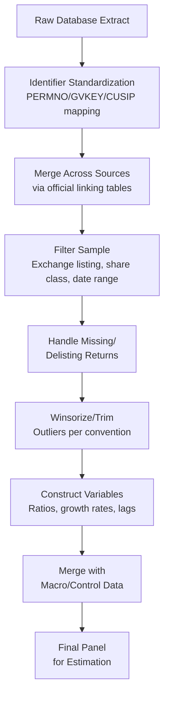

## Working with Financial Databases


### Overview

Financial databases are the empirical backbone of quantitative research in financial economics, providing standardized, structured access to market data, firm fundamentals, and institutional records. Effective use of these databases requires understanding not only how to extract data, but also the construction methodology, known limitations, and survivorship/selection issues embedded in each major source—since misunderstanding data construction is among the most common sources of empirical error in finance research.

**Key Points**

- Major financial databases are generally organized around three domains: **market/price data** (returns, volume, market capitalization), **fundamental/accounting data** (financial statements, ratios), and **event/transaction data** (M&A, IPOs, insider trading, institutional holdings)
- Database identifiers (CUSIP, PERMNO, GVKEY, ISIN, ticker) do not map one-to-one over time, and correctly linking records across databases is a critical and frequently underappreciated methodological step
- Understanding a database's construction methodology (rebalancing rules, survivorship handling, point-in-time vs. restated data) is often as important as the data itself for producing valid research

### Major Database Categories and Providers

#### Market/Price Data

- **CRSP (Center for Research in Security Prices)**: the standard academic source for US stock market data (daily/monthly returns, prices, shares outstanding, trading volume), maintained by the University of Chicago Booth School of Business; widely regarded as the benchmark for return calculation methodology in academic asset pricing research due to its careful handling of delistings and corporate actions
- **Bloomberg Terminal**: comprehensive real-time and historical market data across global asset classes, widely used in both practitioner and academic settings, though typically accessed via institutional subscription rather than bulk academic licensing
- **Refinitiv (formerly Thomson Reuters) Datastream**: global market data with broad international equity, fixed income, and macroeconomic time series coverage, commonly used for international/cross-country studies
- **TAQ (Trade and Quote) Database**: NYSE-maintained intraday transaction-level data (trades and quotes), the standard source for market microstructure research requiring tick-level granularity

#### Fundamental/Accounting Data

- **Compustat**: the standard source for US (and global, via Compustat Global) corporate financial statement data, widely linked with CRSP via the **CRSP/Compustat Merged (CCM) database** to combine market and accounting data for the same firms
- **Worldscope**: international corporate fundamentals database, commonly used alongside Datastream for cross-country corporate finance studies
- **XBRL-based SEC filings data**: increasingly used for granular, tagged financial statement data directly from SEC EDGAR filings, enabling finer-grained or more current data than periodically-updated commercial databases

#### Institutional and Ownership Data

- **Thomson Reuters/Refinitiv 13F Database**: institutional investor quarterly holdings data, derived from mandatory SEC Form 13F filings, widely used to study institutional ownership and trading behavior
- **ExecuComp**: executive compensation data for US public firms, standard source for corporate governance and executive pay research
- **RiskMetrics/ISS Governance Database**: corporate governance characteristics (board structure, takeover defenses, voting outcomes)

#### Bond and Fixed Income Data

- **TRACE (Trade Reporting and Compliance Engine)**: FINRA-maintained transaction-level corporate bond trading data, the standard source for corporate bond market microstructure and liquidity research
- **Mergent FISD (Fixed Income Securities Database)**: bond issuance characteristics and covenant data

#### Deal and Event Data

- **SDC Platinum (Refinitiv)**: mergers and acquisitions, IPO, and other corporate transaction data, widely used in corporate finance event studies
- **VentureXpert/PitchBook**: venture capital and private equity transaction data

### Database Linking and Identifier Management

#### The Identifier Problem

- **CUSIP**: a 9-character alphanumeric identifier for North American securities, can be **reused for different securities over time** after a sufficient period, creating potential mismatches in long panel datasets if not handled carefully
- **PERMNO**: CRSP's permanent security identifier, specifically designed to remain stable for a given security throughout its trading history, making it the preferred identifier for CRSP-based panel construction
- **GVKEY**: Compustat's permanent company identifier, used as the standard key for firm-level panel construction within Compustat and linked databases
- **ISIN**: International Securities Identification Number, the standard identifier for cross-border/international security matching
- **Ticker symbols**: **not reliable long-term identifiers**, since tickers can be reused by different companies after delisting and can change for the same company (e.g., following rebranding or exchange changes)

#### Cross-Database Linking

- **CRSP/Compustat Merged (CCM) database**: provides an official linking table between CRSP's PERMNO and Compustat's GVKEY, maintained and validated by CRSP specifically to address the non-trivial challenge of matching securities across the two databases' differing identifier systems
- **Best practice**: researchers should use official linking tables (like CCM) rather than constructing ad hoc matches via ticker or company name, since name-based or ticker-based matching is prone to significant error from name changes, subsidiary relationships, and identifier reuse

```mermaid
flowchart LR
    A[CRSP<br/>PERMNO, price/return data] -->|CCM Linking Table| B[Compustat<br/>GVKEY, fundamental data]
    B -->|Merge on GVKEY + Date| C[Combined Panel<br/>Market + Accounting Data]
    D[SDC Platinum<br/>Deal identifiers] -->|Name/CUSIP Matching<br/>with manual verification| C
    E[ExecuComp<br/>GVKEY-linked| B
    C --> F[Final Research Dataset]
```

### Critical Data Construction Issues

#### Survivorship Bias

- **Definition**: bias introduced when a dataset only includes entities that "survived" to the present (or to the end of the sample construction), systematically excluding failed, delisted, or merged entities
- **CRSP's handling**: CRSP is specifically constructed to include delisted securities along with **delisting returns**, allowing researchers to avoid survivorship bias if the full CRSP file (rather than a "current constituents only" extract) is used correctly
- **Common error**: using only currently-listed firms, or failing to properly incorporate delisting returns (treating a delisting as simply missing data rather than accounting for the actual return realized, which is often significantly negative for distressed delistings), which biases results toward better-performing surviving firms

#### Look-Ahead Bias

- **Definition**: bias introduced when a study uses information that would not have been available to market participants at the time being studied (e.g., using final, restated financial statement figures in a trading strategy backtest, when only preliminary figures were available at the time)
- **Point-in-time databases**: some databases (e.g., certain Compustat point-in-time offerings, I/B/E/S for analyst forecasts) are specifically designed to preserve the data *as originally reported*, before subsequent restatements, allowing researchers to avoid look-ahead bias in trading strategy or event-based research

#### Backfill Bias

- **Definition**: bias arising when a database backfills historical data for entities added to coverage later (common in hedge fund databases, where funds often only begin reporting after establishing a track record, and that historical track record is then backfilled), inflating average historical performance
- **Relevance**: particularly significant in hedge fund and mutual fund performance databases (e.g., certain commercial hedge fund databases), where self-reporting and backfilling can materially distort documented average returns

#### Rebalancing and Index Construction Timing

- Index membership databases (S&P 500 constituents, Russell indices) require careful attention to the exact rebalancing dates and methodology, since research on index effects (inclusion/exclusion) is highly sensitive to correctly identifying announcement dates versus effective dates

### Data Cleaning and Preparation Workflow



#### Common Cleaning Steps

1. **Share class filtering**: many firms have multiple share classes (e.g., Class A/Class B) listed separately in CRSP; researchers typically select a single representative class or aggregate appropriately depending on the research question
2. **Exchange and security type filtering**: standard asset pricing research typically restricts to common stocks (CRSP share codes 10/11) listed on major exchanges (NYSE, AMEX, NASDAQ), excluding REITs, ADRs, or closed-end funds unless specifically relevant
3. **Winsorization/trimming**: extreme outlier values (often at the 1st/99th percentile) are commonly winsorized or trimmed in accounting-based variables to reduce the influence of data errors or extreme observations, though the specific threshold and justification should be reported transparently
4. **Missing data handling**: explicit decisions about how to handle missing fundamental data (exclude, impute, or treat as zero where economically meaningful) should be documented and, ideally, tested for sensitivity
5. **Variable construction from raw fields**: standard ratios (e.g., book-to-market, leverage, profitability measures) require careful attention to the specific Compustat/CRSP field definitions used, since seemingly standard variables can be constructed multiple ways in the literature

### Database Access and Query Approaches

#### Access Platforms

- **WRDS (Wharton Research Data Services)**: the dominant academic gateway providing unified access to CRSP, Compustat, TAQ, SDC Platinum, ExecuComp, and numerous other databases through a common web interface and SAS/Python/R/Stata query interfaces; most US academic finance research relies on WRDS-hosted data access
- **Direct vendor APIs**: Bloomberg (BLPAPI), Refinitiv Eikon/Datastream APIs, and similar programmatic interfaces for institutional/practitioner settings
- **SEC EDGAR**: freely accessible public repository of SEC filings, increasingly queried directly via API for granular, current filing data not yet incorporated into commercial databases

#### Query Language and Tooling

- WRDS supports SQL-based querying (via PostgreSQL-based backend) in addition to traditional statistical software integration (SAS, Stata, R, Python via `wrds` Python package), enabling researchers to construct efficient, reproducible extraction scripts rather than manual web-interface downloads
- Reproducibility best practice: documenting the exact query/extraction code (rather than manually filtered spreadsheet downloads) is increasingly expected for replication purposes in top finance journals

**Example**

A typical WRDS Python extraction for merging CRSP monthly returns with Compustat annual fundamentals via the CCM link table involves: (1) querying CRSP monthly stock file for PERMNO-level returns, (2) querying the CCM linking table to obtain valid PERMNO-GVKEY-date ranges, (3) querying Compustat annual fundamentals for GVKEY-level data, and (4) merging with appropriate lag alignment (fiscal year-end data typically lagged to ensure availability at the time of the corresponding market observation, commonly a minimum three- to six-month reporting lag assumption).

### Common Pitfalls in Database Use

**Key Points**

- **Ticker-based matching across time**: using ticker symbols as a primary identifier for panel construction, ignoring ticker reuse and changes, is a frequent source of silent data corruption
- **Ignoring delisting returns**: treating delisted firms as simply exiting the sample without applying CRSP's delisting return adjustment biases return-based studies, particularly during periods with elevated distress-related delistings
- **Mismatched fiscal year alignment**: failing to properly lag accounting data relative to its public availability date, introducing look-ahead bias
- **Uncritical acceptance of "standard" variable construction**: assuming a specific variable definition (e.g., "leverage") is unambiguous, when in practice the literature contains multiple competing construction conventions that can materially affect results
- **Insufficient sample filtering documentation**: failing to transparently report and justify sample filters (exchange, share class, minimum price thresholds, missing data exclusions), which undermines replicability and can mask results sensitive to filtering choices
- **Currency and unit inconsistencies in international data**: cross-country studies using Worldscope/Datastream must carefully handle currency denomination, accounting standard differences (local GAAP vs. IFRS), and fiscal year-end variation across countries

### Documentation and Replicability Standards

- Leading finance journals increasingly require detailed **data appendices** specifying exact variable construction, database vintage/access date, and sample filtering criteria
- **Replication packages**: growing expectation (and in some journals, requirement) that published papers include code and, where licensing permits, data or detailed extraction instructions sufficient for independent replication
- **Database vintage sensitivity**: commercial databases are periodically revised (restated financials, corrected identifiers), meaning results can be sensitive to the specific vintage/access date of the data pull—documenting the extraction date is considered best practice

**Next Steps**

- CRSP and Compustat variable construction conventions in depth
- Survivorship bias, look-ahead bias, and backfill bias: detection and correction methods
- WRDS query construction and reproducible data pipeline design
- Point-in-time databases and their role in avoiding look-ahead bias
- International financial database considerations (Worldscope, Datastream, IFRS harmonization)
- SEC EDGAR and XBRL-based financial statement data extraction
- Data cleaning, winsorization, and outlier handling conventions in empirical finance