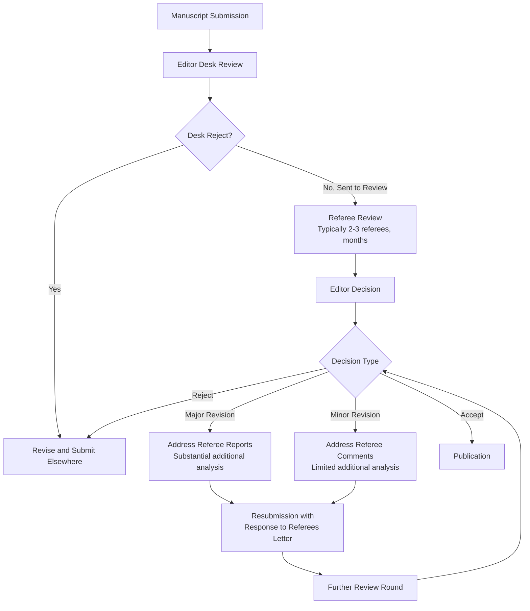

## Academic Writing and Publishing in Finance

### Overview

Academic writing and publishing in finance follows conventions distinct from general academic writing, shaped by the discipline's emphasis on empirical rigor, standardized paper structure, and a hierarchical, highly selective journal system. Successfully navigating this process requires understanding both the craft of writing a compelling finance paper and the institutional mechanics of journal submission, peer review, and revision.

**Key Points**

- Finance papers follow a relatively standardized structure (introduction, literature review, data/methodology, results, robustness, conclusion) that differs from other social sciences in its heavy emphasis on a front-loaded, self-contained introduction
- The finance journal hierarchy is unusually concentrated, with a small set of "top" journals exerting outsized influence on academic careers, particularly for tenure-track positions
- The peer review and revision process in finance is typically lengthy (often 1–3+ years from submission to publication) and demands substantial additional analysis in response to referee reports, distinct from a simple proofreading-style revision

### The Structure of a Finance Research Paper

#### The Introduction as a Self-Contained Summary

- Unlike many disciplines where the introduction merely motivates the topic, finance paper introductions are expected to function as a **complete, self-contained summary** of the entire paper—stating the research question, brief methodology, headline result (often with specific magnitudes), contribution relative to literature, and robustness, all within the first several pages
- **Rationale**: given time constraints, many readers (including referees on a first pass) read only the introduction; a well-constructed introduction should allow a reader to understand the paper's core contribution without reading further
- **Typical introduction components, in order**: (1) motivation and research question, (2) brief preview of empirical approach/identification strategy, (3) headline finding with magnitude, (4) contribution relative to existing literature (explicitly naming the gap addressed), (5) brief preview of robustness/additional analysis, (6) paper roadmap

#### Literature Review Section

- Positioned early (often as Section 2), serving to establish the paper's contribution relative to existing work, following the synthesis and gap-identification principles of rigorous literature review
- In finance, this section is typically more concise than in other social sciences, since substantial literature positioning already occurs in the introduction—the literature review section provides deeper engagement with closely related papers rather than a broad survey

#### Data and Methodology Section

- Detailed description of data sources, sample construction, key variable definitions, and summary statistics (typically presented in a "Table 1" showing descriptive statistics for the main sample)
- Explicit statement of the empirical model/identification strategy, including the econometric specification, fixed effects structure, and standard error clustering approach
- **Convention**: summary statistics tables typically report mean, median, standard deviation, and percentiles for key variables, allowing readers to assess sample characteristics and compare with related studies

#### Results Section

- Presented via regression tables following field conventions: coefficients with standard errors (or t-statistics) typically in parentheses below, significance stars (commonly *, **, *** for 10%, 5%, 1% levels), and R-squared/observation counts reported at the table foot
- Results are typically presented with increasing model complexity across table columns (e.g., progressively adding control variables or fixed effects), allowing readers to assess robustness to specification changes within the table itself

#### Robustness and Additional Analysis

- A dedicated section (or subsections throughout) addressing alternative explanations, placebo tests, subsample analysis, and alternative variable definitions
- **Convention**: given the centrality of identification concerns in finance, referees typically expect extensive robustness testing directly addressing plausible alternative explanations for the main result, not merely mechanical specification variations

#### Conclusion

- Typically brief, summarizing key findings, restating the contribution, and noting limitations and directions for future research, without introducing substantial new analysis

### Writing Style Conventions in Finance

**Key Points**

- **Precision over elegance**: finance writing prioritizes precise, unambiguous statement of results (specific coefficient magnitudes, statistical significance, economic significance) over literary style
- **Active voice and directness**: increasingly preferred over passive constructions, consistent with broader social science writing trends toward clarity
- **Economic significance alongside statistical significance**: strong papers interpret coefficient magnitudes in economically meaningful terms (e.g., "a one-standard-deviation increase in X is associated with a Y% change in the outcome, equivalent to Z dollars for the average firm in the sample"), not merely reporting statistical significance
- **Hedging calibrated to evidence strength**: causal language ("causes," "leads to") is reserved for results supported by a credible identification strategy; correlational findings should be described using more cautious language ("is associated with," "correlates with")

### The Finance Journal Hierarchy

#### The "Top Three" and Broader Tiers

- **Top three journals**: *Journal of Finance*, *Journal of Financial Economics*, and *Review of Financial Studies* are widely regarded as the most prestigious outlets in the field, carrying substantial weight in tenure and promotion decisions at research-focused institutions
- **Strong field journals**: *Journal of Financial and Quantitative Analysis*, *Review of Finance*, *Management Science* (finance articles), *Journal of Banking and Finance*, *Journal of Corporate Finance*, among others, represent a broader tier of well-regarded outlets
- **Specialized field journals**: journals focused on specific subfields (e.g., *Review of Asset Pricing Studies*, *Journal of Financial Intermediation*, *Journal of Empirical Finance*) serve as outlets for more specialized contributions
- [Inference: the relative ranking and weighting of journals below the "top three" varies by institution and subfield community; the characterization of a "second tier" is a broadly shared informal convention rather than a formally standardized ranking]

#### Working Paper Dissemination

- **SSRN (Social Science Research Network)**: the dominant platform for disseminating working papers prior to (and often during) the formal peer review process, allowing early visibility and citation before journal publication
- **NBER Working Paper Series**: particularly relevant for macro-finance and broader economics-adjacent research, associated with National Bureau of Economic Research affiliation
- **Conference presentation**: major finance conferences (American Finance Association annual meeting, Western Finance Association, European Finance Association, NBER conferences) serve as key venues for receiving feedback prior to formal submission, and conference acceptance itself carries some signaling value

### The Peer Review and Revision Process

#### Key Process Characteristics

- **Desk rejection**: editors reject a substantial proportion of submissions without sending to referees, typically based on fit, apparent contribution, or methodological red flags identified in an initial editorial assessment
- **Referee reports**: typically 2–3 referees per paper at top journals, providing detailed reports often spanning several pages, raising both major concerns (identification, contribution, robustness) and minor issues (presentation, additional citations)
- **Major revision expectations**: a "revise and resubmit" (R&R) decision at a top finance journal commonly requires substantial additional empirical work—new robustness tests, additional data, alternative specifications—not merely textual revision; this can take many months to a year or more to complete
- **Response to referees letter**: a detailed, point-by-point response document accompanying resubmission, addressing each referee comment explicitly and describing changes made (or providing reasoned justification where a suggested change was not implemented)
- **Timeline**: the overall process from initial submission to final publication at a top finance journal commonly spans one to several years, reflecting both the thoroughness of the review process and the additional analysis typically required during revision

### Common Reasons for Rejection

**Key Points**

- **Insufficient contribution/novelty**: the central finding is judged to be already established, too incremental, or insufficiently important to the literature
- **Identification concerns**: referees are unconvinced the empirical strategy credibly establishes the claimed causal relationship, or find the identifying assumption implausible
- **Robustness weaknesses**: results that are fragile to reasonable alternative specifications, sample restrictions, or variable definitions raise concerns about reliability
- **Poor fit**: a technically sound paper submitted to a journal whose readership or scope does not match the paper's contribution (e.g., a highly technical asset pricing theory paper submitted to a more applied/practitioner-oriented outlet)
- **Insufficient economic significance**: results that are statistically significant but economically small or difficult to interpret in a meaningful real-world context

### Reproducibility and Data/Code Availability

- Growing requirement among finance journals (particularly top-tier outlets) for authors to submit **replication packages**—code and, where licensing permits, data sufficient to reproduce published results
- Some journals now conduct formal **pre-publication replication verification**, where an independent party attempts to reproduce key results before final publication [Unverified: specific journal policies on mandatory replication verification vary and continue to evolve; confirm current requirements against each journal's current author guidelines]
- This trend reflects broader social science concerns about replicability and specification-searching, and has increased the practical burden of preparing a submission-ready manuscript

### Co-Authorship and Collaboration Norms

- Finance research frequently involves co-authorship, with **alphabetical author ordering** the dominant convention in economics and finance (distinct from fields like biology where author order signals relative contribution)
- Given alphabetical ordering norms, formal contribution statements are less common in finance than in some other disciplines, though some journals have begun requesting them
- Cross-institutional and international collaboration is common, facilitated by conference networking and the SSRN/working paper circulation system

### Ethical and Integrity Standards

- **Data fabrication/falsification**: treated as a severe integrity violation, with journal and institutional consequences including retraction and potential career-ending sanctions
- **Specification searching/p-hacking disclosure**: increasing expectation that researchers disclose the full set of specifications tested (not merely the significant ones reported), with pre-registration serving as one mechanism to formally commit to hypotheses before data analysis
- **Plagiarism and self-plagiarism**: standard academic integrity norms apply; reusing substantial portions of one's own previously published text without appropriate citation/acknowledgment is generally considered a violation of publishing norms
- **Conflict of interest disclosure**: relevant particularly for research involving proprietary or commercially-sourced data, or research with direct implications for entities with which authors have financial relationships

### Practical Writing and Submission Strategy

**Key Points**

- **Journal targeting strategy**: authors typically assess a paper's likely contribution level and fit before submission, since submitting to a journal well above the paper's likely acceptance threshold wastes significant review-cycle time given the lengthy process
- **Seminar and conference feedback prior to submission**: presenting working papers at seminars and conferences before formal submission is standard practice, allowing researchers to identify and address major concerns before entering the formal review process
- **Revision discipline**: successful navigation of major revisions requires treating referee reports as a roadmap for strengthening the paper's identification and robustness, rather than merely satisfying reviewers with minimal changes
- **Persistence given rejection rates**: rejection, including after extensive revision, is a common outcome even for methodologically sound papers at top journals given extremely high submission volume and selectivity; resubmission at a different, appropriately-tiered outlet is a normal part of the publication process rather than a signal of fundamental research failure

**Next Steps**

- Structuring the introduction: the self-contained summary convention in depth
- Navigating the revise-and-resubmit process and crafting response-to-referees letters
- Replication packages and reproducibility standards in finance publishing
- Conference and seminar presentation norms in financial economics
- Co-authorship conventions and collaborative research management
- Research integrity, pre-registration, and specification-searching disclosure
- Career and tenure implications of the finance journal hierarchy