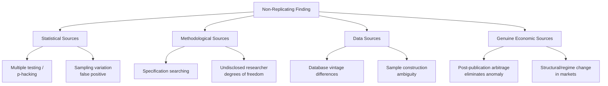

## Replication and Reproducibility in Financial Research

### Overview

Replication and reproducibility form the empirical foundation of credible financial economics research, addressing whether published findings hold up under independent scrutiny, alternative data, or re-analysis of the same data. The distinction between these related but technically different concepts—along with growing evidence of limited replicability in parts of the published literature—has made this a central methodological concern in the field over the past decade.

**Key Points**

- **Reproducibility** refers to obtaining the same results using the original data and code (a computational/verification check); **replication** refers to obtaining consistent findings using new data, a different sample period, or an independent methodology (a scientific/robustness check)
- Influential large-scale replication studies in finance and economics have found that a meaningful share of published findings do not replicate at conventional significance levels or with the originally reported magnitude, prompting field-wide reforms
- Journals, funding bodies, and professional associations have progressively strengthened data/code sharing requirements, pre-registration norms, and multiple-testing correction expectations in response to these concerns

### Reproducibility vs. Replication: Definitional Clarity

#### Reproducibility

- **Definition**: using the *same* data and the *same* method (code) as the original study to verify that the reported results can be independently regenerated
- **Purpose**: catches coding errors, undisclosed data transformations, and computational mistakes; does not test whether the underlying finding is robust or generalizable
- **Mechanism**: typically achieved via replication packages (code plus data, where licensing permits) submitted alongside publication

#### Replication

- **Definition**: using *different* data (a new sample period, different market, different but related dataset) or an *independent* implementation of the methodology to test whether the original finding holds
- **Purpose**: assesses whether a finding reflects a genuine, generalizable economic relationship or is an artifact of the specific sample, period, or implementation choices used in the original study
- **Sub-types**:
  - **Direct/exact replication**: closely follows original methodology on new data from the same population
  - **Conceptual replication**: tests the same underlying hypothesis using a different methodology or in a different but related context

$$\text{Reproducibility: Same Data + Same Method} \rightarrow \text{Same Result?}$$

$$\text{Replication: New Data or New Method} \rightarrow \text{Consistent Finding?}$$

### Landmark Replication Studies in Finance and Economics

- **Harvey, Liu, and Zhu (2016), "...and the Cross-Section of Expected Returns"**: systematically reviewed hundreds of documented return-predicting factors in the asset pricing literature, arguing that a substantial share are likely false positives once appropriate multiple-testing correction is applied, given the sheer number of factors tested across the literature (a phenomenon informally termed the "factor zoo")
- **McLean and Pontiff (2016), "Does Academic Research Destroy Stock Return Predictability?"**: examined the post-publication performance of documented return anomalies, finding that many anomalies' predictive power declines significantly after publication—consistent with either limited replicability of the original finding, publication-informed arbitrage activity reducing the mispricing, or some combination of both
- **Hou, Xue, and Zhang (2020), "Replicating Anomalies"**: conducted a large-scale replication of a broad set of documented capital market anomalies using a consistent methodology and testing framework, finding that a substantial proportion failed to replicate at conventional significance thresholds when subjected to more rigorous statistical testing
- [Inference: these studies are widely cited as central to the field's growing awareness of replication concerns; the precise proportion of "non-replicating" findings varies across studies depending on methodology and significance threshold chosen, and should not be treated as a single universally agreed figure]

### Sources of Non-Replication in Finance Research

#### Statistical Sources

- **Multiple testing / data mining**: when many hypotheses or variable specifications are tested (explicitly or implicitly across the broader literature), some fraction will appear statistically significant purely by chance at conventional thresholds (e.g., 5%); with hundreds of proposed asset pricing factors tested across the literature, a meaningful share are plausibly false positives absent correction
- **Small sample sizes and low statistical power**: findings based on limited data (short time series, small cross-sections) are more susceptible to sampling variation that does not replicate in larger or independent samples

#### Methodological Sources

- **Specification searching ("p-hacking")**: iteratively adjusting model specifications, sample filters, or variable definitions until a statistically significant result emerges, without disclosing the full set of specifications tested
- **Researcher degrees of freedom**: the many small, often reasonable-seeming choices in data cleaning, sample construction, and variable definition that collectively create substantial flexibility in how a given hypothesis can be tested, increasing the risk of unintentional overfitting to the specific sample

#### Data Sources

- **Database vintage and revisions**: commercial financial databases (Compustat, CRSP) are periodically revised; results computed on an earlier database vintage may not exactly reproduce using a later vintage due to data corrections or restatements
- **Sample construction ambiguity**: insufficiently documented sample filters (exchange listing, share class selection, outlier treatment) can make exact replication difficult even with access to the same underlying database

#### Genuine Economic Sources (Distinct from Statistical Artifacts)

- **Post-publication arbitrage**: if a documented mispricing anomaly reflects genuine, previously unexploited profit opportunity, its publication may prompt increased trading activity that arbitrages away the mispricing, causing the effect to genuinely weaken or disappear in post-publication data without implying the original finding was statistically spurious
- **Structural/regime change**: genuine shifts in market structure, regulation, or macroeconomic regime can cause a previously robust relationship to weaken or reverse, independent of any methodological flaw in the original study

### Statistical Remedies: Multiple Testing Correction

- **Bonferroni correction**: conservative adjustment dividing the significance threshold by the number of tests conducted, controlling the family-wise error rate but often overly conservative for large numbers of correlated tests common in finance
- **False Discovery Rate (FDR) control (Benjamini-Hochberg and related methods)**: controls the expected proportion of false positives among rejected null hypotheses, generally considered more appropriate than Bonferroni correction for large-scale factor testing given typical correlation structures among candidate variables
- **Harvey-Liu-Zhu multiple testing framework**: proposes a specific higher significance threshold (t-statistics well above the conventional 1.96 for a 5% two-tailed test) for newly proposed factors in asset pricing research, explicitly accounting for the cumulative number of factors already tested in the literature

$$t\text{-statistic threshold (adjusted)} > t\text{-statistic threshold (conventional 5\%)}$$

reflecting the need for a higher bar given the cumulative multiple-testing problem across the published factor literature.

### Institutional and Journal Responses

#### Data and Code Availability Requirements

- Major finance journals have progressively adopted mandatory **replication package** submission requirements—code and, where data licensing permits, the underlying data—as a condition of publication
- Some journals maintain dedicated data/code repositories (e.g., journal-hosted supplementary materials, or third-party archives such as the **AEA Data and Code Repository** model, increasingly referenced as a norm-setting example across economics and finance journals) [Unverified: specific journal-by-journal requirements vary and are updated periodically; confirm current policy against each journal's current author guidelines]

#### Pre-Registration

- **Definition**: publicly registering a study's hypotheses, sample, and planned methodology before conducting the analysis (or before accessing outcome data), formally committing to the research design in advance
- **Purpose**: directly addresses specification-searching concerns by making post-hoc researcher discretion over model choice observable and constrained
- **Adoption in finance**: less universally adopted than in some experimental social sciences, but growing particularly for studies using proprietary or newly available datasets where pre-registration is logistically feasible; some journals now explicitly invite or require pre-registration for certain study types

#### Formal Replication Verification

- A subset of journals and research initiatives have begun conducting **independent pre-publication replication checks**, where a third party (often a research assistant or dedicated replication team) attempts to reproduce key results before final publication acceptance
- Standalone replication-focused initiatives (e.g., systematic replication projects analogous to psychology's Reproducibility Project) have begun to emerge in economics/finance, though the field's replication infrastructure remains less mature than in some other empirical social sciences [Speculation: the pace and eventual scope of formal replication infrastructure adoption in finance specifically remains an evolving institutional question rather than a settled practice]

### Best Practices for Producing Replicable Research

**Key Points**

- **Full disclosure of specifications tested**: reporting the full set of specifications considered, including those that did not yield significant results, rather than selectively reporting only significant findings
- **Pre-registration where feasible**: committing to hypotheses and methodology before data analysis, particularly valuable when using novel or proprietary datasets
- **Transparent, well-documented code**: writing analysis code with clear documentation, version control, and a structure that allows an independent researcher to trace each reported result back to its generating script
- **Explicit multiple-testing acknowledgment**: for studies testing multiple related hypotheses or variable specifications, explicitly applying and reporting appropriate correction methods (FDR, adjusted significance thresholds)
- **Out-of-sample and holdout testing**: where feasible, reserving a portion of the sample or a subsequent time period as a holdout for validating a finding discovered in an initial exploratory sample, directly testing replicability within the same study
- **Robustness to reasonable alternative specifications**: proactively testing and reporting sensitivity to plausible alternative sample filters, variable definitions, and model specifications, rather than only reporting the specification yielding the strongest result

### Distinguishing Legitimate Model Refinement from Specification Searching

| Practice | Legitimate Research Iteration | Problematic Specification Searching |
| --- | --- | --- |
| Testing alternative specifications | Testing robustness of an a priori hypothesis | Searching for any specification yielding significance |
| Reporting | Reporting all specifications tested, including non-significant | Selectively reporting only significant results |
| Timing | Sample/hypothesis fixed before full-sample analysis | Hypothesis or sample adjusted after observing results |
| Theoretical grounding | Alternative specifications motivated by theory/prior literature | Specifications chosen purely to achieve significance |
| Documentation | Full disclosure of researcher degrees of freedom exercised | Undisclosed iterative refinement |

### Implications for Consuming Published Research

**Key Points**

- **Weighting evidence by replication status**: findings that have been independently replicated across multiple samples, time periods, or methodologies should generally be weighted more heavily than single-study findings, particularly for factors or effects documented only in the original discovering paper
- **Skepticism toward "too clean" results**: results with unusually strong statistical significance relative to typical effect sizes in the literature, or results that survive an implausibly large number of robustness checks without any qualification, warrant additional scrutiny
- **Awareness of the "factor zoo" problem**: newly proposed return-predicting factors should be evaluated against the backdrop of hundreds of previously proposed factors, with appropriately elevated skepticism absent strong theoretical motivation and rigorous out-of-sample or multiple-testing-adjusted validation
- **Value of replication studies themselves**: systematic replication papers (such as those cited above) are increasingly recognized as valuable scholarly contributions in their own right, not merely a check on prior work, given their role in calibrating the field's overall confidence in the published record

**Next Steps**

- The "factor zoo" problem and multiple testing correction methods in asset pricing
- Pre-registration design and implementation for empirical finance studies
- Data and code replication package construction standards
- False Discovery Rate control and Bonferroni correction in large-scale hypothesis testing
- Post-publication anomaly decay: arbitrage versus statistical artifact explanations
- Out-of-sample validation and holdout sample testing design
- Research transparency norms and journal data-sharing policy comparison