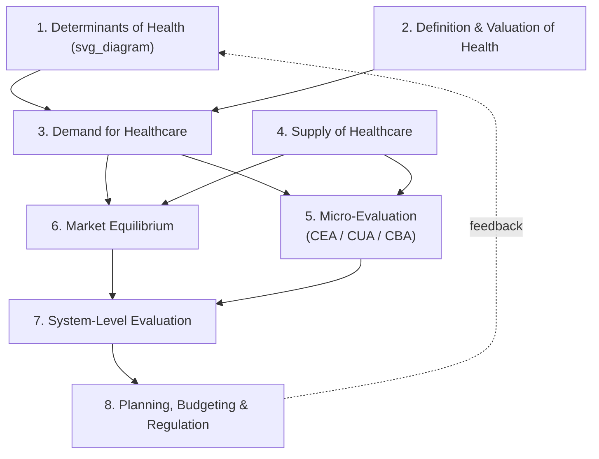

## Scope and Definition of Health Economics

### Definition

Health economics is the branch of economics concerned with how scarce resources are allocated among alternative uses in the production, distribution, and consumption of health and healthcare. It applies economic theory — particularly the theories of value, production, and welfare — to the phenomena and problems associated with the demand for and supply of health and healthcare services.

Two related but distinct concepts anchor the field:

- **Health**: a state of physical, mental, and social well-being, treated in economic terms as a durable "stock" or capital good that yields utility directly and also functions as an input into other productive activities (e.g., a healthy worker is more productive).
- **Healthcare**: the set of goods and services (physician visits, hospitalization, pharmaceuticals, diagnostics, preventive services) consumed as one of several inputs used to produce or maintain health.

This distinction matters because healthcare is a means to an end (health), not an end in itself — a point formalized in Grossman's model of health capital (discussed below).

### Scope of the Field

Health economics is often organized into a set of interlocking sub-domains. Alan Williams' "plumbing diagram" of health economics, widely used in teaching, decomposes the field into eight linked topics:

1. **What influences health** (beyond healthcare) — determinants such as genetics, lifestyle, environment, education, and income.
2. **What is health, and what is its value** — measurement of health status and health-related quality of life (e.g., QALYs).
3. **Demand for healthcare** — how individuals and populations seek care, including the role of need, insurance, and information asymmetry.
4. **Supply of healthcare** — how providers, hospitals, and firms produce healthcare services.
5. **Micro-economic evaluation at treatment level** — cost-effectiveness, cost-benefit, and cost-utility analysis of specific interventions.
6. **Market equilibrium** — how demand and supply interact, and why healthcare markets frequently fail to clear efficiently.
7. **Evaluation of healthcare systems as a whole** — macro-level performance, financing, and equity.
8. **Planning, budgeting, and regulatory mechanisms** — the policy instruments used to correct or substitute for market outcomes.

**Key Points**

- Health economics spans micro-level clinical decision-making, meso-level institutional/provider behavior, and macro-level health system financing and policy.
- It draws on welfare economics, industrial organization, labor economics, public economics, and econometrics.
- It is both a positive science (describing how health markets actually behave) and a normative one (evaluating how resources *should* be allocated, often using welfare criteria).

### Why Healthcare Markets Are "Special"

A foundational justification for health economics as a distinct sub-discipline — most influentially articulated by Kenneth Arrow (1963) — is that healthcare markets systematically violate the assumptions of a competitive market, making standard microeconomic predictions unreliable without modification. Commonly cited features include:

- **Uncertainty**: Illness onset and treatment outcomes are unpredictable, motivating the existence of health insurance.
- **Information asymmetry**: Physicians (agents) typically know more about diagnosis and appropriate treatment than patients (principals), creating the potential for **supplier-induced demand** and requiring a **principal–agent** framing of the doctor–patient relationship.
- **Externalities**: Some health interventions (e.g., vaccination, communicable disease control) generate benefits or costs to third parties not captured in market prices.
- **Public-good and quasi-public-good characteristics**: Certain health-related goods (e.g., herd immunity, sanitation, epidemiological surveillance) are non-excludable and/or non-rivalrous.
- **Restricted supply / barriers to entry**: Licensure, credentialing, and regulation constrain the number and behavior of providers, unlike free entry in competitive markets.
- **Insurance and moral hazard**: Because insurance reduces the marginal price faced by the consumer at the point of use, it alters consumption behavior — a distortion absent in most other consumer goods markets.
- **Equity considerations**: Health is widely regarded as having a claim to distribution on the basis of need rather than ability to pay, in tension with the efficiency criteria of standard welfare economics.

These features are the analytical reason health economics exists as a specialized field rather than being fully absorbed into general microeconomics.

### The Health Production Function

Health economics conceptualizes health as an output produced from multiple inputs, not solely healthcare. A simplified health production function can be written as:

$$H = f(M, L, E, G, S)$$

where $H$ is health status, $M$ is medical care, $L$ is lifestyle/behavior, $E$ is environmental quality, $G$ is genetic endowment, and $S$ is socioeconomic status (including education and income).

**Example**

Empirical decompositions of population health gains (e.g., McGinnis and Foege's widely cited U.S. estimates) attribute a relatively modest share of mortality reduction to medical care itself, with larger shares attributed to behavioral factors, social/environmental conditions, and genetics. [Inference: the precise percentage splits vary across studies, populations, and time periods, and should not be treated as fixed universal constants.]

This production-function view underlies policy arguments for investing in public health and social determinants of health rather than healthcare delivery alone.

### Grossman's Model of Health Capital

Michael Grossman's 1972 model formalizes health as a durable capital stock that:

- Depreciates over time (accelerating with age),
- Can be augmented through investment (medical care, time, lifestyle choices),
- Yields utility directly (health as a consumption good) and indirectly by increasing the time available for market work and leisure (health as an investment good).

The individual chooses an optimal investment path in health capital by weighing the marginal cost of investment against the marginal monetary and psychic returns, subject to a lifetime budget and time constraint. This model is the theoretical basis for most subsequent work on the demand for health versus the demand for healthcare, and for lifecycle analyses of health behavior (e.g., why health investment tends to decline with age even as depreciation accelerates).

### Positive vs. Normative Health Economics

- **Positive health economics** describes and predicts actual behavior: how patients respond to co-payments, how physicians respond to reimbursement schemes, how insurance affects utilization.
- **Normative health economics** evaluates outcomes against explicit value judgments, most often **efficiency** (maximizing health gain from available resources) and **equity** (fair distribution of health and healthcare access). Techniques such as cost-effectiveness analysis (CEA), cost-utility analysis (CUA), and cost-benefit analysis (CBA) belong to this normative branch.

The tension between efficiency and equity is a recurring theme: an intervention that maximizes aggregate health (efficiency-maximizing) may not be the one that most reduces health disparities (equity-maximizing), and health economists frequently must make this trade-off explicit to policymakers rather than resolve it analytically.

### Illustrative Diagram: Scope of Health Economics (Williams' Plumbing Diagram, Simplified)

### Relationship to Mainstream Economics

Health economics does not discard standard economic tools — utility maximization, production theory, general and partial equilibrium analysis, and econometric estimation all remain central. What differs is the *application context*: assumptions of perfect information, free entry, and homogeneous, storable goods (standard in textbook competitive-market models) are relaxed or replaced to reflect the empirical realities of healthcare markets described above. Health economics is therefore best understood as applied welfare and industrial-organization economics adapted to a sector with unusually strong market failures and unusually strong equity claims.

### Conclusion

The scope of health economics extends well beyond the financing of hospitals and insurance; it encompasses the determinants of health itself, the behavior of patients and providers under uncertainty and asymmetric information, the evaluation of specific interventions, and the design of whole health systems and policies. Its definition rests on treating health as a valued, producible, depreciable capital stock, and healthcare as one of several inputs — alongside behavior, environment, and genetics — used to produce that stock, all under conditions where ordinary competitive-market assumptions frequently fail.

**Related Topics**

- Kenneth Arrow's 1963 analysis of uncertainty and welfare economics in medical care
- Grossman's model of the demand for health (formal derivation and comparative statics)
- Market failure in healthcare: information asymmetry, moral hazard, and adverse selection
- Health production functions and social determinants of health
- Positive vs. normative economics applied to health policy
- Overview of economic evaluation methods: CEA, CUA, CBA
- Equity vs. efficiency trade-offs in health resource allocation
- Principal–agent theory in the physician–patient relationship