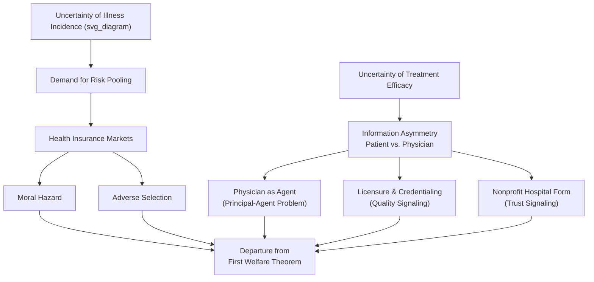

## Arrow's Uncertainty and the Welfare Economics of Medical Care

### Overview and Significance

Kenneth Arrow's 1963 paper "Uncertainty and the Welfare Economics of Medical Care" (*American Economic Review*) is widely regarded as the founding theoretical text of health economics as a distinct field. Its central claim is that the medical care market deviates so systematically from the conditions required for competitive equilibrium to yield a Pareto-optimal (welfare-maximizing) outcome that the market cannot be analyzed with the standard tools used for ordinary consumer goods. Arrow's core argument is that **uncertainty** — about the onset of illness, the efficacy of treatment, and the quality of care received — is the central organizing feature that explains most of the non-standard institutions observed in healthcare (insurance, licensure, nonprofit hospitals, the physician–patient relationship).

**Key Points**

- Arrow's paper is a welfare-economics argument, not a policy manifesto; it asks whether the invisible-hand result (competitive equilibrium implies Pareto efficiency) holds for medical care, and argues it largely does not.
- The uncertainties Arrow identifies are twofold: uncertainty in the *incidence* of disease (who gets sick, and when) and uncertainty in the *effectiveness* of treatment (whether a given intervention will actually restore health).
- Many real-world healthcare institutions (insurance, medical licensing, fee structures, nonprofit status of hospitals) are interpreted by Arrow as social/market adaptations that arose specifically to cope with these uncertainties, not as arbitrary historical accidents.

### The Two Dimensions of Uncertainty

1. **Uncertainty of demand (incidence)**: Illness is irregular and largely unpredictable at the individual level. A rational, risk-averse consumer facing a stochastic and potentially catastrophic financial loss from illness has a demand for **risk-pooling**, which is the fundamental economic rationale for health insurance.
2. **Uncertainty of product (efficacy)**: Unlike most consumer goods, the recipient of medical care typically cannot verify in advance, and often not even after the fact, whether the treatment was necessary, correctly diagnosed, or effective. This is distinct from ordinary product uncertainty because the consumer frequently lacks the technical competence to evaluate the outcome even with full information disclosure.

These two forms of uncertainty combine to produce the argument that medical care cannot be treated as a homogeneous, well-specified commodity in the sense required by Arrow–Debreu general equilibrium theory.

### Departures from the Competitive Market Ideal

Arrow catalogs several specific ways the medical care market departs from the assumptions underlying the First Welfare Theorem:

- **Asymmetric information and the agency relationship**: Physicians possess specialized knowledge patients cannot easily acquire or verify, so patients delegate decision authority to physicians, who act as their **agents**. This creates the classic **principal–agent problem**: the agent's incentives (income, reputation, workload, defensive medicine) may not perfectly align with the principal's (patient's) interests, and the patient often cannot detect divergence.
- **Trust and the non-commercial character of the physician–patient relationship**: Arrow argues that because patients cannot fully monitor quality, market norms alone (arms-length bargaining, profit maximization) are insufficient to sustain trust; professional codes of ethics, licensure, and non-pecuniary motivations partially substitute for missing market discipline.
- **Barriers to entry via licensing**: Restricting practice to licensed professionals limits supply (a departure from free entry) but is justified, in Arrow's framing, as a second-best response to the consumer's inability to verify provider quality directly — an early formalization of a **quality-signaling** rationale for occupational licensure.
- **Price discrimination and non-uniform pricing**: Historically, physicians priced services according to a patient's ability to pay rather than a uniform market price, inconsistent with a standard competitive market but consistent with a norm of ensuring access regardless of income.
- **Non-profit institutional form**: A disproportionate share of hospitals (especially historically) are organized as nonprofits rather than profit-maximizing firms. Arrow interprets this as a response to information asymmetry: patients may distrust profit-motivated providers on dimensions of care quality they cannot verify, so the nonprofit form functions as a trust-conferring signal, substituting for the missing informational competitive discipline.
- **Product uncertainty precluding a standard insurance market**: Comprehensive insurance against the cost of *all* illness is difficult to construct on ordinary actuarial principles because the "product" (successful treatment) is not homogeneous or independently verifiable, unlike, for instance, fire or life insurance where the insured event is unambiguous.

### Moral Hazard and Adverse Selection

Arrow's framework, extended significantly by subsequent literature (notably Mark Pauly's 1968 response), formalizes two distortions that arise once insurance is introduced to manage uncertainty:

- **Moral hazard**: Once insured, a consumer faces a lower marginal price at the point of use ($p_{oop} < p_{market}$), which economically rational behavior predicts will increase utilization beyond the level that would be chosen under full-price exposure. Pauly's critique clarified that this increased utilization is not necessarily irrational or wasteful — it can represent a rational response to a lower effective price — but it does create a welfare loss relative to the actuarially fair, no-insurance benchmark, because consumption is driven by moral hazard rather than genuine marginal benefit exceeding marginal social cost.

$$\text{Welfare loss} \approx \frac{1}{2} \cdot \Delta Q \cdot \Delta P$$

where $\Delta Q$ is the quantity increase induced by the price reduction from insurance and $\Delta P$ is the price wedge between the full market price and the out-of-pocket price.

- **Adverse selection**: Because individuals typically know more about their own health risk than insurers do, a single pooled premium tends to attract disproportionately higher-risk individuals (for whom the premium is a bargain) while discouraging lower-risk individuals from purchasing coverage. Left unaddressed, this can produce a classic Akerlof-style unraveling of the insurance market, ultimately justifying mechanisms such as risk adjustment, mandated pooling, or subsidized enrollment.

### Formal Welfare Framing

Arrow's underlying question can be stated in standard welfare-economics terms: does competitive equilibrium in the medical care market satisfy the conditions of the **First Fundamental Theorem of Welfare Economics** — that a competitive equilibrium is Pareto efficient? The theorem requires, among other things:

- Complete markets (a market exists, in principle, for every good and every state of nature),
- No externalities,
- Perfect information (or at least symmetric information) among transactors,
- Price-taking behavior with free entry and exit.

Arrow's contribution was to show, sector-by-sector, that medical care violates several of these conditions simultaneously — chiefly informational completeness and symmetry — and that the resulting market failure is not incidental but structural, arising from irreducible features of illness and treatment. The policy implication, made explicit in subsequent literature, is that unregulated competitive markets in healthcare should not be presumed efficient by default, unlike the presumption typically applied to goods such as agricultural commodities or consumer electronics.

### Diagram: Arrow's Causal Chain from Uncertainty to Market Institutions

### Modern Relevance and Critiques

- Arrow's framework remains the standard justification, in health policy debates, for regulating insurance markets (e.g., mandates, subsidies, risk-adjustment mechanisms) rather than relying on laissez-faire competition.
- Subsequent scholars (Pauly, Zeckhauser, and others) have refined the moral hazard concept, distinguishing "efficient" moral hazard (rational responses to genuinely lower marginal costs of treatment) from inefficient overconsumption, sharpening the normative conclusions Arrow's descriptive framework implied.
- [Inference: The precise magnitude of welfare loss from moral hazard and adverse selection is empirically contested and varies substantially by market, insurance design, and population; Arrow's paper establishes the theoretical mechanism rather than quantifying its real-world size.]
- Critics have noted that some of Arrow's institutional explanations (e.g., nonprofit hospitals as trust signals) may be less applicable in contemporary healthcare systems with more standardized quality reporting, accreditation, and consumer information tools than existed in 1963, though the underlying informational-asymmetry logic is still widely cited.

### Conclusion

Arrow's 1963 analysis established that medical care cannot be modeled as an ordinary competitive good because uncertainty — in both disease incidence and treatment efficacy — combines with pervasive information asymmetry to violate the conditions of the First Welfare Theorem. This single paper supplies the theoretical foundation for treating insurance markets, physician agency, licensure, and nonprofit hospital structures as rational (if imperfect) institutional responses to market failure, and it remains the reference point against which virtually all subsequent health economics theory on insurance, moral hazard, and adverse selection is built.

**Related Topics**

- Pauly's (1968) reformulation of moral hazard as a rational price response
- Akerlof's "market for lemons" and adverse selection in insurance
- Principal–agent theory and supplier-induced demand
- Economic rationale for occupational licensure in healthcare
- Nonprofit vs. for-profit hospital behavior
- Health insurance market design: risk adjustment, mandates, and subsidies
- The First and Second Fundamental Theorems of Welfare Economics
- Grossman's model of health capital (demand-side foundations)