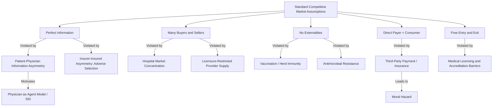

## Why Health Care Markets Differ from Standard Markets

### Overview

Standard microeconomic theory assumes that competitive markets—characterized by many buyers and sellers, perfect information, homogeneous goods, free entry and exit, and no externalities—allocate resources efficiently. Health care markets systematically violate nearly every one of these assumptions. This divergence is not incidental; it arises from structural features intrinsic to health and medical care as economic goods. Understanding these deviations is foundational to health economics as a discipline, since it explains why health care is rarely left to unregulated markets and why specialized theoretical tools (e.g., agency theory, insurance economics) are required to analyze it.

### The Standard Competitive Market Benchmark

In a textbook competitive market:

- Numerous small buyers and sellers exist, none with market power
- Products are homogeneous or buyers can easily compare substitutes
- Buyers and sellers have full information about price, quality, and outcomes
- Consumers bear the full cost and reap the full benefit of their purchases
- Entry and exit are unrestricted
- No third party is required to complete the transaction

Under these conditions, the price mechanism equates marginal benefit to marginal cost, producing Pareto-efficient allocation. Health care violates each condition, often severely.

### Key Points: Structural Failures in Health Care Markets

**1. Uncertainty and Unpredictability of Illness**

Kenneth Arrow's 1963 analysis identified uncertainty as the central feature distinguishing medical care from ordinary commodities. Illness onset, severity, and treatment need are irregular and unpredictable for any given individual, even though population-level risk can be estimated actuarially. This uncertainty:

- Creates demand for health insurance as a risk-pooling mechanism (rather than direct market purchase of care)
- Introduces a wedge between the point of consumption (illness) and the point of payment (premium), which fundamentally alters the price signal facing patients at the moment of care

**2. Information Asymmetry**

Information asymmetry is arguably the most consequential deviation. It appears in two distinct forms:

- *Between patient and physician*: Physicians possess specialized clinical knowledge that patients typically lack, making it difficult for patients to judge the necessity, quality, or appropriateness of recommended treatment. This is far more severe than typical asymmetries in consumer markets (e.g., used cars), because the "buyer" often cannot independently verify quality even after consumption (some outcomes are never fully attributable to treatment vs. natural course of disease).
- *Between insurer and insured*: Insurers cannot fully observe an individual's health risk, leading to **adverse selection** — high-risk individuals disproportionately seek coverage, potentially destabilizing insurance pools.

This asymmetry motivates the **principal-agent relationship** between physician (agent) and patient (principal), discussed further below.

**3. Supplier-Induced Demand (SID)**

Because patients rely on physicians to both diagnose need and recommend treatment, physicians occupy a dual role as both service providers and de facto purchasing agents for the patient. This creates the theoretical possibility of supplier-induced demand: physicians influencing utilization beyond what a fully-informed patient would choose, particularly under fee-for-service payment models. [Inference] The magnitude of SID in practice remains empirically contested and varies by specialty, payment system, and market structure — this should be treated as a theoretical mechanism with mixed empirical support rather than a universal, quantifiable effect.

**4. Externalities**

Health care generates externalities absent in most markets:

- *Positive externalities*: Vaccination and infectious disease treatment protect others beyond the individual treated (herd immunity)
- *Caring externalities*: Individuals may derive utility from knowing others have access to care, supporting redistributive social insurance arguments
- *Negative externalities*: Antimicrobial resistance from overuse of antibiotics affects future patients broadly

Externalities justify public intervention (subsidies, mandates) that pure market allocation would not generate.

**5. Health Care as (Partially) a Merit Good / Public Good Characteristics**

Certain components of health care — public health surveillance, sanitation, pandemic preparedness — exhibit non-rivalry and non-excludability, classic public good properties that private markets systematically undersupply. Most clinical care remains a private good, but public health functions do not.

**6. Restricted Entry and Licensure**

Unlike free-entry competitive markets, the health care labor market is deliberately restricted through licensure, accreditation, and credentialing (medical boards, residency matching, scope-of-practice laws). This is a **second-best regulatory response** to information asymmetry (patients cannot verify provider competence directly), but it also confers market power on incumbent providers, a trade-off central to health workforce economics.

**7. The Role of Third-Party Payment**

In most health systems, a third party (insurer, government payer) pays for care instead of the patient directly. This breaks the standard price mechanism:

- Patients face only partial marginal cost at the point of service (cost-sharing via copays/coinsurance), weakening price sensitivity
- This generates **moral hazard**: insured individuals may consume more care than they would if paying full price, since the marginal cost to them is below the marginal social cost
- Providers negotiate prices with payers rather than patients, further separating the "buyer" (payer) from the "consumer" (patient) and the "decision-maker" (physician)

$$MC_{social} \neq MC_{patient} \quad \text{when third-party payment exists}$$

**8. Non-Substitutability and Urgency**

For many conditions, care is not deferrable or substitutable in the way ordinary goods are (a heart attack patient cannot "shop around" or delay purchase). This limits the disciplining effect of consumer search and price comparison that underpins competitive markets.

**9. Provider Market Power and Imperfect Competition**

Hospital markets frequently exhibit high concentration (due to economies of scale, certificate-of-need laws, and network formation), granting providers pricing power over insurers. This is compounded by:

- Bundled, complex service lines that resist unbundled price shopping
- Geographic constraints limiting the number of feasible competitors, especially in rural areas

### Illustration: Deviations Mapped to Market Failure Categories

### The Agency Relationship (svg_diagram)

The physician-patient relationship is best modeled as a **principal-agent problem**: the patient (principal) delegates decision authority to the physician (agent) due to the information asymmetry described above. Whether the agent acts perfectly in the principal's interest, partially in their own financial interest, or some blend of both is a central question in physician payment design (fee-for-service vs. capitation vs. salary).

<svg xmlns="http://www.w3.org/2000/svg" viewBox="0 0 640 260">
<text x="320" y="24" font-size="14" font-weight="bold" text-anchor="middle" fill="#222">Physician-Patient Agency Relationship (svg_diagram)</text>
<rect x="30" y="70" width="160" height="70" rx="8" fill="#eaf2ff" stroke="#3b6fb6" stroke-width="1.5" />
<text x="110" y="100" font-size="13" text-anchor="middle" fill="#1a355e">Patient</text>
<text x="110" y="118" font-size="11" text-anchor="middle" fill="#1a355e">(Principal)</text>
<text x="110" y="132" font-size="10" text-anchor="middle" fill="#3b5a80">Lacks clinical knowledge</text>
<rect x="240" y="70" width="160" height="70" rx="8" fill="#eafbea" stroke="#3ba65a" stroke-width="1.5" />
<text x="320" y="100" font-size="13" text-anchor="middle" fill="#134a20">Physician</text>
<text x="320" y="118" font-size="11" text-anchor="middle" fill="#134a20">(Agent)</text>
<text x="320" y="132" font-size="10" text-anchor="middle" fill="#2c6b3f">Diagnoses + recommends treatment</text>
<rect x="450" y="70" width="160" height="70" rx="8" fill="#fff3e6" stroke="#c97b1e" stroke-width="1.5" />
<text x="530" y="100" font-size="13" text-anchor="middle" fill="#7a4a0e">Payer / Insurer</text>
<text x="530" y="118" font-size="11" text-anchor="middle" fill="#7a4a0e">(Reimburses care)</text>
<text x="530" y="132" font-size="10" text-anchor="middle" fill="#8a5d1e">Sets payment incentives</text>
<line x1="190" y1="105" x2="240" y2="105" stroke="#555" stroke-width="1.5" marker-end="url(#arrow)" />
<text x="215" y="98" font-size="9" text-anchor="middle" fill="#333">Delegates decision</text>
<line x1="320" y1="140" x2="320" y2="180" stroke="#555" stroke-width="1.5" marker-end="url(#arrow)" />
<text x="320" y="197" font-size="10" text-anchor="middle" fill="#333">Treatment decision</text>
<text x="320" y="210" font-size="9" text-anchor="middle" fill="#666">(possible supplier-induced demand)</text>
<line x1="450" y1="105" x2="400" y2="105" stroke="#555" stroke-width="1.5" marker-end="url(#arrow)" />
<text x="425" y="98" font-size="9" text-anchor="middle" fill="#333" transform="rotate(0)" />
<text x="425" y="60" font-size="9" text-anchor="middle" fill="#333">Payment method shapes incentives</text>
</svg>

### Practical Example

Consider a patient presenting with lower back pain:

1. **Information asymmetry**: The patient cannot independently determine whether an MRI, physical therapy, or watchful waiting is clinically appropriate.
2. **Agency**: The physician recommends a course of action on the patient's behalf.
3. **Third-party payment**: The patient's insurer covers most of the cost, so the patient faces only a copay, weakening the incentive to weigh the full cost of an MRI against its marginal diagnostic value.
4. **Possible SID**: If the physician has a financial stake in an imaging facility (fee-for-service, self-referral), the recommendation may be influenced by revenue incentives rather than clinical necessity alone. [Inference] Whether this occurs in a specific case cannot be verified from market structure alone; it is a systemic risk that varies by payment arrangement and regulatory context (e.g., self-referral / "Stark Law" type restrictions in some jurisdictions).
5. **Outcome uncertainty**: Even after treatment, it may be unclear whether recovery resulted from the intervention or the natural resolution of the condition, limiting the patient's ability to retrospectively evaluate quality.

This chain illustrates how multiple market deviations compound within a single clinical encounter, each independently sufficient to invalidate the standard competitive market model.

### Policy Implications

These deviations collectively explain recurring features of health policy across countries:

- Mandatory insurance or single-payer systems (addressing adverse selection and risk pooling)
- Licensure and quality regulation (addressing information asymmetry patients cannot resolve alone)
- Cost-sharing design—deductibles, copays (addressing moral hazard)
- Public financing of vaccination and public health surveillance (addressing positive externalities and public-good characteristics)
- Antitrust scrutiny of hospital mergers (addressing provider market power)
- Practice guidelines, second-opinion requirements, utilization review (addressing supplier-induced demand risk)

**Related Topics**

- Arrow's 1963 theory of medical care uncertainty
- Moral hazard and cost-sharing design (deductibles, coinsurance)
- Adverse selection and risk adjustment in insurance markets
- Supplier-induced demand: theory and empirical evidence
- Principal-agent theory applied to physician payment models
- Externalities in public health (vaccination, antimicrobial resistance)
- Market concentration and hospital merger economics
- Licensure, credentialing, and scope-of-practice regulation
- Grossman model of health as human capital
- Comparative health system financing structures (Beveridge, Bismarck, single-payer)