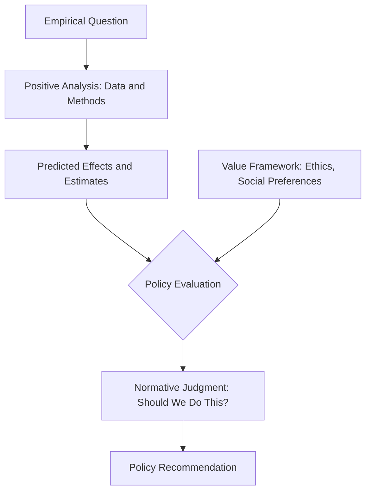

## Positive versus Normative Analysis in Health Policy

### Definitions

**Positive Analysis**

Positive analysis is concerned with objective, empirically testable statements about how the healthcare system actually functions or is predicted to function. Positive statements describe "what is" or "what will be" and can, in principle, be verified or refuted using data. They do not depend on the values of the person making the claim.

**Normative Analysis**

Normative analysis is concerned with value-based statements about how the healthcare system *should* function. Normative statements incorporate ethical judgments, social values, and preferences about outcomes, and cannot be resolved by data alone because they rest on subjective premises about what is desirable or fair.

### Core Distinction

| Dimension | Positive Analysis | Normative Analysis |
| --- | --- | --- |
| Core question | "What is/will happen?" | "What ought to happen?" |
| Basis | Facts, data, testable hypotheses | Values, ethics, social preferences |
| Verifiability | Empirically testable | Not empirically resolvable |
| Example domain | Cost-effectiveness estimates | Justice in resource allocation |
| Role of economist | Analyst/scientist | Advisor/advocate |
| Disagreement source | Data quality, methodology | Underlying value systems |

### Illustrative Examples in Health Policy

**Example**

- Positive: "A $1 increase in the cigarette excise tax reduces smoking prevalence by 2%." — This is an empirical claim, testable using observational or quasi-experimental data.
- Normative: "The government should tax cigarettes to discourage smoking." — This depends on value judgments about paternalism, individual liberty, and the acceptable role of the state in shaping behavior.
- Positive: "Expanding Medicaid eligibility increases emergency department utilization among newly insured populations in the short run."
- Normative: "Medicaid eligibility should be expanded because healthcare is a human right."
- Positive: "Countries with single-payer systems spend a lower share of GDP on healthcare administration than the U.S. multi-payer system."
- Normative: "Countries should adopt single-payer systems because equitable access matters more than consumer choice."

### Why the Distinction Matters

**Key Points**

- Positive analysis provides the evidence base (magnitudes, causal effects, forecasts) that policymakers use as inputs.
- Normative analysis supplies the value framework (efficiency vs. equity, liberty vs. paternalism) used to judge whether those inputs justify a policy choice.
- Conflating the two can disguise value judgments as "objective" findings, undermining transparent policy debate. A cost-effectiveness ratio (positive) does not by itself dictate a funding decision (normative), since that requires a judgment about what a "good" tradeoff is (e.g., willingness-to-pay thresholds such as $50,000/QALY are themselves normative conventions, not natural constants).
- Much of applied health economics operationalizes normative goals (e.g., "maximize social welfare") using positive tools (e.g., econometric estimation of demand elasticities), so most real policy analysis blends both.

### Positive Analysis in Practice: Methodological Toolkit

Positive health economics relies on empirical and theoretical tools designed to isolate causal relationships or accurately describe system behavior:

- **Demand estimation**: price and income elasticities of healthcare demand
- **Program evaluation**: randomized controlled trials (RCTs), difference-in-differences, instrumental variables, regression discontinuity
- **Cost estimation**: costing studies, econometric cost functions
- **Forecasting**: actuarial and epidemiological projection models
- **Market structure analysis**: measuring provider concentration, insurer market power (e.g., HHI indices)

[Inference] The relative weight given to positive versus normative reasoning in a given health economics paper is not always explicit, and readers must often infer which claims are empirical versus value-laden based on framing and supporting evidence.

### Normative Analysis in Practice: Frameworks

Normative health economics draws on distinct ethical and welfare frameworks, which frequently generate conflicting policy recommendations:

- **Welfarism**: Judges outcomes solely by their effect on individual utility; underlies standard cost-benefit analysis.
- **Extra-welfarism**: Focuses on health as the maximand (e.g., QALYs) rather than general utility, common in health technology assessment (e.g., NICE in the UK).
- **Egalitarianism**: Prioritizes equal access or equal health outcomes regardless of efficiency costs.
- **Rawlsian/maximin**: Prioritizes improving the position of the worst-off members of society.
- **Libertarian**: Prioritizes individual liberty and voluntary exchange, minimizing state intervention.

### The Efficiency-Equity Tradeoff as a Normative Fault Line

A recurring normative tension in health policy is between:

- **Efficiency**: Maximizing aggregate health or welfare from limited resources (often measured via cost per QALY).
- **Equity**: Distributing health resources fairly across populations, which may require accepting some efficiency loss.

$$\text{Social Welfare} = f(\text{Efficiency}, \text{Equity})$$

The functional form of $f(\cdot)$ — how much weight to place on equity relative to efficiency — is itself a normative choice, not something derivable from data.

### Diagram: Positive-Normative Flow in Policy Formation

### Common Pitfalls

**Key Points**

- **Naturalistic fallacy**: Assuming that because something *is* the case, it *ought* to be the case (e.g., "the market allocates organs efficiently, therefore markets for organs are desirable").
- **Value-laden framing of positive claims**: Presenting a normatively contested threshold (e.g., a specific QALY cost-effectiveness cutoff) as though it were an objective fact.
- **Ignoring distributional effects**: A policy can be positively efficient (raises aggregate welfare) while being normatively troubling if the gains and losses fall unevenly across subgroups.
- **False consensus in economics**: Disagreement among health economists is frequently rooted in differing normative premises, not differing empirical findings, even though debates are often presented as purely technical.

### Application: Cost-Effectiveness Analysis (CEA) as a Hybrid Exercise

CEA is a useful case study because it explicitly combines both modes:

1. **Positive component**: Estimating costs and health outcomes (e.g., QALYs gained) of an intervention using clinical trial and observational data.
2. **Normative component**: Setting or applying a willingness-to-pay threshold (e.g., $50,000–$150,000 per QALY in U.S. practice, or a fixed threshold used by NICE) and deciding whether the intervention "should" be funded based on that threshold.

$$\text{ICER} = \frac{C_1 - C_0}{E_1 - E_0}$$

where $C_1, C_0$ are the costs and $E_1, E_0$ are the health effects (e.g., QALYs) of the new and comparator interventions, respectively. The ICER itself is a positive calculation; the decision of whether an ICER is "acceptable" is normative.

[Unverified] Specific numeric thresholds cited for cost-effectiveness (e.g., $50,000/QALY) vary by jurisdiction, payer, and time period, and should be treated as illustrative conventions rather than fixed universal standards.

### Related Topics

- Welfare economics and social welfare functions
- Quality-Adjusted Life Years (QALYs) and health utility measurement
- Cost-effectiveness analysis and incremental cost-effectiveness ratios (ICERs)
- Equity-efficiency tradeoffs in resource allocation
- Health technology assessment (HTA) frameworks (e.g., NICE, ICER Institute)
- Market failure and the rationale for government intervention in healthcare
- Paternalism versus consumer sovereignty in health policy
- Distributive justice theories applied to healthcare (Rawlsian, utilitarian, libertarian)