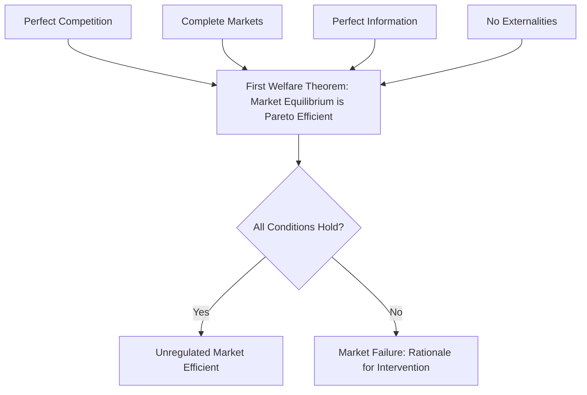

## Welfare Economics and Market Efficiency

### Definitions

**Welfare Economics**

Welfare economics is the branch of economics that evaluates the desirability of alternative economic states based on their effects on social welfare, typically defined as some aggregation of individual utilities or well-being. In health economics, it provides the theoretical foundation for judging whether a given allocation of healthcare resources is "efficient" or "good" for society.

**Market Efficiency**

Market efficiency, in the welfare-economic sense (allocative efficiency), refers to a state in which resources are allocated such that it is impossible to reallocate them to make one person better off without making another person worse off. This is formally known as Pareto efficiency.

### Foundational Concepts

**Key Points**

- **Pareto Efficiency**: An allocation is Pareto efficient if no reallocation can improve one individual's welfare without reducing another's.
- **Pareto Improvement**: A reallocation that makes at least one person better off without making anyone worse off.
- **First Welfare Theorem**: Under specific conditions (perfect competition, complete markets, no externalities, no information asymmetries), a competitive market equilibrium is Pareto efficient.
- **Second Welfare Theorem**: Any Pareto efficient allocation can be achieved as a competitive equilibrium through appropriate lump-sum redistribution of initial endowments, then allowing markets to operate.
- **Social Welfare Function (SWF)**: A theoretical construct aggregating individual utilities into a single social welfare measure, $W = f(U_1, U_2, ..., U_n)$, used to rank different allocations, including those that are not Pareto comparable.

### The First Welfare Theorem: Conditions for Efficiency

For unregulated markets to achieve Pareto efficiency, several conditions must hold simultaneously:

1. **Perfect competition**: Many buyers and sellers, none with market power
2. **Complete markets**: Markets exist for all goods and services, including risk (insurance)
3. **Perfect information**: Buyers and sellers have full knowledge of prices, quality, and outcomes
4. **No externalities**: Consumption or production does not impose uncompensated costs/benefits on third parties
5. **No public goods problem**: Goods are excludable and rival in consumption

[Inference] Healthcare markets are widely characterized in the literature as failing to satisfy most or all of these conditions simultaneously, which is why the First Welfare Theorem's efficiency result is generally treated as inapplicable to unregulated healthcare markets without significant qualification.

### Market Failure in Healthcare: Departures from the Ideal

Healthcare markets systematically violate the conditions required for the First Welfare Theorem, providing the standard economic rationale for government intervention:

| Condition Violated | Healthcare Manifestation |
| --- | --- |
| Perfect information | Information asymmetry between physicians and patients (agency problem); patients often cannot assess quality or necessity of care |
| Complete markets | Missing or incomplete insurance markets due to adverse selection |
| No externalities | Positive externalities from vaccination (herd immunity); negative externalities from untreated infectious disease |
| Perfect competition | Provider market power due to geographic monopolies, licensing barriers, hospital consolidation |
| Rational, informed consumers | Bounded rationality in complex, emotionally charged, infrequent purchase decisions (e.g., choosing a surgeon) |

### Diagram: Conditions Linking Competitive Markets to Efficiency

### Efficiency Concepts Applied to Healthcare

**Allocative Efficiency**

Achieved when resources are distributed across healthcare and other goods such that the marginal benefit of healthcare spending equals its marginal cost (or equals the marginal benefit of spending in alternative sectors).

$$MB_{health} = MC_{health}$$

**Technical (Productive) Efficiency**

Achieved when a given level of health output is produced at the lowest possible cost, without waste in the production process itself (e.g., minimizing input costs for a given number of successful treatments).

**Dynamic Efficiency**

Concerns whether the health system generates an appropriate rate of innovation over time (e.g., investment in new drugs, medical technology), balancing current access against incentives for future R&D.

### Kaldor-Hicks Efficiency: Beyond Strict Pareto

Because most real-world health policy changes create both winners and losers (failing the strict Pareto standard), economists commonly apply the **Kaldor-Hicks criterion**: a change is efficient if the winners could *hypothetically* compensate the losers and still be better off, even if compensation does not actually occur.

**Example**

A national formulary reform that lowers drug prices benefits patients and payers but reduces manufacturer revenue. If the aggregate welfare gain to patients/payers exceeds the loss to manufacturers, the policy is Kaldor-Hicks efficient — even though manufacturers are not compensated. This criterion underlies most cost-benefit analysis in applied health policy, since actual compensation is rarely implemented.

### Externalities in Healthcare: A Core Efficiency Problem

**Positive Externality Example**

Vaccination against a communicable disease benefits the vaccinated individual (private benefit) and also reduces transmission risk to others (external benefit). A competitive market, driven only by private marginal benefit, will under-produce vaccination relative to the socially optimal level.

$$MSB = MPB + MEB$$

where $MSB$ is marginal social benefit, $MPB$ is marginal private benefit, and $MEB$ is marginal external benefit. Efficient provision requires $MSB = MC$, not $MPB = MC$, which is what an unregulated market delivers.

### Diagram: Market Failure from Positive Externality (svg_diagram)

<svg xmlns="http://www.w3.org/2000/svg" viewBox="0 0 620 420">
<text x="310" y="25" font-size="16" font-weight="bold" text-anchor="middle">Vaccination Market: Positive Externality (svg_diagram)</text>
<line x1="80" y1="360" x2="80" y2="50" stroke="black" stroke-width="2" />
<line x1="80" y1="360" x2="560" y2="360" stroke="black" stroke-width="2" />
<text x="40" y="55" font-size="13">Price</text>
<text x="540" y="385" font-size="13">Quantity</text>
<line x1="80" y1="340" x2="500" y2="90" stroke="#1f77b4" stroke-width="2" />
<text x="480" y="85" font-size="12" fill="#1f77b4">Supply (MC)</text>
<line x1="80" y1="120" x2="380" y2="340" stroke="#d62728" stroke-width="2" />
<text x="385" y="345" font-size="12" fill="#d62728">MPB (private demand)</text>
<line x1="80" y1="70" x2="460" y2="340" stroke="#2ca02c" stroke-width="2" />
<text x="440" y="65" font-size="12" fill="#2ca02c">MSB = MPB + MEB</text>
<line x1="290" y1="360" x2="290" y2="205" stroke="gray" stroke-dasharray="4" />
<text x="270" y="378" font-size="12">Q_market</text>
<line x1="360" y1="360" x2="360" y2="165" stroke="gray" stroke-dasharray="4" />
<text x="345" y="378" font-size="12">Q_optimal</text>
<circle cx="290" cy="205" r="4" fill="black" />
<circle cx="360" cy="165" r="4" fill="black" />
<path d="M 290 205 L 360 205 L 360 165 Z" fill="orange" fill-opacity="0.4" />
<text x="295" y="195" font-size="11">Deadweight loss</text>
</svg>

The shaded region represents the welfare loss from underproduction: the market settles at $Q_{market}$ (where $MPB = MC$) rather than the socially efficient $Q_{optimal}$ (where $MSB = MC$).

### Equity Considerations Within Welfare Economics

Standard welfare economics is primarily concerned with efficiency, but health policy analysis typically layers equity considerations on top:

- **Utilitarian SWF**: $W = \sum_i U_i$ — treats a dollar of welfare equally regardless of who receives it, which can justify inequality if it maximizes total welfare.
- **Rawlsian (maximin) SWF**: $W = \min(U_1, U_2, ..., U_n)$ — social welfare is judged solely by the worst-off individual's utility.
- **Atkinson-type SWFs**: Incorporate an inequality-aversion parameter, interpolating between pure utilitarian and more egalitarian weightings.

[Speculation] The choice of SWF form is sometimes treated in applied policy work as a technical modeling decision, but it is fundamentally a normative choice about how much society should value equality versus aggregate welfare, and different plausible choices can reverse policy rankings.

### Application: Evaluating Insurance Market Efficiency

Health insurance markets are a canonical case study in welfare economics because of adverse selection:

1. Insurers cannot perfectly observe individual risk (information asymmetry)
2. High-risk individuals are more likely to purchase (or over-purchase) insurance
3. Insurers respond by raising premiums for all
4. Low-risk individuals may exit the market ("adverse selection death spiral")
5. Equilibrium may be inefficient or markets may unravel entirely (Akerlof-type outcome)

This is a canonical justification, grounded in welfare economics, for mandates, subsidies, or public insurance provision as efficiency-improving interventions, not purely redistributive ones.

### Limitations of the Welfare-Economic Framework

**Key Points**

- Assumes utility is at least ordinally, and often cardinally, measurable and interpersonally comparable — a strong and contested assumption.
- Pareto efficiency says nothing about the fairness of the initial distribution of resources; a highly unequal allocation can still be Pareto efficient.
- Real-world policy evaluation almost always requires normative judgments (e.g., choice of SWF, discount rates, distributional weights) that go beyond what positive welfare theorems can resolve.
- Behavioral economics has raised significant challenges to the rational-actor assumptions underlying standard welfare analysis, particularly relevant in healthcare decision-making under stress, pain, or urgency.

### Related Topics

- Positive versus normative analysis in health policy
- Market failure and externalities in healthcare
- Information asymmetry and the principal-agent problem in medicine
- Adverse selection and moral hazard in health insurance
- Social welfare functions and distributive justice
- Cost-benefit analysis and the Kaldor-Hicks criterion
- Public goods and healthcare (e.g., disease surveillance, public health infrastructure)
- Behavioral economics critiques of rational-choice welfare theory