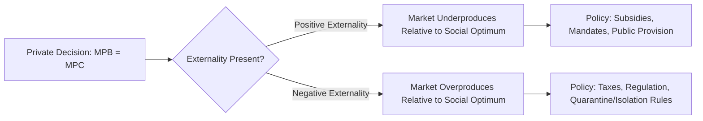

## Externalities and Public Goods in Health Care

### Definitions

**Externality**

An externality occurs when the production or consumption of a good creates costs or benefits that spill over to third parties not directly involved in the transaction, and which are not reflected in the market price.

**Public Good**

A public good is a good characterized by two properties: **non-excludability** (individuals cannot be effectively prevented from consuming it) and **non-rivalry** (one person's consumption does not diminish another's ability to consume it).

### Classification of Externalities

| Type | Definition | Healthcare Example |
| --- | --- | --- |
| Positive consumption externality | A third party benefits from an individual's consumption | Vaccination reducing disease transmission risk to others |
| Negative consumption externality | A third party is harmed by an individual's consumption | Secondhand smoke; spread of untreated infectious disease |
| Positive production externality | A third party benefits from a firm's production activity | Hospital-based research generating spillover medical knowledge |
| Negative production externality | A third party is harmed by a firm's production activity | Pharmaceutical manufacturing waste contaminating water supplies |

### Why Externalities Cause Market Failure

In an unregulated market, private actors equate marginal private benefit (MPB) to marginal private cost (MPC), ignoring external effects. Efficient allocation, by contrast, requires equating marginal *social* benefit (MSB) to marginal *social* cost (MSC).

$$MSB = MPB + MEB, \quad MSC = MPC + MEC$$

where $MEB$ and $MEC$ denote marginal external benefit and marginal external cost, respectively. Efficiency requires:

$$MSB = MSC$$

**Key Points**

- Positive externalities (e.g., vaccination) lead to **underproduction/underconsumption** relative to the social optimum, since private decision-makers ignore benefits accruing to others.
- Negative externalities (e.g., untreated infectious disease, antimicrobial resistance from overprescription) lead to **overproduction/overconsumption** relative to the social optimum, since private decision-makers ignore costs imposed on others.

### Diagram: Externality Wedge Between Private and Social Optimum

### Case Study: Vaccination as a Positive Externality

**Example**

An individual's decision to vaccinate is based on personal protection (private benefit) weighed against cost, inconvenience, and perceived risk. It does not account for the **herd immunity** effect — reduced transmission probability for the entire population once vaccination coverage exceeds a critical threshold.

$$V_c = 1 - \frac{1}{R_0}$$

where $V_c$ is the critical vaccination coverage threshold and $R_0$ is the basic reproduction number of the pathogen. Below $V_c$, disease can still spread through the population; the externality benefit is nonlinear and threshold-dependent, which is [Inference] a key reason herd-immunity externalities are harder to internalize via simple per-unit subsidies than more linear externality cases.

**Standard Policy Responses**

- Subsidizing or fully funding vaccination (lowering private cost below social cost)
- School-entry vaccination mandates (converting a voluntary choice into a quasi-requirement)
- Public information campaigns to correct information gaps that suppress private demand below even the private optimum

### Case Study: Antimicrobial Resistance as a Negative Externality

Antibiotic use generates a negative externality: each individual course of treatment marginally contributes to population-level resistance evolution, a cost not borne by the prescribing physician or patient.

**Key Points**

- Private decision-makers (patients, physicians) do not internalize the future cost imposed on all future patients who may face resistant infections.
- This is a case of a **dynamic, cumulative externality** — the external cost compounds over time and is not fully realized within the transaction period.
- Standard policy responses include antimicrobial stewardship programs, prescribing restrictions, and (in some proposals) Pigouvian-style taxes or reimbursement adjustments on antibiotic use.

### Pigouvian Correction Framework

A **Pigouvian tax or subsidy** is a standard theoretical tool to internalize externalities by setting a per-unit tax/subsidy equal to the marginal external cost/benefit at the socially optimal quantity.

$$t^* = MEC(Q^*) \quad \text{or} \quad s^* = MEB(Q^*)$$

**Example**

A tobacco excise tax set (in theory) equal to the marginal external cost of smoking (secondhand smoke exposure, uncompensated healthcare costs borne by public insurance) is a Pigouvian tax. [Unverified] In practice, calibrating $t^*$ precisely to $MEC(Q^*)$ is difficult because external costs are hard to measure with precision, and actual tobacco tax rates are set through a mix of empirical estimation and political/fiscal considerations rather than a single clean externality calculation.

### Public Goods in Health Care

Few healthcare services are *pure* public goods, but several important categories closely approximate the concept:

| Service | Non-Excludable? | Non-Rival? | Classification |
| --- | --- | --- | --- |
| Disease surveillance systems | Yes | Yes | Pure public good |
| Basic biomedical research (published) | Yes (once published) | Yes | Pure public good |
| Public health information campaigns | Yes | Yes | Pure public good |
| Mosquito control / vector abatement | Largely yes (within area) | Largely yes | Near-public good |
| Individual medical treatment | No | No | Private good |
| Vaccination (individual dose) | No (individual) | No (individual) | Private good with externality, not a public good itself |

**Key Points**

- It is a common conceptual error to classify vaccination itself as a "public good" — an individual vaccine dose is excludable and rival (only one person can receive it, and non-payers can be excluded). Vaccination generates a positive *externality* that has public-good-*like* properties at the population level (herd immunity benefits are non-excludable and non-rival among the unvaccinated), but the underlying service is a private good with a spillover effect, not a pure public good.
- Genuinely pure public goods in healthcare are relatively rare — disease surveillance, epidemiological research, and public health infrastructure are the clearest examples.

### The Free-Rider Problem

Because public goods are non-excludable, individuals have an incentive to consume without contributing to their cost, since they cannot be prevented from benefiting regardless of payment ("free-riding"). This leads to systematic **underprovision** of public goods by private markets, since no single private actor can capture enough of the benefit to justify the cost of provision.

$$\text{Socially Optimal Provision: } \sum_i MB_i = MC$$

This is the **Samuelson condition** for public goods — efficient provision requires summing marginal benefits *vertically* across all individuals (since consumption is non-rival), in contrast to private goods where market demand is the *horizontal* sum of individual demand curves.

### Diagram: Private Good vs. Public Good Demand Aggregation (svg_diagram)

<svg xmlns="http://www.w3.org/2000/svg" viewBox="0 0 620 360">
<text x="310" y="25" font-size="16" font-weight="bold" text-anchor="middle">Aggregation of Demand: Private vs Public Goods (svg_diagram)</text>
<text x="150" y="55" font-size="13" font-weight="bold" text-anchor="middle">Private Good (horizontal sum)</text>
<line x1="60" y1="300" x2="60" y2="70" stroke="black" stroke-width="1.5" />
<line x1="60" y1="300" x2="280" y2="300" stroke="black" stroke-width="1.5" />
<line x1="60" y1="150" x2="140" y2="290" stroke="#1f77b4" stroke-width="2" />
<text x="60" y="145" font-size="11" fill="#1f77b4">D1</text>
<line x1="60" y1="150" x2="230" y2="290" stroke="#2ca02c" stroke-width="2" />
<text x="185" y="270" font-size="11" fill="#2ca02c">D1+D2 (market)</text>
<text x="450" y="55" font-size="13" font-weight="bold" text-anchor="middle">Public Good (vertical sum)</text>
<line x1="360" y1="300" x2="360" y2="70" stroke="black" stroke-width="1.5" />
<line x1="360" y1="300" x2="580" y2="300" stroke="black" stroke-width="1.5" />
<line x1="360" y1="250" x2="560" y2="130" stroke="#1f77b4" stroke-width="2" />
<text x="565" y="130" font-size="11" fill="#1f77b4">MB1</text>
<line x1="360" y1="300" x2="480" y2="90" stroke="#2ca02c" stroke-width="2" />
<text x="440" y="85" font-size="11" fill="#2ca02c">MB1+MB2 (social)</text>
</svg>

### Application: Government Roles Motivated by Externalities and Public Goods

**Next Steps**

Standard economic rationales for public sector involvement in healthcare, derived directly from externality and public-good theory:

- **Direct public provision**: Disease surveillance, public health laboratories, epidemic preparedness infrastructure
- **Subsidization**: Vaccination programs, prenatal care (positive externalities on child health and future productivity)
- **Taxation**: Tobacco, alcohol, and sugar-sweetened beverage taxes (negative externality correction)
- **Regulation and mandates**: Quarantine and isolation authority during outbreaks, vaccination requirements for school entry
- **Funding of basic research**: Government and philanthropic funding of biomedical research, justified by the non-excludable, non-rival nature of resulting scientific knowledge once published

### Related Topics

- Welfare economics and market efficiency
- Pigouvian taxation and subsidy design
- Herd immunity and epidemiological threshold models
- Free-rider problem and public goods provision mechanisms
- Government intervention rationales in health systems
- Antimicrobial resistance economics
- Cost-benefit analysis of public health interventions
- Global health public goods (pandemic preparedness, international disease surveillance)