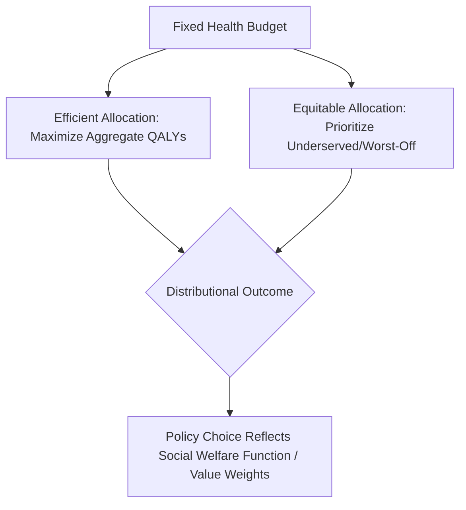

## Equity-Efficiency Tradeoffs in Health Policy

### Definitions

**Efficiency**

In health policy, efficiency refers to maximizing aggregate health or welfare outcomes from a given set of resources, without regard to how those outcomes are distributed across the population. It is typically operationalized via allocative efficiency (resources directed to their highest-value use) and technical efficiency (minimizing cost for a given output).

**Equity**

Equity refers to the fairness of the distribution of healthcare resources, access, or outcomes across individuals or groups, generally with reference to need, rather than ability to pay or other morally arbitrary factors. Equity is a normative concept and admits multiple, sometimes conflicting, definitions.

### Why a Tradeoff Exists

Efficiency-maximizing allocations direct resources toward interventions with the highest marginal return per unit of expenditure (e.g., highest QALYs gained per dollar). This can conflict with equity because:

- The highest-return interventions may not be the ones benefiting the worst-off or most disadvantaged populations
- Efficient targeting may concentrate resources on populations that are already relatively advantaged (e.g., healthier, easier to reach, better insured)
- Achieving greater equality of access or outcomes (e.g., extending services to rural or low-income populations) often costs more per unit of health gained than serving already well-served populations

**Key Points**

- The tradeoff is not absolute in every case — some interventions are both efficient and equity-improving (e.g., low-cost, high-impact primary prevention in underserved populations). The tradeoff becomes binding specifically when the most efficient use of a marginal resource differs from the most equity-improving use.
- Distinguishing **equity of access** (ability to obtain care), **equity of utilization** (actual use, adjusted for need), and **equity of outcomes** (final health status) matters because a policy can improve one dimension while leaving others unchanged.

### Types of Equity Relevant to Health Policy

| Concept | Definition |
| --- | --- |
| Horizontal equity | Equal treatment of individuals with equal need |
| Vertical equity | Appropriately unequal (differential) treatment of individuals with unequal need |
| Equality of access | Equal opportunity to obtain care, regardless of whether care is used |
| Equality of utilization | Equal use of services after adjusting for need |
| Equality of outcomes | Equal health status or results across groups |
| Equality of financial contribution | Payment for healthcare proportional to ability to pay (e.g., progressive financing) |

### Formal Representation of the Tradeoff

A stylized **social welfare function (SWF)** incorporating both efficiency and equity concerns can be written as:

$$W = \sum_i U_i - \lambda \cdot I(U_1, U_2, ..., U_n)$$

where $\sum_i U_i$ represents aggregate welfare (the efficiency component), $I(\cdot)$ is an inequality index (e.g., a health-specific Gini or Atkinson-type measure), and $\lambda \geq 0$ represents society's degree of inequality aversion. When $\lambda = 0$, the SWF reduces to a pure utilitarian (efficiency-only) criterion; as $\lambda$ increases, more weight is placed on reducing inequality, even at some cost to aggregate welfare.

[Speculation] The specific value of $\lambda$ appropriate for any given health system is not derivable from data alone and reflects a underlying societal value judgment, meaning different plausible choices of $\lambda$ can reverse the ranking of competing policies.

### Diagram: The Equity-Efficiency Possibility Frontier

### Illustrative Frontier (svg_diagram)

<svg xmlns="http://www.w3.org/2000/svg" viewBox="0 0 600 400">
<text x="300" y="25" font-size="16" font-weight="bold" text-anchor="middle">Equity-Efficiency Possibility Frontier (svg_diagram)</text>
<line x1="80" y1="350" x2="80" y2="60" stroke="black" stroke-width="2" />
<line x1="80" y1="350" x2="540" y2="350" stroke="black" stroke-width="2" />
<text x="20" y="200" font-size="13" transform="rotate(-90 20 200)">Equity</text>
<text x="290" y="380" font-size="13">Aggregate Health Gain (Efficiency)</text>
<path d="M 100 340 Q 250 330 350 250 Q 450 150 520 80" fill="none" stroke="#1f77b4" stroke-width="2.5" />
<text x="380" y="200" font-size="11" fill="#1f77b4">Frontier (max attainable combinations)</text>
<circle cx="500" cy="100" r="5" fill="#d62728" />
<text x="440" y="90" font-size="11" fill="#d62728">Efficiency-max point</text>
<circle cx="150" cy="320" r="5" fill="#2ca02c" />
<text x="155" y="335" font-size="11" fill="#2ca02c">Equity-max point</text>
<circle cx="330" cy="260" r="5" fill="black" />
<text x="335" y="255" font-size="11">Feasible compromise</text>
<circle cx="250" cy="220" r="4" fill="gray" />
<text x="180" y="215" font-size="10" fill="gray">Interior/inefficient point</text>
</svg>

Points on the frontier represent Pareto-efficient combinations of aggregate health gain and equity for a given budget; points inside the frontier are attainable but wasteful (both efficiency and equity could be improved simultaneously), while points outside are infeasible given current resources and technology.

### Applied Examples

**Example**

- **Efficient but potentially inequitable**: Allocating a fixed vaccination budget entirely to the geographic region with the lowest cost-per-dose logistics, even if that region already has comparatively high baseline health status.
- **Equitable but potentially less efficient**: Mandating equal per-capita health spending across regions regardless of differing costs of service delivery (e.g., higher costs to reach rural or remote populations), which may reduce total health gained system-wide compared to a needs- or cost-based allocation.
- **QALY-based priority-setting critique**: Standard cost-per-QALY thresholds used in health technology assessment can systematically disadvantage treatments for rare diseases, disabilities, or elderly populations (where QALY gains per treatment are mechanically smaller), raising equity objections even when the ranking is efficiency-optimal by construction.

### Distributional Weighting: Reconciling the Two Objectives

**Key Points**

One methodological approach to formally blend equity and efficiency is to apply distributional weights to health gains accruing to different subgroups, rather than treating a QALY (or a dollar of benefit) as having identical social value regardless of recipient.

$$W = \sum_i w_i \cdot \Delta H_i$$

where $\Delta H_i$ is the health gain to group $i$ and $w_i$ is a distributional weight (e.g., $w_i > 1$ for disadvantaged groups, reflecting a societal judgment that health gains to worse-off populations carry greater social value).

- Distributional cost-effectiveness analysis (DCEA) operationalizes this approach, extending standard CEA by explicitly modeling how costs and health effects fall across socioeconomic or demographic subgroups.
- [Unverified] The specific numerical weights $w_i$ used in DCEA applications vary substantially by study and jurisdiction, and no single "correct" weighting scheme has achieved consensus adoption; this remains an active area of methodological development.

### Institutional Approaches to the Tradeoff

| Mechanism | How It Addresses the Tradeoff |
| --- | --- |
| Universal Health Coverage (UHC) | Prioritizes equity of access as a baseline constraint, within which efficiency is pursued |
| Needs-based capitation formulas | Adjust resource allocation for population health need, blending efficiency (targeted spending) with equity (need-based, not demand-based) |
| QALY caps / equity weighting in HTA | Modify pure cost-effectiveness rankings with equity considerations (e.g., NICE's "severity modifier") |
| Progressive health financing | Addresses equity in the *payment* dimension separately from equity in the *benefit* dimension |
| Safety-net programs (e.g., Medicaid) | Explicitly sacrifice some system-wide efficiency to guarantee a baseline level of access for low-income populations |

### Why This Tradeoff Cannot Be "Solved" Analytically

**Key Points**

- The Second Welfare Theorem shows that, in principle, any point on the equity-efficiency frontier can be reached through the correct combination of lump-sum redistribution plus efficient market operation — but healthcare markets rarely allow costless lump-sum redistribution (redistribution mechanisms like taxation are themselves distortionary).
- Positive analysis can describe the shape and location of the tradeoff frontier (data on costs, health effects by subgroup), but selecting a specific point on that frontier requires a normative judgment about the relative social value of equity versus aggregate efficiency — this is not resolvable by economic analysis alone.
- Cross-national variation in health system design (e.g., UK NHS vs. U.S. multi-payer system) is frequently interpreted in the literature as reflecting differing societal weights placed on equity relative to efficiency and consumer choice, rather than differing technical knowledge of what is efficient.

### Related Topics

- Positive versus normative analysis in health policy
- Welfare economics and market efficiency
- Cost-effectiveness analysis and QALY-based priority setting
- Distributional cost-effectiveness analysis (DCEA)
- Universal health coverage design and financing
- Social welfare functions and inequality aversion
- Health technology assessment (HTA) equity modifiers
- Progressive versus regressive health financing mechanisms