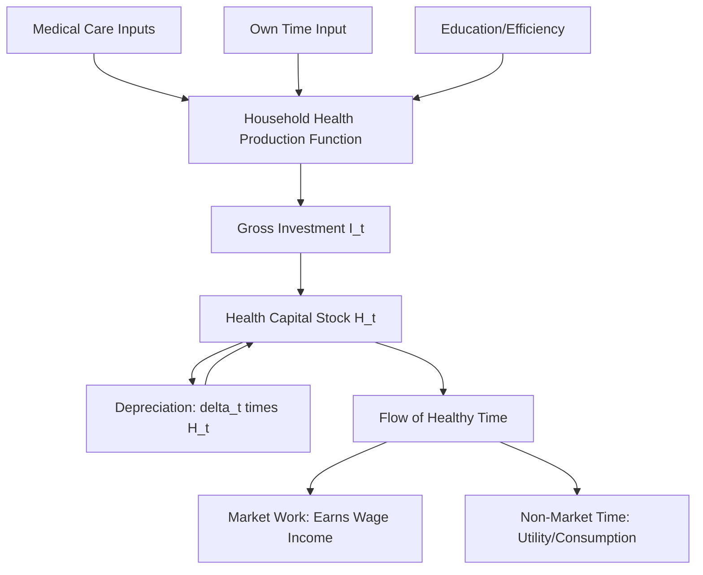

## Health as Human Capital: The Grossman Model

### Overview

The Grossman model, introduced by Michael Grossman in 1972, is the foundational theoretical framework treating health as a form of **human capital** rather than merely a consumption good. It models individuals as producers of their own health, using inputs such as medical care, time, and lifestyle choices, subject to a health capital stock that depreciates over time and can be augmented through investment.

### Core Conceptual Departure

**Key Points**

- Prior to Grossman, health economics largely treated medical care as an ordinary consumption good demanded directly for its own sake.
- Grossman's insight: individuals do not demand medical care *per se* — they demand **health**, and medical care is one input (among several) into the production of health.
- Health itself is modeled as a **durable capital stock** that yields a flow of services over time (healthy days, productive capacity), analogous to physical capital in standard investment theory.

### Health as Both Consumption and Investment Good

The model's central duality is that health capital delivers utility through two distinct channels:

1. **Consumption good**: Health directly enters the utility function — being healthy is inherently pleasurable/preferred (fewer sick days, better quality of life).
2. **Investment good**: Health determines the total time available for market work (earning income) and non-market activities, functioning as an input into the production of other valued goods.

$$U = U(\phi_1 H_1, ..., \phi_n H_n, Z_1, ..., Z_n)$$

where $H_i$ represents the stock of health capital in period $i$, $\phi_i$ is the flow of healthy time derived from that stock, and $Z_i$ represents other commodities consumed.

### The Health Capital Stock and Depreciation

Health capital is assumed to depreciate over time (biological aging, illness) and can be replenished through investment (medical care, healthy behaviors). The law of motion for the health stock is:

$$H_{t+1} - H_t = I_t - \delta_t H_t$$

where $H_t$ is the health stock at time $t$, $I_t$ is gross investment in health during period $t$, and $\delta_t$ is the rate of depreciation of health capital, which is typically assumed to increase with age.

**Key Points**

- The depreciation rate $\delta_t$ rising with age is a central mechanism generating the model's predictions about health declining and medical care demand increasing over the life cycle.
- Gross investment $I_t$ is produced using a household production function combining purchased medical care, own time, education, and other inputs.

### Health Production Function

Health investment (gross investment in the health stock) is produced via a household production process, not purchased directly as a finished good:

$$I_t = I(M_t, TH_t; E_t)$$

where $M_t$ is medical care inputs, $TH_t$ is the individual's own time input devoted to health production, and $E_t$ represents human capital/education, which is assumed to affect the *efficiency* of health production (more educated individuals are assumed to produce health more efficiently from the same inputs).

### Diagram: Structure of the Grossman Model

### Two Motives for Health Demand

The model formally decomposes the demand for health into two components, which can be analyzed separately under certain simplifying assumptions (the "pure investment model" special case):

| Motive | Mechanism | Implication |
| --- | --- | --- |
| Consumption motive | Health directly yields utility | Demand for health responds to preferences, independent of wage effects |
| Investment motive | Health increases healthy time available for market work | Demand for health responds to the wage rate — higher wages increase the value of healthy time, raising optimal health investment |

**Example**

An individual with a high market wage has a higher opportunity cost of sick days (lost earnings), which — in the pure investment framework — increases their optimal investment in health capital relative to a lower-wage individual, holding preferences constant. This yields the model's prediction that higher-wage individuals should, all else equal, invest more in health.

### Key Predictions of the Model

**Key Points**

- **Age and health investment**: As $\delta_t$ (depreciation rate) rises with age, the optimal quantity of health capital held tends to fall over the life cycle, while gross investment in health (medical care demand) tends to *increase* with age, as more investment is required merely to offset accelerating depreciation.
- **Education and health**: Individuals with more education/human capital are modeled as more efficient producers of health, predicting a positive correlation between education and health status — a widely replicated empirical finding, though [Inference] the model's specific causal mechanism (efficiency in health production) is one of several competing explanations offered in the empirical literature for the education-health gradient, alongside selection and income-mediated pathways.
- **Wage effects**: In the pure investment model, an increase in the wage rate increases the shadow price of illness (value of lost healthy time), predicting higher optimal health investment among higher earners.
- **Uncompensated wage elasticity**: The model predicts a positive relationship between wages and health investment operating specifically through the investment motive, distinct from any income effect operating through the consumption motive.

### The Shadow Price of Health

A central analytical construct in the Grossman model is the **shadow price of health capital** ($\pi$), representing the full marginal cost of maintaining an additional unit of health capital, incorporating both the direct cost of medical care inputs and the opportunity cost of time:

$$\pi_t = \frac{P_M \cdot m + W \cdot t_H}{\partial I / \partial M}$$

where $P_M$ is the price of medical care, $m$ is the quantity of medical inputs, $W$ is the wage rate (opportunity cost of time), $t_H$ is time spent on health production, and $\partial I / \partial M$ is the marginal product of medical care in producing health investment.

[Inference] This formulation implies that the shadow price of health rises with the wage rate (via the time-cost component) and depends on the marginal efficiency of health production, which is why the model predicts that health investment behavior differs systematically across education and income groups, not merely because of differing preferences.

### Optimal Path of Health Investment Over the Life Cycle

The model derives an optimality condition equating the marginal cost of health investment to its marginal benefit (discounted future returns from the health stock):

$$\pi_t = \frac{W_t \cdot \phi_t + \sum \text{marginal utility value of future health flows}}{1 + r}$$

where $r$ is the individual's discount rate. As depreciation accelerates with age, maintaining a constant desired health stock requires progressively larger gross investment, generating the model's characteristic prediction of rising medical care utilization in later life even absent any change in preferences.

### Comparative Statics Summary

| Parameter Change | Predicted Effect on Health Investment |
| --- | --- |
| Increase in depreciation rate $\delta$ (age) | Increase in gross investment (medical care demand) |
| Increase in wage rate $W$ | Increase in investment (via investment motive) |
| Increase in education/efficiency $E$ | Increase in health stock; ambiguous effect on medical care demand (efficiency may reduce required inputs per unit of health) |
| Increase in price of medical care $P_M$ | Decrease in gross investment, depending on price elasticity |
| Increase in discount rate $r$ | Decrease in current health investment (future health valued less) |

### Empirical Applications and Extensions

**Key Points**

- The model has been used to motivate empirical work on the education-health gradient, the health-income relationship, and life-cycle patterns of medical care utilization.
- Extensions incorporate uncertainty (stochastic health shocks), addiction/habit formation in health behaviors (e.g., extensions modeling smoking as a form of negative health investment), and dynamic labor supply interactions.
- [Unverified] The empirical literature testing the Grossman model's specific structural predictions (e.g., the pure wage effect on health investment) has produced mixed results, and some predictions — particularly the ambiguous or sometimes negative empirical relationship between education and certain health investment measures — have generated ongoing methodological debate about model specification and identification.

### Criticisms and Limitations

**Key Points**

- The model assumes a rational, forward-looking, fully-informed individual optimizing a lifetime utility function — an assumption challenged by behavioral economics research on present bias and health-related decision-making.
- Separating the "pure investment" and "pure consumption" cases requires restrictive assumptions (e.g., that health does not directly enter the utility function, in the investment-only variant) that are analytically convenient but not fully realistic.
- The model treats health production as a well-defined, estimable function, but real-world health production involves substantial uncertainty and imperfect information about the health-generating effects of medical inputs.
- Household time allocation and intra-household bargaining (e.g., caregiving time inputs) are abstracted away in the basic single-agent formulation, limiting direct application to household-level health decisions without extension.

### Related Topics

- Health production functions and input substitution
- Education and the health gradient
- Life-cycle models of health and medical care demand
- Time allocation models (Becker's theory of household production)
- Behavioral economics critiques of intertemporal health decision-making
- Human capital theory (Becker, Mincer) and its application beyond education
- Empirical estimation strategies for the Grossman model (structural vs. reduced-form approaches)
- Addiction and habit-formation extensions to health capital models