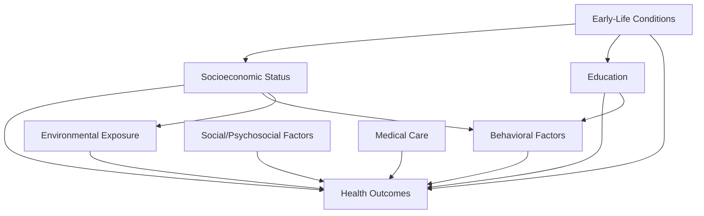

## Determinants of Health Beyond Medical Care

### Overview

Empirical and theoretical work in health economics consistently finds that medical care explains only a modest share of variation in population health outcomes. A broader framework — often organized under the term **social determinants of health (SDOH)** — identifies non-medical factors as the dominant drivers of health status, with substantial implications for how health economists model demand, allocate resources, and evaluate policy.

### Conceptual Framework: The Health Production Function Revisited

Building on the household production approach (see the Grossman model), health status $H$ can be modeled as a function of multiple inputs, of which medical care $M$ is only one:

$$H = f(M, B, S, E, G, En)$$

where $M$ is medical care, $B$ is health-related behaviors, $S$ is socioeconomic status, $E$ is education, $G$ is genetic endowment, and $En$ is environmental exposure. [Inference] The relatively small estimated marginal contribution of $M$ in many empirical decompositions is a central motivation in health economics for policy attention to the non-medical determinants, though the precise share attributable to each category varies across studies and populations and is sensitive to modeling assumptions.

### Major Categories of Non-Medical Determinants

**Key Points**

| Category | Examples | Economic Relevance |
| --- | --- | --- |
| Socioeconomic status (SES) | Income, wealth, occupation | Correlates strongly and consistently with health across virtually all studied populations (the "SES-health gradient") |
| Education | Years of schooling, health literacy | Affects health production efficiency (per Grossman) and health-related decision-making |
| Behavioral/lifestyle factors | Diet, physical activity, smoking, alcohol use | Directly enter the health production function as substitutable/complementary inputs to medical care |
| Environmental factors | Air/water quality, housing conditions, neighborhood safety | Often externalities or public-good-like factors outside individual control |
| Social and psychosocial factors | Social support networks, chronic stress, discrimination | Increasingly integrated into health economics via behavioral and biopsychosocial extensions |
| Genetic/biological endowment | Inherited predisposition to disease | Treated as a largely exogenous parameter in most economic models |
| Early-life conditions | In-utero exposures, childhood socioeconomic conditions | Basis for "fetal origins"/early-life human capital literature |

### The Socioeconomic Status (SES)-Health Gradient

**Example**

Across virtually every country and time period studied, individuals with higher income and/or education report better health outcomes and longer life expectancy than those with lower income/education, even in countries with universal health insurance coverage — indicating the gradient is not solely attributable to differential access to medical care.

Two broad (non-mutually-exclusive) causal explanations are debated in the literature:

1. **Causation (SES → Health)**: Higher income enables better nutrition, housing, and living conditions; more education improves health literacy and health production efficiency; lower stress associated with financial security.
2. **Reverse causation (Health → SES)**: Poor health reduces labor market productivity and earnings capacity, and increases medical expenditures, generating downward mobility.

[Speculation] Most researchers in this literature treat the SES-health relationship as bidirectional, with the relative magnitude of each causal direction remaining an active empirical question that differs by country, health condition, and life stage studied.

### Diagram: Pathways from Non-Medical Determinants to Health Outcomes

### Behavioral Determinants and the Household Production Framework

Within the Grossman-style household production model, health behaviors function as **inputs** to health production that can substitute for or complement formal medical care:

$$I_t = I(M_t, B_t, TH_t; E_t)$$

where $B_t$ (behavioral inputs such as diet quality, exercise, smoking cessation) is added explicitly alongside medical care $M_t$ as a producible input to gross health investment.

**Key Points**

- Health-related behaviors are themselves modeled as choices subject to time and money constraints, prices (e.g., cigarette taxes affecting smoking), information, and preferences (including time preference/discount rates).
- Behavioral economics extensions incorporate present bias and self-control problems to explain why individuals may under-invest in health-promoting behaviors (e.g., exercise, preventive screening) despite full information about long-run benefits — a departure from the purely rational intertemporal optimization in the baseline Grossman framework.

### Environmental and Neighborhood Determinants

Environmental determinants are frequently modeled using an **externalities framework**, since exposure is often involuntary and not fully reflected in market transactions:

$$H_i = f(M_i, B_i, X_i)$$

where $X_i$ represents ambient environmental exposure (e.g., air pollution) affecting individual $i$'s health production regardless of their own private choices — a classic negative externality (see externalities and public goods).

**Example**

Air pollution exposure has been linked in the epidemiological and economics literature to increased respiratory and cardiovascular morbidity; because pollution sources and affected populations are typically distinct economic actors, this dynamic is treated as a textbook negative production/consumption externality requiring correction (e.g., emissions regulation) rather than something addressable through medical care demand alone.

### Early-Life and Intergenerational Determinants

**Key Points**

- The "fetal origins hypothesis" (Barker hypothesis) and subsequent economics literature link in-utero and early childhood conditions (maternal nutrition, stress, disease exposure) to adult health and economic outcomes, extending the health capital framework across generations.
- Early-life socioeconomic conditions are frequently modeled as shaping the *initial health capital stock* $H_0$ in life-cycle health models, with lasting effects on the depreciation trajectory and lifetime health investment pattern.
- This literature has motivated economic evaluation of early-childhood interventions (e.g., nutrition programs, early education) using a human-capital return framework rather than a purely clinical cost-effectiveness framework.

### Implications for Health Policy Design

**Key Points**

- If non-medical determinants account for a substantial share of health variation, then policies confined to the medical care delivery system (insurance expansion, provider payment reform) may have a bounded ceiling on achievable population health improvement — a point frequently raised in comparative health system analyses.
- This motivates cross-sectoral policy interventions ("health in all policies"): housing policy, education policy, income support, and environmental regulation are increasingly analyzed using health-economic evaluation frameworks (e.g., cost-effectiveness analysis applied to non-health-sector interventions).
- From a welfare-economics perspective, addressing non-medical determinants often involves correcting externalities (environmental regulation) and addressing market failures in other sectors (housing, labor markets), not solely healthcare-market interventions.
- [Unverified] The magnitude of return-on-investment estimates for non-medical/upstream interventions (e.g., early childhood programs) reported in specific studies varies considerably by methodology, population, and time horizon, and such figures should be treated as context-specific rather than universally generalizable.

### Measurement and Empirical Challenges

**Key Points**

- Attributing health variation to specific determinant categories requires decomposition methods (e.g., Oaxaca-Blinder-style decompositions, multilevel modeling) that are sensitive to model specification and data availability.
- Reverse causality (health affecting SES, behaviors) and confounding (unobserved factors affecting both determinants and health) present persistent identification challenges, motivating use of quasi-experimental designs (natural experiments, instrumental variables, sibling/twin studies) in this literature.
- Cross-country comparisons of the relative importance of medical care versus non-medical determinants are complicated by differing health system structures, data quality, and definitions of health outcomes across settings.

### Related Topics

- Health as human capital: the Grossman model
- Socioeconomic gradients in health and the SES-health relationship
- Behavioral economics of health decision-making (present bias, self-control)
- Externalities and public goods in health care
- Equity-efficiency tradeoffs in health policy
- Early-life origins of adult health and human capital (fetal origins hypothesis)
- Health in All Policies and cross-sectoral health interventions
- Quasi-experimental identification strategies in health economics research