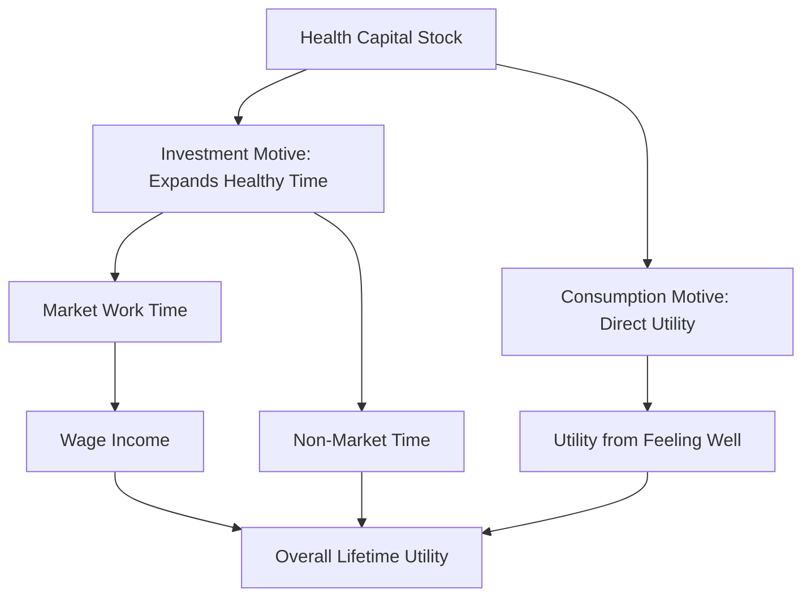

## Investment versus Consumption Motives for Health

### Overview

Within the Grossman framework for the demand for health, individuals value health capital through two conceptually distinct channels: as a **consumption good** yielding direct utility, and as an **investment good** that expands the time available for income-generating and other valued activities. Separating these motives is central to understanding the model's comparative-static predictions and to interpreting empirical estimates of health demand.

### The Consumption Motive

**Definition**

Under the consumption motive, health enters the utility function directly — individuals value being healthy independent of any effect on earnings or productivity. Feeling well, avoiding pain, and enjoying activities are treated as sources of utility in their own right.

$$U = U(\phi H, Z)$$

where $\phi H$ is the flow of healthy time derived from the health stock $H$, entering utility alongside other consumption commodities $Z$.

**Key Points**

- The consumption motive implies that demand for health responds to standard consumer-theory forces: income effects, preferences, and the (shadow) price of health investment, independent of the wage rate's role as an opportunity-cost variable.
- Under a pure consumption-only specification, an individual with no labor market attachment (e.g., a retiree) would still demand health investment, driven purely by the utility value of healthy time.

### The Investment Motive

**Definition**

Under the investment motive, health is valued instrumentally because a larger stock of health capital increases the total time available for market work (and hence earnings) and for other productive non-market activities. Health functions analogously to physical or human capital — an asset generating a stream of future returns.

$$\phi H = TW + TL$$

where $\phi H$ (healthy time) is allocated between $TW$ (time in market work, generating wage income $W \cdot TW$) and $TL$ (other non-work time uses). A larger $H$ increases total available healthy time, relaxing the individual's overall time constraint.

**Key Points**

- The investment motive implies that the wage rate $W$ directly affects the optimal demand for health: a higher wage raises the value of an additional healthy day (via increased potential earnings), increasing the marginal benefit of health investment.
- Under the pure investment-only specification (health does not enter utility directly), health is demanded solely because it is productive — analogous to a firm's investment in physical capital based on its marginal revenue product.

### Diagram: Two Channels of Health Demand

### Why the Distinction Matters Analytically

**Key Points**

- The two motives generate different, empirically distinguishable predictions about how health demand responds to wage changes. Isolating the "pure investment" case (by assuming health does not enter utility directly) allows derivation of clean comparative statics, particularly the prediction that health investment rises with the wage rate.
- In the general (combined) model, both motives operate simultaneously, and the wage effect on health investment reflects a mix of the investment-motive effect (positive, via opportunity cost of illness) and any income effect operating through the consumption motive (sign depends on whether health is a normal or inferior good in the utility function).
- Grossman's original formulation shows that the pure investment model and the pure consumption model yield differing — and in some cases opposite-signed — predictions regarding the effect of specific parameters (e.g., the wage elasticity of health demand), making the distinction empirically testable in principle.

### Comparative Statics: Contrasting Predictions

| Parameter Change | Pure Investment Model Prediction | Pure Consumption Model Prediction |
| --- | --- | --- |
| Increase in wage rate $W$ | Increases health investment (higher value of healthy time) | Ambiguous — depends on income effect and whether health is normal/inferior good |
| Increase in education $E$ | Increases health investment via efficiency in production | Increases health investment via efficiency in production (same channel, both models) |
| Increase in depreciation rate $\delta$ (age) | Increases gross investment (medical care demand); reduces optimal health stock | Increases gross investment; reduces optimal health stock (similar direction, different underlying mechanism) |
| Pure time preference/discount rate $r$ | Higher $r$ reduces investment (future returns to work capacity discounted more heavily) | Higher $r$ reduces investment (future utility from health discounted more heavily) |

[Inference] Because several predictions coincide in direction across the two motives (e.g., effects of depreciation and education), empirically distinguishing which motive dominates in practice typically requires isolating variation specifically in the wage/opportunity-cost channel (e.g., using populations with weak labor force attachment) rather than relying on predictions that both models share.

### Example: Retirees and the Investment Motive

**Example**

A common application of this distinction concerns health investment behavior among retired individuals, who by construction have no labor market earnings and therefore no active investment-motive channel through market work. In the pure investment model, retirees' health demand should reflect only its effect on non-market productive time (e.g., household production, leisure value), while in the pure consumption model, retirees demand health based purely on direct utility from feeling well. [Speculation] Some researchers have used differential health investment behavior around retirement transitions as one (imperfect) empirical strategy to help disentangle the relative strength of the two motives, though isolating a clean natural experiment for this purpose is methodologically difficult given the many other changes co-occurring at retirement (income, time use, social context).

### Shadow Price Implications

The shadow price of health capital $\pi$ — the full marginal cost of health investment — differs conceptually across the two motivations even though it is calculated similarly:

$$\pi = \frac{P_M m + W t_H}{\partial I/\partial M}$$

- Under the **investment motive**, the *marginal benefit* set equal to $\pi$ at the optimum is the present value of increased future earnings from additional healthy time.
- Under the **consumption motive**, the marginal benefit set equal to $\pi$ is the marginal utility value of the healthy time itself, independent of any earnings implication.

In the combined (general) model, the optimality condition equates the shadow price to the *sum* of both marginal benefit streams, discounted appropriately over the planning horizon.

### Empirical and Policy Relevance

**Key Points**

- The investment-motive framework provides the theoretical basis for treating health expenditures (public health investment, workplace wellness programs, disability prevention) as productivity-enhancing investments with a measurable return, supporting cost-benefit analyses that incorporate labor market gains, not just direct health-utility gains.
- The consumption-motive framework underlies welfare evaluations that value health improvements directly (e.g., via willingness-to-pay or QALY-based valuation) independent of any labor market effect — relevant for populations outside the labor force (children, retirees, individuals with severe disability).
- Cost-effectiveness and cost-benefit analyses in applied health economics implicitly draw on both motives: QALY-based valuation captures the consumption-good aspect of health, while human-capital or friction-cost approaches to indirect cost estimation (e.g., valuing productivity loss from illness) capture the investment-good aspect.
- [Unverified] The relative empirical weight of the two motives is not settled in the literature and likely varies by population subgroup (e.g., prime-age workers versus retirees) and by the specific health condition or intervention being studied; the theoretical decomposition is best understood as an analytical device for generating testable predictions rather than a claim that real individuals consciously separate these motivations.

### Related Topics

- Health as human capital: the Grossman model
- Determinants of health beyond medical care
- Human capital theory and labor market productivity
- Cost-of-illness studies and indirect cost valuation (human capital vs. friction cost approaches)
- Willingness-to-pay and QALY-based health valuation
- Life-cycle labor supply models incorporating health
- Retirement transitions and health behavior
- Time allocation and household production theory