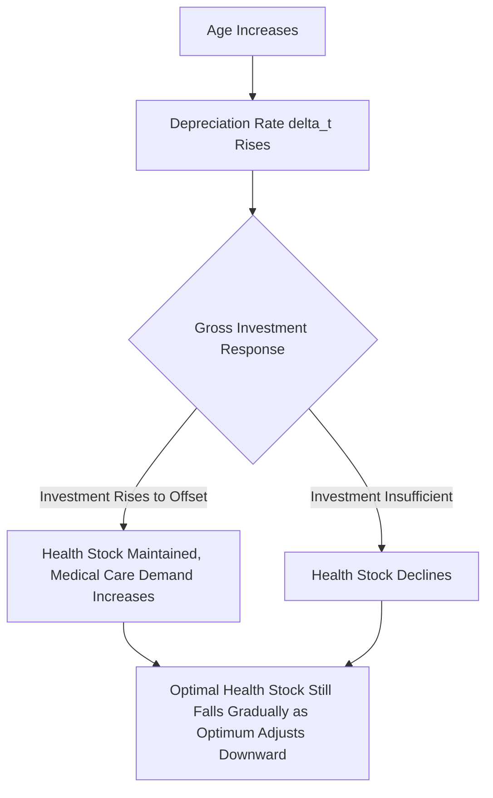

## Depreciation of Health Capital over the Life Cycle

### Overview

Within the Grossman model, health is treated as a durable capital stock that depreciates over time, analogous to physical capital. The rate of depreciation is a central dynamic parameter governing the model's life-cycle predictions: as depreciation accelerates with age, individuals must undertake progressively greater gross investment merely to maintain a given health stock, generating the model's characteristic prediction of rising medical care demand in later life.

### The Depreciation Parameter

**Definition**

The depreciation rate $\delta_t$ represents the proportion of the health capital stock lost between periods due to biological aging, wear, and the cumulative effects of illness, independent of any offsetting investment. It is the health-capital analog of physical capital depreciation in standard investment theory.

$$H_{t+1} = H_t + I_t - \delta_t H_t$$

where $H_t$ is the health stock at time $t$, $I_t$ is gross investment during the period, and $\delta_t$ is the age-dependent depreciation rate.

**Key Points**

- $\delta_t$ is standardly assumed to be an increasing function of age: $\delta_t = \delta(t)$, with $\partial \delta / \partial t > 0$, reflecting the empirical regularity that biological aging accelerates functional decline.
- Depreciation is distinct from gross investment — an individual can offset a rising depreciation rate through increased investment (medical care, healthier behaviors), but cannot eliminate the underlying age-related increase in $\delta_t$ itself within the model's standard formulation.

### Net Investment and the Evolution of Health Stock

Net investment in health capital is the difference between gross investment and depreciation:

$$\text{Net Investment}_t = I_t - \delta_t H_t$$

- When net investment is positive, the health stock rises.
- When net investment is negative (depreciation exceeds gross investment), the health stock declines — the typical pattern in later life even with sustained, or even increasing, medical care utilization.

### Diagram: Depreciation and Investment Dynamics over the Life Cycle

### Optimal Health Stock Path

The model derives an optimal trajectory for the health stock by equating, at each period, the marginal cost of health investment (the shadow price $\pi_t$) to the marginal benefit of holding an additional unit of health capital (the discounted value of future healthy time, in both consumption and investment terms):

$$\pi_t \left( r + \delta_t - \frac{\dot{\pi}_t}{\pi_t} \right) = MB_t$$

This is a health-capital analog of the standard **user cost of capital** formula from investment theory, where $r$ is the discount rate, $\delta_t$ is depreciation, and $\dot{\pi}_t / \pi_t$ captures anticipated changes in the shadow price of health over time. As $\delta_t$ rises with age, the effective "user cost" of holding health capital rises, and — holding the marginal benefit schedule fixed — the model predicts a declining optimal health stock over the life cycle.

**Key Points**

- Because $\delta_t$ enters directly as a component of the effective discount/cost rate applied to health capital, higher depreciation is functionally equivalent to a rising "interest rate" charged against the health stock, compressing the optimal holding of health capital as age advances.
- The optimal *level* of health capital thus tends to decline gradually over the life cycle even under an optimal investment strategy — the model does not predict individuals can indefinitely maintain youthful health levels through unlimited investment, since the health production function is characterized by diminishing marginal returns to medical inputs.

### Gross Investment (Medical Care Demand) versus Health Stock: Divergent Life-Cycle Paths

A central and somewhat counterintuitive prediction of the model is that **gross investment (medical care utilization) and the health stock move in opposite directions** over much of the life cycle:

| Life Stage | Depreciation Rate | Optimal Health Stock | Gross Investment (Medical Care Demand) |
| --- | --- | --- | --- |
| Young adulthood | Low | High | Low |
| Middle age | Rising | Gradually declining | Rising |
| Older age | High | Lower | High (often rising further) |

**Example**

A healthy young adult may consume minimal medical care despite having a high health stock, simply because low depreciation means little investment is needed to maintain that stock. An older adult, despite substantially higher medical care utilization (more physician visits, medications, procedures), may still exhibit a declining overall health stock, because the elevated depreciation rate outpaces even substantially increased gross investment. This divergence is a direct structural implication of the model, not merely an empirical coincidence.

### Diagram: Stylized Life-Cycle Trajectories (svg_diagram)

<svg xmlns="http://www.w3.org/2000/svg" viewBox="0 0 620 400">
<text x="310" y="25" font-size="16" font-weight="bold" text-anchor="middle">Health Stock vs Gross Investment over Age (svg_diagram)</text>
<line x1="80" y1="350" x2="80" y2="60" stroke="black" stroke-width="2" />
<line x1="80" y1="350" x2="560" y2="350" stroke="black" stroke-width="2" />
<text x="30" y="200" font-size="13" transform="rotate(-90 30 200)">Level</text>
<text x="290" y="380" font-size="13">Age</text>
<path d="M 100 120 Q 250 140 350 190 Q 450 230 540 260" fill="none" stroke="#1f77b4" stroke-width="2.5" />
<text x="420" y="215" font-size="12" fill="#1f77b4">Health Stock H_t (declines)</text>
<path d="M 100 320 Q 250 300 350 230 Q 450 150 540 90" fill="none" stroke="#d62728" stroke-width="2.5" />
<text x="380" y="130" font-size="12" fill="#d62728">Gross Investment I_t (rises)</text>
<line x1="80" y1="350" x2="80" y2="345" stroke="black" />
<text x="90" y="365" font-size="11">Young</text>
<text x="500" y="365" font-size="11">Older</text>
</svg>

### Factors Modifying the Depreciation Trajectory

**Key Points**

- **Chronic disease onset**: Discrete health shocks (e.g., diagnosis of a chronic condition) can be modeled as step-increases in $\delta_t$ beyond the smooth age-related trend.
- **Behavioral factors**: Smoking, poor diet, and physical inactivity are commonly modeled as accelerating the depreciation rate, independent of chronological age — providing the theoretical basis for describing such behaviors as increasing the "rate of aging" of health capital.
- **Education**: Beyond its role in improving the efficiency of health *production*, some model extensions posit that education may also moderate the depreciation rate itself (e.g., via better health-protective behaviors), though [Unverified] the specific channel through which education affects depreciation, as distinct from production efficiency, is not uniformly specified across variants of the model in the literature.
- **Environmental and occupational exposures**: Exposure to hazardous working conditions or environmental pollutants can be incorporated as factors directly elevating $\delta_t$.

### Empirical Implications and Applications

**Key Points**

- The model's prediction that medical care demand rises with age even as health stock declines is broadly consistent with observed patterns of healthcare utilization and expenditure rising sharply in older populations, a pattern with substantial implications for health insurance design (e.g., age-rated premiums) and public program financing (e.g., Medicare-type systems).
- The framework provides a theoretical rationale for the widely observed rise in per-capita healthcare spending with age, distinguishing this life-cycle effect from separate drivers such as end-of-life care intensity or cohort-specific factors.
- [Speculation] Some researchers have proposed that the acceleration of $\delta_t$ may not be a smooth, continuous function of age but may instead better reflect a series of discrete health shocks and chronic condition onsets; if so, empirical estimation strategies assuming smooth depreciation functions may not fully capture the underlying dynamics, though this remains a point of methodological discussion rather than settled consensus.
- Extensions incorporating **stochastic depreciation** (uncertain health shocks rather than deterministic age-based decline) have been developed to better match observed variability in individual health trajectories and medical care utilization patterns.

### Related Topics

- Health as human capital: the Grossman model
- Investment versus consumption motives for health
- Life-cycle models of medical care demand and expenditure
- Chronic disease onset and health shock modeling
- Age-related health insurance pricing and risk adjustment
- Determinants of health beyond medical care
- Human capital depreciation (comparison to physical/education capital models)
- Stochastic extensions to deterministic health capital models