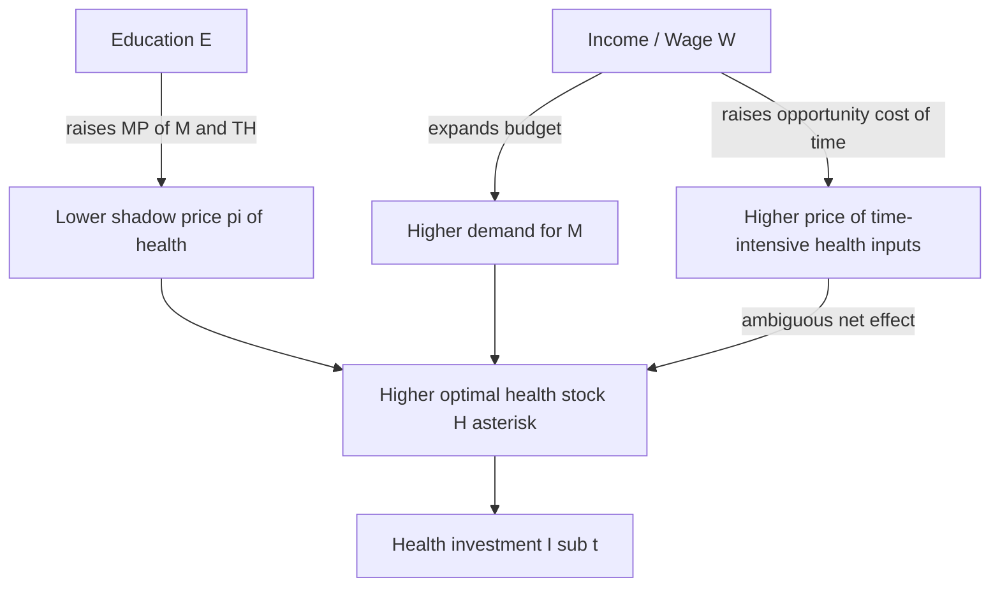

## Education, Income, and Health Production

### Overview

Education and income enter the health production framework not as goods consumed for their own sake, but as inputs that alter how efficiently individuals convert market goods and time into health. This builds on the Grossman model of health capital, where health is treated as a durable capital stock that yields utility directly and productive time indirectly, and where individuals act as both producers and consumers of health.

### The Health Production Function

The foundational relationship is:

$$H_{t+1} = H_t(1-\delta_t) + I_t$$

where $H_t$ is the health capital stock in period $t$, $\delta_t$ is the depreciation rate, and $I_t$ is gross investment in health produced via a household production function:

$$I_t = f(M_t, TH_t; E_t)$$

Here $M_t$ represents purchased medical care and other market goods, $TH_t$ is time input devoted to health production, and $E_t$ is the stock of education, which enters as a shift parameter on the production function rather than as a direct input. This distinction is central: education does not produce health directly the way a doctor's visit does; it changes the marginal productivity of the inputs that do.

### Education as Productive Efficiency

Two competing (and non-mutually-exclusive) hypotheses explain why more-educated individuals exhibit better health outcomes, holding income constant.

**Productive efficiency hypothesis**: Education raises the marginal product of health inputs. A more educated person extracts more health output from the same quantity of medical care, nutrition, or exercise time — for example, by adhering more precisely to a prescribed regimen, correctly interpreting symptoms, or timing preventive care appropriately. Formally, this is modeled as a multiplicative or shift effect on $f(\cdot)$:

$$I_t = E_t^{\gamma} \cdot f(M_t, TH_t)$$

where $\gamma > 0$ captures the productivity elevation from education. Grossman's original empirical work and subsequent extensions found evidence consistent with this: schooling coefficients in health production regressions remained significant even after controlling for income, occupation, and access to care.

**Allocative efficiency hypothesis**: An alternative explanation, associated with Michael Grossman and later formalized by Kenkel and others, holds that education does not make people more efficient at producing health from a given input bundle, but rather makes them better at *choosing* the right inputs in the first place — selecting more effective treatments, avoiding harmful behaviors, and acquiring and processing health-relevant information more effectively. Under this view, education operates through information acquisition and decision quality rather than through the physical production technology itself.

Distinguishing these empirically is difficult because both predict the same reduced-form correlation between schooling and health; they differ only in the underlying mechanism, and disentangling them typically requires data on health knowledge, input choices, and health outcomes simultaneously. [Inference] Much of the applied literature treats this distinction as still empirically unresolved, since both channels typically move together in observational data.

### Income and the Demand for Health

Income enters the model through the budget constraint rather than the production function directly:

$$\sum_{t=0}^{T} \frac{M_t P_t + V_t TW_t}{(1+r)^t} = \sum_{t=0}^{T} \frac{W_t TW_t}{(1+r)^t} + A_0$$

where $P_t$ is the price of medical care, $V_t$ is the value of time devoted to health production (opportunity cost of time), $TW_t$ is time spent working, $W_t$ is the wage rate, $r$ is the discount rate, and $A_0$ is initial assets. Income affects health demand in two distinct channels:

1. **Full income effect**: Higher wages raise the budget available for purchasing $M_t$, expanding the feasible set of health investment.
2. **Time-price effect**: Higher wages also raise the *opportunity cost* of time spent on health-producing activities (exercise, sleep, preparing meals, seeking care), which can theoretically *reduce* health investment if the time-intensity of production is high relative to the goods-intensity.

This second channel is why the model does not predict an unambiguous positive relationship between income and health investment: the net effect depends on the relative time-intensity of health production versus market-good-intensity, and on whether the wage effect on the shadow price of health investment dominates the income effect.

### The Shadow Price of Health

A central derived concept is the shadow price of health capital, $\pi_t$, which represents the marginal cost of producing one additional unit of health capital:

$$\pi_t = \frac{P_t}{MP_M} \quad \text{or equivalently} \quad \pi_t = \frac{W_t}{MP_{TH}}$$

where $MP_M$ and $MP_{TH}$ are the marginal products of market goods and time, respectively, in health production. Since education raises marginal productivity ($MP_M$ and/or $MP_{TH}$), it **lowers** $\pi_t$ for a given individual. A lower shadow price of health, holding the marginal efficiency of investment (MEI) schedule fixed, induces a *movement along the demand curve* toward greater optimal health stock — this is the primary theoretical channel through which education raises health demand independent of income.

### Graphical Representation: Efficiency and the MEI Curve

In the standard Grossman diagram, health capital $H$ is on the horizontal axis and the marginal cost / marginal efficiency of investment is on the vertical axis. The marginal efficiency of investment (MEI) curve slopes downward (diminishing returns to health capital in producing healthy time or utility). Education shifts this curve.

- **Pure productive efficiency effect**: education rotates or shifts the MEI curve outward/upward, increasing the marginal efficiency of investment at every level of $H$, since more health capital can now be "produced" per unit of cost. This increases optimal $H^*$ and, in most parameterizations, increases gross investment $I_t$.
- **Pure allocative efficiency effect**: education does not shift the physical MEI curve but changes which point on the existing possibilities set is chosen, shifting realized health outcomes without necessarily changing $\pi_t$ as conventionally measured.

(svg_diagram) Marginal Efficiency of Investment shift with education:

<svg xmlns="http://www.w3.org/2000/svg" viewBox="0 0 640 420" font-family="Helvetica, Arial, sans-serif">
<text x="320" y="24" text-anchor="middle" font-size="16" font-weight="bold" fill="#1a1a1a">Marginal Efficiency of Investment — Education Shift (svg_diagram)</text>

<line x1="80" y1="360" x2="580" y2="360" stroke="#333" stroke-width="2" />
<line x1="80" y1="360" x2="80" y2="50" stroke="#333" stroke-width="2" />
<text x="330" y="395" text-anchor="middle" font-size="13" fill="#333">Health Capital Stock, H</text>
<text x="30" y="205" text-anchor="middle" font-size="13" fill="#333" transform="rotate(-90 30 205)">Marginal Efficiency / Cost</text>

<path d="M 100 90 C 200 130, 320 220, 500 340" stroke="#c0392b" stroke-width="3" fill="none" />
<text x="505" y="345" font-size="12" fill="#c0392b">MEI0 (baseline)</text>

<path d="M 100 60 C 220 100, 380 190, 555 330" stroke="#2471a3" stroke-width="3" fill="none" />
<text x="500" y="300" font-size="12" fill="#2471a3">MEI1 (post-education, higher productivity)</text>

<line x1="80" y1="300" x2="580" y2="300" stroke="#7d7d7d" stroke-width="2" stroke-dasharray="6,4" />
<text x="585" y="304" font-size="12" fill="#7d7d7d">r + δ</text>

<circle cx="330" cy="300" r="5" fill="#c0392b" />
<line x1="330" y1="300" x2="330" y2="360" stroke="#c0392b" stroke-width="1.5" stroke-dasharray="3,3" />
<text x="330" y="378" text-anchor="middle" font-size="12" fill="#c0392b">H0*</text>
<circle cx="430" cy="300" r="5" fill="#2471a3" />
<line x1="430" y1="300" x2="430" y2="360" stroke="#2471a3" stroke-width="1.5" stroke-dasharray="3,3" />
<text x="430" y="378" text-anchor="middle" font-size="12" fill="#2471a3">H1*</text>

<text x="330" y="45" text-anchor="middle" font-size="11" fill="#555">Equilibrium: MEI = r + δ (cost of capital)</text>

</svg>

### Empirical Evidence and Measurement Issues

**Cross-sectional findings**: Numerous studies (Grossman 1972; Berger and Leigh 1989; Kenkel 1991) find that an additional year of schooling is associated with measurable reductions in mortality and morbidity, controlling for income. Grossman's own estimates suggested each additional year of schooling was associated with meaningfully lower mortality risk in his samples. [Unverified] The precise magnitude varies substantially across country, cohort, and specification, and should not be treated as a universal constant.

**The reverse causality / selection problem**: A major methodological challenge is that the education–health relationship is confounded by:

1. **Reverse causality**: Poor childhood health can reduce educational attainment (via absenteeism, cognitive impairment, reduced returns to schooling investment), rather than education causing health.
2. **Third-factor confounding**: Time preference (discount rate $r$ in the model), cognitive ability, and family background jointly determine both schooling attainment and health behaviors. An individual with a low discount rate values future health more, invests more in both education and health, generating a spurious correlation not run through education's productive channel at all.
3. **Ability bias**: Higher cognitive ability may independently raise both earnings potential (hence schooling incentives) and health-production efficiency, without schooling itself being causal.

**Instrumental variable approaches**: To isolate causal effects, researchers have used quasi-experimental variation in schooling — compulsory schooling law changes, school construction programs (e.g., Duflo's Indonesia study design logic), and compulsory attendance age discontinuities — as instruments for education, netting out ability and family-background confounds. Findings using such designs are mixed: some studies (e.g., using UK and US compulsory schooling reforms) find that the causal effect of an additional year of schooling on health is smaller than the naive OLS correlation suggests, implying a substantial share of the raw correlation reflects selection rather than a causal productive-efficiency or allocative-efficiency channel. [Inference] This suggests the "true" causal contribution of education to health production is likely smaller than cross-sectional Grossman-style regressions imply, though the direction of the OLS bias (whether it overstates or understates effects) is not uniform across all study populations and outcome measures used.

### Interaction Between Income and Education in Production

In extended models, education and income are frequently modeled as interacting rather than additive inputs. A common specification for the household production function including both:

$$I_t = A \cdot E_t^{\alpha} \cdot M_t^{\beta} \cdot TH_t^{(1-\beta)}$$

where $A$ is a technology/ability shifter, $\alpha$ captures the elasticity of health investment with respect to education (via the efficiency channel), and $\beta$ is the goods-intensity share of health production (a Cobb-Douglas parameterization). Income determines the *level* of $M_t$ purchasable given the budget constraint, while $E_t$ determines how effectively that $M_t$, combined with time $TH_t$, converts into actual health investment $I_t$.

Under this specification, education and income are complements: the marginal return to income-financed medical care rises with education level, meaning income transfers to more-educated populations may generate larger health gains per dollar spent than identical transfers to less-educated populations, holding medical technology fixed. [Inference] This complementarity implication is theoretically robust within the Cobb-Douglas structure but its empirical magnitude is sensitive to the assumed functional form and is not something the base Grossman model itself estimates.

### Health Literacy as the Applied Mechanism

A closely related applied concept, "health literacy," operationalizes the allocative efficiency channel in policy-relevant terms: the degree to which individuals can obtain, process, and understand basic health information needed to make appropriate health decisions. Low health literacy is associated with:

- Higher rates of hospitalization and emergency department use
- Poorer management of chronic conditions (diabetes, hypertension)
- Lower uptake of preventive services (vaccination, screening)
- Higher healthcare costs, holding underlying morbidity constant

Health literacy is generally correlated with, but conceptually and empirically distinct from, years of formal schooling — it is a more proximate measure of the mechanism through which education is hypothesized to affect health production.

### Policy Implications

**Key Points**

- Because education operates through the shadow price of health ($\pi_t$) and/or through allocative choices, education policy (compulsory schooling laws, higher education subsidies) can be understood partly as implicit health policy, with effects that compound over the life cycle as health capital depreciates and is reinvested in period by period.
- Income transfer programs (cash transfers, conditional cash transfers, minimum wage policy) affect health demand ambiguously in theory because of the offsetting time-price effect; empirical evaluation is required in each context rather than assuming a monotonic positive relationship.
- Targeting health information and health literacy interventions (the allocative efficiency channel) may be a more cost-effective lever than raising formal schooling attainment (the productive efficiency channel) if the primary mechanism is decision quality rather than physical production technology — though this depends on which hypothesis dominates in the target population, which is generally not directly observable ex ante.
- Because education and income may interact multiplicatively in the production function, health-financing policy design (e.g., subsidized insurance, means-tested medical benefits) should account for the possibility that the same medical expenditure yields differential health returns across education strata.

### Related Topics

- Grossman model of health capital: full derivation of demand and investment models
- Marginal efficiency of investment (MEI) curve derivation and comparative statics
- Time allocation models and the value of non-market time
- Human capital theory (Becker, Mincer) and its parallel structure to health capital theory
- Compulsory schooling law instrumental variable designs in health economics
- Health literacy measurement instruments (e.g., REALM, TOFHLA)
- Intergenerational transmission of health capital (parental education effects on child health production)
- Depreciation rate $\delta_t$ specification and its age-dependence in extended Grossman models