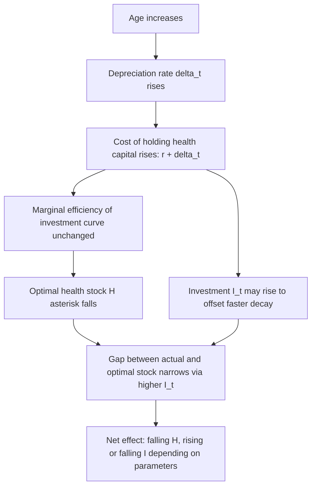

## Economics of Aging and Health Capital Decline

### Overview

Aging enters the Grossman health capital framework primarily through the depreciation rate $\delta_t$, an age-dependent parameter governing how quickly health capital erodes absent new investment. Unlike physical capital in standard investment theory, health capital depreciation is not typically treated as constant or exogenous to biology alone — it interacts with the individual's optimizing behavior, the shape of the marginal efficiency of investment (MEI) curve, and the declining value of remaining lifetime over which investment returns can be captured. This section extends the base demand-for-health model to the life-cycle setting.

### The Age-Dependent Depreciation Rate

The core law of motion for health capital remains:

$$H_{t+1} = H_t(1 - \delta_t) + I_t$$

but $\delta_t$ is now modeled as an increasing function of age $t$, typically specified as:

$$\delta_t = \delta_0 e^{\lambda t} \quad \text{or} \quad \delta_t = \delta_0 + \lambda t$$

where $\delta_0$ is a baseline depreciation rate and $\lambda > 0$ governs the rate of biological aging. The exponential specification (Grossman's original formulation) implies depreciation accelerates multiplicatively with age, consistent with observed morbidity and mortality curves that rise more than linearly in older cohorts. [Inference] The exact functional form ($\delta_t$ as exponential versus a Gompertz-type hazard versus a piecewise function) is a modeling choice rather than an empirically settled functional law, and different specifications generate materially different comparative-statics predictions about optimal investment near end-of-life.

### Why Depreciation Rises with Age

Three broad channels are typically invoked to justify $\delta_t' > 0$, though the base Grossman model treats depreciation as a reduced-form parameter without fully endogenizing these mechanisms:

1. **Biological senescence**: Cellular repair mechanisms, immune function, and organ reserve capacity decline with chronological age largely independent of behavior, imposing a rising biological "tax" on the existing health stock.
2. **Cumulative insult / wear-and-tear**: Prior health investments and disinvestments (smoking history, occupational exposures, prior injury) accumulate and manifest as higher effective depreciation later in life — this creates path dependence, since $\delta_t$ is not purely a function of calendar age but of cumulative prior health trajectory. [Speculation] Some extensions of the model attempt to endogenize this via a stock of "damage" alongside the health stock itself, though this is not part of the canonical single-state-variable Grossman formulation and remains a research-frontier modeling extension rather than a standard textbook result.
3. **Comorbidity interactions**: Existing chronic conditions can raise the marginal depreciation rate on remaining health capital (e.g., diabetes increasing cardiovascular depreciation), producing a form of accelerating decline once certain thresholds are crossed.

### Optimal Investment Response to Rising Depreciation

The individual's first-order condition for optimal health investment equates the marginal efficiency of investment to the opportunity cost of capital:

$$MEI_t = r + \delta_t - \frac{\dot{\pi}_t}{\pi_t}$$

where $r$ is the market interest rate (or discount rate), $\delta_t$ is the depreciation rate, and $\dot{\pi}_t / \pi_t$ is the percentage rate of change in the shadow price of health capital over time (a capital-gains-like term). As $\delta_t$ rises with age, the right-hand side "cost of holding health capital" rises, which — for a *given* MEI curve — implies the equilibrium optimal health stock $H_t^*$ *falls* with age even absent any change in productive efficiency.

This produces the central life-cycle prediction of the model: **optimal health stock declines with age**, and — under standard parameterizations — **gross investment can rise even as the health stock falls**, because more investment is required merely to offset accelerating depreciation. This is a frequently misunderstood implication: rising medical spending in old age is not necessarily evidence of irrational or wasteful health investment; it can be the fully rational response to a rising cost of maintaining any given health stock.

### Graphical Analysis: Depreciation Shift and the Optimal Age Path

(svg_diagram) Effect of rising depreciation on optimal health stock across age:

<svg xmlns="http://www.w3.org/2000/svg" viewBox="0 0 640 440" font-family="Helvetica, Arial, sans-serif">
<text x="320" y="24" text-anchor="middle" font-size="16" font-weight="bold" fill="#1a1a1a">Depreciation Rise and Optimal Health Stock by Age (svg_diagram)</text>

<line x1="80" y1="380" x2="580" y2="380" stroke="#333" stroke-width="2" />
<line x1="80" y1="380" x2="80" y2="60" stroke="#333" stroke-width="2" />
<text x="330" y="415" text-anchor="middle" font-size="13" fill="#333">Health Capital Stock, H</text>
<text x="30" y="220" text-anchor="middle" font-size="13" fill="#333" transform="rotate(-90 30 220)">Marginal Efficiency / Cost</text>

<path d="M 100 90 C 220 130, 380 220, 550 350" stroke="#1e8449" stroke-width="3" fill="none" />
<text x="430" y="235" font-size="12" fill="#1e8449">MEI (unchanged, fixed productivity)</text>

<line x1="80" y1="330" x2="580" y2="330" stroke="#2471a3" stroke-width="2" stroke-dasharray="6,4" />
<text x="585" y="334" font-size="11" fill="#2471a3">r+δ(young)</text>

<line x1="80" y1="270" x2="580" y2="270" stroke="#d68910" stroke-width="2" stroke-dasharray="6,4" />
<text x="585" y="274" font-size="11" fill="#d68910">r+δ(mid-age)</text>

<line x1="80" y1="180" x2="580" y2="180" stroke="#c0392b" stroke-width="2" stroke-dasharray="6,4" />
<text x="585" y="184" font-size="11" fill="#c0392b">r+δ(old age)</text>

<circle cx="470" cy="330" r="5" fill="#2471a3" />
<line x1="470" y1="330" x2="470" y2="380" stroke="#2471a3" stroke-width="1.5" stroke-dasharray="3,3" />
<text x="470" y="398" text-anchor="middle" font-size="11" fill="#2471a3">H*(young)</text>
<circle cx="390" cy="270" r="5" fill="#d68910" />
<line x1="390" y1="270" x2="390" y2="380" stroke="#d68910" stroke-width="1.5" stroke-dasharray="3,3" />
<text x="390" y="398" text-anchor="middle" font-size="11" fill="#d68910">H*(mid)</text>
<circle cx="290" cy="180" r="5" fill="#c0392b" />
<line x1="290" y1="180" x2="290" y2="380" stroke="#c0392b" stroke-width="1.5" stroke-dasharray="3,3" />
<text x="290" y="398" text-anchor="middle" font-size="11" fill="#c0392b">H*(old)</text>
</svg>

### The "Ill-Health" Terminal Condition

The model imposes a terminal condition: death occurs when health capital falls to a critical minimum threshold $H_{min}$ (sometimes normalized to zero or to a subsistence level required to generate positive healthy time). Since $\delta_t$ rises with age, the horizon over which any given unit of health investment can be "amortized" shrinks as an individual ages, reducing the present value of the returns to investment. This generates two reinforcing effects near end-of-life:

1. Declining $H_t^*$ makes the terminal threshold $H_{min}$ reachable in finite time even under continued positive investment, formally generating an endogenous length of life as an output of the model rather than an exogenous parameter.
2. The shrinking payback horizon for investment reduces the incentive to invest in health capital that has long-duration payoffs (e.g., preventive care, health-promoting lifestyle changes) relative to investments with more immediate returns (e.g., palliative or curative treatment for current conditions), a pattern consistent with observed shifts in healthcare utilization composition across age groups.

### Wage, Retirement, and the Value of Time Channel

Aging also interacts with the model through the value-of-time term $V_t$ in the budget constraint, independent of the pure biological depreciation channel:

- **Pre-retirement**: The wage $W_t$ typically follows a hump-shaped age-earnings profile, meaning the opportunity cost of time spent on health production is not monotonic across the life cycle.
- **Post-retirement**: Once an individual exits the labor force, $W_t$ effectively falls to the value of non-market time, which sharply lowers the opportunity cost of time-intensive health investment (exercise, meal preparation, sleep). This predicts a *shift toward more time-intensive and less money-intensive health production* after retirement, holding health status constant — a testable prediction distinct from the pure depreciation-driven decline in $H_t^*$.

This creates an important identification challenge in empirical aging-and-health studies: observed health behavior changes around retirement age reflect a composite of (a) rising biological depreciation, (b) the discrete change in the time-price of health investment, and (c) selection (individuals in poor health may retire earlier, reversing the presumed causal direction).

### Empirical Regularities and the "Health-Wealth Gradient" Over the Life Cycle

**Key Points**

- Cross-sectional and longitudinal data consistently show a widening health-income and health-education gradient with age up to late-middle-age, followed by a narrowing in very old age — a pattern sometimes attributed to selective mortality (less healthy individuals within lower socioeconomic strata die earlier, leaving a healthier surviving sample, which mechanically compresses the observed gradient at older ages).
- Grossman-model-consistent studies find that estimated depreciation rates roughly double every 16–20 years of age in several calibrated versions of the model, though [Unverified] the precise parameter values are highly sensitive to functional form assumptions, country context, and the health outcome measure used, and should not be treated as universal constants transferable across populations.
- Medical expenditure data (e.g., NHEA/CMS-type data in the U.S. context) show sharply rising per-capita spending with age, consistent with the model's prediction that gross investment $I_t$ can rise even as realized health stock declines, though a substantial share of this rise is concentrated in the final months/years of life ("time-to-death" effect) rather than smoothly increasing with chronological age per se — a finding that has led health economists to argue that proximity to death, not age itself, is often the better predictor of health spending intensity.

### Policy and Applied Implications

**Next Steps**

- **Long-term care financing design**: Because rising $\delta_t$ implies a mechanically rising cost of maintaining health stock, insurance and financing mechanisms (Medicare, long-term care insurance, means-tested programs) should be evaluated against a benchmark of rationally rising expenditure, not simply treated as evidence of cost inefficiency.
- **Preventive care targeting across the life cycle**: Since the payback horizon for preventive investment shrinks with age, the model implies heterogeneous optimal preventive care intensity by age cohort — front-loading high-payoff, long-duration preventive investments (vaccination, screening with long lead times to benefit) in younger cohorts, while shifting toward curative and palliative investment mix in older cohorts, is consistent with utility-maximizing behavior rather than ageist rationing.
- **Retirement policy and health**: Policy changes to statutory retirement age interact with the time-price channel independent of the depreciation channel; raising retirement age raises the opportunity cost of time-intensive health production for a given cohort, a mechanism distinct from, and potentially offsetting, any income effects from continued earnings.
- **Compression of morbidity debate**: The aging-and-health-capital framework provides the theoretical scaffolding for the empirical "compression of morbidity" versus "expansion of morbidity" debate — whether increases in life expectancy are accompanied by a proportional or disproportional increase in years spent below a health threshold, which depends critically on whether $\delta_t$ itself is being lowered by medical technology (a favorable technology shift on the MEI curve) faster than raw biological aging pushes it up.

### Related Topics

- Grossman model comparative statics: full derivation of the demand-for-health-over-time optimal path
- Time-to-death versus age as predictors of healthcare expenditure (Zweifel-style decomposition)
- Compression versus expansion of morbidity hypotheses (Fries; Gruenberg; Manton)
- Selective mortality and its effect on cross-sectional socioeconomic health gradients
- Retirement, labor supply, and health behavior transitions
- Long-term care economics and insurance market design (adverse selection in LTC insurance)
- Endogenous longevity models and calibration of age-dependent depreciation parameters
- Medical technology as a shifter of the MEI curve versus the depreciation rate