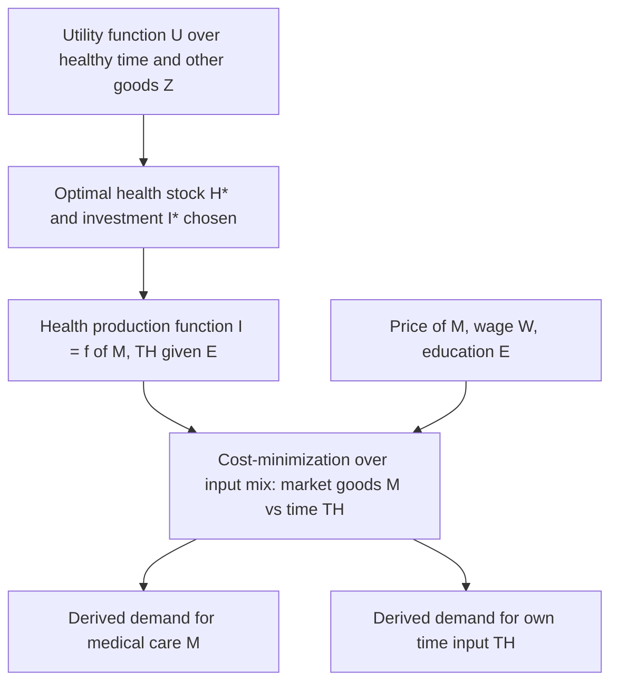

## Derived Demand for Medical Care

### Overview

Medical care is not demanded for its own sake but as an input into the production of health, which is itself demanded for the utility it generates directly and for the healthy time it makes available for market work and leisure. This makes the demand for medical care a **derived demand** in the classical microeconomic sense — analogous to a firm's demand for labor or capital being derived from consumer demand for the final good those inputs produce. This concept is the direct behavioral consequence of the household production framework underlying the Grossman model and is what separates health economics demand theory from standard consumer-good demand theory.

### Distinguishing Direct and Derived Demand

In conventional consumer theory, a good enters the utility function directly:

$$U = U(X_1, X_2, \dots, X_n)$$

and demand for $X_i$ responds to its own price, income, and prices of substitutes/complements via standard utility maximization. Medical care $M$, by contrast, does **not** enter utility directly in the Grossman framework. Instead:

$$U = U(\Phi(H), Z)$$

where $\Phi(H)$ is healthy time (a function of the health stock $H$) and $Z$ is a composite of other consumption goods. Medical care $M$ appears only as an argument of the health production function:

$$I = f(M, TH; E)$$

Demand for $M$ is therefore obtained by first solving the consumer's optimization problem for the optimal health investment path $I_t^*$, and then solving the cost-minimization problem for the input mix ($M$, $TH$) that produces $I_t^*$ at least cost. This two-stage structure is the defining technical feature of derived demand in this context.

### Two-Stage Derivation Formally

**Stage 1 — Optimal investment demand.** The consumer chooses the optimal path of $I_t$ by equating the marginal efficiency of investment to the user cost of health capital:

$$MEI_t = r + \delta_t - \frac{\dot\pi_t}{\pi_t}$$

This determines $I_t^*$, the quantity of health investment desired in each period — but says nothing yet about how much medical care is purchased.

**Stage 2 — Cost-minimizing input choice.** Given the target $I_t^*$, the individual (or household) minimizes the cost of producing it:

$$\min_{M_t, TH_t} \; P_t M_t + V_t TH_t \quad \text{s.t.} \quad f(M_t, TH_t; E_t) = I_t^*$$

where $P_t$ is the market price of medical care and $V_t$ is the shadow value of time (approximated by the wage $W_t$ under standard assumptions of interior time allocation). The first-order condition yields the familiar tangency condition:

$$\frac{MP_M}{MP_{TH}} = \frac{P_t}{V_t}$$

The derived demand for $M_t$ is the solution to this cost-minimization problem, conditional on the Stage 1 optimal $I_t^*$. This is directly analogous to a firm's conditional factor demand for labor and capital, conditional on a chosen output level — the health economics literature borrows this structure explicitly from production theory.

### Own-Price Elasticity and Why It Differs from Standard Goods

Because $M$ is a derived demand, its own-price elasticity depends on two components, mirroring the Marshallian derived-demand elasticity rules (Hicks-Marshall laws of derived demand, adapted from labor economics):

1. **The elasticity of substitution between $M$ and $TH$** in the health production function — if time and medical care are close substitutes (e.g., home monitoring versus clinic visits for routine chronic disease management), demand for $M$ is more price-elastic, since a price increase induces substitution toward time-intensive alternatives.
2. **The elasticity of demand for health investment $I$ itself** — if health investment demand is highly inelastic (e.g., for acute, life-threatening conditions where forgoing treatment is not a viable margin), then even a highly substitutable production technology will not translate into large derived-demand elasticity for $M$, because the "output" being demanded barely responds to changes in its cost of production.

This yields the well-known empirical regularity that demand for acute, non-discretionary medical care (emergency treatment, care for severe/life-threatening conditions) is substantially less price-elastic than demand for discretionary or preventive care, where degree of choice over both the health target and the input mix is much greater. The RAND Health Insurance Experiment's finding of modest but non-trivial price elasticity for ambulatory and outpatient care, contrasted with near-zero elasticity for inpatient/hospital care in emergency contexts, is broadly consistent with this derived-demand structure. [Inference] The RAND estimates are specific to the U.S. cost-sharing designs and time period studied; the qualitative pattern (acute care less elastic than discretionary care) generalizes more robustly than the specific elasticity magnitudes.

### Complements and Substitutes in Production, Not Utility

A key conceptual consequence of derived demand: cross-price relationships between medical care and other inputs (own time, education, other health-related goods) are governed by their relationship in the **production function**, not by preferences. For example:

- If pharmaceuticals and physician visits are substitutes in producing a given health outcome (e.g., home-managed hypertension medication versus regular monitoring visits), a fall in drug prices reduces derived demand for physician time, even though the two goods never appear together in a utility function.
- If medical care and patient time are complements in production (e.g., physical therapy requiring both a provider visit and significant home exercise time), a rise in the wage rate (raising the price of time) can reduce derived demand for the medical care component itself, not just the time component, because the two must be used in relatively fixed proportion.

This is a structurally different mechanism from ordinary Slutsky cross-price effects and is frequently misunderstood in applied health-policy analysis that treats medical care demand using standard consumer-good elasticity intuition without accounting for the underlying production relationship.

### Insurance and the Wedge Between Producer and Consumer Price

Health insurance introduces a wedge between the price the medical care producer faces ($P_t$, the market price) and the price the patient-as-health-producer effectively faces (the out-of-pocket price, $P_t \cdot c_t$ where $c_t$ is the coinsurance rate). Since the cost-minimization first-order condition uses the *effective* price faced by the decision-maker:

$$\frac{MP_M}{MP_{TH}} = \frac{P_t c_t}{V_t}$$

insurance-induced reductions in $c_t$ shift the cost-minimizing input mix toward greater use of $M$ relative to $TH$, independent of any change in the total quantity of health investment desired. This is the derived-demand-theoretic foundation of *ex ante moral hazard* in health insurance: the substitution occurs at the input-mix level (Stage 2), and can occur even without any change in the target health stock $H^*$ (Stage 1) — a distinction often blurred in policy discussions that attribute all insurance-induced utilization increases to a single undifferentiated "moral hazard" effect.

### Graphical Representation: Isoquant and Cost-Minimizing Input Mix

(svg_diagram) Isoquant analysis of derived demand for medical care versus time input:

<svg xmlns="http://www.w3.org/2000/svg" viewBox="0 0 640 440" font-family="Helvetica, Arial, sans-serif">
<text x="320" y="24" text-anchor="middle" font-size="16" font-weight="bold" fill="#1a1a1a">Cost-Minimizing Input Mix for Health Investment (svg_diagram)</text>

<line x1="80" y1="380" x2="580" y2="380" stroke="#333" stroke-width="2" />
<line x1="80" y1="380" x2="80" y2="60" stroke="#333" stroke-width="2" />
<text x="330" y="415" text-anchor="middle" font-size="13" fill="#333">Medical Care, M</text>
<text x="30" y="220" text-anchor="middle" font-size="13" fill="#333" transform="rotate(-90 30 220)">Own Time, TH</text>

<path d="M 110 100 C 200 150, 320 300, 540 360" stroke="#1e8449" stroke-width="3" fill="none" />
<text x="430" y="330" font-size="12" fill="#1e8449">Isoquant: I* (target health investment)</text>

<line x1="130" y1="380" x2="330" y2="80" stroke="#c0392b" stroke-width="2" stroke-dasharray="6,4" />
<text x="335" y="80" font-size="11" fill="#c0392b">Isocost, no insurance (high P*c)</text>

<line x1="180" y1="380" x2="520" y2="90" stroke="#2471a3" stroke-width="2" stroke-dasharray="6,4" />
<text x="440" y="85" font-size="11" fill="#2471a3">Isocost, with insurance (low P*c)</text>

<circle cx="230" cy="200" r="5" fill="#c0392b" />
<text x="150" y="195" font-size="11" fill="#c0392b">Mix A: less M, more TH</text>
<circle cx="380" cy="260" r="5" fill="#2471a3" />
<text x="390" y="290" font-size="11" fill="#2471a3">Mix B: more M, less TH</text>
</svg>

### Wage Effects and Time-Price of Care-Seeking

Because own time $TH$ is a co-input, the wage rate $W_t$ (approximating the value of time) directly affects derived demand for $M$ through the substitution channel described above, independent of income effects. Higher-wage individuals face a higher opportunity cost of time-intensive health-seeking behavior (waiting rooms, self-care, travel time to providers), which — holding the target health investment fixed — shifts the cost-minimizing input mix toward more money-intensive, time-saving forms of medical care (e.g., paying for expedited or concierge care, choosing pharmaceutical treatment over supervised in-person therapy when both are viable substitutes in production).

**Key Points**

- Medical care demand is derived from the demand for health, not health itself; own-price elasticity of medical care is a composite of the elasticity of substitution in health production and the elasticity of demand for health investment.
- Acute/life-threatening care demand is generally far less elastic than discretionary/preventive care demand, consistent with a low underlying elasticity of demand for health investment in acute cases regardless of substitution possibilities.
- Insurance-induced utilization changes operate through the cost-minimizing input-mix margin (Stage 2), which is conceptually distinct from any change in the total desired health stock (Stage 1) — collapsing these into a single "moral hazard" concept obscures the underlying mechanism.
- Wage/time-price effects on medical care demand run through the substitutability of purchased care and own time in the production function, not through a direct utility-based income effect.

### Related Topics

- Grossman model derivation of optimal health investment (Stage 1 optimization)
- Elasticity of substitution in health production and empirical estimation approaches
- RAND Health Insurance Experiment: design, findings, and elasticity estimates by care type
- Moral hazard in health insurance: ex ante versus ex post distinctions
- Agency and information asymmetry in physician-induced demand (a separate deviation from pure derived-demand theory)
- Time costs of medical care: waiting time, travel time, and their role in access barriers
- Cost-minimization and conditional factor demand theory (parallels to labor economics)