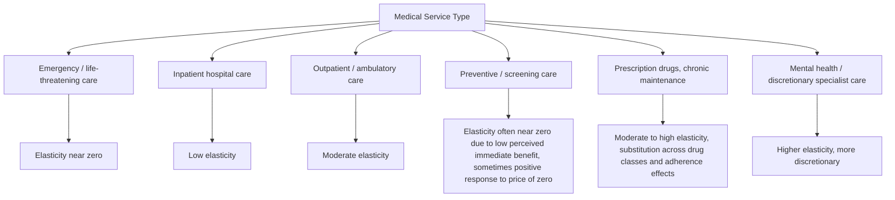

## Price Elasticity of Demand for Medical Services

### Overview

Price elasticity of demand for medical services measures the responsiveness of quantity of medical care demanded to changes in its own price — most relevantly, changes in the out-of-pocket price faced by the patient after insurance coverage. Because medical care is a derived demand (see prior item) embedded in a health production framework, its elasticity is theoretically expected to be low relative to ordinary consumer goods, but empirically it varies substantially by type of service, condition severity, and insurance design. This topic underpins nearly all applied health insurance design, cost-sharing policy, and welfare analysis of moral hazard.

### Formal Definition

The standard own-price elasticity of demand is:

$$\varepsilon_{Q,P} = \frac{\partial Q}{\partial P} \cdot \frac{P}{Q} = \frac{\% \Delta Q}{\% \Delta P}$$

In the health insurance context, the relevant price is typically the **out-of-pocket price**, $P^{oop} = P \cdot c$, where $P$ is the market price and $c$ is the coinsurance rate (or, more generally, the effective marginal price accounting for deductibles, copayments, and coinsurance schedules). Since $c \in [0,1]$ under most insurance arrangements, the elasticity relevant to insurance design is:

$$\varepsilon_{Q,P^{oop}} = \frac{\partial Q}{\partial P^{oop}} \cdot \frac{P^{oop}}{Q}$$

This is distinguished from the elasticity with respect to the full market price $P$, which is rarely the policy-relevant parameter once insurance is present.

### Theoretical Basis for Low Elasticity

Three theoretical channels, consistent with the derived-demand framework, predict low own-price elasticity for medical care relative to typical consumer goods:

1. **Necessity and low substitutability of health itself**: Health enters the utility function as an argument that is difficult to substitute away from using other consumption; unlike ordinary goods, there are few close substitutes for the underlying commodity (healthy time) that medical care helps produce.
2. **Severity-dependent elasticity of health investment demand**: For acute or life-threatening conditions, the derived elasticity of demand for health investment $I$ itself approaches zero, since forgoing treatment carries very high marginal utility cost — mechanically compressing the derived elasticity for $M$ regardless of production-side substitutability.
3. **Information asymmetry and agency**: Physicians, not patients, frequently make or strongly influence the effective quantity decision (see physician-induced demand), which can dampen the observed responsiveness of quantity to the price faced by the patient, since the patient is not the sole locus of the marginal decision.

### The RAND Health Insurance Experiment (HIE)

The RAND HIE (1971–1982) remains the canonical randomized-design evidence base for elasticity estimation. [Unverified] The specific point elasticity estimates below are as widely cited in the literature summarizing RAND, but exact figures vary slightly across published reanalyses and should be treated as approximate, not exact, reproductions of the original study's tables.

**Key Points**

- Overall arc elasticity of demand for medical services was estimated in the range of approximately $-0.1$ to $-0.2$ across the full RAND cost-sharing arms (free care through 95% coinsurance), indicating substantially inelastic demand overall.
- Elasticity was **not uniform across service types**: outpatient/ambulatory care exhibited elasticity closer to $-0.17$ to $-0.2$, while inpatient/hospital care exhibited elasticity closer to $-0.1$ or lower, consistent with the theoretical prediction that acute, high-severity care is less price-responsive.
- The experiment found that cost-sharing reduced both "appropriate" and "inappropriate" utilization roughly proportionally — i.e., patients facing higher cost-sharing did not disproportionately cut low-value care relative to high-value care, a finding with substantial implications for value-based insurance design (discussed below).
- Effects were concentrated at the **extensive margin** (whether to seek care at all / initiate an episode) more than the **intensive margin** (how much care to consume once an episode begins), suggesting the primary behavioral response to price operates through care-seeking initiation rather than through the quantity of care within a treatment episode.

### The Oregon Health Insurance Experiment

A more recent randomized natural experiment — the 2008 Oregon Medicaid lottery — provides complementary evidence via a different mechanism (extending insurance coverage to previously uninsured low-income adults, rather than varying coinsurance among the already-insured). Findings are broadly consistent with RAND's qualitative pattern: gaining insurance coverage (equivalent to a large reduction in effective price) substantially increased utilization across office visits, prescription drugs, and emergency department use, with effects again concentrated more heavily at the extensive margin of care-seeking. [Inference] Because Oregon varies the extensive margin of insurance status itself rather than marginal coinsurance rates within existing coverage, its elasticity estimates are not directly comparable in magnitude to RAND's coinsurance-based estimates, though both point toward meaningfully price/coverage-responsive extensive-margin behavior.

### Elasticity Heterogeneity by Service and Population

Elasticity also varies systematically by:

- **Income**: Lower-income populations exhibit higher own-price elasticity for a given absolute price change, since a fixed copayment represents a larger share of disposable income (documented across RAND subgroup analyses and subsequent Medicaid/Medicare cost-sharing studies).
- **Chronic disease status**: Patients managing chronic conditions requiring ongoing maintenance medication or monitoring (e.g., hypertension, diabetes) show elasticity patterns where price increases can reduce *adherence* to necessary treatment, generating downstream cost increases from complications — the basis of "value-based insurance design" (V-BID) proposals that selectively lower cost-sharing for high-value chronic disease management services.
- **Age**: Elderly populations, facing generally higher baseline utilization and more chronic/acute conditions, tend to exhibit lower price elasticity than younger, healthier populations for comparable service categories.

### Elasticity and Welfare: The Moral Hazard Welfare Triangle

The standard welfare framework (Pauly, Feldstein) models the *welfare loss from moral hazard* using the own-price elasticity directly. With insurance lowering the effective price from $P$ to $P^{oop} = cP$, the demand curve $D(P^{oop})$ generates a quantity response $\Delta Q$, and the deadweight loss from "excess" consumption induced by insurance is approximated by the standard Harberger triangle:

$$DWL \approx \frac{1}{2} \cdot \varepsilon \cdot \frac{(1-c)^2}{c} \cdot P \cdot Q$$

This shows that **welfare loss from moral hazard scales with the square of the coinsurance reduction and linearly with the elasticity** — meaning even a modestly inelastic demand curve can generate meaningful deadweight loss under near-zero coinsurance (first-dollar coverage), which is the central theoretical argument for positive cost-sharing in optimal insurance design (Feldstein's classic result), balanced against the risk-protection benefits of lower cost-sharing.

(svg_diagram) Moral hazard welfare loss triangle under insurance-induced price reduction:

<svg xmlns="http://www.w3.org/2000/svg" viewBox="0 0 640 440" font-family="Helvetica, Arial, sans-serif">
<text x="320" y="24" text-anchor="middle" font-size="16" font-weight="bold" fill="#1a1a1a">Moral Hazard Welfare Loss from Insurance (svg_diagram)</text>

<line x1="80" y1="380" x2="580" y2="380" stroke="#333" stroke-width="2" />
<line x1="80" y1="380" x2="80" y2="60" stroke="#333" stroke-width="2" />
<text x="330" y="415" text-anchor="middle" font-size="13" fill="#333">Quantity of Medical Care, Q</text>
<text x="30" y="220" text-anchor="middle" font-size="13" fill="#333" transform="rotate(-90 30 220)">Price</text>

<path d="M 100 90 L 540 340" stroke="#1e8449" stroke-width="3" fill="none" />
<text x="450" y="315" font-size="12" fill="#1e8449">Demand curve D(P)</text>

<line x1="80" y1="150" x2="580" y2="150" stroke="#c0392b" stroke-width="2" stroke-dasharray="6,4" />
<text x="585" y="154" font-size="11" fill="#c0392b">Market price P</text>

<line x1="80" y1="280" x2="580" y2="280" stroke="#2471a3" stroke-width="2" stroke-dasharray="6,4" />
<text x="585" y="284" font-size="11" fill="#2471a3">OOP price c·P</text>

<line x1="290" y1="150" x2="290" y2="380" stroke="#c0392b" stroke-width="1.5" stroke-dasharray="3,3" />
<text x="290" y="398" text-anchor="middle" font-size="11" fill="#c0392b">Q at P (efficient)</text>
<line x1="410" y1="280" x2="410" y2="380" stroke="#2471a3" stroke-width="1.5" stroke-dasharray="3,3" />
<text x="410" y="398" text-anchor="middle" font-size="11" fill="#2471a3">Q at c·P (insured)</text>

<polygon points="290,150 410,150 410,280" fill="#e74c3c" fill-opacity="0.3" stroke="#c0392b" stroke-width="1" />
<text x="330" y="200" font-size="11" fill="#922b21">DWL triangle</text>
</svg>

### Estimation Challenges

**Endogeneity of insurance choice**: In observational (non-experimental) data, individuals with higher expected medical needs may self-select into more generous insurance plans, biasing naive OLS elasticity estimates. This is why the RAND and Oregon experiments — using random assignment to insurance/cost-sharing arms — are treated as the gold-standard identification strategy; most subsequent quasi-experimental work (regression discontinuity around deductible/coverage-gap thresholds, difference-in-differences around plan design changes) attempts to replicate this identification advantage without full randomization.

**Bunching and non-linear budget sets**: Modern insurance plans (deductibles, out-of-pocket maximums, tiered coinsurance) create kinked, non-linear budget constraints for medical spending. Elasticity estimation in this context increasingly uses "bunching" estimators around kink points (e.g., spending bunching just below a deductible threshold) rather than simple linear price-response regressions, since the marginal price of care varies discontinuously with cumulative spending within a plan year. [Inference] This methodological shift reflects broader adoption of bunching-estimator techniques from public finance (originally developed for taxable income elasticity estimation) rather than a health-economics-specific methodological innovation.

**Dynamic and forward-looking behavior**: Because insurance plans reset annually and marginal price depends on cumulative year-to-date spending, fully rational patients face a dynamic optimization problem (the "end-of-year" spending spike near deductible resets is a well-documented empirical pattern), meaning static, single-period elasticity models can misstate the true behavioral response to price schedules that are non-linear over the plan year.

### Policy Applications

**Next Steps**

- **Cost-sharing design**: Low-to-moderate estimated elasticities support cautious cost-sharing increases as a modest utilization-management lever, but the RAND finding that cost-sharing cuts high-value and low-value care roughly proportionally motivates targeted, rather than uniform, cost-sharing design.
- **Value-based insurance design (V-BID)**: Directly operationalizes elasticity heterogeneity by service value — lowering or eliminating cost-sharing for high-value chronic disease management and preventive services (where non-adherence elasticity generates downstream costs) while maintaining or raising cost-sharing for discretionary/low-value services.
- **Reference pricing and tiered networks**: Exploit elasticity heterogeneity across providers for clinically equivalent services (e.g., imaging, elective procedures) by setting insurer payment at a reference price and exposing patients to the full marginal cost above it, targeting the more price-elastic *provider-choice* margin rather than the less-elastic *whether-to-seek-care* margin.
- **Optimal coinsurance rate (Feldstein-style)**: The Harberger-triangle welfare framework provides a formal basis for deriving welfare-optimal coinsurance rates balancing moral hazard deadweight loss against risk-protection value, though the model's practical calibration remains sensitive to elasticity estimates that vary substantially across the service-type heterogeneity discussed above.

### Related Topics

- Derived demand for medical care and the two-stage optimization structure
- RAND Health Insurance Experiment: full experimental design and subgroup results
- Oregon Health Insurance Experiment and Medicaid expansion natural experiments
- Feldstein's welfare-loss-from-moral-hazard model and optimal coinsurance derivation
- Value-based insurance design (V-BID) principles and implementation examples
- Bunching estimators and non-linear budget set methods in health economics
- Physician-induced demand and supplier-side deviations from patient-driven elasticity
- Adverse selection versus moral hazard: distinguishing insurance market failures