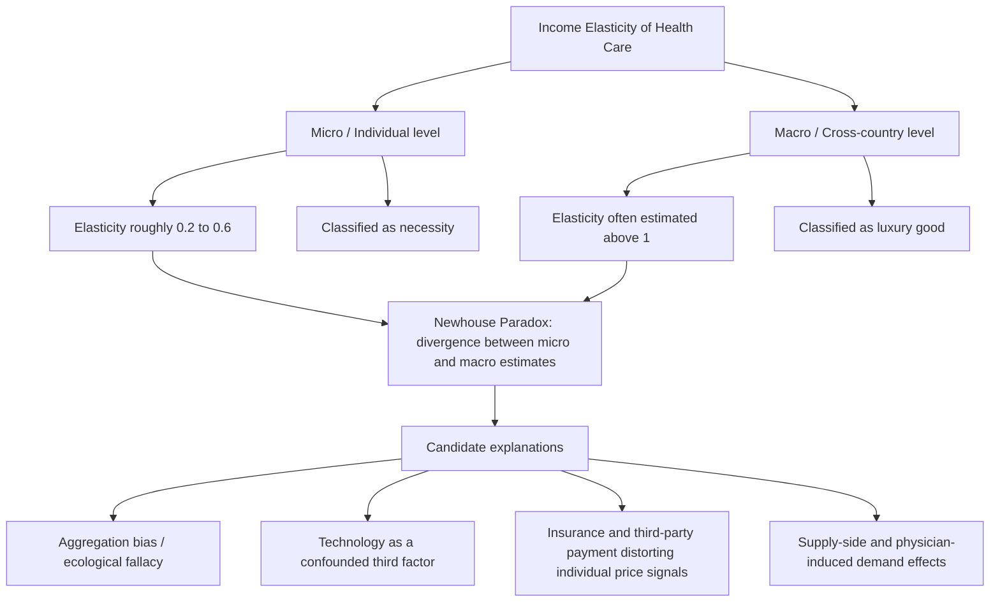

## Income Elasticity of Demand for Health Care

### Overview

Income elasticity of demand for health care measures the percentage change in quantity of health care demanded (or health expenditure) in response to a one percent change in income, holding price and other factors constant. This parameter carries unusual theoretical weight in health economics because its estimated magnitude has been used both to classify health care as a "necessity" or "luxury" good at the individual level and — far more controversially — to explain the aggregate relationship between national income and health spending across countries, a debate that has generated one of the more persistent methodological controversies in the field.

### Formal Definition

$$\varepsilon_{Q,Y} = \frac{\partial Q}{\partial Y} \cdot \frac{Y}{Q} = \frac{\% \Delta Q}{\% \Delta Y}$$

where $Y$ is income (individual, household, or in cross-country studies, national income/GDP per capita) and $Q$ is quantity or expenditure on health care. By convention:

- $\varepsilon_{Q,Y} < 0$: inferior good
- $0 < \varepsilon_{Q,Y} < 1$: normal good, necessity (income-inelastic)
- $\varepsilon_{Q,Y} > 1$: normal good, luxury (income-elastic)

The distinction between micro-level (individual/household) and macro-level (national aggregate) income elasticity estimates is the central organizing issue in this literature, as the two produce systematically different conclusions.

### Individual-Level Income Elasticity

At the household/individual level, embedded in the Grossman demand-for-health framework, income affects health care demand through the two channels described previously: the direct budget-expansion effect on purchasing power for $M_t$, and the offsetting time-price effect via the rising opportunity cost of time in health production as wages rise. This theoretical ambiguity is reflected in the empirical estimates.

**Key Points**

- Cross-sectional household survey-based studies (including RAND HIE subgroup analyses controlling for price) generally estimate individual-level income elasticity for health care in the range of roughly 0.2 to 0.6, consistent with health care functioning as a **necessity** at the individual level — income-inelastic but still a normal good.
- Prescription drugs and outpatient physician visits tend to show somewhat higher individual-level income elasticity than inpatient hospital care, which is largely need-driven and less discretionary regardless of income.
- Preventive and elective care categories (dental care, elective procedures, wellness services) tend to exhibit higher income elasticity than acute/emergency care, consistent with the same severity-based elasticity gradient observed in own-price elasticity studies.
- [Unverified] Point estimates vary substantially by country, dataset, time period, and econometric specification (particularly whether health insurance status and price are adequately controlled for), so cited numeric ranges should be treated as broadly indicative rather than as precise, universally transferable parameters.

### The Aggregate (Cross-Country) Puzzle: Newhouse's Finding

At the aggregate/national level, the empirical picture diverges sharply from the individual-level results. Newhouse's seminal 1977 cross-national study found that **national income (GDP per capita) explained the overwhelming majority of cross-country variation in health expenditure**, with an estimated income elasticity of national health spending with respect to GDP per capita **greater than 1** — placing aggregate health spending in the "luxury good" category, in stark contrast to the necessity classification typical at the individual level.

This became known as the central puzzle of health economics macro-demand literature: **why does health care appear to be a necessity at the micro level but a luxury at the macro level?**

### Candidate Explanations for the Micro-Macro Divergence

**Aggregation bias / ecological fallacy**: Country-level GDP per capita is correlated with numerous confounding factors (institutional quality, insurance system generosity, demographic structure, availability of medical technology) that independently drive health spending, meaning the cross-country regression coefficient on income captures far more than the pure income effect isolated in individual-level demand studies. Regressing aggregate spending on aggregate income does not recover the same structural parameter as regressing individual quantity demanded on individual income, since the aggregate regression conflates income with these omitted correlated factors.

**Medical technology as a confounded input**: A widely cited explanation (associated with Newhouse's own subsequent work and later formalized by others including Weisbrod) holds that rising income permits — and indirectly funds — the development and diffusion of new, generally more expensive medical technology, which itself is the primary driver of rising health spending. Under this account, income is not directly "purchasing more health care" in the individual demand-curve sense; rather, higher-income *societies* fund more R&D and adopt more technology, and it is the resulting technological change that shifts the entire health-production and cost structure, generating a spurious high aggregate income elasticity when technology is omitted from the regression. [Inference] This technology-mediated channel is generally regarded as the leading explanation in the literature, though it is difficult to fully disentangle empirically because technology adoption itself is partly endogenous to income and insurance generosity, creating a further identification challenge rather than a clean resolution.

**Insurance-mediated distortion of individual price signals**: Because most individual-level health care consumption occurs under third-party payment (insurance), the price signal actually facing individual consumers is heavily attenuated relative to the true resource cost of care. This means individual-level demand studies estimate income elasticity along a demand curve that has already been shifted/flattened by insurance, while aggregate spending reflects the full resource cost — potentially explaining part, though not all, of the divergence.

**Supply-side and physician-agency effects**: Since physicians substantially influence utilization decisions (see physician-induced demand), and physician supply, capacity, and practice norms tend to expand with national income and healthcare system investment, aggregate spending growth may partly reflect supply-side expansion correlated with income rather than pure patient-side income-driven demand.

### Graphical Representation: Divergent Elasticity Estimates

(svg_diagram) Micro versus macro income elasticity comparison:

<svg xmlns="http://www.w3.org/2000/svg" viewBox="0 0 640 420" font-family="Helvetica, Arial, sans-serif">
<text x="320" y="24" text-anchor="middle" font-size="16" font-weight="bold" fill="#1a1a1a">Micro vs. Macro Income Elasticity of Health Care (svg_diagram)</text>

<line x1="80" y1="370" x2="580" y2="370" stroke="#333" stroke-width="2" />
<line x1="80" y1="370" x2="80" y2="60" stroke="#333" stroke-width="2" />
<text x="330" y="400" text-anchor="middle" font-size="13" fill="#333">Percent Change in Income</text>
<text x="30" y="215" text-anchor="middle" font-size="13" fill="#333" transform="rotate(-90 30 215)">Percent Change in Health Spending</text>

<line x1="80" y1="370" x2="480" y2="70" stroke="#7d7d7d" stroke-width="2" stroke-dasharray="6,4" />
<text x="485" y="70" font-size="11" fill="#7d7d7d">Unit elasticity (slope = 1)</text>

<line x1="80" y1="370" x2="480" y2="230" stroke="#2471a3" stroke-width="3" />
<text x="485" y="228" font-size="12" fill="#2471a3">Micro-level (necessity, ε ≈ 0.3-0.6)</text>

<line x1="80" y1="370" x2="360" y2="60" stroke="#c0392b" stroke-width="3" />
<text x="365" y="60" font-size="12" fill="#c0392b">Macro cross-country (luxury, ε &gt; 1)</text>

<text x="330" y="45" text-anchor="middle" font-size="11" fill="#555">Newhouse (1977) divergence illustrated schematically</text>

</svg>

### Implications for Health Spending Forecasting

The macro income elasticity estimate has direct policy relevance for long-run health expenditure forecasting and the "cost disease" debate. If aggregate health spending is genuinely income-elastic (a luxury good in the Newhouse sense), then rising national income alone predicts a rising health-spending-to-GDP ratio over time even absent any change in underlying prices, insurance design, or demographic structure — a mechanical implication used in projections by government actuaries and international bodies (e.g., OECD health spending projections). Critics of this application argue that using the cross-sectional elasticity estimate to forecast time-series growth conflates a **level comparison across countries at a point in time** with a **within-country growth process over time**, which need not share the same structural elasticity if the drivers (e.g., technology diffusion rates, insurance system maturation) evolve differently across the cross-section versus the time dimension.

### Methodological Critiques and Refinements

- **Panel data and fixed-effects approaches**: More recent studies using panel data with country and time fixed effects (rather than single cross-section regressions) generally find **lower** income elasticity estimates than Newhouse's original cross-section, since fixed effects absorb time-invariant country characteristics (institutional quality, baseline technology level) that were previously confounded with income in the pure cross-section.
- **Non-stationarity and cointegration concerns**: Because both health spending and GDP are trending (non-stationary) time series, naive time-series regressions of spending on income risk spurious regression problems; cointegration-based approaches have been used in later literature to address this, generally yielding elasticity estimates closer to unity than Newhouse's original luxury-good finding, though [Unverified] the precise estimates remain sensitive to sample period and country composition.
- **Outlier sensitivity**: The U.S. observation, an extreme outlier in both income and health spending share of GDP among high-income countries, has been shown in several reanalyses to exert disproportionate leverage on the estimated cross-country income elasticity coefficient; excluding or down-weighting the U.S. materially changes estimated elasticity in some specifications.

### Applied and Policy Relevance

**Next Steps**

- **Long-term fiscal projections**: Government and multilateral (e.g., OECD, IMF) long-run health spending projections rely heavily on assumed income elasticity parameters; the choice between micro-consistent (necessity, $\varepsilon < 1$) and macro-consistent (luxury, $\varepsilon > 1$) assumptions produces materially different long-run spending share trajectories, making this parameter choice a first-order determinant of fiscal sustainability forecasts.
- **Technology policy as a spending lever**: If the technology-mediated explanation of the Newhouse puzzle is correct, policy levers aimed at moderating the *rate and cost-effectiveness of technology diffusion* (health technology assessment, comparative effectiveness research, coverage-with-evidence-development schemes) may be more effective spending-growth levers than policies aimed directly at patient-facing price or income effects.
- **Distinguishing "need" from "demand" in resource allocation**: The necessity classification at the individual level supports policy frameworks (e.g., universal coverage mandates) premised on health care being a basic, income-inelastic need rather than a discretionary luxury purchase — a normative link frequently drawn between this empirical parameter and equity-based insurance policy arguments, though this is a values-based inference rather than a conclusion the elasticity estimate itself logically compels.

### Related Topics

- Newhouse (1977) cross-national health expenditure study and its methodological legacy
- Medical technology as an endogenous driver of health spending growth ("cost disease" debate)
- Grossman model demand-for-health and the theoretical ambiguity of the income effect
- Physician-induced demand and supply-side determinants of aggregate utilization
- Panel data and cointegration methods in health expenditure forecasting
- OECD and government health spending projection methodologies
- Baumol's cost disease and its application to labor-intensive health service sectors
- Price elasticity of demand for medical services (companion parameter in demand estimation)