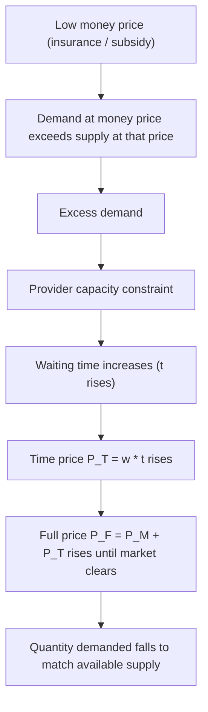

## Time Costs and the Full Price of Care

### Overview

In healthcare economics, the **money price** charged for a medical service (the copayment, coinsurance, or out-of-pocket fee) systematically understates the true economic burden borne by a patient. The **full price** of care incorporates both the direct monetary outlay and the **time costs** associated with obtaining that care. This distinction, formalized in the work of health economists building on Grossman's model of health capital and Becker's theory of time allocation, is central to understanding why demand for health care does not respond to money price alone.

### The Full Price Framework

#### Basic Definition

The full price ($P_F$) of a medical encounter is defined as:

$$P_F = P_M + P_T$$

where:

- $P_M$ = the money price (out-of-pocket payment, copay, coinsurance)
- $P_T$ = the time price, i.e., the monetized value of time spent obtaining care

#### Time Price Formalization

The time price component is typically modeled as:

$$P_T = w \times t$$

where:

- $w$ = the patient's opportunity cost of time (often approximated by the wage rate)
- $t$ = total time spent in the process of obtaining care (hours)

Total time $t$ is usually decomposed into several sub-components:

$$t = t_{travel} + t_{wait} + t_{treatment} + t_{recovery}$$

- $t_{travel}$: time traveling to and from the provider
- $t_{wait}$: time spent in the waiting room or waiting for an appointment slot
- $t_{treatment}$: time spent actually receiving the service
- $t_{recovery}$: any time lost from work or normal activities during recuperation

**Key Points**

- Time costs are a real economic cost even though no money changes hands.
- Because $w$ varies across individuals, two patients facing an identical money price can face very different full prices.
- Time costs are non-insurable: no conventional health insurance plan reimburses a patient for the hours lost sitting in a waiting room.

### Why Time Costs Matter for Demand

#### Standard Demand Curve Bias

Empirical demand studies that regress utilization only on money price (net of insurance) will misstate the true price elasticity of demand if they ignore time costs. If time costs move inversely with money price — for example, a "free" public clinic with near-zero money price but very long queues — then apparent insensitivity to money price may actually reflect substitution of time cost for money cost, not low price elasticity per se.

This produces the classic result that **the demand curve for medical care is a demand curve for a bundle (money price, time price)**, not money price alone. A policy that reduces money price (e.g., first-dollar insurance coverage) without addressing capacity will, in equilibrium, raise time price (longer waits) until $P_F$ re-equilibrates — a mechanism closely related to non-price rationing.

#### Graphical Illustration (svg_diagram)

<svg xmlns="http://www.w3.org/2000/svg" viewBox="0 0 720 480" font-family="Helvetica, Arial, sans-serif">
<text x="360" y="28" text-anchor="middle" font-size="18" font-weight="bold" fill="#1a1a1a">Full Price vs. Money Price Demand (svg_diagram)</text>

<line x1="90" y1="420" x2="670" y2="420" stroke="#333" stroke-width="2" />
<line x1="90" y1="420" x2="90" y2="60" stroke="#333" stroke-width="2" />
<text x="380" y="455" text-anchor="middle" font-size="14" fill="#333">Quantity of Care Demanded (Q)</text>
<text x="35" y="240" text-anchor="middle" font-size="14" fill="#333" transform="rotate(-90 35 240)">Price</text>

<path d="M 130 90 C 300 180, 450 300, 620 400" stroke="#0b6e99" stroke-width="3" fill="none" />
<text x="600" y="410" font-size="13" fill="#0b6e99" font-weight="bold">D (full price)</text>

<line x1="90" y1="360" x2="670" y2="360" stroke="#c0392b" stroke-width="2" stroke-dasharray="6,4" />
<text x="600" y="352" font-size="13" fill="#c0392b" font-weight="bold">Money price (P_M) after insurance</text>

<line x1="90" y1="230" x2="670" y2="230" stroke="#27ae60" stroke-width="2" stroke-dasharray="6,4" />
<text x="600" y="222" font-size="13" fill="#27ae60" font-weight="bold">Full price (P_F = P_M + P_T)</text>

<line x1="90" y1="360" x2="330" y2="360" stroke="#c0392b" stroke-width="1" stroke-dasharray="2,2" />
<line x1="330" y1="360" x2="330" y2="420" stroke="#c0392b" stroke-width="1" stroke-dasharray="2,2" />
<text x="330" y="438" text-anchor="middle" font-size="12" fill="#c0392b">Q at P_M (naive)</text>
<line x1="90" y1="230" x2="230" y2="230" stroke="#27ae60" stroke-width="1" stroke-dasharray="2,2" />
<line x1="230" y1="230" x2="230" y2="420" stroke="#27ae60" stroke-width="1" stroke-dasharray="2,2" />
<text x="230" y="438" text-anchor="middle" font-size="12" fill="#27ae60">Q* at P_F (true)</text>

<path d="M 330 250 Q 280 260 235 245" stroke="#555" stroke-width="1" fill="none" marker-end="url(#arrow)" />
<text x="380" y="270" font-size="12" fill="#555">Overestimated quantity if</text>
<text x="380" y="286" font-size="12" fill="#555">time cost is ignored</text>
</svg>

### Determinants of the Value of Time ($w$)

The wage rate proxy for $w$ is a simplification. Several refinements are used in applied work:

1. **Market wage rate**: For working individuals whose work hours are flexible, forgone wages approximate the opportunity cost of time (Becker's household production framework).
2. **Shadow price of time for non-workers**: For retirees, students, or those out of the labor force, $w$ must be imputed — often using reservation wages, home-production value, or a fraction of the market wage for similar demographic groups.
3. **Household production substitution**: A patient may not personally bear full time cost if a household member (e.g., an adult child accompanying an elderly parent) absorbs part of $t$. In this case, the relevant $w$ is a household-weighted average, not solely the patient's own wage.
4. **Income effects on $w$**: Higher-income patients have a higher $w$, making them more time-price-sensitive and money-price-insensitive; lower-income patients typically face the reverse pattern — higher sensitivity to money price and lower opportunity cost of time (though this can be complicated by irregular or inflexible work schedules that raise the *effective* cost of time missed from work, e.g., risk of job loss).

**Key Points**

- $w$ is heterogeneous across the population, so time cost is not a fixed adjustment — it must be modeled per subgroup.
- Time cost regressivity is theoretically ambiguous: it can burden low-wage workers disproportionately (job/income risk from missed work) even though their monetized $w$ is lower.

### Empirical Estimation Approaches

#### Acton's Classic Model (1975)

Jan Paul Acton's foundational study of time price and demand for emergency room and outpatient visits demonstrated that when travel and waiting time were included in the "full price," demand elasticities changed substantially compared to models using money price alone. Acton found that time price elasticities could be as large as or larger than money price elasticities, particularly for low-income patients who are often more sensitive to time costs at public/subsidized facilities because they represent a scarcer resource relative to income (or, in some formulations, because these patients have less flexible schedules).

[Inference] Some literature also finds time price elasticity varies with the type of visit (i.e., differs between preventive and acute care) and the availability of substitute providers, though the sign and magnitude of these differences depend on the specific dataset and time period studied.

#### General Estimating Equation

A stylized empirical demand function incorporating full price:

$$Q_d = f(P_M, P_T, Y, X)$$

which, after substituting $P_T = w \cdot t$, becomes:

$$Q_d = f(P_M, w \cdot t, Y, X)$$

where $Y$ is income and $X$ is a vector of other demand shifters (health status, insurance coverage, demographics).

Researchers estimate this by regressing utilization on both money price and a constructed or observed time cost variable (travel distance/time, average clinic wait time, appointment lag), often using instruments for time cost (e.g., provider density, distance to nearest facility) to address endogeneity — since waiting time itself is partly a function of demand (a simultaneity problem).

### Practical Example

**Example**

Consider two patients seeking care for a routine checkup at a community clinic where the money price after insurance is $20 for both.

- **Patient A** (hourly wage $15): Spends 1 hour traveling, 1.5 hours waiting, and 0.5 hours in treatment = 3 hours total.

  $$P_T^A = 15 \times 3 = \$45$$

  $$P_F^A = 20 + 45 = \$65$$
- **Patient B** (hourly wage $45, salaried professional who must take unpaid leave in half-day increments equivalent to 4 hours of lost time): 

  $$P_T^B = 45 \times 4 = \$180$$

  $$P_F^B = 20 + 180 = \$200$$

Despite an identical money price, Patient B's full price is more than three times higher than Patient A's. If Patient B has a flexible remote-work schedule, however, their effective $t$ (and thus $P_T^B$) could shrink dramatically — illustrating that flexibility of the work schedule, not wage alone, materially affects realized time cost.

### Policy Implications

#### Non-Price Rationing and Waiting Lists

In systems with low or zero money price at the point of service (e.g., some single-payer systems, community health centers, VA facilities), waiting time often functions as the primary rationing mechanism, substituting for money price in equilibrating supply and demand. This is sometimes referred to as **rationing by waiting** or **time-price rationing**.

#### Implications for Equity

Because time cost falls disproportionately (in relative terms) on patients with inflexible jobs, unpaid caregiving duties, or unreliable transportation, policies that lower money price without addressing capacity or convenience (e.g., extended hours, telehealth, reduced travel burden) may fail to achieve their intended equity goals. Conversely, telehealth and same-day scheduling innovations reduce $t$ directly, lowering full price without changing money price — a mechanism increasingly emphasized in access-to-care policy design.

#### Value-of-Time Adjustments in Cost-Effectiveness Analysis

Health technology assessment and cost-effectiveness analyses increasingly recommend including patient and caregiver time costs as a component of the **societal perspective** cost calculation, alongside direct medical costs. The Second Panel on Cost-Effectiveness in Health and Medicine (Sanders et al., 1996; updated 2016) explicitly recommends valuing patient time using either the wage-rate approach or a friction-cost approach, depending on the analytic perspective chosen.

### Distinguishing Concepts: Time Cost vs. Related Constructs

| Concept | Definition | Relationship to Time Cost |
| --- | --- | --- |
| **Money price** | Direct out-of-pocket payment | Additive component of full price |
| **Time price** | Monetized opportunity cost of time spent obtaining care | Additive component of full price |
| **Access cost** | Broader concept including psychological, informational, and logistical barriers | Time cost is a subset/proxy of access cost |
| **Opportunity cost of illness** | Value of lost productivity/leisure due to being sick (not seeking care) | Distinct: this is a cost of the *illness*, not of *obtaining treatment* |
| **Indirect cost (in cost-of-illness studies)** | Broader term sometimes encompassing both time cost of treatment-seeking and lost productivity due to illness/death | Time cost is a component of indirect cost |

**Key Points**

- Time cost is specifically about the process of *obtaining* care, not the cost of being sick in general.
- In cost-of-illness accounting frameworks, time costs of treatment-seeking are typically separated from morbidity/mortality-related productivity losses.

### Limitations and Critiques

[Inference] Several methodological challenges are commonly raised in the literature, though the degree of concern varies by study design:

- **Endogeneity of waiting time**: Longer waits may reflect higher perceived quality (more popular, presumably better providers), confounding the price effect with a quality effect.
- **Heterogeneous valuation of time**: Not all time has equal disutility; waiting time may be valued differently than travel time or treatment time itself (e.g., waiting is often considered more onerous per minute than traveling, sometimes modeled with a "boredom" or disutility multiplier greater than 1).
- **Wage rate as a proxy**: Using market wage for $w$ assumes marginal labor-leisure substitutability, which may not hold for salaried workers, caregivers, or individuals with fixed shift schedules — this is a recognized simplification, not a strict empirical law.
- **[Unverified] magnitude generalizability**: Specific elasticity estimates from older studies (e.g., Acton's 1970s ER data) may not generalize to contemporary settings given changes in transportation, telehealth availability, and labor market flexibility.

### Related Topics

- Grossman's model of the demand for health as an investment/consumption good
- Price elasticity of demand for medical care (Rand Health Insurance Experiment)
- Non-price rationing mechanisms in healthcare systems
- Opportunity cost and time allocation theory (Becker, 1965)
- Access to care: geographic, financial, and temporal barriers
- Telehealth and its effect on the time price of care
- Societal perspective vs. healthcare-sector perspective in cost-effectiveness analysis
- Friction-cost method vs. human-capital method for valuing productivity/time losses
- Waiting times in single-payer health systems (comparative health systems analysis)
- Induced demand and physician-patient agency relationships