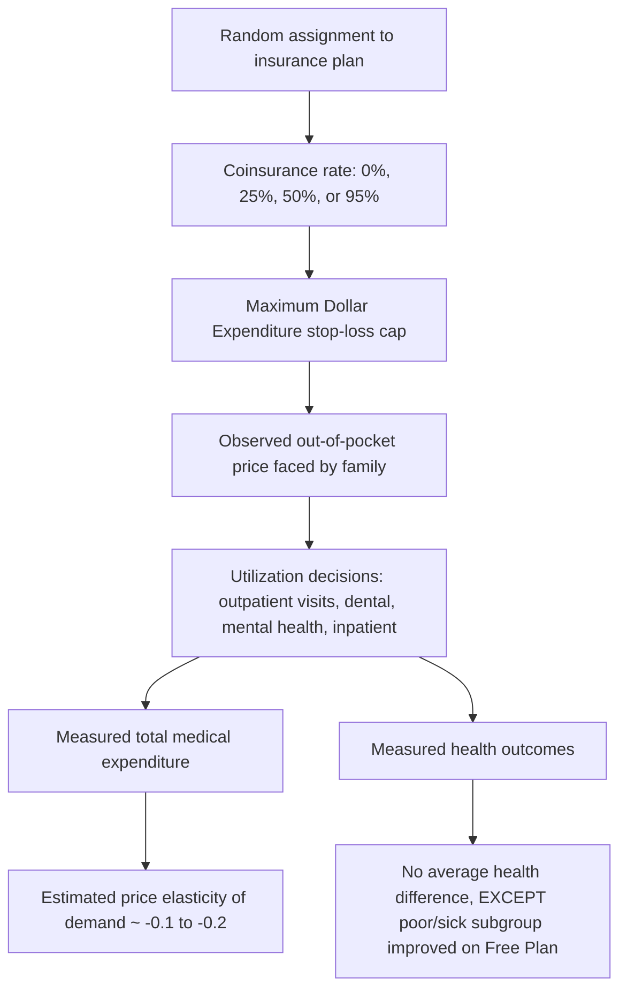

## The RAND Health Insurance Experiment

### Overview

The RAND Health Insurance Experiment (HIE) was a large-scale, randomized controlled trial conducted in the United States between 1971 and 1982 to measure the causal effect of cost-sharing (coinsurance, deductibles) on the demand for medical care and on health outcomes. It remains the single most influential empirical study in health economics for estimating the price elasticity of demand for health care services, and it directly underpins the theoretical predictions of moral hazard discussed elsewhere in demand-for-care models.

### Study Design

#### Sampling and Sites

The RAND HIE enrolled approximately 2,750 families (about 7,700 individuals) between the ages of 14 and 61, drawn from six sites across the United States: Dayton, Ohio; Seattle, Washington; Fitchburg and Franklin County, Massachusetts; and Charleston and Georgetown County, South Carolina. Sites were selected to represent variation in urban/rural composition, region, and medical care market characteristics.

#### Randomization Mechanism

Families were randomly assigned to one of several health insurance plans that varied along two dimensions:

1. **Coinsurance rate**: the percentage of costs the family paid out of pocket
2. **Maximum Dollar Expenditure (MDE)**: an annual out-of-pocket spending cap (a stop-loss provision), set at the lesser of a fixed dollar amount or a percentage of family income (5%, 10%, or 15%), beyond which the plan paid 100% of costs

#### Plan Types

| Plan | Coinsurance Rate | Notes |
| --- | --- | --- |
| Free Plan | 0% | Fully free care at point of service |
| 25% Plan | 25% | Partial cost-sharing |
| 50% Plan | 50% | Partial cost-sharing |
| 95% Plan | 95% (approx.) | Near full cost-sharing, subject to MDE cap |
| Individual Deductible Plan | 95% for outpatient care up to a deductible, then free | Free inpatient care; deductible applied per individual, not family, for outpatient services |

**Key Points**

- All plans covered inpatient hospitalization essentially fully once the family's MDE was reached, isolating the study's cost-sharing variation primarily to ambulatory/outpatient care decisions below that threshold.
- The design allowed RAND to trace out multiple points on the demand curve rather than comparing only two discrete states (insured vs. uninsured).
- Enrollees experienced no risk of catastrophic loss because of the MDE cap, which is an important scope condition when generalizing the results to uninsured populations facing unlimited exposure.

#### Duration and Attrition Controls

Most families participated for three years, with a subset enrolled for five years to test for anticipatory or long-run behavioral responses. To prevent adverse selection into more generous plans, RAND compensated all participants with lump-sum payments calibrated to make participation in any assigned plan financially neutral or superior relative to their prior insurance arrangement.

### Core Empirical Findings

#### Price Elasticity of Demand for Medical Care

The central estimate from the RAND HIE is that the arc price elasticity of demand for medical services is modest and negative, generally estimated around $-0.1$ to $-0.2$ for overall medical expenditure, indicating that health care demand is price-inelastic but not perfectly inelastic — a foundational empirical anchor for the theoretical demand curves discussed in this chapter.

$$E_d = \frac{\%\Delta Q_d}{\%\Delta P} \approx -0.2$$

Free care increased total medical spending substantially relative to the 95% coinsurance plan — enrollees on the Free Plan spent roughly 45% more on medical care than those on the 95% (near-catastrophic) plan.

#### Differential Elasticity by Service Type

The demand response was not uniform across categories of care:

- **Outpatient/ambulatory care**: More price-responsive; the largest behavioral effects were observed here, since these are more discretionary, lower-cost, and more easily deferred or foregone decisions.
- **Inpatient/hospital care**: Substantially less price-responsive, consistent with the theory that hospitalization decisions are typically physician-directed and involve less patient discretion at the point of service (supporting the physician-as-agent / supplier-induced-demand literature).
- **Dental care**: Similarly price-responsive to outpatient medical care.
- **Mental health care**: Found to be more price-elastic than most physical health services, prompting the plans to include special, more restrictive limits on mental health visits.

#### The "One-Third to Two-Thirds" Rule of Thumb

[Inference] A commonly cited heuristic drawn from RAND HIE results is that moving from a 25% coinsurance rate to free care increases spending by roughly one-third, while moving from free care to a 95% coinsurance plan decreases spending by roughly one-third relative to the 25% plan — though exact magnitudes vary by outcome measure and specification, so this should be treated as an approximate summary rather than a precise universal ratio.

#### Health Outcomes

For the average enrollee, the RAND HIE found no statistically detectable difference in general health status between the Free Plan and the cost-sharing plans, suggesting that the additional care consumed under free care was, on average, of limited marginal clinical value for the broadly healthy population studied.

However, subgroup analysis found an important exception: for the poorest and sickest participants (approximately the bottom fifth of the income distribution combined with elevated baseline health risk), free care was associated with measurably better outcomes on several clinical indicators, including:

- Better control of hypertension (blood pressure)
- Improved vision correction outcomes
- Fewer serious symptoms/conditions among high-risk, low-income participants

**Key Points**

- The "no difference on average, but benefit for the poor and sick" finding is central to arguments both for and against high-deductible/high-cost-sharing insurance designs.
- The result implies heterogeneous marginal benefit of medical care by income and health risk, a nuance often collapsed in simplified summaries of the study.

### Diagrammatic Summary of the Design-to-Outcome Pathway

### Theoretical Interpretation: Moral Hazard

The RAND HIE is frequently cited as the primary empirical validation of **ex post moral hazard** in health insurance markets — the tendency of insured individuals to consume more medical care than they would if fully exposed to marginal cost, precisely because the insurance contract lowers the marginal money price they face at the point of service. This connects directly to the standard consumer demand model:

$$Q_d = f(P_{oop}, Y, X)$$

where $P_{oop}$ is out-of-pocket price. As insurance coverage becomes more generous, $P_{oop} \to 0$, and consumption rises along the demand curve toward the quantity implied by a near-zero price, even though the full social marginal cost of that care remains positive and is instead borne by the risk pool (other premium payers).

### Welfare Implications

Because demand is inelastic but not perfectly so, the RAND HIE evidence has been used to argue that first-dollar (zero cost-sharing) insurance generates a **welfare loss (deadweight loss) from overconsumption** relative to the socially efficient quantity, illustrated by the standard "welfare triangle" argument in insurance economics: consumers purchase units of care up to the point where their marginal private benefit equals the low out-of-pocket price, even though marginal social cost is much higher.

$$DWL \approx \frac{1}{2} \times \Delta P \times \Delta Q$$

This is the theoretical basis for cost-sharing mechanisms (deductibles, coinsurance, copayments) as tools to mitigate moral hazard, balanced against the risk-protection benefits that comprehensive insurance provides — the central efficiency-versus-risk-protection tradeoff in health insurance design.

### Methodological Strengths

- **True randomization**: Unlike most health care utilization studies (which are observational and subject to selection bias — sicker people select more generous coverage), the RAND HIE's randomized design supports a causal interpretation of the price-utilization relationship.
- **Multiple price points**: Because several coinsurance rates were tested simultaneously, researchers could estimate a full demand curve rather than a single average treatment effect.
- **Long observation window**: Multi-year participation allowed measurement of both short-run utilization shifts and, for the five-year subsample, some persistence checks.

### Limitations and Critiques

[Inference] Several limitations are commonly raised regarding the external validity of RAND HIE findings for contemporary policy debates, though the core price-elasticity finding itself is robust and widely replicated in follow-up work:

- **Era and cost structure**: The experiment was conducted in the 1970s–1980s; medical technology, treatment intensity, and the composition of health spending (e.g., much higher current shares devoted to prescription drugs and high-cost specialty care) have changed substantially since then.
- **Excluded populations**: The study excluded those aged 62 and older (Medicare-eligible) and did not include institutionalized populations, limiting generalizability to the elderly and severely disabled.
- **MDE cap**: Because all plans capped out-of-pocket exposure, the study cannot speak directly to behavior under truly uninsured, uncapped catastrophic financial risk.
- **Compensating payments**: Since RAND paid participants to neutralize the financial risk of enrollment, it is possible (though not clearly demonstrated in the literature) that behavioral responses under a real-world, non-compensated switch to higher cost-sharing could differ from the experimental setting.
- **Follow-up work (e.g., the Oregon Health Insurance Experiment, 2008)**, which randomized access to Medicaid coverage via lottery, has been used to test and partially corroborate some RAND-era findings in a modern Medicaid context, though methodological differences (insurance vs. no insurance, rather than varying coinsurance tiers) limit direct comparability.

### Practical Example

**Example**

Suppose a policymaker is evaluating whether to move a public insurance plan from a 20% coinsurance rate to a 0% (free) rate for primary care visits. Using the RAND-derived elasticity of approximately $-0.2$:

$$\%\Delta Q_d = E_d \times \%\Delta P = (-0.2) \times (-100\%) = +20\%$$

If moving from 20% coinsurance to 0% coinsurance represents (approximately) a 100% reduction in the out-of-pocket price paid, the RAND elasticity estimate would predict roughly a 20% increase in visit volume. [Inference] This is a simplified linear extrapolation for illustrative purposes; actual point elasticities are not necessarily constant across the full range of price changes, and RAND's own arc-elasticity estimates were derived from the specific coinsurance tiers tested (25%, 50%, 95%) rather than from a 20%-to-0% comparison.

### Related Topics

- Moral hazard (ex ante vs. ex post) in health insurance
- Price elasticity of demand for medical care
- Deductibles, coinsurance, and copayments as cost-sharing instruments
- The Oregon Health Insurance Experiment and Medicaid expansion studies
- Adverse selection vs. moral hazard in insurance markets
- Welfare economics of health insurance (deadweight loss framework)
- Supplier-induced demand and the physician-as-agent model
- High-deductible health plans (HDHPs) and consumer-directed health care
- Grossman's model of health as human capital
- Time costs and the full price of care