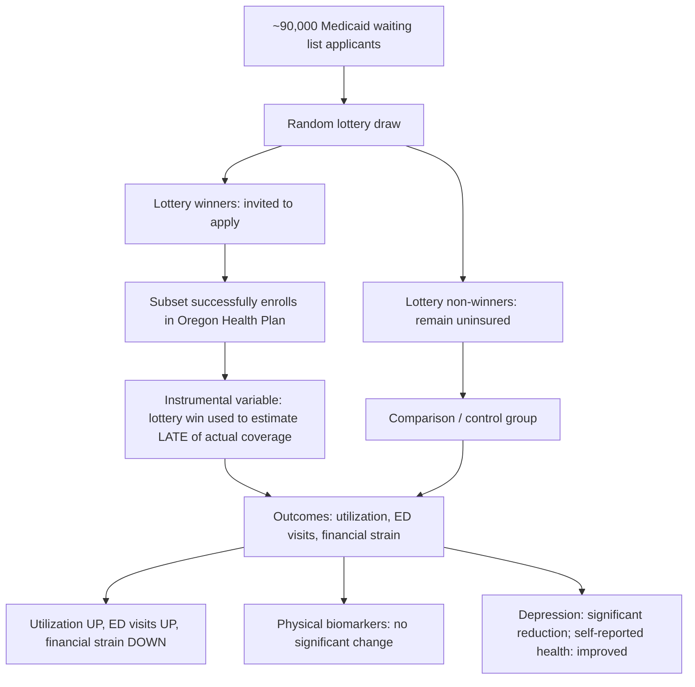

## The Oregon Health Insurance Experiment

### Overview

The Oregon Health Insurance Experiment (OHIE) was a natural randomized controlled trial that emerged when the state of Oregon used a lottery to allocate a limited number of new Medicaid coverage slots in 2008. Because demand for the expanded program vastly exceeded available funding, Oregon distributed access via random lottery draw, creating an unusual and methodologically powerful opportunity for researchers to study the causal effect of Medicaid coverage — as opposed to varying degrees of cost-sharing, as in the RAND HIE — on health care utilization, financial outcomes, and health status.

### Background and Institutional Context

#### The Policy Setting

In 2008, Oregon sought to expand its Medicaid program (called the Oregon Health Plan) to cover additional low-income, uninsured adults who did not otherwise qualify for existing Medicaid categories (i.e., non-disabled, non-elderly, non-pregnant adults below the federal poverty line). The state had funding for approximately 10,000 new enrollment slots but received around 90,000 applications from interested households.

#### The Lottery Mechanism

Rather than using a first-come-first-served or means-adjusted priority system, Oregon drew names by lottery from a waiting list of eligible applicants. Those selected were invited to apply for coverage, and if they met income and eligibility criteria, they were enrolled in the Oregon Health Plan. This random selection process created a treatment group (lottery winners who gained coverage) and a natural control group (lottery losers who remained uninsured), allowing researchers to isolate the causal effect of Medicaid coverage from the confounding factors (health status, motivation, socioeconomic circumstances) that would bias a purely observational comparison of insured versus uninsured populations.

**Key Points**

- Unlike RAND, which randomized the *terms* of insurance (coinsurance rates) among the already-insured, Oregon randomized *access to insurance itself* (coverage vs. no coverage).
- The comparison group in Oregon is the uninsured, whereas RAND's most generous comparison plan (Free Plan) was compared against plans with meaningful cost-sharing, not against zero coverage.
- This distinction is critical when comparing the two experiments' findings, since they answer related but conceptually different economic questions.

### Study Design

#### Sample and Timeline

Approximately 30,000 individuals from the lottery waiting list were included in the study sample (both winners and non-winners), drawn from the roughly 90,000 applicants. Researchers conducted data collection in stages:

1. **Administrative data analysis (Year 1)**: Using Medicaid enrollment records, hospital discharge data, and credit report data to measure utilization, health care spending, and financial strain.
2. **In-person survey and biometric data collection (Year 2)**: A detailed follow-up survey with a subsample (~12,000 individuals), including direct physical health measurements (blood pressure, cholesterol, glycated hemoglobin/HbA1c for diabetes screening) and validated mental health screening instruments (e.g., for depression).

#### Comparison Groups

| Group | Description |
| --- | --- |
| Lottery winners | Selected to apply for Oregon Health Plan coverage; subset ultimately enrolled |
| Lottery non-winners | Remained on waiting list; largely remained uninsured during study period |

Because not all lottery winners successfully enrolled (some did not complete the application or did not meet final eligibility criteria), researchers used the random lottery draw as an **instrumental variable (IV)** for actual Medicaid enrollment, allowing estimation of both:

- The **intent-to-treat (ITT) effect**: the effect of winning the lottery (regardless of actual enrollment)
- The **local average treatment effect (LATE)**: the effect of actually obtaining coverage, scaled up from the ITT using the enrollment take-up rate as the first-stage relationship

$$\text{LATE} = \frac{\text{ITT effect}}{\text{First-stage take-up rate}}$$

### Core Empirical Findings

#### Health Care Utilization

Medicaid coverage was found to substantially increase utilization of health care services relative to being uninsured, including:

- Increased outpatient visits and prescription drug use
- Increased preventive care utilization (e.g., cholesterol screening, mammograms)
- Increased hospital admissions
- Notably, **increased emergency department (ED) use** — a finding that surprised many policymakers who expected that gaining primary care coverage would substitute away from costly ED visits

[Inference] The increase in ED utilization is one of the more debated findings in the health policy literature, since it runs counter to the common policy assumption that expanding insurance coverage necessarily redirects care from expensive emergency settings toward cheaper primary care settings; interpretations vary regarding whether this reflects pent-up demand, lower time/money price of ED care once insured, or supply constraints in primary care access for new Medicaid enrollees.

#### Financial Outcomes

Medicaid coverage produced a clear and robust reduction in financial strain:

- Substantially reduced probability of catastrophic out-of-pocket medical expenditures
- Reduced medical debt and reduced likelihood of debt sent to collections
- Virtually eliminated the probability of having any out-of-pocket medical expenses at all for covered services

This finding is one of the most consistent and least contested results of the OHIE, reflecting the core risk-protection function of health insurance.

#### Physical Health Outcomes

Results for objective physical health measures were mixed and, in several cases, statistically insignificant:

- **No statistically significant improvement** was detected in blood pressure control, cholesterol levels, or glycated hemoglobin (HbA1c) levels among the study population within the observed timeframe.
- Coverage was associated with **increased rates of diabetes diagnosis and diabetes medication use**, which likely reflects improved detection (more screening) rather than necessarily an underlying change in disease prevalence.

#### Mental Health and Self-Reported Outcomes

In contrast to the muted physical health findings, the OHIE found a statistically significant reduction in the prevalence of depression, along with meaningful improvements in self-reported physical and mental health and overall well-being among those who gained coverage.

**Key Points**

- The combination of "improved financial security and mental health" alongside "no detectable improvement in measured physical biomarkers" became one of the most cited and debated dualities in health policy discourse.
- Critics have noted the study may have been statistically underpowered to detect physical health improvements over the roughly two-year follow-up window, particularly for chronic conditions like hypertension and diabetes that require longer intervention periods to show measurable biomarker change. [Inference] This "underpowered" interpretation is a widely discussed critique, but it is a methodological argument, not a definitively resolved empirical finding — the null results themselves are precisely estimated on the study's own terms.

### Diagrammatic Summary of the Design and Causal Pathway

### Theoretical and Policy Interpretation

#### Relation to the Demand Model

The OHIE provides strong causal evidence consistent with the standard prediction that lowering the effective price of care (via insurance coverage, moving $P_{oop}$ close to zero for most services) increases quantity demanded — reinforcing the moral hazard mechanism identified in the RAND HIE, but in the more policy-relevant context of "insured vs. completely uninsured" rather than "generous vs. moderate cost-sharing among the already-insured."

#### Complementarity with the RAND HIE

The two experiments are often taught together because they address distinct but related margins of the health insurance demand question:

| Dimension | RAND HIE | Oregon HIE |
| --- | --- | --- |
| Population | Mostly non-elderly, employed/insurable families | Low-income, previously uninsured adults |
| Variation studied | Coinsurance rate (0% to 95%) | Coverage vs. no coverage |
| Era | 1970s–1980s | 2008 onward |
| Method | Direct random assignment to insurance plans | Random lottery as instrumental variable |
| Headline finding | Moral hazard; modest price elasticity (~-0.2); no average health effect (with exception for poor/sick) | Coverage raises utilization and ED use; strong financial protection; improved mental health; no detected short-run physical biomarker change |

#### Welfare and Policy Debate

The OHIE has been invoked on multiple sides of the Medicaid expansion debate under the Affordable Care Act:

- Advocates for expansion emphasize the financial protection and mental health benefits as core, well-established value of coverage.
- Skeptics of expansion's health impact emphasize the null physical health findings to argue that Medicaid coverage alone may not be sufficient to improve measurable chronic disease control without complementary investments in primary care access, care management, or health system capacity.

[Inference] The appropriate normative weight to place on "financial security and mental health improvement" versus "no detected physical biomarker change" is a matter of ongoing scholarly and political debate rather than a settled empirical conclusion, since it depends partly on value judgments about which outcomes matter most for evaluating insurance policy.

### Methodological Contributions

The OHIE is frequently cited as a methodological landmark for using policy-generated lotteries as a source of credible random assignment in real-world (non-laboratory) settings, an approach in the broader tradition of natural experiments and quasi-experimental identification strategies in applied economics. It also popularized the practical application of instrumental variables estimation to convert an intent-to-treat effect (lottery winning) into a treatment effect estimate for actual program enrollment, addressing imperfect compliance in real-world lottery-based policy rollouts.

### Practical Example

**Example**

Suppose the study observes that winning the lottery (ITT) is associated with a 10-percentage-point increase in the probability of visiting an emergency department in the past six months, and that only 25 percentage points of lottery winners actually took up Medicaid coverage relative to non-winners (the first-stage effect). The local average treatment effect on ED use *among those induced to enroll by winning the lottery* would be approximated as:

$$\text{LATE} = \frac{0.10}{0.25} = 0.40$$

This suggests that for the subpopulation of "compliers" (those who enrolled in Medicaid because they won the lottery, but would not have otherwise), actually obtaining coverage is associated with a 40-percentage-point increase in ED visit probability. [Inference] This is a simplified illustrative calculation using representative structure of the method; actual published OHIE point estimates for specific outcomes should be consulted directly from the primary NBER/QJE publications for precise figures.

### Related Topics

- The RAND Health Insurance Experiment
- Moral hazard in health insurance markets
- Instrumental variables and local average treatment effects (LATE)
- Medicaid expansion under the Affordable Care Act
- Natural experiments and quasi-experimental methods in health economics
- Financial toxicity and medical bankruptcy
- Time costs and the full price of care
- Emergency department utilization and access to primary care
- Grossman's model of health as human capital
- Health outcomes measurement: biomarkers vs. self-reported health