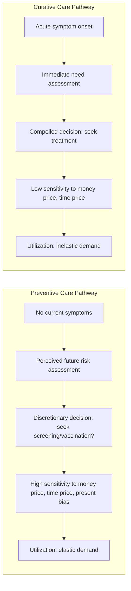

## Demand for Preventive versus Curative Care

### Overview

Preventive care and curative care occupy distinct positions in the household production model of health demand. **Preventive care** consists of interventions undertaken to reduce the probability of future illness or to detect disease at an early, more treatable stage (e.g., vaccinations, screenings, routine checkups). **Curative care** consists of interventions undertaken to treat an already-manifest illness or injury (e.g., surgery, acute medication, emergency treatment). These two categories differ systematically in their price elasticity of demand, time-cost structure, information requirements, and the presence of externalities — differences with significant implications for insurance design and public health policy.

### Theoretical Framework: Investment in Health Capital

#### Grossman Model Application

In Grossman's model of health as a durable capital stock, health capital $H_t$ depreciates over time at rate $\delta_t$ and can be augmented through investment (medical care, time, and other health inputs):

$$H_{t+1} = H_t(1 - \delta_t) + I_t$$

Preventive care can be understood as an investment that reduces the depreciation rate $\delta_t$ itself (slowing the rate of health capital decay), whereas curative care is better understood as a corrective investment $I_t$ undertaken *after* an adverse health shock has already reduced $H_t$ below some threshold. This distinction matters because:

- Preventive care demand is driven by expectations about future disease probability and the perceived marginal product of prevention in reducing that probability.
- Curative care demand is driven by realized illness — it responds to a health shock that has already occurred, making it far less discretionary in the short run.

**Key Points**

- Curative care demand is generally more inelastic than preventive care demand because acute illness reduces the feasible set of substitutes (a patient with a broken leg or acute appendicitis cannot easily defer or substitute away from treatment).
- Preventive care demand, by contrast, is more discretionary, more elastic with respect to money price and time price, and more sensitive to patient information, health literacy, and present bias.

### Comparative Demand Characteristics

| Dimension | Preventive Care | Curative Care |
| --- | --- | --- |
| Timing relative to illness | Before onset / early detection | After onset |
| Price elasticity of demand | Relatively higher (more elastic) | Relatively lower (more inelastic) |
| Time cost sensitivity | High — patients readily defer/skip if time cost rises | Lower — urgency reduces sensitivity to wait/travel time |
| Information requirements | High — patient must understand future risk and prevention's value | Lower — presence of symptoms provides a clear signal to seek care |
| Externalities | Often present (e.g., vaccination, infectious disease screening) | Typically private, with some exceptions (e.g., treating active infectious disease) |
| Insurance coverage design | Often subject to first-dollar coverage mandates specifically to counteract underuse | Typically covered as core benefit, still subject to coinsurance/deductibles |
| Behavioral biases affecting demand | Present bias, hyperbolic discounting, optimism bias about future risk | Less relevant — present illness dominates decision-making |

### Why Preventive Care Demand Tends to Be Under-Provided in Free Markets

#### Present Bias and Hyperbolic Discounting

Because the costs of preventive care (money price, time cost, inconvenience) are borne immediately while the benefits (reduced probability of future disease) accrue in the future, standard behavioral economics models predict that consumers with **present-biased preferences** will systematically under-invest in prevention relative to what a fully time-consistent, forward-looking consumer would choose.

A simplified two-period utility framework illustrates this:

$$U = u(c_0) - \beta \cdot \delta \cdot p(a) \cdot L$$

where:

- $c_0$ = immediate cost of preventive action $a$
- $\beta$ = present-bias discount factor ($\beta < 1$ for present-biased individuals; $\beta = 1$ for time-consistent individuals)
- $\delta$ = standard exponential discount factor
- $p(a)$ = probability of future adverse health event, decreasing in preventive effort $a$
- $L$ = the loss (disutility, cost of illness) associated with the adverse event

When $\beta < 1$, the perceived future benefit of prevention is discounted more heavily than a rational time-consistent planner would discount it, leading to underinvestment in $a$ relative to the socially/individually optimal level from a long-run perspective.

#### Information Asymmetry and Risk Perception

[Inference] Underuse of preventive services is also commonly attributed to **optimism bias** (systematic underestimation of one's own future disease risk) and to gaps in health literacy regarding the marginal benefit of screening or vaccination, though the relative magnitude of behavioral versus purely financial/access barriers varies across specific interventions and populations studied.

#### Externalities in Preventive Care

Certain preventive interventions — most notably vaccination against communicable disease — generate **positive externalities**: an individual's vaccination reduces the probability of disease transmission to others (herd immunity effects), a benefit not captured in the individual's private demand calculation. This creates a classic **wedge between private and social marginal benefit**:

$$MB_{social} = MB_{private} + MB_{external}$$

Because private demand reflects only $MB_{private}$, the market equilibrium quantity of vaccination (or similar externality-generating preventive care) will be **below the socially optimal quantity**, providing a standard economic rationale for public subsidy or mandate.

#### Graphical Illustration: Externality-Driven Underconsumption (svg_diagram)

<svg xmlns="http://www.w3.org/2000/svg" viewBox="0 0 700 460" font-family="Helvetica, Arial, sans-serif">
<text x="350" y="26" text-anchor="middle" font-size="17" font-weight="bold" fill="#1a1a1a">Preventive Care Externality (svg_diagram)</text>
<line x1="80" y1="400" x2="650" y2="400" stroke="#333" stroke-width="2" />
<line x1="80" y1="400" x2="80" y2="60" stroke="#333" stroke-width="2" />
<text x="365" y="430" text-anchor="middle" font-size="13" fill="#333">Quantity of Preventive Care (e.g., vaccinations)</text>
<text x="30" y="230" text-anchor="middle" font-size="13" fill="#333" transform="rotate(-90 30 230)">Price / Marginal Benefit</text>

<path d="M 110 340 C 280 300, 420 220, 600 130" stroke="#0b6e99" stroke-width="3" fill="none" />
<text x="580" y="120" font-size="12" fill="#0b6e99" font-weight="bold">MB_private (D_private)</text>

<path d="M 110 260 C 280 210, 420 130, 600 70" stroke="#27ae60" stroke-width="3" fill="none" />
<text x="560" y="60" font-size="12" fill="#27ae60" font-weight="bold">MB_social (D_social)</text>

<line x1="150" y1="90" x2="450" y2="380" stroke="#c0392b" stroke-width="2" />
<text x="440" y="370" font-size="12" fill="#c0392b" font-weight="bold">MC (supply)</text>

<line x1="80" y1="230" x2="300" y2="230" stroke="#0b6e99" stroke-width="1" stroke-dasharray="2,2" />
<line x1="300" y1="230" x2="300" y2="400" stroke="#0b6e99" stroke-width="1" stroke-dasharray="2,2" />
<text x="300" y="418" text-anchor="middle" font-size="11" fill="#0b6e99">Q_private (market)</text>

<line x1="80" y1="150" x2="380" y2="150" stroke="#27ae60" stroke-width="1" stroke-dasharray="2,2" />
<line x1="380" y1="150" x2="380" y2="400" stroke="#27ae60" stroke-width="1" stroke-dasharray="2,2" />
<text x="380" y="418" text-anchor="middle" font-size="11" fill="#27ae60">Q_social (efficient)</text>

<text x="500" y="250" font-size="12" fill="#555">Underconsumption gap</text>

<path d="M 480 260 L 340 200" stroke="#555" stroke-width="1" marker-end="url(#arrow2)" />

</svg>

### Empirical Elasticity Evidence

#### RAND HIE Findings on Preventive Care

Data from the RAND Health Insurance Experiment showed that preventive services (e.g., well-child visits, screenings) were among the categories most responsive to changes in coinsurance rates, consistent with the theoretical prediction that preventive care is more discretionary and thus more price-elastic than acute or inpatient curative care.

#### Contrast with Curative/Acute Care Elasticity

By contrast, RAND HIE and subsequent literature generally find that demand for acute, symptom-driven curative care (e.g., emergency treatment for injury, hospitalization for acute conditions) exhibits substantially lower price elasticity, since the presence of acute symptoms compels care-seeking regardless of modest price changes.

### Policy Design Implications

#### Value-Based Insurance Design (V-BID)

Because preventive care is price-elastic and its underuse imposes long-run costs (through disease progression, higher future treatment costs, and negative externalities in some cases), many insurance designs deliberately reduce or eliminate cost-sharing specifically for preventive services — a strategy known as **value-based insurance design**. Under the U.S. Affordable Care Act, for example, many preventive services recommended by the U.S. Preventive Services Task Force (USPSTF) must be covered without patient cost-sharing ($0 copay) in most non-grandfathered private insurance plans.

**Key Points**

- V-BID selectively lowers the money price for high-value services (often preventive) while sometimes maintaining or raising cost-sharing for lower-value or more discretionary services.
- This reflects an explicit policy response to the *differential* elasticity and marginal-value characteristics of preventive versus curative care rather than a uniform cost-sharing structure across all care types.

#### The "Cost-Offset" Debate

A commonly debated policy claim is that increased preventive care spending "pays for itself" by reducing future curative care spending (e.g., screening prevents costly late-stage disease treatment). [Inference] This claim holds for some specific, well-studied interventions (e.g., certain vaccinations, specific high-value screenings in targeted populations) but does not hold universally — health services research has found that many preventive interventions increase net long-run spending even while improving health outcomes, because the cost of screening/treating the many outweighs averted treatment costs for the few who would have developed the condition. Policymakers should therefore evaluate preventive interventions on cost-effectiveness grounds (cost per quality-adjusted life year, or QALY) rather than assuming automatic net cost savings.

### Diagram: Decision Pathway Comparison

### Practical Example

**Example**

A 45-year-old patient is deciding whether to get a routine colonoscopy screening (preventive) versus seeking treatment for acute abdominal pain (curative).

- **Preventive scenario (colonoscopy screening)**: The patient faces no current symptoms. If the copay is $150 and requires taking a full day off work (time cost), the patient may rationally (or due to present bias) postpone the screening for months or years, since the perceived probability of finding a life-threatening condition today feels low and the benefit is distant.
- **Curative scenario (acute abdominal pain)**: The same $150 copay and comparable time cost of a same-day urgent care visit are far less likely to deter the patient from seeking care, because the immediate, tangible discomfort dominates the decision — demonstrating in a single individual how identical money and time prices produce very different utilization responses depending on whether the care is preventive or curative.

### Related Topics

- Grossman's model of health as human capital
- Time costs and the full price of care
- The RAND Health Insurance Experiment
- Value-based insurance design (V-BID)
- Positive externalities and public goods in vaccination policy
- Present bias, hyperbolic discounting, and health behavior
- Cost-effectiveness analysis and quality-adjusted life years (QALYs)
- U.S. Preventive Services Task Force (USPSTF) recommendations
- Supplier-induced demand and physician recommendation effects on screening uptake
- Health literacy and its effect on care-seeking behavior