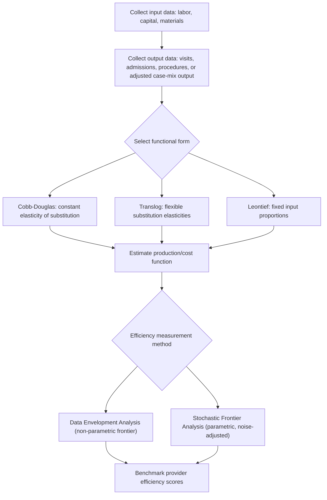

## Production Functions in Health Care Delivery

### Overview

A **production function** in health care delivery describes the technical relationship between the inputs used by a health care provider or organization (labor, capital, materials) and the output produced (units of medical care, health improvements, or treated patients). Production functions form the theoretical foundation for analyzing provider efficiency, cost structure, input substitution, and the technical constraints that shape the supply side of health care markets — complementing the demand-side theory covered in Grossman's model and related utilization frameworks.

### General Form of the Health Care Production Function

#### Standard Notation

The general production function for a health care provider (e.g., a hospital, physician practice, or clinic) is typically written as:

$$Q = f(L, K, M)$$

where:

- $Q$ = output, which may be measured as visits, procedures, admissions, or (in more sophisticated formulations) health outcomes/QALYs produced
- $L$ = labor inputs (physicians, nurses, technicians, administrative staff), often disaggregated by skill level
- $K$ = capital inputs (buildings, diagnostic equipment, beds, IT systems)
- $M$ = materials and intermediate inputs (pharmaceuticals, supplies, disposables)

#### Two-Stage Production in Health Care

A distinguishing feature of health care production, emphasized in the health economics literature since at least Grossman (1972) and subsequent work by Culyer, Newhouse, and others, is that the "final" output of interest — **health** — is produced in two conceptually distinct stages:

$$\text{Stage 1: } Q = f(L, K, M) \quad \text{(medical services produced)}$$

$$\text{Stage 2: } H = g(Q, X) \quad \text{(health improvement produced from services)}$$

where $X$ represents patient-specific factors (severity, comorbidities, compliance, socioeconomic status, genetic factors) that mediate how effectively medical services translate into actual health improvement.

**Key Points**

- Stage 1 (the "medical care production function") is the domain most amenable to standard microeconomic production theory and efficiency measurement (e.g., hospital cost function studies).
- Stage 2 (the "health production function") is far more difficult to estimate empirically because $X$ includes many unobserved or difficult-to-measure patient characteristics, and the causal contribution of medical care $Q$ to health $H$ is confounded by these factors.
- This two-stage distinction explains why studies of hospital "outputs" (e.g., discharges, procedures) are more tractable than studies attempting to directly measure hospitals' "health output."

### Common Functional Forms

#### Cobb-Douglas Production Function

A widely used functional form in empirical hospital and physician-practice production studies is the Cobb-Douglas specification:

$$Q = A \cdot L^{\alpha} \cdot K^{\beta} \cdot M^{\gamma}$$

where $A$ represents total factor productivity (technology, managerial efficiency), and $\alpha$, $\beta$, $\gamma$ are output elasticities with respect to each input. This form is popular partly because it is log-linearizable for estimation:

$$\ln Q = \ln A + \alpha \ln L + \beta \ln K + \gamma \ln M$$

and because $\alpha + \beta + \gamma$ directly indicates returns to scale: equal to 1 implies constant returns to scale, greater than 1 implies increasing returns to scale, and less than 1 implies decreasing returns to scale.

#### Translog Production Function

Because the Cobb-Douglas form imposes a restrictive assumption (a constant elasticity of substitution equal to 1 between all input pairs), many empirical health economics studies instead use the more flexible **translog (transcendental logarithmic) production function**, which allows input elasticities and substitution patterns to vary:

$$\ln Q = \beta_0 + \sum_i \beta_i \ln X_i + \frac{1}{2}\sum_i\sum_j \beta_{ij} \ln X_i \ln X_j$$

where $X_i$ represents the vector of inputs (labor types, capital, materials). This specification is standard in hospital cost-function and production-frontier estimation because it does not impose a fixed elasticity of substitution across all input pairs a priori.

#### Leontief (Fixed-Proportions) Production Function

In some clinical and staffing contexts — for example, minimum-staffing-ratio regulations in nursing (nurse-to-patient ratios) or required surgical team compositions — inputs must be combined in fixed proportions, better represented by a Leontief production function:

$$Q = \min\left(\frac{L}{a}, \frac{K}{b}\right)$$

where $a$ and $b$ are fixed input-output coefficients. This form reflects settings where input substitution is legally or clinically constrained rather than a matter of managerial choice.

### Marginal Product and Input Substitution

#### Marginal Product of Labor and Capital

The marginal product of an input measures the additional output produced by one more unit of that input, holding other inputs constant:

$$MP_L = \frac{\partial Q}{\partial L}, \quad MP_K = \frac{\partial Q}{\partial K}$$

Diminishing marginal returns are typically assumed to hold in the short run (e.g., adding more nurses to a fixed number of exam rooms and physicians eventually yields smaller output gains per additional nurse), consistent with standard neoclassical production theory.

#### Elasticity of Substitution Between Labor Types

A major area of applied health workforce economics concerns the **elasticity of substitution** between different labor types — for example, physicians versus nurse practitioners (NPs) or physician assistants (PAs) for delivering primary care services:

$$\sigma_{L,NP} = \frac{\% \Delta (NP/L_{physician})}{\% \Delta \text{MRTS}}$$

where MRTS is the marginal rate of technical substitution between nurse practitioners and physicians. Empirical estimates of this substitution elasticity inform scope-of-practice policy debates, since a high elasticity of substitution implies that expanding NP/PA scope-of-practice authority could substitute effectively for physician labor in producing equivalent primary care output, potentially easing workforce shortages and reducing costs.

### Diagrammatic Illustration: Isoquant Analysis (svg_diagram)

<svg xmlns="http://www.w3.org/2000/svg" viewBox="0 0 680 460" font-family="Helvetica, Arial, sans-serif">
<text x="340" y="26" text-anchor="middle" font-size="17" font-weight="bold" fill="#1a1a1a">Health Care Isoquants and Isocost Line (svg_diagram)</text>
<line x1="90" y1="400" x2="620" y2="400" stroke="#333" stroke-width="2" />
<line x1="90" y1="400" x2="90" y2="60" stroke="#333" stroke-width="2" />
<text x="355" y="430" text-anchor="middle" font-size="13" fill="#333">Labor (L) — e.g., physician/nurse hours</text>
<text x="35" y="230" text-anchor="middle" font-size="13" fill="#333" transform="rotate(-90 35 230)">Capital (K) — e.g., equipment, beds</text>
<path d="M 140 360 C 220 260, 330 200, 480 170" stroke="#0b6e99" stroke-width="2.5" fill="none" />
<text x="490" y="168" font-size="12" fill="#0b6e99" font-weight="bold">Q1 (lower output)</text>
<path d="M 200 380 C 290 300, 400 240, 570 200" stroke="#27ae60" stroke-width="2.5" fill="none" />
<text x="580" y="198" font-size="12" fill="#27ae60" font-weight="bold">Q2 (higher output)</text>
<line x1="120" y1="90" x2="560" y2="390" stroke="#c0392b" stroke-width="2" stroke-dasharray="6,4" />
<text x="480" y="380" font-size="12" fill="#c0392b" font-weight="bold">Isocost line (wL + rK = Budget)</text>
<circle cx="330" cy="238" r="5" fill="#1a1a1a" />
<text x="340" y="230" font-size="12" fill="#1a1a1a" font-weight="bold">Cost-minimizing input mix</text>
</svg>

### Returns to Scale in Hospital Production

#### Empirical Findings on Hospital Scale Economies

Empirical hospital cost-function studies (a large literature spanning decades) generally find evidence of **economies of scale** up to a moderate hospital size, after which scale economies diminish or reverse into **diseconomies of scale** at very large facility sizes, producing a U-shaped long-run average cost curve consistent with standard production theory predictions.

$$AC(Q) = \frac{TC(Q)}{Q}$$

The presence of scale economies has direct policy relevance for hospital merger review, certificate-of-need regulation, and debates over minimum efficient scale in service line consolidation (e.g., regionalization of specialized surgical services).

#### Economies of Scope

In addition to economies of scale, health care organizations often exhibit **economies of scope**, where joint production of multiple related services (e.g., a hospital producing both inpatient surgical care and outpatient diagnostic imaging) is more cost-efficient than producing each service in a separate, specialized facility:

$$TC(Q_1, Q_2) < TC(Q_1, 0) + TC(0, Q_2)$$

This is a common justification offered for horizontal and vertical integration in hospital systems, though the empirical magnitude of scope economies is contested and varies substantially by service combination studied.

### Measuring Efficiency: Frontier Analysis

#### Technical Efficiency

A provider is **technically efficient** if it produces the maximum feasible output from its given input bundle (i.e., it operates on the production frontier rather than below it). Deviations from the frontier represent technical inefficiency, often attributed to managerial slack, organizational factors, or measurement error.

#### Data Envelopment Analysis (DEA) and Stochastic Frontier Analysis (SFA)

Two dominant empirical methods are used to estimate health care production/efficiency frontiers:

1. **Data Envelopment Analysis (DEA)**: A non-parametric, linear-programming-based method that constructs a "best-practice" efficiency frontier from observed data without imposing a specific functional form, then measures each provider's distance from that frontier.
2. **Stochastic Frontier Analysis (SFA)**: A parametric econometric method that specifies a functional form (e.g., Cobb-Douglas or translog) and decomposes the error term into a symmetric random noise component and a one-sided inefficiency component:

$$\ln Q_i = \ln f(X_i; \beta) + v_i - u_i$$

where $v_i$ is standard statistical noise and $u_i \geq 0$ represents technical inefficiency specific to provider $i$.

**Key Points**

- DEA is more flexible but sensitive to outliers and measurement error, since it does not separate noise from inefficiency.
- SFA requires a specified functional form and distributional assumption for $u_i$ (commonly half-normal or exponential), but explicitly models statistical noise separately from inefficiency.
- Both methods are widely used in comparative hospital and physician-practice efficiency benchmarking studies, though results can be sensitive to model specification choices — a recognized methodological limitation in this literature. [Inference]

### Diagram: Production Analysis Workflow

### Practical Example

**Example**

Consider a hospital estimating a Cobb-Douglas production function for its outpatient surgical unit, using monthly data:

$$Q = A \cdot L^{0.5} \cdot K^{0.3} \cdot M^{0.2}$$

where $Q$ is the number of outpatient surgical procedures performed, $L$ is nursing/physician labor hours, $K$ is operating room capacity utilization (hours available), and $M$ is disposable surgical supplies consumed.

Since $\alpha + \beta + \gamma = 0.5 + 0.3 + 0.2 = 1.0$, the estimated function exhibits **constant returns to scale**: doubling all three inputs simultaneously would be expected to double output, holding technology ($A$) and case mix constant. If hospital administrators are considering whether to expand capacity by adding a second operating room (increasing $K$) without proportionally increasing $L$, the model predicts output gains from the added capital input alone will be governed by the (diminishing) marginal product of capital, $MP_K = 0.3 \cdot A \cdot L^{0.5} \cdot K^{-0.7} \cdot M^{0.2}$, holding $L$ and $M$ fixed — illustrating why single-input expansions typically yield smaller proportional output gains than balanced expansion of all inputs together. [Inference] This example uses illustrative parameter values rather than published empirical estimates specific to any particular facility.

### Related Topics

- Grossman's model of health as human capital
- Hospital cost functions and economies of scale/scope
- Data Envelopment Analysis and Stochastic Frontier Analysis in health services research
- Physician workforce substitution: scope-of-practice policy for NPs and PAs
- Certificate-of-need regulation and hospital market structure
- Supplier-induced demand and the physician-as-agent model
- Case-mix adjustment and hospital output measurement
- Health information technology (HIT) as a capital input in production
- Value-based payment models and their effect on provider input choices
- Vertical and horizontal integration in health systems