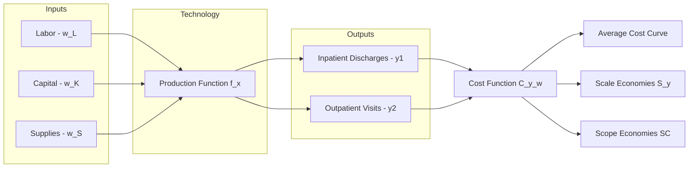

## Cost Functions and Economies of Scale and Scope

### Overview

The cost function is the central analytical tool for studying the supply side of healthcare markets. It maps the relationship between the quantity of medical services produced (hospital discharges, physician visits, surgical procedures) and the minimum expenditure required to produce that output, given input prices and the available technology. Economies of scale and scope extend this framework to ask how average and marginal costs behave as output volume grows (scale) and as providers produce multiple related services jointly rather than separately (scope). These concepts underpin healthcare policy debates on hospital mergers, minimum-volume standards for surgical centers, optimal hospital size, and the consolidation of health systems.

### The Cost Function: Formal Definition

A cost function $C(y, w)$ expresses the minimum total cost of producing output vector $y$ given a vector of input prices $w$:

$$C(y, w) = \min_{x} \{w \cdot x : f(x) \geq y\}$$

where $x$ is the vector of inputs (labor, capital, supplies) and $f(x)$ is the production technology (production possibility frontier) describing feasible output for given inputs.

**Key Points**

- The cost function is derived from cost-minimizing behavior conditional on the production technology; it is not itself the technology.
- In healthcare, $y$ is often a vector (e.g., inpatient days, outpatient visits, case-mix-adjusted discharges) rather than a scalar, which is why *cost function* estimation in hospital economics almost always involves multiproduct specifications.
- Standard properties assumed: non-decreasing in $y$, non-decreasing and concave in $w$, homogeneous of degree 1 in $w$, and continuous.

### Average and Marginal Cost

For single-output simplification, average cost ($AC$) and marginal cost ($MC$) are defined as:

$$AC(y) = \frac{C(y)}{y}, \qquad MC(y) = \frac{\partial C(y)}{\partial y}$$

The relationship between $AC$ and $MC$ determines the shape of the cost curve:

- If $MC < AC$, average cost is falling as output rises (economies of scale).
- If $MC > AC$, average cost is rising (diseconomies of scale).
- If $MC = AC$, average cost is at a minimum (efficient scale).

### Economies of Scale

**Definition**

Economies of scale exist when average cost declines as output increases, holding the product mix and input prices fixed. The standard scale-economy index is the ray average cost elasticity:

$$S(y) = \frac{C(y)}{y \cdot MC(y)} = \frac{AC(y)}{MC(y)}$$

- $S(y) > 1$: economies of scale (average cost falling; marginal cost below average cost)
- $S(y) = 1$: constant returns to scale (minimum efficient scale)
- $S(y) < 1$: diseconomies of scale

**Sources in Healthcare Settings**

- **Indivisibility of fixed inputs**: A CT scanner, catheterization lab, or emergency department has a large fixed-cost component; spreading it over more patients lowers per-unit cost up to capacity.
- **Specialization**: Larger hospitals can employ specialized staff (dedicated infection-control nurses, subspecialist physicians) whose fixed employment cost is amortized over higher volume.
- **Volume-outcome relationship**: For complex procedures (e.g., cardiac surgery, oncologic resections), higher procedure volume is associated with better outcomes and lower complication-related costs, an indirect scale economy operating through quality rather than through input prices alone. [Inference — the outcomes-cost link is empirically well documented in specific procedure classes but the causal mechanism (practice-makes-perfect vs. selective referral) remains debated in the literature.]
- **Administrative and overhead spreading**: Billing, compliance, and IT infrastructure costs are largely fixed with respect to patient volume within a relevant range.

**Diseconomies of Scale**

Beyond some threshold, hospitals may experience rising average costs due to:

- Bureaucratic and coordination costs of managing larger, more complex organizations
- Congestion effects (capacity constraints causing patient boarding, longer wait times, overtime labor costs)
- Loss of managerial control and agency problems in large, multi-site systems

**Empirical U-Shaped Cost Curve**

Most hospital cost function studies find a U-shaped (or L-shaped, flattening) average cost curve, implying a minimum efficient scale (MES) — the output level at which $AC$ is minimized. Estimates of MES for general acute-care hospitals commonly fall in a range around 100–200 beds, though estimates vary substantially by country, era, and service mix. [Unverified — precise MES figures are highly sensitive to data era, country, casemix adjustment, and econometric specification; treat any single numeric range as illustrative rather than definitive.]

### Economies of Scope

**Definition**

Economies of scope exist when it is cheaper to produce two or more outputs jointly within a single organization than to produce them separately in specialized single-product firms. For two outputs $y_1$ and $y_2$:

$$SC = \frac{C(y_1, 0) + C(0, y_2) - C(y_1, y_2)}{C(y_1, y_2)}$$

- $SC > 0$: economies of scope (joint production cheaper — cost complementarity)
- $SC < 0$: diseconomies of scope (joint production more expensive — cost substitutability)
- $SC = 0$: cost-separable, no scope effects

**Sources in Healthcare Settings**

- **Shared fixed infrastructure**: A hospital producing both inpatient surgical care and outpatient diagnostic imaging shares the same physical plant, medical records system, and administrative overhead.
- **Shared inputs across service lines**: A radiology department serves oncology, orthopedics, and emergency medicine simultaneously; a single trained radiologist workforce serves multiple "product lines."
- **Diagnostic and information synergies**: Treating a patient's comorbidities under one roof (e.g., diabetes and cardiovascular care) can reduce duplicated testing and improve information continuity, lowering joint cost relative to fragmented care. [Inference — this synergy is a commonly cited rationale for integrated delivery systems, though the magnitude of realized cost savings from vertical/horizontal integration in real-world systems is mixed empirically.]
- **Teaching and research complementarities**: Academic medical centers often exhibit scope economies between clinical service production and medical education/research, since faculty, facilities, and case material serve both purposes jointly.

**Diseconomies of Scope**

- Complexity costs of managing highly heterogeneous service lines
- Resource competition (e.g., operating room time contested between specialties)
- Loss of focus / dilution of managerial attention, sometimes cited in the "focused factory" hospital literature as a rationale for specialty hospitals

### Multiproduct Cost Function Specification

Because most healthcare providers produce multiple, non-homogeneous outputs, empirical work typically specifies a flexible multiproduct cost function, most commonly a **quadratic** or **translog** functional form, to allow for interactions between output types and input prices without imposing separability a priori.

A generalized quadratic multiproduct cost function:

$$C(y_1, y_2, w) = \alpha_0 + \sum_i \alpha_i y_i + \frac{1}{2}\sum_i \sum_j \beta_{ij} y_i y_j + \gamma \cdot w + \varepsilon$$

The cross-product term $\beta_{ij} y_i y_j$ (for $i \neq j$) captures scope interactions: if $\beta_{ij} < 0$, marginal cost of $y_i$ decreases with more $y_j$, indicating economies of scope.

**Translog specification** (log-quadratic in outputs and input prices) is common because it:

- Imposes no a priori restriction on the shape of the cost surface (second-order flexible form)
- Naturally accommodates the homogeneity-of-degree-1-in-prices restriction
- Allows scale and scope elasticities to vary with the output level (local rather than global measures)

**Example**

Consider a hospital producing $y_1$ = medical/surgical discharges and $y_2$ = outpatient visits. A researcher estimates:

$$\ln C = \alpha_0 + \alpha_1 \ln y_1 + \alpha_2 \ln y_2 + \frac{1}{2}\beta_{11}(\ln y_1)^2 + \frac{1}{2}\beta_{22}(\ln y_2)^2 + \beta_{12}\ln y_1 \ln y_2 + \sum_k \gamma_k \ln w_k$$

If the estimated $\beta_{12} < 0$ and statistically significant, this is interpreted as evidence of scope economies between inpatient and outpatient production — consistent with shared diagnostic and administrative infrastructure.

### Diagrammatic Representation

### Illustrative U-Shaped Average Cost Curve (svg_diagram)

<svg xmlns="http://www.w3.org/2000/svg" viewBox="0 0 640 380">
<text x="320" y="24" text-anchor="middle" font-size="16" font-weight="bold" fill="#1a1a1a">Average and Marginal Cost Curves (svg_diagram)</text>
<line x1="70" y1="330" x2="600" y2="330" stroke="#333" stroke-width="2" />
<line x1="70" y1="330" x2="70" y2="50" stroke="#333" stroke-width="2" />
<text x="335" y="365" text-anchor="middle" font-size="13" fill="#333">Output (y)</text>
<text x="30" y="190" text-anchor="middle" font-size="13" fill="#333" transform="rotate(-90 30 190)">Cost per unit</text>
<path d="M 100 300 C 200 120, 300 90, 350 100 C 450 120, 520 220, 580 300" fill="none" stroke="#2166ac" stroke-width="3" />
<text x="590" y="295" font-size="12" fill="#2166ac">AC</text>
<path d="M 100 260 C 220 150, 300 90, 350 90 C 420 90, 500 190, 560 330" fill="none" stroke="#b2182b" stroke-width="3" />
<text x="565" y="325" font-size="12" fill="#b2182b">MC</text>
<line x1="350" y1="330" x2="350" y2="97" stroke="#666" stroke-dasharray="4,4" />
<text x="352" y="345" font-size="12" fill="#333">MES (y*)</text>
<circle cx="350" cy="97" r="4" fill="#333" />
<text x="150" y="90" font-size="12" fill="#2166ac">Economies of scale (S&gt;1)</text>
<text x="420" y="200" font-size="12" fill="#b2182b">Diseconomies (S&lt;1)</text>
</svg>

### Policy Applications

**Hospital Mergers and Antitrust**

Estimated scale and scope economies are central evidence in hospital merger review. If empirical estimates show a merging pair operates well below minimum efficient scale, the merger may plausibly reduce system-wide average costs. Conversely, evidence of flat or rising average cost beyond current output undercuts efficiency-based merger justifications used before competition authorities.

**Minimum Volume Standards**

Regulatory or accreditation minimum-volume thresholds for specific procedures (e.g., certain oncologic or cardiac surgeries) are motivated partly by scale-economy/quality arguments — the presumption that below-threshold volume yields both higher unit cost and worse outcomes.

**Specialty Hospitals and the "Focused Factory" Debate**

The rise of specialty hospitals (single-specialty orthopedic or cardiac centers) tests the scope-economies hypothesis directly: if broad-service general hospitals possess strong economies of scope, focused single-specialty entrants should face a cost disadvantage; the persistence and growth of specialty hospitals in some markets is often cited as evidence that diseconomies of scope (loss of focus, cross-subsidization inefficiency) may dominate in certain service lines. [Inference — this remains a contested empirical question in the health economics literature, with results sensitive to setting and outcome measured (cost vs. quality vs. patient selection effects).]

**Rural Hospital Sustainability**

Small rural hospitals often operate below minimum efficient scale, yielding structurally higher average costs — a key rationale behind policies such as Critical Access Hospital cost-based reimbursement designations, which explicitly compensate for scale-driven cost disadvantages rather than relying on volume-based prospective payment.

### Distinguishing Scale from Scope Empirically

**Key Points**

- Scale economies concern the cost of expanding a *given* output mix proportionally.
- Scope economies concern the cost of adding a *different* output type to an existing mix.
- A provider can exhibit economies of scale in a single service line while simultaneously exhibiting diseconomies of scope if diversifying into unrelated services strains shared managerial or capital resources.
- Ray average costs (used for scale) and cost complementarity (used for scope) require different mathematical derivatives of the same estimated multiproduct cost function — they are not interchangeable diagnostics.

### Limitations and Estimation Challenges

- **Case-mix adjustment**: Raw discharge counts understate true output heterogeneity; failure to adjust for severity/complexity biases scale-economy estimates (a hospital treating more complex cases will appear to have diseconomies of scale that are actually a casemix effect).
- **Quality as an unmeasured output**: If higher-cost hospitals also produce higher unmeasured quality, cost function estimates that omit quality controls will conflate quality differences with genuine inefficiency or diseconomies.
- **Endogeneity of output**: Output and cost may be jointly determined with local demand and input-price conditions, requiring instrumental-variable or panel-data approaches to isolate the technological cost relationship from confounding.
- **Cross-sectional vs. panel identification**: Cross-sectional comparisons of scale economies across hospitals of different sizes can conflate genuine scale effects with unobserved regional cost-of-living or wage differences; panel/fixed-effects approaches partially address this. [Inference — the direction and magnitude of such bias depends on the specific dataset and identification strategy used.]

### Related Topics

- Production functions and the medical care production function
- Hospital cost-reimbursement systems (cost-based vs. prospective payment, DRGs)
- Vertical and horizontal integration in health systems
- Volume-outcome relationship in surgical and procedural care
- X-inefficiency and technical vs. allocative efficiency in hospital production
- Certificate-of-Need (CON) regulation and its relationship to scale economics
- Translog and flexible functional form estimation methods in applied microeconomics
- Specialty hospitals and the focused factory hypothesis
- Antitrust analysis and merger simulation in hospital markets