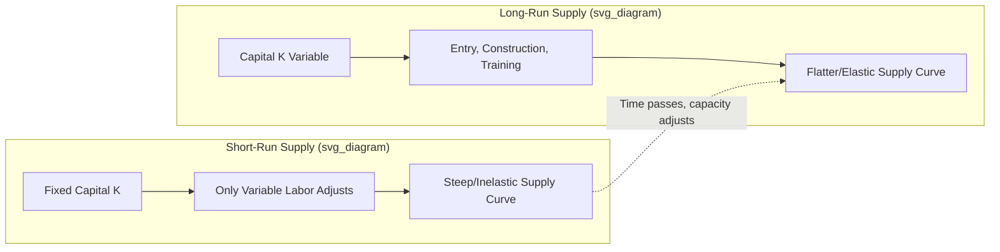

## Short-Run versus Long-Run Supply Responses

### Conceptual Foundation

Supply responses in healthcare markets describe how the quantity of medical services provided changes in reaction to a price or demand shift, with the magnitude and mechanism of that change depending critically on the time horizon under consideration. The distinction between short-run and long-run supply is a direct application of standard production theory, but it takes on distinctive features in healthcare markets due to licensing barriers, capital intensity, long training pipelines, and regulatory constraints on capacity.

In the **short run**, at least one factor of production is fixed. In healthcare, this typically means the number of licensed physicians, hospital beds, or specialized equipment (e.g., MRI machines) cannot be adjusted quickly. Providers can only vary output by adjusting variable inputs — labor hours, overtime, nursing staff, supply utilization, or throughput per fixed facility.

In the **long run**, all factors of production are variable. New hospitals can be built, new physicians can be trained and licensed, new equipment can be purchased, and market entry/exit becomes possible. The long-run supply curve reflects the full adjustment of capacity to price signals.

### Key Points

- Short-run supply is constrained by fixed capital (beds, equipment) and fixed professional labor supply (number of licensed practitioners).
- Long-run supply is constrained only by entry barriers: licensing requirements, medical education capacity, certificate-of-need (CON) laws, and capital formation.
- The healthcare sector exhibits unusually **long adjustment lags** relative to most industries because physician training takes 7–15 years (undergraduate + medical school + residency + fellowship), making the short run effectively longer in duration than in most other markets.
- Price elasticity of supply is lower in the short run and higher in the long run — a standard economic result, but the *magnitude* of the gap is unusually large in healthcare due to licensing bottlenecks.

### Short-Run Supply Curve: Characteristics

The short-run supply curve for medical care is typically drawn as steeply upward-sloping (inelastic) because:

1. **Fixed number of providers** — the physician workforce cannot expand quickly in response to a demand surge (e.g., a pandemic or a new insurance mandate expanding coverage).
2. **Fixed capital stock** — hospital beds, operating rooms, and imaging equipment represent large sunk investments that cannot be scaled instantaneously.
3. **Diminishing marginal returns to variable inputs** — as existing facilities are pushed to use more variable inputs (overtime nursing labor, extra shifts) against a fixed base of beds/equipment, the marginal cost of additional output rises.

The short-run marginal cost curve reflects this diminishing returns structure:

$$MC_{SR} = \frac{\partial TC}{\partial Q}\bigg|_{K = \bar{K}}$$

where $\bar{K}$ denotes the fixed capital stock (beds, equipment, or licensed provider count) held constant in the short run.

**Practical Example**: When a region experiences a sudden influx of patients (e.g., an epidemic outbreak or a large employer relocating and bringing thousands of newly insured workers), the short-run response is limited to:

- Existing physicians extending office hours or seeing more patients per hour (reducing time per visit)
- Hospitals adding overtime shifts for existing nursing staff
- Utilization of urgent care or telehealth to absorb marginal demand
- Increased wait times and rationing by queue rather than by price expansion of capacity

None of these responses add net new capacity — they intensify use of the existing fixed base, which is why prices (or wait times, in non-market-clearing contexts) rise sharply in the short run when demand shifts outward.

### Long-Run Supply Curve: Characteristics

In the long run, the supply curve is flatter (more elastic) because entry and capital expansion become possible:

1. **New medical school enrollment and residency slots** can expand the physician pipeline, though with a multi-year lag.
2. **Hospital construction and equipment purchases** allow capacity to catch up to demand.
3. **Entry of new provider types** (e.g., nurse practitioners, physician assistants, retail clinics) can substitute for physician-constrained capacity in some service lines.
4. **Geographic reallocation** — providers relocate toward higher-reimbursement or higher-demand markets over time.

The long-run supply curve can be represented as the **envelope of short-run marginal cost curves** at each level of fixed capital, analogous to the long-run average cost envelope in standard cost theory:

$$MC_{LR}(Q) = \min_{K} ; MC_{SR}(Q, K)$​

This reflects that in the long run, providers choose the capital stock $K$ that minimizes the cost of producing any given quantity $Q$, whereas in the short run they are stuck with whatever $K$ they currently hold.

### Diagrammatic Representation

The following SVG illustrates the standard short-run versus long-run supply curve divergence from a common point, a canonical device in price theory:

<svg xmlns="http://www.w3.org/2000/svg" viewBox="0 0 620 420" font-family="Helvetica, Arial, sans-serif">
<title>Short-Run vs Long-Run Supply Curves (svg_diagram)</title>

<line x1="70" y1="360" x2="580" y2="360" stroke="#333" stroke-width="2" />
<line x1="70" y1="360" x2="70" y2="30" stroke="#333" stroke-width="2" />
<text x="300" y="400" font-size="16" fill="#222">Quantity of Medical Care (Q)</text>
<text x="20" y="200" font-size="16" fill="#222" transform="rotate(-90 20,200)">Price (P)</text>

<path d="M 150 350 C 250 250, 320 120, 360 40" stroke="#c0392b" stroke-width="3" fill="none" />
<text x="365" y="45" font-size="14" fill="#c0392b">S(short-run)</text>

<path d="M 90 340 C 250 290, 400 200, 560 60" stroke="#2980b9" stroke-width="3" fill="none" />
<text x="565" y="65" font-size="14" fill="#2980b9">S(long-run)</text>

<path d="M 100 80 L 520 340" stroke="#27ae60" stroke-width="2" stroke-dasharray="6,4" fill="none" />
<text x="500" y="335" font-size="14" fill="#27ae60">D1</text>

<path d="M 220 60 L 570 320" stroke="#8e44ad" stroke-width="2" stroke-dasharray="6,4" fill="none" />
<text x="550" y="315" font-size="14" fill="#8e44ad">D2 (shifted)</text>

<circle cx="270" cy="205" r="5" fill="#000" />
<text x="280" y="200" font-size="13">E0</text>
<circle cx="340" cy="150" r="5" fill="#000" />
<text x="350" y="145" font-size="13">E_SR (high price, small Q gain)</text>
<circle cx="420" cy="205" r="5" fill="#000" />
<text x="430" y="220" font-size="13">E_LR (lower price, larger Q gain)</text>
</svg>

This diagram shows the standard result: when demand shifts from D1 to D2, the short-run equilibrium (E_SR) lands on the steep short-run supply curve, producing a large price increase and small quantity increase. Over time, as capacity adjusts, the equilibrium migrates to E_LR on the flatter long-run curve, yielding a smaller net price increase and a larger quantity increase.

### Sector-Specific Mechanisms Driving the Short-Run/Long-Run Gap

**Physician Labor Supply**

- Short run: physicians can adjust hours worked (labor supply elasticity along the intensive margin), but the number of physicians is fixed.
- Long run: medical school capacity, residency slot funding (heavily influenced by Medicare Graduate Medical Education (GME) funding in the U.S.), and licensing/immigration policy for foreign-trained physicians determine the size of the physician stock.
- [Inference] Because residency slots have historically been capped by federal funding formulas, physician supply in the U.S. has been argued by some health economists to adjust more slowly than in systems with more flexible training-capacity funding; the precise elasticity is debated and varies by specialty and country.

**Hospital Capacity**

- Short run: number of staffed beds, ICU capacity, and equipment are fixed; hospitals can only adjust length-of-stay management, discharge planning, and staffing intensity.
- Long run: Certificate-of-Need (CON) laws in many U.S. states directly regulate the ability of hospitals to add beds or acquire major equipment, creating a *regulatory* long-run constraint layered on top of the *economic* long-run adjustment process. In states with CON laws, "long run" supply elasticity can remain artificially suppressed even over multi-year horizons because expansion requires regulatory approval, not just capital investment.

**Pharmaceutical and Medical Device Manufacturing**

- Short run: existing manufacturing lines and approved formulations constrain output; a demand spike (e.g., a new indication or pandemic-driven demand) can only be met by running existing plants at higher utilization.
- Long run: new manufacturing facilities, new drug approvals, and generic entry (post-patent expiration) expand supply substantially. FDA approval timelines impose an additional multi-year lag distinct from ordinary capital construction lags.

### Elasticity Comparison

| Time Horizon | Fixed Inputs | Elastic Margin of Adjustment | Typical Supply Elasticity |
| --- | --- | --- | --- |
| Short run | Beds, equipment, licensed provider count | Labor hours, overtime, utilization rate, queue length | Low (inelastic, often estimated well below 1) |
| Long run | None (all inputs variable) | Entry, construction, training pipeline, technology adoption | Higher (more elastic, though still constrained by licensing/regulatory frictions relative to non-healthcare sectors) |

[Unverified] Specific numerical elasticity estimates vary widely across empirical studies, specialties, and countries, and depend heavily on identification strategy (e.g., using reimbursement rate changes, Medicare fee schedule shocks, or supply-side natural experiments); no single elasticity value should be treated as a universal constant for "medical care supply."

### Policy Relevance

The short-run/long-run distinction matters directly for policy design:

- **Fee schedule changes** (e.g., Medicare reimbursement cuts or increases) will have muted short-run supply effects because provider capacity cannot instantly respond, but larger long-run effects as providers adjust specialty choice, practice location, or capacity investment over time.
- **Insurance expansions** (e.g., Medicaid expansion, ACA marketplace subsidies) that increase demand tend to produce short-run price/wait-time pressure that gradually eases as supply-side adjustment (new practices, expanded hours, telehealth entry) occurs — though empirical evidence on the speed of this adjustment varies by market and specialty.
- **Workforce planning** (e.g., projecting physician shortages) requires modeling the long training pipeline explicitly; a shortage identified today implies a policy response (e.g., expanding residency slots) that will not manifest as increased supply for 7+ years.
- **CON law repeal or retention** debates hinge on whether policymakers believe regulatory removal will meaningfully shift the long-run supply curve outward, versus concerns that unrestricted capacity expansion could induce supplier-driven demand (a separate topic from pure supply elasticity).

### Worked Example

Suppose a state government significantly raises Medicaid reimbursement rates for primary care visits, intending to increase access.

*Short run (0–12 months):*

- Existing primary care physicians accept more Medicaid patients into open appointment slots (some substitution from other payer types or from leisure time).
- Total visit volume increases modestly; the visible response is mostly a *reallocation* of existing capacity toward Medicaid patients rather than a net increase in total visits.
- Appointment wait times for all patient types may rise slightly if physicians are near full capacity.

*Long run (3–10 years):*

- Higher reimbursement makes primary care a relatively more attractive specialty choice for medical students and residents, gradually shifting the specialty mix of new physicians.
- Some physicians relocate to the state or expand practice size (adding partners, physician assistants, or nurse practitioners) to capture the higher-margin patient volume.
- New practices open in previously underserved areas where reimbursement had been too low to support a practice's fixed costs.
- Aggregate primary care capacity expands, and the long-run equilibrium exhibits both higher quantity and a smaller sustained price/wait-time premium than the short-run outcome.

### Related Topics

- Physician labor supply elasticity and target-income hypothesis
- Certificate-of-Need (CON) laws and regulatory entry barriers
- Supplier-induced demand and its interaction with supply elasticity
- Medical education pipeline economics and GME funding policy
- Hospital cost structure: fixed versus variable cost analysis
- Market structure in healthcare: monopolistic competition among providers
- Capacity planning and queuing theory in healthcare delivery
- Cross-country comparison of physician supply regulation (U.S. vs. single-payer systems)