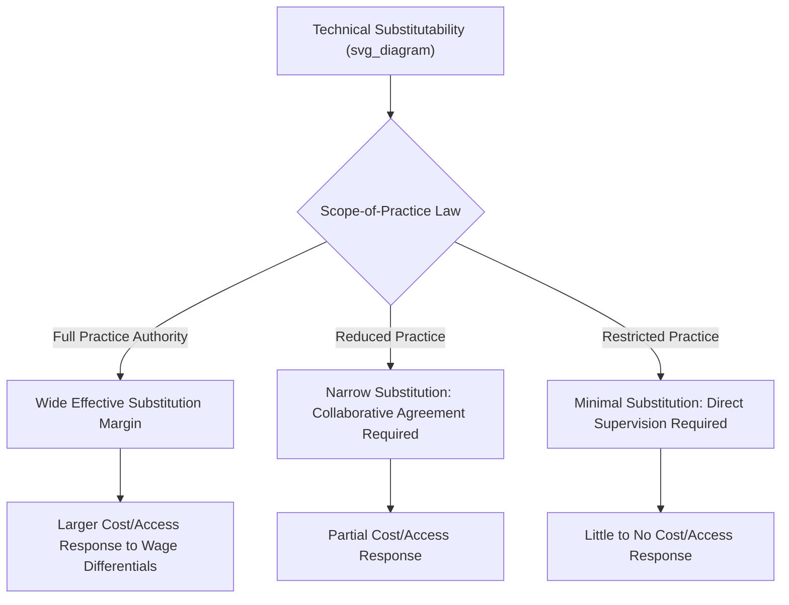

## Input Substitution Among Health Care Providers

### Conceptual Foundation

Input substitution refers to the degree to which one type of productive input in the delivery of medical care can be replaced by another while maintaining a given level of output (health services rendered, or health outcomes achieved). In healthcare production theory, this most commonly refers to substitution among labor types — physicians, nurse practitioners (NPs), physician assistants (PAs), registered nurses, and technicians — but it also extends to substitution between labor and capital (e.g., automated diagnostic equipment replacing technician time) and between sites of care (e.g., outpatient substituting for inpatient).

The healthcare production function can be represented generally as:

$$Q = f(L_{MD}, L_{NP}, L_{PA}, L_{RN}, K, M)$$

where $Q$ is health services output, $L_{MD}$, $L_{NP}$, $L_{PA}$, and $L_{RN}$ represent labor inputs from physicians, nurse practitioners, physician assistants, and registered nurses respectively, $K$ is capital (equipment, facilities), and $M$ is materials/supplies.

Input substitution asks: how does the optimal mix of $L_{MD}$, $L_{NP}$, $L_{PA}$ change as their relative prices (wages) or relative productivities change, holding $Q$ constant?

### Key Points

- Substitutability is measured formally via the **elasticity of substitution**, which quantifies how the ratio of input use responds to changes in the ratio of input prices.
- Substitution in healthcare is **bounded by scope-of-practice regulation**, not solely by relative productivity or cost — a key departure from standard input-substitution models in other industries.
- Substitution can be **full** (perfect substitutes for a given task), **partial** (some tasks can be shifted, others cannot), or **complementary** (inputs must be used together, e.g., a supervising physician legally required alongside a PA in some states).
- The direction and magnitude of substitution has direct implications for cost containment policy, access expansion, and workforce planning.

### The Elasticity of Substitution

The elasticity of substitution ($\sigma$) between two inputs, say physicians (MD) and nurse practitioners (NP), is defined as:

$$\sigma = \frac{\partial \ln(L_{NP}/L_{MD})}{\partial \ln(w_{MD}/w_{NP})}$$

where $w_{MD}$ and $w_{NP}$ are the respective wage rates. A higher $\sigma$ indicates that a given change in the relative wage of physicians induces a larger shift toward using NPs in place of MDs.

**Interpretation of boundary cases:**

- $\sigma = 0$: perfect complements (Leontief production) — inputs must be used in fixed proportion regardless of relative price (e.g., a physician must be present for a specific procedure by law, and no wage differential changes that requirement).
- $\sigma \to \infty$: perfect substitutes — the two inputs are interchangeable for the task at hand, and the entire task shifts to whichever input is cheaper.
- $0 < \sigma < \infty$: imperfect substitutes — the empirically realistic case for most MD/NP/PA relationships, since some tasks are substitutable and others are not.

[Unverified] Empirical estimates of $\sigma$ between physicians and mid-level providers vary substantially across studies, specialties, and practice settings, and are sensitive to how "task" is defined (e.g., primary care visits for routine conditions show higher estimated substitutability than complex diagnostic or surgical care); no single elasticity value generalizes across the healthcare sector.

### Scope-of-Practice as a Substitution Constraint

Unlike substitution in a standard manufacturing production function, healthcare input substitution is legally bounded by **scope-of-practice (SOP) laws**, which define which tasks each licensed provider type is permitted to perform, often varying substantially:

- **Full practice authority states**: NPs can diagnose, treat, and prescribe independently without physician supervision — the substitution margin between MDs and NPs is comparatively wide.
- **Reduced practice states**: NPs require a collaborative agreement with a supervising physician for some scope of activity, narrowing substitutability.
- **Restricted practice states**: NPs require direct physician supervision for prescribing and other functions, sharply narrowing the substitution margin.

This creates a distinctive feature of healthcare labor markets: the *technical* elasticity of substitution (what is clinically feasible) can exceed the *effective* elasticity of substitution (what is legally permitted), and policy changes to SOP laws function as shifts in the effective substitution frontier rather than shifts in underlying technology.

### Types of Substitution Margins

**1. Task-Level Substitution (Skill-Mix Substitution)**

Reallocating specific clinical tasks from higher-cost to lower-cost licensed labor without changing the site or type of care. Example: routine hypertension management shifted from physicians to NPs within the same primary care practice.

**2. Site-of-Care Substitution**

Shifting the location where care is delivered, which typically also shifts the input mix. Example: minor procedures moved from inpatient hospital settings (physician- and RN-intensive, capital-intensive) to ambulatory surgery centers, or from in-person visits to telehealth (substituting technology/bandwidth for in-person clinical staff time).

**3. Labor-Capital Substitution**

Replacing labor input with capital/technology. Example: automated point-of-care diagnostic devices reducing the technician time required per test, or AI-assisted radiology triage reducing radiologist time per routine read (with radiologist time reallocated toward complex cases).

**4. Team-Based Care Restructuring**

Rather than pure substitution, many practices restructure the entire care team, with physicians focusing on complex diagnostic and treatment-planning tasks while NPs, PAs, and RNs handle routine follow-up, chronic disease management, and patient education — a form of **complementary specialization** rather than one-for-one substitution.

### Practical Example: Cost-Minimization with Substitutable Inputs

Consider a primary care practice producing a fixed target of $Q_0$ patient visits per week, choosing between physician hours ($L_{MD}$, wage $w_{MD}$) and NP hours ($L_{NP}$, wage $w_{NP}$), where $w_{MD} > w_{NP}$.

The practice minimizes cost subject to the production constraint:

$$\min_{L_{MD}, L_{NP}} \; w_{MD} L_{MD} + w_{NP} L_{NP} \quad \text{s.t.} \quad f(L_{MD}, L_{NP}) = Q_0$$

The optimal input ratio satisfies the standard tangency condition:

$$\frac{MP_{MD}}{MP_{NP}} = \frac{w_{MD}}{w_{NP}}$$

where $MP_{MD}$ and $MP_{NP}$ denote the marginal products of physician and NP labor respectively for the relevant task mix.

**Numerical illustration**: Suppose a physician's fully loaded wage is $120/hour and an NP's is $60/hour. If the marginal product of an additional physician-hour on routine visit throughput is only 1.3 times that of an NP-hour (rather than 2.0 times, which would exactly offset the wage ratio), then cost-minimization favors substituting toward more NP hours and fewer physician hours, holding total visit output constant — provided scope-of-practice law permits NPs to perform the marginal task independently.

If SOP law requires physician co-signature or supervision for that task, an implicit "supervision cost" must be added to the effective wage of the NP-performed task, which can offset or eliminate the nominal cost advantage.

### Empirical Findings

[Inference] Based on the health economics literature broadly, several patterns are commonly reported, though specific magnitudes vary by study and should not be treated as universal constants:

- States that expanded NP scope of practice have generally been found to see increased NP-provided primary care visit share, particularly in rural and underserved areas where physician supply is more constrained.
- Cost per visit tends to be lower for NP/PA-delivered routine primary care relative to physician-delivered care for comparable case-mix, though outcome-equivalence claims are more contested and vary by condition complexity.
- Substitution appears strongest for well-protocolized, lower-complexity care (routine chronic disease management, minor acute conditions) and weakest for complex diagnostic or procedural care, consistent with a low elasticity of substitution for high-complexity tasks and a higher elasticity for routine tasks.

### Barriers to Substitution Beyond Legal Scope

- **Malpractice liability structure**: liability insurance and legal exposure can create disincentives for delegating tasks even where legally permitted.
- **Reimbursement policy**: some payers reimburse NP/PA-delivered services at a percentage of the physician fee schedule (commonly cited around 85% in U.S. Medicare policy for many services), which affects the practice's financial incentive to substitute independent of clinical feasibility. [Unverified — reimbursement percentages vary by payer, service, and are subject to periodic policy revision; consult current fee schedules for specific rates.]
- **Patient preference and information asymmetry**: some patients prefer or perceive higher quality from physician-delivered care regardless of clinical equivalence, which can dampen the market-level substitution response even when supply-side incentives favor it.
- **Professional/institutional norms**: hospital medical staff bylaws and credentialing committees can impose stricter task boundaries than state law requires.

### Diagrammatic Summary: Isoquant and Substitution

<svg xmlns="http://www.w3.org/2000/svg" viewBox="0 0 600 420" font-family="Helvetica, Arial, sans-serif">
<title>Isoquant and Input Substitution Between Physician and NP Labor (svg_diagram)</title>
<line x1="70" y1="360" x2="560" y2="360" stroke="#333" stroke-width="2" />
<line x1="70" y1="360" x2="70" y2="30" stroke="#333" stroke-width="2" />
<text x="280" y="400" font-size="15" fill="#222">NP Hours (L_NP)</text>
<text x="20" y="200" font-size="15" fill="#222" transform="rotate(-90 20,200)">Physician Hours (L_MD)</text>

<path d="M 100 60 C 200 90, 350 220, 520 330" stroke="#2980b9" stroke-width="3" fill="none" />
<text x="420" y="300" font-size="13" fill="#2980b9">Isoquant Q0 (imperfect substitutes)</text>

<line x1="90" y1="320" x2="480" y2="70" stroke="#c0392b" stroke-width="2" stroke-dasharray="5,3" />
<text x="440" y="65" font-size="13" fill="#c0392b">Isocost (w_MD high)</text>

<line x1="120" y1="350" x2="540" y2="150" stroke="#27ae60" stroke-width="2" stroke-dasharray="5,3" />
<text x="480" y="145" font-size="13" fill="#27ae60">Isocost (w_NP falls)</text>

<circle cx="230" cy="140" r="5" fill="#000" />
<text x="240" y="130" font-size="12">A: initial mix</text>
<circle cx="330" cy="230" r="5" fill="#000" />
<text x="340" y="245" font-size="12">B: substitution toward NP hours</text>
</svg>

As the relative wage of NP labor falls (or scope-of-practice expansion effectively lowers the "supervision-adjusted" cost of NP labor), the isocost line rotates, and the cost-minimizing tangency point moves along the isoquant from point A toward point B — more NP hours, fewer physician hours, same total output $Q_0$.

### Related Topics

- Scope-of-practice regulation and its variation across U.S. states
- Physician labor supply elasticity and target-income hypothesis
- Skill-mix optimization and team-based primary care models
- Reimbursement policy for non-physician practitioners (Medicare/Medicaid fee schedules)
- Technology-labor substitution: AI and automation in diagnostic workflows
- Short-run versus long-run supply responses (interaction with substitution flexibility)
- Production function estimation methods in healthcare economics
- Access-to-care effects of mid-level provider scope expansion in rural markets