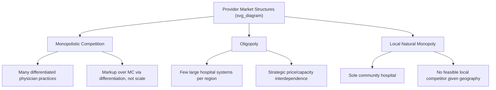

## Market Structure and Competition Among Providers

### Conceptual Foundation

Market structure describes the competitive environment in which healthcare providers (physicians, hospitals, insurers, and other supplier entities) operate, characterized by the number and size distribution of firms, barriers to entry, product/service differentiation, and the degree of price-setting power individual providers hold. Standard industrial organization theory identifies four canonical structures — perfect competition, monopolistic competition, oligopoly, and monopoly — but healthcare markets rarely fit these categories cleanly due to information asymmetry, licensing barriers, insurance intermediation, and geographic constraints on patient mobility.

The relevant analytical question for this topic is: how does the structure of the provider market affect price, quantity, quality, and consumer welfare in medical care markets, and why does healthcare deviate systematically from the textbook competitive benchmark?

### Key Points

- Provider markets are best characterized as **monopolistically competitive** at the physician-practice level and increasingly **oligopolistic** at the hospital-system level due to ongoing consolidation.
- **Geographic market definition** is central to healthcare antitrust and competition analysis because patients generally cannot travel far for most services, making local markets economically relevant even when national provider counts appear large.
- **Information asymmetry** between providers and patients weakens the standard competitive discipline that price and quality signals would otherwise provide.
- **Insurance intermediation** changes the nature of price competition: providers often compete for inclusion in insurer networks rather than directly for patient price-sensitivity at the point of service.
- Provider market concentration has been extensively documented to be associated with higher negotiated prices, with more mixed and context-dependent evidence on quality effects.

### The Spectrum of Market Structures in Healthcare

**1. Monopolistic Competition (Physician Practices, Ambulatory Care)**

Many differentiated providers exist within a local market, each possessing some degree of market power due to differentiation (location, reputation, bedside manner, sub-specialization, wait time) rather than pure price competition:

$$P > MC \quad \text{but} \quad P \to AC \text{ in long-run equilibrium as entry occurs}$$

Each provider faces a downward-sloping demand curve for their own services due to differentiation and patient search/switching costs, yielding positive markups over marginal cost even in markets with numerous competitors.

**2. Oligopoly (Hospital Systems, Specialty Groups)**

A small number of large hospital systems or specialty practice groups dominate a geographic market, often the result of sustained merger activity. Strategic interdependence becomes central — pricing and capacity decisions by one system directly affect and are affected by rivals, making standard oligopoly frameworks (Cournot quantity competition, Bertrand price competition, or healthcare-specific bargaining models) the relevant analytical tools.

**3. Local (Natural) Monopoly (Rural Hospitals, Sole Community Providers)**

In many rural markets, a single hospital or physician group is the only feasible provider given population density and travel-cost constraints, creating a natural local monopoly even though the same firm operates within a competitive national market for inputs such as labor and equipment.

**4. Monopsony/Oligopsony (Insurer Side; Increasingly Provider Side in Labor Markets)**

While this topic centers on provider-side competition, concentrated insurers can exercise monopsony power over providers in price negotiations, and increasingly, large hospital systems can exercise monopsony power over local physician and nursing labor markets — a related but distinct concentration phenomenon.

### Geographic Market Definition

A defining methodological feature of healthcare competition analysis is that **relevant markets are local**, not national, for most inpatient and many outpatient services, because:

- Patients generally will not travel far for routine or emergency care.
- Antitrust regulators (in the U.S., the FTC and DOJ) typically define hospital markets using patient-flow data — analyzing where patients in a given area actually receive care — rather than simple radius-based or population-based proxies.
- The standard tool for measuring concentration within a defined geographic market is the **Herfindahl-Hirschman Index (HHI)**:

$$HHI = \sum_{i=1}^{n} s_i^2$$

where $s_i$ is the market share (as a percentage) of firm $i$ in the relevant geographic market, and $n$ is the number of firms.

**Interpretation thresholds** (per U.S. Horizontal Merger Guidelines, historically applied to hospital merger review):

- $HHI < 1500$: unconcentrated market
- $1500 \le HHI \le 2500$: moderately concentrated market
- $HHI > 2500$: highly concentrated market; mergers producing large HHI increases in this range draw heightened antitrust scrutiny

[Unverified] Specific numerical thresholds and their application have evolved over successive revisions of federal merger guidelines; consult current FTC/DOJ guidance for the applicable thresholds at any given time, as these are periodically revised.

### Practical Example: HHI Calculation

Suppose a metropolitan statistical area (MSA) has four hospital systems with the following inpatient market shares: 45%, 30%, 15%, and 10%.

$$HHI = 45^2 + 30^2 + 15^2 + 10^2 = 2025 + 900 + 225 + 100 = 3250$$

This market would be classified as highly concentrated ($HHI > 2500$). If the two largest systems (45% and 30% shares) proposed a merger, the post-merger HHI would be:

$$HHI_{post} = 75^2 + 15^2 + 10^2 = 5625 + 225 + 100 = 5950$$

The change in HHI ($\Delta HHI = 5950 - 3250 = 2700$) would substantially exceed typical scrutiny thresholds for a market already highly concentrated, making this merger a strong candidate for antitrust challenge under standard guidelines.

### Hospital Consolidation Trends and Effects

Hospital and physician practice consolidation has been a dominant structural trend in U.S. healthcare markets over recent decades, occurring through:

- **Horizontal mergers**: hospital-to-hospital combinations within the same geographic market, directly increasing concentration.
- **Vertical integration**: hospitals acquiring physician practices, converting previously independent competitive physician markets into components of integrated delivery systems.
- **Cross-market mergers**: hospital systems combining across non-overlapping geographic markets, which does not directly increase local concentration but can create "must-have" negotiating leverage with insurers operating across multiple regions.

**Documented effects** (broadly consistent across a substantial body of empirical health economics research, though specific magnitudes vary by study, region, and time period):

- Horizontal hospital mergers in concentrated markets have been consistently associated with price increases for the merging parties, with limited or no corresponding measured quality improvement in many studies — a pattern that runs counter to industry claims that consolidation primarily generates efficiency gains passed to consumers.
- Physician practice acquisition by hospitals ("vertical integration") has been associated with increased prices for physician services in several studies, partly attributed to hospitals billing physician services at higher hospital-outpatient facility rates rather than lower independent-practice rates.
- [Inference] Quality effects of consolidation are more heterogeneous across the literature, with some studies finding modest quality improvements from scale/care coordination and others finding no significant effect or quality declines associated with reduced competitive pressure; results likely depend on market-specific and system-specific factors not fully captured by aggregate analysis.

### Competition and Bargaining Between Providers and Insurers

Provider market power interacts directly with insurer market structure through **bilateral bargaining models**, since most provider prices in the U.S. are not posted/list prices but negotiated rates with each insurer. A standard framework applied in health economics is **Nash bargaining**, where the negotiated price splits the surplus from reaching an agreement based on each party's relative bargaining leverage and disagreement payoff (the outcome if negotiations fail and the provider is excluded from the insurer's network, or the insurer's plan becomes unattractive to enrollees without that provider).

$$P^* = \arg\max_{P} \; \left[\pi_{provider}(P) - \pi_{provider}^{disagreement}\right]^{\beta} \left[\pi_{insurer}(P) - \pi_{insurer}^{disagreement}\right]^{1-\beta}$$

where $\beta$ represents the provider's relative bargaining weight. A more concentrated provider market (fewer substitute hospitals for the insurer to steer patients toward) raises the provider's disagreement payoff advantage and effectively increases $\beta$, translating directly into higher negotiated prices — this is the core mechanism linking provider market structure to observed price levels, distinct from the pure textbook monopoly-pricing mechanism.

### Barriers to Entry Specific to Healthcare Provider Markets

- **Certificate-of-Need (CON) laws**: direct regulatory barriers to new hospital construction or major service line additions in states that maintain them.
- **Capital intensity**: hospital construction and equipment represent very large sunk costs, creating a natural entry barrier independent of regulation.
- **Licensing and credentialing**: physicians face lengthy training and licensing requirements limiting the pool of potential new market entrants.
- **Network effects and reputation**: established providers with existing referral networks, insurer contracts, and patient relationships hold switching-cost advantages that new entrants must overcome.
- **Payer contracting barriers**: new entrants may struggle to secure inclusion in insurer networks at competitive rates, particularly where incumbent systems have long-term exclusive or preferential contracts.

### Comparative Summary Table

| Structural Feature | Perfect Competition (Benchmark) | Typical Healthcare Provider Market |
| --- | --- | --- |
| Number of firms | Many | Few to moderate, varies sharply by geography and service line |
| Product homogeneity | Homogeneous | Highly differentiated (location, reputation, quality perception) |
| Price-taking behavior | Firms are price-takers | Providers negotiate prices bilaterally with each insurer |
| Information | Perfect information | Substantial information asymmetry between patient and provider |
| Entry/exit | Free entry and exit | Significant regulatory, capital, and licensing barriers |
| Consumer price sensitivity | High | Muted at point-of-service due to insurance (moral hazard); more relevant at plan-selection stage |

### Related Topics

- Herfindahl-Hirschman Index (HHI) methodology and antitrust merger review standards
- Nash bargaining models in provider-insurer price negotiation
- Certificate-of-Need (CON) laws and regulatory entry barriers
- Vertical integration of hospitals and physician practices
- Short-run versus long-run supply responses (interaction with entry barriers)
- Input substitution among healthcare providers (interaction with consolidated delivery systems)
- Insurer market concentration and monopsony power
- Quality competition versus price competition in differentiated provider markets