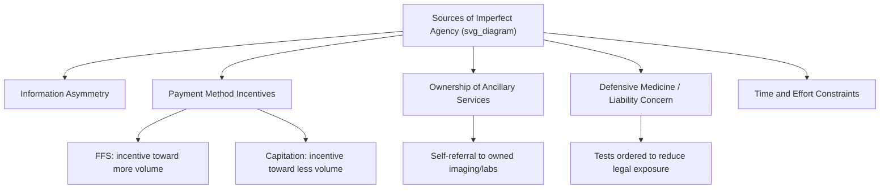

## The Physician as Imperfect Agent

### Conceptual Foundation

Agency theory analyzes relationships in which one party (the **principal**) delegates decision-making authority to another party (the **agent**) who is expected to act in the principal's best interest, but who possesses information, expertise, or incentives that diverge from the principal's. In healthcare, the patient is the principal and the physician is the agent: patients lack the clinical knowledge to independently determine the correct diagnosis, treatment, or quantity of care, and therefore delegate this decision to the physician.

The physician is termed an **imperfect agent** because the ideal of "perfect agency" — where the physician makes exactly the decision the patient would make if the patient possessed the physician's full clinical knowledge — is not achieved in practice. Instead, physician decisions are shaped by a mix of clinical judgment, financial incentives, liability concerns, personal practice norms, and time constraints, which can systematically diverge from what a fully-informed patient would choose.

### Key Points

- The physician-as-agent framework was formalized in health economics primarily through the work of Kenneth Arrow (1963) on uncertainty and welfare economics of medical care, which established information asymmetry as the central market failure in healthcare.
- "Perfect agency" is a theoretical benchmark, not an empirical description — virtually all health economics literature treats real-world physician agency as imperfect to some degree.
- Imperfect agency is the mechanism underlying **supplier-induced demand (SID)**, a related but distinct concept referring to the physician's ability to shift the demand curve itself, rather than simply operating along a fixed demand curve.
- The degree of imperfection varies with payment method, malpractice environment, physician ownership stakes in ancillary services, and the specific clinical decision under consideration.

### The Perfect Agency Benchmark

Under **perfect agency**, the physician would recommend exactly the level and type of care that the patient would choose if the patient had the physician's complete clinical knowledge. Formally, if $U_p(Q, I)$ represents patient utility as a function of quantity of care $Q$ and full information $I$, perfect agency requires the physician to select:

$$Q^{*} = \arg\max_{Q} \; U_p(Q, I_{physician})$$

using the physician's information set $I_{physician}$ but the patient's utility function and preferences, not the physician's own utility function.

In practice, physicians instead often behave as though maximizing some blend of the patient's welfare and their own objectives:

$$U_{physician} = \alpha \, U_p(Q) + (1-\alpha) \, U_{MD}(Q, \pi, L, T)$$

where $U_{MD}$ represents the physician's own utility incorporating income/profit ($\pi$), malpractice/liability risk ($L$), and time/effort cost ($T$), and $\alpha \in [0,1]$ represents the weight placed on pure patient welfare relative to the physician's own interests. $\alpha = 1$ corresponds to perfect agency; $\alpha < 1$ represents imperfect agency, with lower values indicating greater divergence from the patient's ideal.

[Inference] This weighted-utility formulation is a standard pedagogical simplification used to illustrate the agency problem; it is not a literal description of physician psychology, and actual physician decision-making involves clinical judgment under uncertainty that resists full reduction to a single utility-weighting parameter.

### Sources of Imperfect Agency

**1. Information Asymmetry**

Patients cannot fully verify whether a recommended test, procedure, or referral is clinically necessary, creating room for physician discretion that need not align with patient interest even absent any deliberate misconduct — simple clinical uncertainty and differing risk tolerances between physician and patient already produce divergence from a hypothetical perfectly-informed patient's choice.

**2. Financial Incentives Embedded in Payment Method**

- **Fee-for-service (FFS)**: financially rewards increased volume, creating an incentive (not necessarily acted upon, but structurally present) to recommend more services than a purely patient-welfare-maximizing agent would.
- **Capitation**: financially rewards reduced volume per capitated patient, creating the opposite structural incentive — potential under-provision.
- **Salary/fixed payment**: theoretically neutral with respect to volume, though it can create incentives toward reduced effort or referral-out behavior depending on institutional context.

**3. Physician Ownership of Ancillary Services**

Physicians with ownership stakes in imaging centers, labs, ambulatory surgery centers, or specialty pharmacies face a direct financial incentive to refer patients to self-owned facilities, a specific and well-studied form of imperfect agency sometimes termed **self-referral**.

**4. Defensive Medicine**

Malpractice liability concerns can induce physicians to order additional tests or procedures primarily to reduce legal exposure rather than to maximize expected patient health benefit, representing agency divergence driven by the physician's own risk management rather than direct financial gain.

**5. Time and Effort Constraints**

Under panel size pressure or productivity targets, physicians may spend less time per patient than would be ideal from the patient's perspective, trading patient-specific thoroughness for aggregate throughput.

### Distinguishing Imperfect Agency from Supplier-Induced Demand

These two concepts are closely related but analytically distinct:

- **Imperfect agency** describes the *general phenomenon* that physician recommendations may not maximize patient welfare given the physician's information — the underlying structural condition.
- **Supplier-induced demand (SID)** describes a *specific behavioral consequence*: physicians actively using their informational advantage to shift patient demand outward (e.g., convincing a patient that a marginal or unnecessary procedure is needed) in order to increase their own income or utilization of owned resources.

Imperfect agency is a *necessary condition* for SID to be possible (a perfect agent, by definition, could never induce demand against patient interest), but imperfect agency can also manifest without deliberate demand-inducement — for example, through unconscious practice-style variation, defensive medicine, or simple differences in physician versus patient risk tolerance, none of which requires intentional exploitation of the information asymmetry.

### Practical Example: Agency Divergence in a Treatment Decision

Consider a patient presenting with lower back pain, where clinical evidence supports a range of appropriate responses from conservative management (physical therapy, watchful waiting) to advanced imaging (MRI) to surgical referral, depending on symptom severity and red-flag findings.

- **Perfect agent scenario**: the physician selects conservative management for a patient with no red-flag symptoms, matching current clinical practice guidelines and what an informed patient would choose given the low probability of finding an actionable abnormality on imaging.
- **Imperfect agency scenario (FFS incentive)**: the physician, compensated per procedure and with financial ties to an imaging center, recommends MRI despite the absence of red-flag symptoms, increasing revenue without a corresponding increase in expected patient benefit.
- **Imperfect agency scenario (defensive medicine)**: the physician, absent any financial self-interest, orders the same MRI purely to document thoroughness and reduce malpractice exposure in case a rare pathology is later discovered and litigated.
- **Imperfect agency scenario (capitation incentive)**: the physician, under a capitated payment arrangement, defers a clinically appropriate specialist referral longer than an unconflicted agent would, to avoid the cost of the referral being deducted from the capitated payment pool.

Each scenario produces a different quantity/type of care than the perfect-agency benchmark, but through distinct mechanisms — only the first is a deliberate profit-driven divergence; the others reflect liability aversion and misaligned capitation incentives respectively.

### Empirical Evidence and Measurement Challenges

[Inference] Testing for imperfect agency and SID empirically is methodologically difficult because researchers must distinguish demand shifts caused by physician influence from legitimate demand shifts caused by unobserved changes in patient health status or preferences — a classic identification problem in this literature. Common empirical strategies include:

- Examining physician-to-population ratio changes and testing whether increased physician supply is associated with increased utilization per capita holding health status constant (a classic Roemer's Law-adjacent test), which some studies interpret as evidence of demand inducement to maintain target income.
- Comparing utilization patterns before and after changes in reimbursement rates for specific procedures, testing whether utilization moves in the direction predicted by the physician's own financial interest rather than by underlying clinical need.
- Studying self-referral arrangements directly, comparing referral rates and utilization intensity between physicians with and without ownership stakes in ancillary facilities.

[Unverified] The overall magnitude of demand inducement attributable to imperfect agency remains actively debated in the health economics literature; some studies find substantial evidence consistent with inducement in specific contexts (e.g., certain surgical procedures, imaging, self-referral arrangements), while others find utilization patterns largely explained by legitimate clinical and demographic factors. No consensus point estimate of "how much" imperfect agency affects aggregate healthcare spending should be treated as established fact.

### Policy and Institutional Responses

- **Payment reform**: value-based payment models, bundled payments, and shared-savings arrangements attempt to realign physician financial incentives closer to patient welfare maximization, reducing the FFS-specific volume incentive.
- **Self-referral restrictions**: laws such as the U.S. Stark Law directly prohibit or restrict physician self-referral to entities in which they hold a financial interest for services billed to federal healthcare programs.
- **Clinical practice guidelines and utilization review**: standardized, evidence-based guidelines reduce the discretionary space in which agency divergence can operate, and utilization review by payers audits whether recommended care matches guideline-concordant practice.
- **Shared decision-making models**: explicitly incorporating patient preferences and values into the treatment decision process, reducing the informational gap the physician must bridge on the patient's behalf and increasing patient capacity to evaluate whether a recommendation matches their own goals.
- **Malpractice reform**: tort reform measures (e.g., damage caps) aim to reduce the specific imperfect-agency channel driven by defensive medicine, though evidence on their effectiveness in reducing utilization is mixed. [Unverified]

### Related Topics

- Supplier-induced demand and the target-income hypothesis
- Arrow's 1963 analysis of uncertainty and welfare economics of medical care
- Physician payment methods: fee-for-service, capitation, and value-based models
- Stark Law and physician self-referral regulation
- Defensive medicine and malpractice liability
- Shared decision-making and patient-centered care models
- Input substitution among healthcare providers (interaction with delegated clinical authority)
- Information asymmetry as a source of healthcare market failure