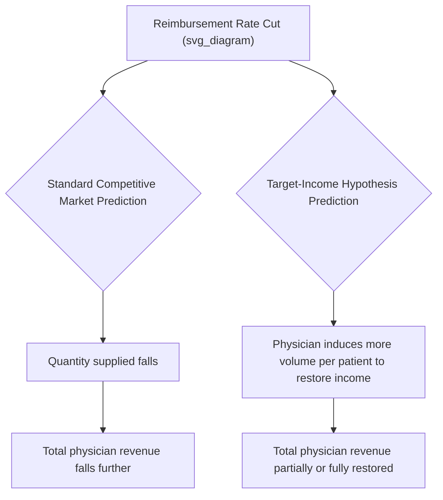

## Supplier-Induced Demand Theory and Evidence

### Conceptual Foundation

Supplier-induced demand (SID) refers to the phenomenon in which a physician, exploiting an informational advantage over the patient, influences the patient's demand for medical care in a direction that serves the physician's own interests — typically income, but potentially also risk-avoidance or workload preferences — rather than purely reflecting the patient's independently informed preferences. SID is distinguished from ordinary demand shifts (driven by changing health status, prices, insurance coverage, or preferences) because the shift originates from the *supply side* of the market, using the same informational asymmetry that gives rise to physician agency in the first place.

Formally, SID represents a violation of the standard assumption that supply and demand are independently determined. Instead of firms responding to prices set by a demand curve that is exogenous to the firm, SID posits that the physician-firm can shift the position of the demand curve itself:

$$Q_d = D(P, X; \theta)$$

where $\theta$ represents the physician's discretionary influence over demand and $X$ represents standard demand shifters (income, insurance, health status). In a standard competitive market, $\theta$ would be irrelevant or zero; SID theory posits $\theta \neq 0$ and, further, that $\theta$ responds systematically to the physician's own financial incentives.

### Key Points

- SID theory emerged largely from empirical observations that physician supply increases were sometimes associated with increased utilization per capita rather than falling prices/incomes, a pattern inconsistent with the standard competitive market prediction.
- The **target-income hypothesis** is the most commonly cited behavioral mechanism underlying SID: physicians facing declining income due to increased competition or reimbursement cuts induce additional demand to restore a target income level.
- SID is empirically difficult to distinguish from legitimate demand-side explanations (unobserved health need, access improvements, defensive medicine), and the health economics literature remains genuinely divided on its magnitude and even its existence in some contexts.
- SID is a distinct concept from imperfect agency generally: imperfect agency is the structural precondition (information asymmetry plus incentive misalignment), while SID is a specific hypothesized behavioral response — active demand-shifting rather than passive incentive-following.

### The Target-Income Hypothesis

The target-income hypothesis, most associated with the work of Uwe Reinhardt and others in the health economics literature, proposes that physicians have a target level of income they seek to maintain (whether due to habituation to a prior income level, reference-point-dependent utility, or a socially-conditioned expectation of physician earnings), and will adjust the intensity of service recommendations to defend that target when exogenous factors threaten it.

$$Q_{induced} = f(\pi^{target} - \pi^{actual}(P, Q_{base}))$$

where $\pi^{target}$ is the physician's target income, $\pi^{actual}$ is realized income given current prices and baseline patient-initiated demand $Q_{base}$, and $Q_{induced}$ is the additional physician-recommended quantity above what would occur under perfect agency.

**Key testable prediction**: under the target-income hypothesis, a *reduction* in the reimbursement rate per service should, counterintuitively, be associated with an *increase* in the volume of services per physician, as physicians attempt to restore income by recommending more services per patient — a prediction that runs directly counter to the standard competitive-market prediction that lower prices reduce quantity supplied.

### The Roemer's Law Connection

A foundational empirical observation motivating SID theory is **Roemer's Law**, originally formulated by Milton Roemer in the 1960s, stating that "a built bed is a filled bed" — hospital bed supply itself appears to drive utilization rates, rather than utilization being purely determined by underlying population health need. Extended to physician markets, the analogous claim is that increases in the physician-to-population ratio are associated with increased utilization per capita, holding health status constant — a pattern inconsistent with a simple competitive model in which increased physician supply should, if anything, reduce induced volume per physician and lower prices through ordinary competitive pressure.

[Inference] Roemer's Law and its physician-market analog are frequently cited as supportive circumstantial evidence for SID, but a positive correlation between provider supply and utilization is also consistent with several non-SID explanations, including reduced travel/waiting costs increasing genuine patient-initiated demand, improved access enabling treatment of previously unmet need, and correlation between provider density and unobserved local health status or demographic factors. The observation of a positive correlation alone does not uniquely establish SID as the causal mechanism.

### Empirical Testing Strategies

Because SID cannot be directly observed (researchers cannot observe a "true" patient-welfare-maximizing quantity to compare against actual utilization), the literature relies on several indirect identification strategies:

**1. Physician-Population Ratio Studies**

Testing whether areas with higher physician density show higher utilization/visit frequency per capita after controlling for observable health status and demographic factors, on the logic that if physicians were simply responding to fixed patient-determined demand, higher physician density should mainly reduce wait times and prices, not increase volume per capita.

**2. Reimbursement Rate Shock Studies**

Examining physician behavior following exogenous reimbursement rate changes (e.g., Medicare fee schedule revisions) and testing whether volume moves in the direction predicted by the target-income hypothesis (inverse relationship between price and volume) versus the standard competitive prediction (positive relationship between price and volume).

**3. Small-Area Variation Studies**

Analyzing geographic variation in procedure rates (e.g., the well-documented variation in rates of tonsillectomy, hysterectomy, coronary procedures, and back surgery across similar populations) as circumstantial evidence that practice-style and supply-side factors, rather than underlying health need, drive substantial utilization differences. The Dartmouth Atlas of Health Care research program is a widely-cited source of this type of small-area variation evidence in the U.S. context.

**4. Self-Referral / Ownership Studies**

Comparing utilization intensity between physicians who own ancillary service facilities (imaging centers, labs, surgery centers) and those who do not, testing whether ownership is associated with higher referral rates for the owned service — a context where the financial incentive for inducement is most direct and observable.

**5. Natural Experiments in Physician Supply**

Using exogenous shocks to local physician supply (e.g., changes in immigration policy for foreign-trained physicians, opening/closing of medical training programs, physician retirement waves) to estimate the causal effect of supply changes on utilization, seeking to isolate supply-driven variation from demand-driven variation.

### Evidence Summary and Ongoing Debate

[Inference] The empirical literature on SID does not converge on a single settled conclusion, and characterizations should reflect that ongoing division rather than presenting either "SID is proven" or "SID is disproven" as fact:

- Physician-ownership self-referral studies have generally found the most consistent evidence *supportive* of inducement-like behavior, with several well-cited studies finding higher imaging or procedure rates among physicians with ownership stakes in the relevant facility compared to non-owning physicians treating clinically similar patients.
- Small-area variation studies robustly document large unexplained geographic variation in procedure rates that is difficult to attribute entirely to underlying health differences, though attributing this variation specifically to *income-seeking* inducement (versus differing practice-style norms, differing clinical uncertainty tolerance, or differing malpractice environments) is contested.
- Reimbursement-rate shock studies have produced genuinely mixed findings: some studies find the target-income-consistent inverse price-volume relationship for specific procedures and specialties, while others find volume moving in the same direction as price (consistent with standard competitive supply behavior) or find no significant relationship.
- Physician-population ratio studies face substantial identification challenges, since physician location choice is not random with respect to local population characteristics, complicating causal interpretation of any observed correlation.

[Unverified] No consensus numerical estimate of "what share of healthcare spending is attributable to SID" exists in the literature; claims of specific percentages should be treated with skepticism absent a specific, clearly-identified study and context.

### Distinguishing SID from Legitimate Explanations

A central methodological challenge in this literature is that several alternative, non-SID mechanisms can produce observationally similar patterns to what SID would predict:

| Observed Pattern | SID Interpretation | Alternative Non-SID Interpretation |
| --- | --- | --- |
| Higher physician density → higher utilization | Physicians induce demand to fill capacity | Reduced travel/wait costs unlock genuine unmet need |
| Reimbursement cut → volume increase | Target-income restoration via inducement | Substitution toward billing more units of a now-cheaper service to maintain clinical revenue neutrality, without demand manipulation |
| Self-referral → higher utilization of owned service | Financial self-interest driving referral | Convenience/care-coordination benefits of vertically integrated care genuinely improving detection rates |
| Geographic small-area variation | Supply-side practice-style inducement | Genuine differences in local clinical training norms, patient preferences, or unmeasured case-mix |

### Policy Implications

- **Reimbursement design**: if SID is present, naive reimbursement cuts intended to reduce spending can backfire by inducing offsetting volume increases — a consideration in the design of payment reforms such as bundled payments and capitation, which attempt to remove the volume-based incentive entirely rather than merely adjusting the per-unit price.
- **Self-referral regulation**: the relatively stronger evidence for ownership-driven inducement has directly motivated regulations such as the U.S. Stark Law restricting physician self-referral for services billed to federal health programs.
- **Utilization management**: prior authorization, second-opinion requirements, and clinical guideline adherence review are institutional responses that function partly as a check on potential SID by inserting an independent assessment between physician recommendation and service delivery.
- **Value-based and bundled payment models**: by shifting reimbursement away from per-unit-of-service payment toward payment for an episode of care or population health outcome, these models aim to eliminate the volume-based financial incentive that SID theory identifies as the underlying driver.

### Related Topics

- The physician as imperfect agent (structural precondition for SID)
- Target-income hypothesis and physician labor supply behavior
- Roemer's Law and hospital bed utilization
- Small-area variation in medical practice (Dartmouth Atlas research tradition)
- Stark Law and physician self-referral regulation
- Physician payment methods: fee-for-service, capitation, bundled payment, and value-based models
- Market structure and competition among providers (interaction with inducement incentives under different competitive conditions)
- Identification strategies in health economics empirical research