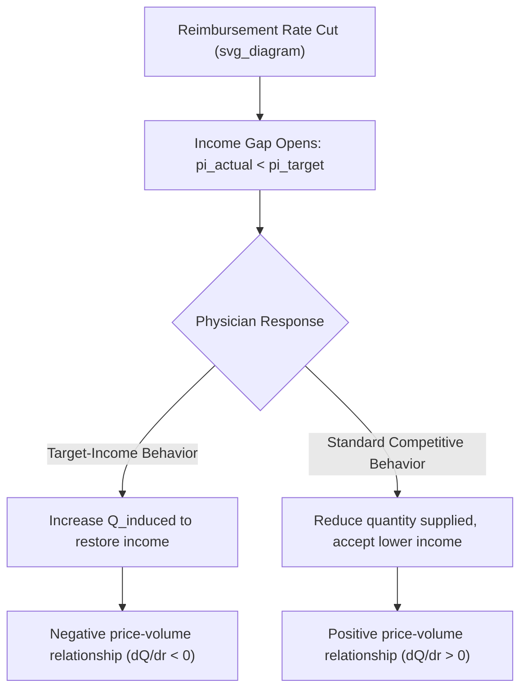

## Target Income Hypothesis

### Conceptual Foundation

The target-income hypothesis is a behavioral model of physician decision-making proposing that physicians hold a reference level of income they seek to attain or maintain, and that they adjust the intensity, frequency, or type of services recommended to patients in order to defend that reference income when exogenous factors — reimbursement cuts, increased competition, reduced patient volume — threaten to push actual income below the target. It is one of the most prominent behavioral mechanisms proposed to explain **supplier-induced demand (SID)**, providing a specific, testable account of *why* a physician-agent might deviate from perfect-agency behavior in an income-seeking direction.

The hypothesis stands in direct contrast to the standard neoclassical labor supply model, in which income effects would predict the *opposite* response: a fall in the wage rate (or reimbursement rate) should, under standard backward-bending labor supply logic, lead a worker to work either more or less depending on whether the substitution or income effect dominates, but crucially without invoking any demand-shifting behavior — the standard model treats the practitioner purely as adjusting hours/effort along a fixed demand curve, not manipulating the demand curve itself.

### Key Points

- The target-income hypothesis is associated primarily with health economists including Uwe Reinhardt, who used it to explain observed physician responses to fee schedule changes and physician-supply increases that appeared inconsistent with standard competitive market predictions.
- The hypothesis's signature empirical prediction is a **negative price-volume relationship**: reimbursement rate cuts lead to volume increases (not decreases), because physicians "make up" lost per-unit income by expanding recommended services per patient.
- This is fundamentally different from a standard income effect in labor economics, because it requires the physician to have discretionary control over the *quantity demanded* by patients (via imperfect agency/informational advantage), not merely control over their own hours worked.
- Empirical support for the strict target-income hypothesis is mixed and contested; the hypothesis is more accurately understood as one candidate explanation within the broader SID literature rather than as an established, uniformly-confirmed empirical law.

### Formal Structure of the Hypothesis

Let $\pi^{target}$ denote the physician's target income and $\pi^{actual}$ denote realized income given the current reimbursement rate $r$ per unit of service, baseline patient-initiated service volume $Q_{base}$ (services patients would seek absent any inducement), and any additional induced volume $Q_{induced}$:

$$\pi^{actual} = r \cdot (Q_{base} + Q_{induced}) - C(Q_{base} + Q_{induced})$$

where $C(\cdot)$ represents the cost of providing services. The target-income hypothesis posits that the physician selects $Q_{induced}$ to close the gap between actual and target income, subject to the physician's own disutility from inducing demand against patient interest (captured by a "distaste" or agency-cost parameter):

$$Q_{induced}^{*} = \arg\max_{Q_{induced}} \; \left[ -\left(\pi^{target} - \pi^{actual}\right)^2 - \gamma \, Q_{induced}^2 \right]$$

where $\gamma > 0$ represents the physician's marginal disutility of deviating from perfect agency (reflecting professional ethics, malpractice risk of unnecessary procedures, or reputational concerns). Solving the first-order condition yields an induced-volume response that increases as the income gap widens and decreases as $\gamma$ increases — meaning physicians with a stronger ethical/professional constraint against inducement will exhibit a smaller target-income response even facing an identical income shortfall.

**Central testable implication**: differentiating realized income with respect to the reimbursement rate $r$, holding the target income fixed, yields the counterintuitive prediction that $\frac{\partial Q}{\partial r} < 0$ over some range — service volume moves inversely with the price per service, a reversal of the standard upward-sloping supply relationship.

### Distinguishing Target-Income Behavior from Standard Labor Supply Responses

It is important not to conflate the target-income hypothesis with an ordinary backward-bending labor supply curve, even though both can produce a negative relationship between price and hours/output under certain conditions:

| Feature | Standard Backward-Bending Labor Supply | Target-Income Hypothesis (SID Context) |
| --- | --- | --- |
| Mechanism | Physician adjusts own hours worked in response to wage change | Physician adjusts patient's recommended service volume |
| Demand curve | Treated as fixed; physician moves along it | Physician actively shifts it via informational advantage |
| Requires imperfect agency? | No — applies to any labor supplier | Yes — requires patient inability to verify necessity |
| Welfare implication | Physician's own leisure-income tradeoff; no direct patient harm | Potential patient harm from unnecessary/excessive services |

A standard backward-bending labor supply response (working more hours when the wage falls, to protect total earnings) does not, by itself, imply any inducement of patient demand — it is fully consistent with perfect agency, since the physician might simply see more patients per day, each of whom independently sought care and each of whom is treated the same way as before. The target-income hypothesis specifically requires that the *volume of services per patient encounter* changes in response to the income shortfall — the added component that connects the concept to SID.

### Practical Example: Contrasting Predictions

Suppose Medicare cuts the reimbursement rate for a specific outpatient procedure by 20%, and a group of physicians who previously performed the procedure regularly face a corresponding reduction in per-procedure revenue.

**Standard competitive market prediction:**

- Physicians reduce the number of procedures performed (some patients previously judged borderline-appropriate are no longer referred for the now-less-profitable procedure).
- Aggregate procedure volume falls; aggregate physician revenue from this procedure falls by more than 20% (both price and quantity decline).

**Target-income hypothesis prediction:**

- Physicians increase referrals for the procedure, including to some patients for whom the clinical indication is more marginal, in an effort to offset the per-unit revenue loss with higher volume.
- Aggregate procedure volume rises; aggregate physician revenue from this procedure declines by less than the 20% price cut would suggest in isolation, or in the extreme case, remains roughly stable.

**Distinguishing evidence needed**: to determine which prediction holds empirically, researchers would need to examine actual claims data following the rate change, controlling for underlying patient case-mix and clinical indication severity, and ideally comparing regions or physician groups differentially exposed to the rate cut (e.g., via a difference-in-differences design using an unaffected comparison group).

### Empirical Evidence and Its Limitations

[Inference] The empirical literature testing the target-income hypothesis specifically (as opposed to the broader and more loosely-defined SID literature) has produced genuinely divided findings, and no single study should be treated as definitively confirming or refuting the hypothesis:

- Some studies examining physician responses to Medicare fee schedule changes (including the introduction of the Resource-Based Relative Value Scale, RBRVS, in the early 1990s) have found volume increases in services that experienced reimbursement reductions, consistent with target-income behavior for at least some specialties and procedures.
- Other studies find that volume changes following reimbursement adjustments are better explained by standard supply-side responses (reduced volume following price cuts) or by demand-side factors unrelated to physician income-seeking behavior.
- A key methodological criticism of target-income studies is that physicians facing a fee cut for one service can substitute toward billing *other*, unaffected or newly profitable services (a documented pattern termed "service substitution" or "billing code migration"), which can mimic a target-income volume response without necessarily involving inducement of the *same* service whose price fell.
- [Unverified] The degree to which target-income behavior, as opposed to simple service substitution or genuine demand-side factors, explains observed volume patterns following reimbursement changes remains an open empirical question, with results appearing sensitive to specialty, procedure type, and the specific historical reimbursement change studied.

### Critiques of the Target-Income Hypothesis

- **Ad hoc reference point**: the hypothesis requires specifying where the "target" income level comes from (habituation to past income, peer comparison, aspirational reference points), and different specifications can generate different predictions, raising concerns about the model's falsifiability if the target itself is not independently measured.
- **Heterogeneity across physicians**: even if some physicians exhibit target-income behavior, aggregate market-level tests may fail to detect it if only a subset of physicians engage in this behavior while others do not, diluting the aggregate signal.
- **Alternative explanations for negative price-volume correlations**: as noted above, service substitution, changes in coding practices, and genuine demand-side shifts correlated with the timing of reimbursement changes can all produce similar reduced-form patterns without requiring the specific psychological mechanism the hypothesis proposes.
- **Professional norms as a countervailing force**: many economists studying physician behavior note that professional ethical norms and the disutility of departing from clinically appropriate care (captured by the $\gamma$ parameter in the formal model above) may substantially limit the practical magnitude of target-income-driven inducement, even if the underlying incentive exists in principle.

### Policy Relevance

- **Fee schedule design**: if target-income behavior is present for a given service, policymakers considering reimbursement cuts intended to reduce spending must account for the possibility of a partially or fully offsetting volume response, which would blunt or negate the intended cost-containment effect.
- **Rationale for bundled and value-based payment**: the target-income hypothesis, alongside the broader SID framework, provides part of the conceptual justification for shifting away from per-unit fee-for-service payment toward bundled payments or capitation, which remove the direct per-service financial incentive that the hypothesis identifies as the trigger for volume-restoring behavior.
- **Monitoring and utilization review**: awareness of target-income dynamics motivates payer-side utilization review specifically around the time period following reimbursement rate changes, as a period of elevated risk for volume-based revenue substitution.

### Related Topics

- Supplier-induced demand theory and evidence (broader framework)
- The physician as imperfect agent (structural precondition)
- Physician labor supply elasticity and backward-bending supply curves
- Resource-Based Relative Value Scale (RBRVS) and Medicare fee schedule design
- Service substitution and billing code migration following reimbursement changes
- Bundled payment and value-based reimbursement models
- Small-area variation in medical practice patterns
- Physician payment methods: fee-for-service, capitation, and salary structures