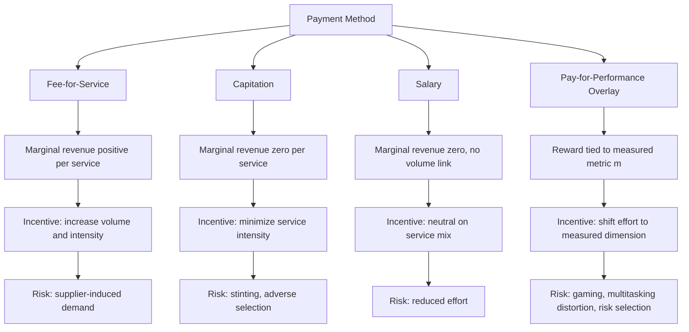

## Physician Payment Methods and Behavioral Responses

### Overview

Physician payment methods define how providers are compensated for services and, because physicians act as both agents for patients and financially interested decision-makers, the structure of payment systematically shapes clinical behavior. This is the core subject matter of physician agency theory: the physician possesses informational advantages over the patient (and often the payer), and the payment mechanism determines whether the physician's financial incentives align with, are neutral toward, or diverge from the patient's clinical interest. This topic sits at the intersection of principal-agent theory, supply-side moral hazard, and empirical health services research on induced demand.

### Theoretical Foundation: Physician as Agent

**Key Points**

- Patients delegate clinical decision-making to physicians because of asymmetric information about diagnosis, treatment necessity, and quality.
- A perfect agent recommends exactly the care the fully-informed patient would choose for themselves.
- An imperfect agent's recommendations are distorted by the physician's own utility function, which may include income, leisure, effort aversion, altruism, and professional norms.
- The physician's utility function is commonly modeled as:

$$U = U(Y, e, Q)$$

where $Y$ is net income, $e$ is effort (entering negatively, i.e., disutility of effort), and $Q$ is a taste for providing quality/altruistic care (entering positively). Payment method enters through $Y$, changing the marginal return to additional effort or additional services, and thereby shifting the physician's optimal choice of service intensity.

### Taxonomy of Payment Methods

#### Fee-for-Service (FFS)

Under FFS, the physician is paid a fee $p_i$ for each discrete service $i$ rendered. Physician income is:

$$Y = \sum_i p_i q_i - c(q)$$

where $q_i$ is the quantity of service $i$ and $c(q)$ is the physician's cost (time, effort) of producing that quantity.

**Behavioral Predictions**

- Marginal revenue per additional unit of service is positive and equal to the fee, so the physician has a direct financial incentive to increase volume and intensity of services, holding effort cost constant.
- This creates the potential for **supplier-induced demand (SID)**: physicians using their informational advantage to shift the patient's demand curve outward toward more services than the patient would choose under full information.
- FFS is associated empirically with higher service volume, more frequent follow-up visits, and greater use of discretionary procedures relative to capitation or salary, though the magnitude attributable to inducement (versus patient preference, defensive medicine, or case complexity) is difficult to identify cleanly. [Inference — the SID literature has produced mixed magnitude estimates depending on identification strategy; the qualitative direction (FFS incentivizing higher volume) is well established, but precise causal effect sizes remain contested.]
- Fee schedules with relative value scales (e.g., RVU-based systems) create differential incentives across service types: procedures with generous relative reimbursement (relative to actual time/effort cost) are favored over cognitive/evaluation services with comparatively lower relative value.

#### Capitation

Under pure capitation, the physician receives a fixed periodic payment $K$ per enrolled patient, regardless of the quantity of services delivered:

$$Y = n \cdot K - c(q)$$

where $n$ is panel size. Marginal revenue from providing an additional unit of service to an already-enrolled patient is zero.

**Behavioral Predictions**

- Because $\partial Y / \partial q = -c'(q) < 0$ (only cost, no offsetting revenue), the physician's incentive is to minimize service intensity per patient — the mirror image of FFS.
- Predicted effects: shorter visits, fewer referrals to specialists, fewer diagnostic tests, and a tendency toward **stinting** or under-provision, particularly for costly or time-intensive care.
- Capitation creates an incentive to attract low-cost/healthy patients ("cream-skimming" or **favorable risk selection**) and to avoid or under-treat high-cost patients, since the fixed payment does not vary with patient severity unless risk-adjusted.
- Panel-size incentives: since income depends on $n$, capitated physicians have an incentive to maximize enrolled panel size, potentially trading off quantity of patients against time per patient.

#### Salary

Under a fixed salary $S$, independent of both volume and patient panel:

$$Y = S$$

Marginal financial return to any additional clinical effort is zero.

**Behavioral Predictions**

- Removes direct financial incentive for both over-provision (FFS) and under-provision (capitation) at the margin.
- Predicted effects: lower service volume than FFS (since there's no revenue incentive to increase it) but not necessarily under-provision relative to capitation, since there's also no direct financial incentive to stint.
- Primary behavioral risk is reduced effort/productivity (moral hazard on the labor-supply margin) rather than distorted service-mix — a physician on salary has less incentive to see additional patients, work extra hours, or exert discretionary effort beyond a contractually monitored minimum, addressed in practice through non-financial mechanisms (professional norms, peer monitoring, employment contracts with productivity clauses).

#### Pay-for-Performance (P4P) / Value-Based Payment

P4P overlays a bonus or penalty $B(m)$ tied to measured performance $m$ (e.g., HbA1c control rates, readmission rates, patient satisfaction scores) on top of a base payment method:

$$Y = \text{Base}(q) + B(m)$$

**Behavioral Predictions**

- Physicians respond to the *measured* dimension of quality, which can produce genuine quality improvement on targeted metrics but also:
  - **Multitasking distortion**: effort is reallocated toward measured, rewarded dimensions of care at the expense of unmeasured but clinically important dimensions (a classic multitask agency problem, following Holmström and Milgrom).
  - **Gaming and upcoding**: manipulation of the reported metric itself (e.g., selective exclusion of difficult patients from denominators, "teaching to the test" documentation practices) rather than genuine improvement in underlying care.
  - **Risk selection**: avoidance of patients whose case mix makes hitting performance targets difficult (e.g., avoiding non-adherent or medically complex patients under a P4P scheme tied to outcome metrics rather than process metrics).
- Empirical evidence on P4P effect sizes on health outcomes is mixed and often modest, with more consistent evidence of effects on the specific processes directly targeted by the incentive than on downstream health outcomes. [Inference — this is a broadly accepted empirical pattern across P4P evaluations (e.g., UK QOF, US hospital value-based purchasing), but individual program effect sizes vary and depend heavily on program design, baseline performance, and incentive magnitude.]

#### Blended/Mixed Payment Systems

Because pure FFS and pure capitation induce opposite distortions, many real-world systems blend payment types, e.g.:

$$Y = \alpha \cdot (\text{FFS component}) + (1-\alpha) \cdot (\text{Capitation component}) + B(m)$$

**Key Points**

- The mixing weight $\alpha$ can theoretically be chosen to partially offset the over-provision incentive of FFS against the under-provision incentive of capitation, though it cannot generally eliminate both distortions simultaneously for a heterogeneous patient population.
- Risk-adjusted capitation (adjusting $K$ by predicted patient cost/severity) is a common refinement intended to reduce the incentive for adverse risk selection under pure capitation.
- Global budgets and bundled/episode payments (a fixed payment per clinical episode spanning multiple providers/services) represent an intermediate design, creating incentive to minimize costs *within* an episode while preserving some quality/outcome accountability through outcome-based penalties or performance overlays.

### Comparative Summary

| Payment Method | Marginal Revenue per Unit of Service | Predicted Volume Effect | Predicted Selection Behavior | Primary Behavioral Risk |
| --- | --- | --- | --- | --- |
| Fee-for-Service | Positive (= fee) | Over-provision / inducement | Favor high-reimbursement, complex cases | Supplier-induced demand |
| Capitation | Zero (cost only) | Under-provision / stinting | Favor low-cost, healthy patients | Under-treatment, adverse selection avoidance |
| Salary | Zero | Neutral on service mix | Minimal direct selection incentive | Reduced effort / low productivity |
| Pay-for-Performance | Depends on base + bonus | Directed toward measured metric | Avoid patients who threaten metric targets | Gaming, multitasking distortion |

### Empirical Identification Challenges

- **Selection into payment scheme**: Physicians (or practices) are not randomly assigned to FFS, capitation, or salaried arrangements — those choosing capitated managed-care contracts may differ systematically in practice style from those remaining in FFS, biasing naive cross-sectional comparisons.
- **Distinguishing demand inducement from legitimate practice-style variation**: Higher service volume under FFS could reflect either inducement or genuine differences in clinical judgment/patient population; identification strategies (exploiting exogenous fee changes, physician-density variation, natural experiments from payment reform) attempt to isolate the causal financial-incentive effect from these confounders.
- **Behavior at the margin of switching payment schemes**: Within-physician panel studies exploiting a policy-driven switch from FFS to capitation (or vice versa) provide cleaner identification of the causal payment effect than cross-sectional comparisons across physicians on different schemes.

### Diagrammatic Representation: Incentive Direction by Payment Method

### Example

A primary care physician managing diabetic patients illustrates the contrast sharply:

- **Under FFS**: each office visit, each additional lab test, and each specialist referral generates separate billable revenue. The physician's optimal strategy (absent altruistic offsetting) is to schedule more frequent visits and order more diagnostic tests than a pure agent might, since each generates positive marginal revenue.
- **Under capitation**: the physician receives a fixed monthly payment per enrolled diabetic patient regardless of visit frequency. The physician bears the full time/resource cost of each additional visit or test with no offsetting revenue, creating an incentive toward fewer visits and more conservative test-ordering — appropriate if it eliminates genuinely unnecessary utilization, but a source of concern if it causes patients with poor glycemic control to be seen less often than clinically warranted.
- **Under P4P with an HbA1c control metric**: the physician now has a direct financial incentive to bring diabetic patients' HbA1c under the target threshold, which may improve genuine chronic-disease management — but also creates an incentive to avoid enrolling or retaining non-adherent, high-HbA1c patients whose inclusion in the physician's measured panel would jeopardize the performance bonus.

### Policy Implications

- **Risk adjustment** is central to making capitation and P4P schemes function as intended; without it, both payment types create incentives for adverse patient selection rather than genuine efficiency or quality gains.
- **Bundled payment / episode-based payment** designs attempt to combine the cost-discipline of capitation (fixed payment per episode) with FFS-style accountability for a defined, verifiable unit of care, reducing (but not eliminating) both over- and under-provision incentives within the episode boundary.
- **Multitasking-aware metric design**: because P4P schemes reward only measured dimensions, program design increasingly emphasizes balanced scorecards (covering multiple quality domains simultaneously) to reduce the risk that unmeasured but clinically important care dimensions are neglected.
- **Behavioral economics extensions**: reference-dependence and loss aversion in physician decision-making (e.g., physicians responding more strongly to potential financial *losses* under P4P penalty structures than to equivalent-sized *gains* under bonus structures) represent an active extension of the standard agency model. [Speculation — this loss-aversion asymmetry is theoretically motivated by prospect theory and has some supporting evidence in specific P4P evaluations, but is not yet a settled empirical regularity across the physician payment literature generally.]

### Related Topics

- Supplier-induced demand: theory and empirical identification strategies
- Principal-agent theory and multitasking (Holmström-Milgrom framework)
- Risk adjustment methods in capitated payment systems
- Bundled payments and episode-based reimbursement design
- Physician altruism and dual-utility models of clinical decision-making
- Defensive medicine and malpractice liability as a distinct behavioral driver
- Managed care utilization review as a complement to payment-based incentives
- Relative value scales (RVU/RBRVS) and their distortionary effects across specialties
- Value-based purchasing programs in hospital and physician reimbursement